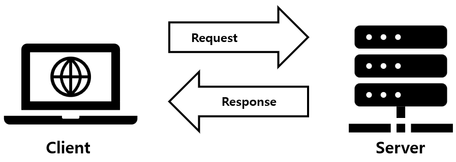
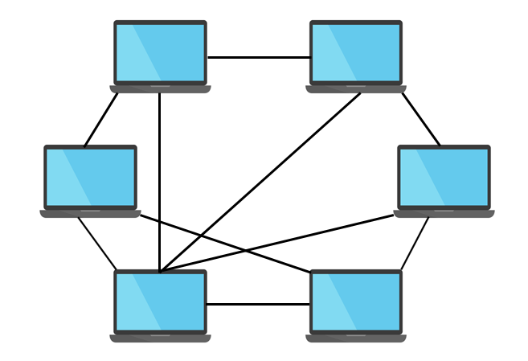

## 네트워크 애플리케이션 구조
네트워크 애플리케이션은 크게 2가지 구조로 나뉜다.

### Client-Server 구조

클라이언트-서버 구조는 무언가를 요청하는 클라이언트와 그 요청을 처리하여 응답을 내려주는 서버로 이루어진 구조를 말한다.

동적인 IP 주소를 가질 수 있는 클라이언트와 달리 **서버는 항상 고정적인 IP 주소를 가지고 있어야 하는데**, 그 이유는 서버의 위치가 계속 달라지면 클라이언트가 요청을 보낼 수 없기 때문이다.

### P2P(Peer-to-Peer) 구조

모든 peer가 클라이언트와 서버의 역할을 모두 수행하는 구조를 P2P 구조라고 한다.    
여기서 peer란 **간헐적으로 연결된 호스트 쌍**을 말하며, 사용자들이 제어하는 PC라고 보면 된다.

각 peer는 다른 peer로부터 요청을 보낼 수도 있고, 다른 peer로부터 응답을 받을 수도 있다.   
이처럼 클라이언트-서버 구조와 달리 Peer가 서로 직접 통신하기 때문에 서버에 최소로 의존할 수 있게 된다. 

덕분에 상당한 서버 구성과 대역폭을 요구하지 않도록 해주어 비용이 감소하고, 자가 확장성(self scalability)이 높아진다.

그러나 고도의 분산 구조 특성 때문에 보안, 성능, 신뢰성 측면에 어려움이 존재한다.

> 예를 들어, 클라이언트-서버 구조에서는 고성능 하드웨어를 사용하여 서버의 성능을 높여 많은 요청을 효율적으로 처리할 수 있다.
> 하지만 P2P 구조에서는 서버 개념 없이 각 노드의 성능이 일정하지 않아 전체 네트워크의 성능이 불안정해진다. 

## 프로세스 간 통신
**프로세스**는 호스트(종단 시스템)에서 실행되는 프로그램을 말한다.

서로 다른 두 호스트의 프로세스는 네트워크를 통한 메시지 교환으로서 서로 통신한다.

클라이언트-서버 구조에서 프로세스는 다음과 같이 설명할 수 있다.
- **클라이언트**: 통신을 초기화(다른 프로세스와 세션을 시작하려고 접속을 초기화)하는 프로세스
- **서버**: 세션을 시작하기 위해 접속을 기다리는 프로세스

즉, 상황에 따라 특정 프로세스 A는 클라이언트가 될 수도 있고 서버가 될 수도 있다.

### Socket
OS가 제공하는 여러 API(시스템 콜) 중에 **호스트의 애플리케이션 계층과 전송 계층 간의 문 역할을 수행하는 API**가 있는데, 그것이 바로 socket이다.

위 그림과 같이 프로세스는 소켓을 통해 네트워크로 메시지를 송수신한다.   
결국 메시지 입장에서 프로세스는 집이고, 소켓은 문인 것이다.

### 프로세스 주소 지정
전세계에는 프로세스가 셀 수 없을 만큼 많이 존재한다. 이러한 수많은 프로세스들 사이에서 메시지는 어떻게 정확히 한 프로세스에 도착할 수 있는걸까?

이를 위해 프로세스마다 주소 지정을 해주는데, 이때 필요한 두 가지 정보가 IP 주소와 Port 번호다.

이에 대한 자세한 내용은 네트워크 계층에서 알아볼 것이므로, 지금은 단순히 **프로세스를 식별하기 위해 IP 주소와 포트 번호를 명시**한다는 것만 알아두자.

## 애플리케이션이 이용 가능한 서비스
우리가 사용하는 애플리케이션은 여러 서비스를 필요로 하고, 이는 전송 계층에서 다양하게 제공한다.

### Data integrity
애플리케이션은 통신할 때 여러 패킷들을 주고 받으며, 이러한 패킷들은 네트워크 내에서 다음과 같은 여러 이유로 유실될 수 있다.
- 라우터의 버퍼에서 오버플로 발생
- 패킷의 비트가 잘못되어 호스트나 라우터에 의해 버려지는 현상 발생

이렇게 통신 중에 패킷이 유실되면, 클라이언트가 요청할 당시 데이터와 서버가 받는 데이터는 그 형태가 달라질 수 있다.   
이러한 문제를 해결하기 위해, 전송 계층에서는 신뢰적 데이터 전송을 통해 송신 프로세스가 보낸 데이터가 오류 없이 수신 프로세스에 도착할 것을 보장한다.

### Throughput
**네트워크 경로를 따라 두 프로세스 간의 통신 세션에서 송신 프로세스가 수신 프로세스로 비트를 전달할 수 있는 비율**을 처리율(throughput)이라고 한다.

오늘날에 존재하는 많은 애플리케이션들은 대역폭에 굉장히 민감하기 때문에 R bps의 보장된 처리율을 요구한다.   
따라서 전송 계층에서는 애플리케이션의 가용한 처리율이 항상 적어도 R bps임을 보장한다.

### Timing
메신저, 스트리밍 플랫폼과 같은 상호작용 애플리케이션에서 긴 지연 시간은 만족도를 크게 떨어뜨린다.   
따라서 상호작용 애플리케이션이 효과적으로 동작하기 위해서는 데이터 전송에 엄격한 시간 제한 조건이 요구된다.

### Security
전송 계층에서는 애플리케이션에 하나 이상의 보안 서비스를 제공하여 데이터 기밀성을 보장한다.      
ex) 송신 프로세스가 전송하는 모든 데이터 암호화, 수신 프로세스로 전달하기 전에 암호 해독

## 인터넷 전송 계층 프로토콜이 제공하는 서비스
위에서 애플리케이션이 필요로 하는 서비스를 살펴봤는데, 전송 계층 프로토콜인 TCP/UDP는 이들 중 몇몇 서비스를 제공한다.   

### TCP 서비스
- #### 신뢰적인 데이터 전송   
  애플리케이션의 한쪽이 소켓을 통해 패킷을 전달하면, 그것이 손실되거나 중복되지 않도록 수신 측 소켓으로 전달한다.
- #### 흐름 제어
  송신자가 수신자의 처리 능력을 초과하는 속도로 데이터를 전송하지 않도록 속도를 제어한다.
- #### 혼잡 제어
  네트워크가 혼잡한 상태에 이르면 프로세스의 속도를 조절하여 각 TCP 연결이 네트워크 대역폭을 고르게 공유하도록 제한한다.
- #### 연결 지향형
  메시지를 전송하기 전에 클라이언트와 서버가 전송 제어 정보를 교환하게 한다. (3-way-handshaking)

TCP가 제공하지 않는 서비스로는 timing, 최소한의 throughput, 보안 등이 있다.

### UDP 서비스
- #### 비신뢰적인 데이터 전송
  신뢰적인 데이터 전송을 보장하지 않는다.
- #### 비연결형
  두 프로세스가 통신하기 전에 전송 제어 정보를 교환하지 않는다.

UDP는 TCP와 다르게 신뢰적인 데이터 전송을 보장하지도 않고, handshaking 과정도 제공하지 않는다.   
따라서 안정성은 많이 떨어지지만 그만큼 속도는 매우 빠르다는 장점이 있다.
