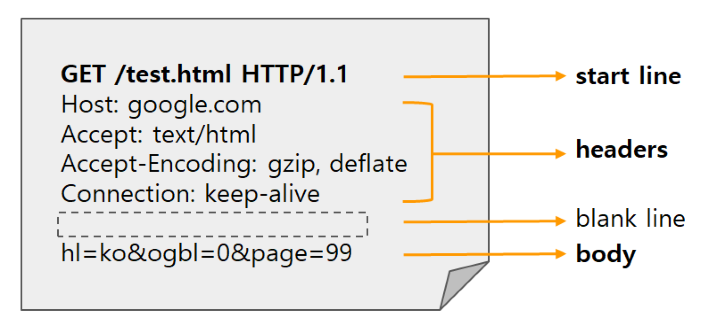
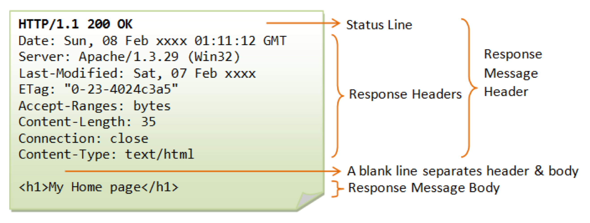
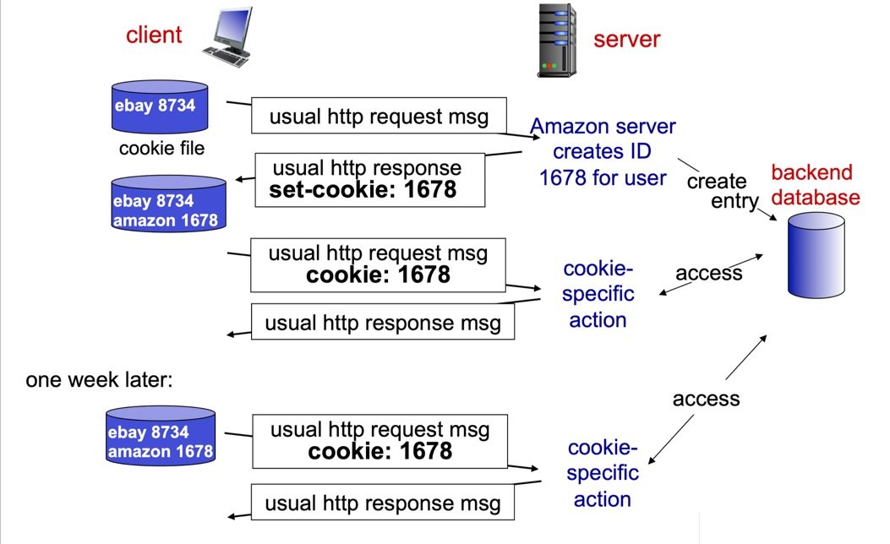

## 웹 페이지 vs 웹 브라우저
- **웹 페이지**: 기본 HTML 파일과 여러 참조 객체(JPEG, Javascript 등)로 구성된 개체

- **웹 브라우저**: HTTP의 클라이언트 측을 구현한 것으로 URL을 해석하거나 요구한 웹 페이지를 보여주는 역할 수행

## 비지속 연결 vs 지속 연결
### 비지속 연결 (Non-persistent connection)
- 각 요구/응답 쌍이 분리된 TCP 연결을 통해 보내지는 방식
- 서버가 응답으로 객체를 보낸 후 각 TCP 연결이 끊어진다.
- 통신 과정
  1. HTTP 클라이언트는 80번 포트를 통해 특정 서버로 TCP 연결을 시도하고, 소켓을 통해 서버로 HTTP 요청 메시지를 전달한다.
  2. HTTP 서버는 TCP 연결 소켓을 통해 요청 메시지를 받고, 저장 장치로부터 요구 받은 객체(HTML 파일)를 추출한다. 그리고나서 응답 메시지에 그 객체를 담아 소켓을 통해 클라이언트로 전달한다.
  3. HTTP 서버는 응답이 끝난 후 TCP 연결을 종료할 것을 요청한다. (아직 종료 X)
  4. HTTP 클라이언트가 응답 메시지를 수신하면 TCP 연결이 종료된다. 클라이언트는 응답 메시지로부터 객체(HTML 파일)를 추출하고, 해당 파일을 조사한 뒤 n개의 이미지 객체에 대한 참조를 찾는다.
  5. 이후에 참조되는 각 n개의 이미지 객체에 대해 앞의 과정을 반복한다.
- 매번 TCP 연결을 초기화하기 때문에, 총 응답 시간은 대략 2 RTT + 서버가 데이터를 전송하는 데 걸리는 시간을 더한 값이 된다.
  > #### RTT(Round-Trip Time)   
  > 작은 패킷이 클라이언트로부터 서버까지 전달된 후 다시 클라이언트로 되돌아오는 데 걸리는 시간
- 단점
  - 각 요청 객체에 대한 새로운 연결이 설정되고 유지되어야 한다. 이로 인해 TCP 변수들이 클라이언트와 서버 양쪽에 유지되어야 하고, 이는 **수많은 요청을 동시 처리하는 웹 서버에게 심각한 부담**을 안긴다.
  - 각 요청/응답 쌍은 2RTT를 필요로 한다.

### 지속 연결 (Persistent connection)
- 각 요구/응답 쌍이 같은 TCP 연결을 통해 보내지는 방식
- 서버는 응답 후 TCP 연결을 유지하고, 같은 클라이언트와 서버 간의 요청/응답은 같은 연결을 통해 이루어진다.
- 객체에 대한 요청이 진행중인 요청에 대한 응답을 기다리지 않고 연속적으로 만들어질 수 있다. (**Pipelining**)
- HTTP의 디폴트 모드는 파이프라이닝을 이용한 지속 연결을 사용한다.

## HTTP 메시지 포맷
### HTTP 요청 메시지

- #### start line
  - 방식(method) 필드, URL 필드, HTTP 버전 필드로 구성되어 있다.
- #### headers
  - 객체가 존재하는 호스트 이름, 지속 연결 여부 등 부가 정보가 포함된다.
- #### blank line
  - 헤더와 바디를 구분하는 공백이 존재한다.
- #### body
- 메시지가 일반 ASCII 텍스트로 쓰여 있어 사람이 읽기 수월하다.
- 각 라인은 CR(Carriage Return)과 LF(Line Feed)로 구분된다.

### HTTP 응답 메시지

## 사용자와 서버 간의 상호작용 : 쿠키
무상태성 프로토콜 HTTP를 사용하는 많은 웹 사이트들은 **사용자를 추적**하기 위해 **쿠키**를 사용한다.

### 동작 원리

1. 클라이언트는 HTTP 요청 메시지를 서버에 전달한다.
2. 서버는 요청한 클라이언트에 대한 ID를 생성하여 DB 엔트리에 저장하고, HTTP 응답 메시지 헤더에 쿠키 파일을 덧붙여 전달한다.
3. 클라이언트는 쿠키 파일을 참조하여 이 사이트에 대한 클라이언트의 식별 번호를 발췌한다. 그리고나서 다음 요청부터 해당 식별 번호를 포함하는 쿠키 헤더 파일을 넣어 전달한다.
4. 서버는 쿠키 클라이언트의 요청 메시지의 쿠키를 통해 DB 엔트리에서 사용자 정보를 조회한다. 그리고 서버는 해당 클라이언트의 행동을 추적한다.
5. 일주일 후 클라이언트가 또 다시 해당 사이트에 접속하면, 서버가 쿠키를 통해 누구인지 식별한 뒤 맞춤 행동을 추천한다.  

## 웹 캐싱
### 웹 캐시(프록시 서버)란?
- 기점 웹 서버(origin web server)를 대신하여 HTTP 요청을 충족시키는 네트워크 개체
- 자체의 저장 장치를 가짐으로써, 최근 호출된 객체의 사본을 저장하고 보존할 수 있다.
- 브라우저는 사용자의 모든 HTTP 요청이 웹 캐시에 가장 먼저 보내지도록 구성할 수 있다.
- **웹 캐시는 서버인 동시에 클라이언트가 될 수 있다.**
- 일반적으로 ISP가 웹 캐시를 구입한 뒤 네트워크 상에 설치하고, 브라우저가 설치된 캐시를 가리키도록 설정한다. 

### 동작 원리
1. 브라우저는 웹 캐시와 TCP 연결을 설정하고 웹 캐시에 있는 객체에 대한 HTTP 요청을 보낸다.
2. 웹 캐시는 객체의 사본이 자신에게 저장되어 있는지 확인한다. 만약 저장되어 있다면 웹 캐시는 클라이언트 브라우저로 HTTP 응답 메시지와 함께 객체를 전달한다.
3. 웹 캐시에 객체의 사본이 저장되어 있지 않다면? 
   1. 웹 캐시는 기점 서버로 TCP 연결을 설정하고, 해당 서버로 객체에 대한 HTTP 요청을 보낸다.
   2. 기점 서버는 웹 캐시로 HTTP 응답 메시지와 함께 객체를 전달한다.
   3. 웹 캐시에 객체를 저장하고, 클라이언트 브라우저로 HTTP 응답 메시지와 함께 객체의 사본을 전달한다.

### 장점
- 클라이언트의 요청에 대한 응답 시간 감소
- 한 기관에서 인터넷으로 접속하는 링크 상의 트래픽 대폭 감소   
  - 기관은 대역폭을 자주 개선시킬 필요가 없어져 비용 감소
  - 서버 성능 개선

### **조건부 GET**
어디에서든 캐시를 사용하면 항상 데이터 불일치 문제가 발생할 수 있다는 단점이 존재한다.

웹 캐시도 마찬가지로 이러한 문제가 발생할 수 있는데, 조건부 GET을 통해 이를 해결할 수 있다.

조건부 GET이란, 클라이언트가 브라우저로 전달되는 모든 객체가 최신의 것임을 확인하면서 캐싱하는 것을 의미한다.   
조건부 GET 방식은 다음과 같이 동작한다. 

1. 클라이언트는 `If-Modified-Since: <date>`를 HTTP 요청 메시지 헤더에 포함하여 전달한다. (조건부 GET 요청)
2. 만약 <date> 이전에 객체가 수정된 기록이 없다면, 서버는 `HTTP/1.0 304 Not Modified`를 HTTP 응답 메시지 헤더에 포함하여 전달한다.
3. 클라이언트는 객체가 수정되지 않았음을 확인하고 캐시로부터 기존 리소스를 받는다.
3. 만약 <date> 이전에 객체가 수정되었다면, 서버는 HTTP 응답 메시지에 객체를 함께 전달하고 클라이언트는 서버로부터 객체를 받는다.
