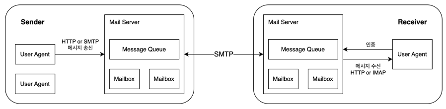
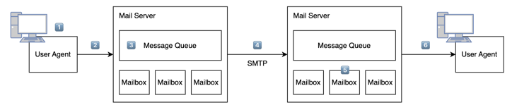
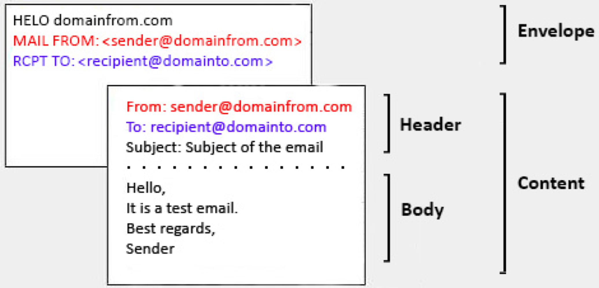

## 인터넷 전자메일 시스템 구성

다음은 인터넷 메일 시스템의 상위 레벨 개념을 도식화한 것이다.

- **사용자 에이전트(user agent)**: 사용자가 메시지를 읽고, 응답하고, 전달하고, 저장하게 해주는 애플리케이션   
  ex) Microsoft Outlook, Apple Mail, Gmail, ...
- **메일 박스(mailbox)**: 수신자에게 온 메시지를 유지 및 관리하는 개체

## SMTP(Simple Mail Transfer Protocol)
- 송신자의 메일 서버로부터 수신자의 메일 서버로 메시지를 전송하는 데 사용하는 애플리케이션 계층 프로토콜
- 만들어진지 오래된 만큼 낡은 특성을 가지고 있다.   
  > SMTP로 전송하는 모든 메일 메시지의 body는 단순 7bit ASCII여야 한다. 따라서 SMTP를 통해 이진 멀티미디어 데이터를 전송하기 전에 ASCII로 변환해야 한다. 심지어 HTTP는 전송 전에 멀티미디어 데이터를 ASCII로 변환하는 것을 요구하지 않기 때문에, SMTP를 통해 전송한 후에는 ASCII 형태의 메시지를 다시 복구해야 한다.
- SMTP는 서버에 오류 없이 메시지를 전달하기 위해 TCP의 신뢰적인 데이터 전송 서비스에 의존한다.
  - 만약 서버에 보낼 다른 메시지가 있을 경우, 클라이언트는 송수신 과정을 같은 TCP 연결 상에서 반복한다.
  - 만약 서버에 보낼 다른 메시지가 없을 경우, 클라이언트는 TCP 연결을 종료한다.

### 동작 원리

1. 송신자는 전자메일 사용자 에이전트에게 수신자의 전자메일 주소를 제공하고, 메시지를 작성한 후 전송하라고 명령한다.
2. 송신자의 사용자 에이전트는 메시지를 그의 메일 서버에 보내고, 그곳에서 메시지는 메시지 큐에 저장된다.
3. 송신자의 메일 서버에서 동작하는 SMTP 클라이언트가 메시지 큐에 있는 메시지를 발견하면, 수신자의 메일 서버에서 동작하는 SMTP 서버에게 TCP 연결을 설정한다.
4. 초기 SMTP handshaking 이후에 SMTP 클라이언트는 송신자의 메시지를 TCP 연결로 보낸다.
5. 수신자의 메일 서버 호스트에서 SMTP 서버는 메시지를 수신하고, 수신자의 메일 서버는 그 메시지를 메일 박스에 저장한다.
6. 수신자는 편한 시간에 사용자 에이전트를 통해 메시지를 읽는다.

## 메일 메시지 포맷

- 헤더 다음에 빈 줄이 이어지고, 그 다음에 메시지 body가 이어진다.
- 모든 헤더는 `From`과 `To`를 필수로 가진다.
- `Subject`를 포함한 여러 옵션 헤더를 가질 수 있다.

## 메일 접속 프로토콜
SMTP는 push 전용 프로토콜이다. 다시 말해서 SMTP로는 수신자가 자신의 메일 서버로부터 메시지를 수신할 수 없다.

메일 서버로부터 메시지를 수신하기 위해서는 2가지 프로토콜을 사용해야 한다.
- 수신자가 웹 기반 전자메일이나 모바일 앱을 사용하는 경우 HTTP 사용
- 수신자가 MS Outlook 같은 전형적인 메일 클라이언트를 사용하는 경우 IMAP(Internet Mail Access Protocol) 사용
