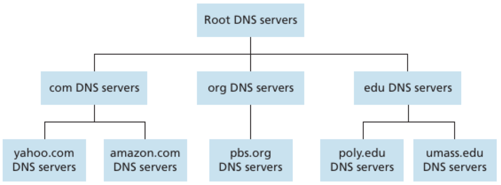
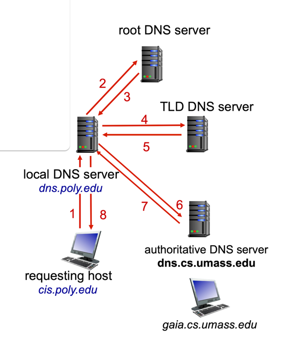
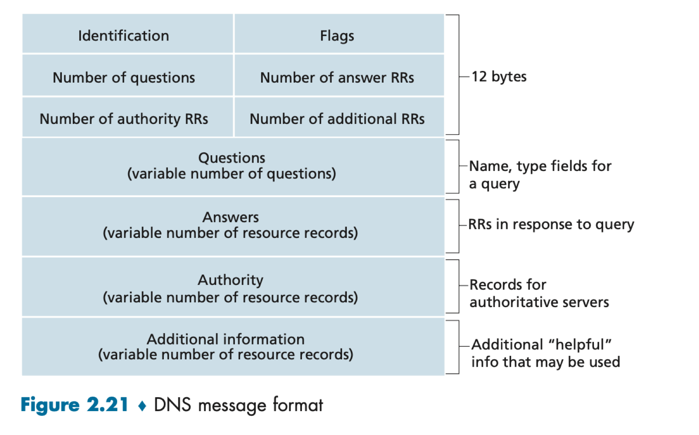

## DNS(Domain Name System)란?
- 많은 name server들의 계층 구조로 구현된 분산 DB
- 호스트가 분산 DB로 질의하도록 허용하는 애플리케이션 계층 프로토콜
- UDP 상에서 수행되며 53번 포트 사용

> ### DNS는 왜 UDP를 사용할까?
> 연락처에서 번호를 찾는 시간이 실제 통화 시간과 비슷하다면 그것은 굉장히 비효율적인 작업이라고 볼 수 있는데, DNS도 마찬가지다.   
> 사실 DNS를 통해 IP 주소를 얻는 과정은 HTTP 통신 전에 수행하는 준비 동작일 뿐이다. 이러한 준비 동작에 시간이 많이 소요되는 것은 굉장히 비효율적이다.      
> 그리고 DNS를 통해 요청/응답으로 보내는 데이터(호스트 이름, IP 주소 등)의 크기는 매우 작기 때문에, 데이터가 유실됐을 때 데미지가 그렇게 크지 않다.   
> 따라서 DNS는 신뢰적인 데이터 전송을 포기하고 빠른 시간을 취할 수 있는 UDP를 사용하는 것이다.

## DNS가 제공하는 서비스
### 호스트 이름을 IP 주소로 변환
사람은 기억하기 쉬운 호스트 이름 식별자를 선호하는 반면, 라우터는 고정 길이의 계층 구조를 가진 IP 주소를 선호한다.   

이 둘의 차이를 절충하기 위해 호스트 이름을 IP 주소로 변환하는 서비스를 제공한다.

### Host aliasing
호스트의 IP 주소 뿐만 아니라, 제시한 별칭 호스트 이름에 대한 정식 호스트 이름을 얻을 수 있다.

예를 들어, 정식 호스트 이름이 'relay1.west-coast.enterprise.com'일 경우 별칭 호스트 이름은 'enterprise.com' 또는 'www.enterprise.com'이 될 수 있다. 

### Mail server aliasing
호스트 이름 뿐만 아니라 메일 서버에서도 aliasing이 가능하다.

### 부하 분산 (load distribution)
중복 웹 서버의 경우 여러 IP 주소가 하나의 정식 호스트 이름과 연관되어 있다.   
따라서 DNS 서버의 DB는 이러한 여러 IP 주소 집합을 가지고 있다. 만약 클라이언트가 해당 주소 집합으로 매핑하는 호스트 이름에 대한 DNS 질의를 보내면, 서버는 IP 주소 집합 전체를 가지고 응답한다. 이때 각 응답에서의 주소는 순환식으로 보낸다.

이처럼 DNS는 여러 중복 서버 사이의 부하를 분산시킨다.

## DNS 동작 원리
1. 애플리케이션은 변환될 호스트 이름을 명시하여 DNS 측의 클라이언트를 호출한다.
2. 사용자 호스트의 DNS는 네트워크에 질의 메시지를 전송한다. 이때 모든 질의/응답 메시지는 53번 포트의 UDP 데이터그램으로 보내진다.
3. 수 ms에서 sec까지의 지연 후에 사용자 호스트의 DNS는 요청한 매핑에 해당하는 DNS 응답 메시지를 수신한다.
4. 해당 매핑 내용은 DNS 클라이언트를 호출한 애플리케이션으로 전달된다.

## 분산 계층 데이터베이스

### Root Name Server
- 루트 존 레코드의 요청에 직접 응답하고, 적절한 TLD에 대해 권한이 있는 네임 서버 목록을 반환함으로써 다른 요청에 응답한다.
- 600개 이상의 서버 인스턴스가 전세계에 흩어져 있다.

### TLD(Top Level Domain) Name Server
- com, org, net 같은 일반적인 TLD 및 국가 코드 TLD(kr, uk, fr)를 관리한다.
- 여러 서비스 사마다 TLD 서버를 담당한다. 예를 들어, Educause는 '.edu' TLD 서버를 유지 관리한다.
- Authoritative Name 서버에 대한 IP 주소를 제공한다.

### Authoritative Name Server
- 조직이나 도메인 소유자가 운영하는 DNS 서버로, 해당 도메인에 대한 공식적인 이름-주소 매핑 정보를 제공한다.
- 네트워크를 운영하는 모든 기관은 자신이 책임지는 DNS 서버를 운영한다. 그리고 각 기관이 보유한 도메인에 속하는 호스트 이름 매핑에 대한 책임은 그 기관이 가진다.

### DNS를 중앙 집중화하지 않은 이유
모든 매핑을 포함하는 하나의 DNS 서버를 두면 간단할텐데, 왜 그렇지 않고 분산된 계층 구조로 구성한 것일까?

이에 대한 핵심적인 이유는 다음과 같다.

- **서버 장애**: 만약 하나의 DNS 서버에 장애가 발생하면 전체 인터넷이 동작하지 않을 것이다.
- **많은 트래픽**: 단일 DNS 서버가 모든 질의를 처리하기에는 그 수가 너무 많다.
- **먼 거리로 인한 속도 저하**: 만약 DNS 서버가 한 지역에만 존재한다면, 그 지역에서 멀리 떨어진 지역은 속도가 매우 느릴 것이다.
- **유지 관리**: 단일 DNS 서버는 모든 인터넷 호스트에 대한 레코드를 유지해야 한다. 이는 DB가 거대해질 뿐만 아니라, 모든 새로운 호스트를 반영하기 위해 갱신 주기가 매우 잦아질 것이다.

이러한 여러 이유로 인해 DNS 서버를 단일로 구성하는 것은 권장되지 않는 방식이다.

그리고 무엇이던 규모가 커지면 구조를 계층화해야 관리가 수월해진다. 예를 들어, 대한민국의 행정을 한 곳에서 맡는다면 그곳은 굉장히 바빠 업무가 밀릴 것이다. 따라서 도, 시, 구 등 여러 지역으로 분산시켜 관리한다.   
또한, 어떤 도메인의 IP 주소가 변경되어도 가장 하위 계층에 위치한 DNS 서버의 DB에서만 변경하면 된다는 장점도 있다.

## Local DNS Server
- 로컬 DNS 서버는 최근에 요청된 도메인 이름과 IP 주소의 매핑 정보를 캐시에 저장하여 빠르게 응답할 수 있다.
- 사용자가 웹사이트에 접근하려고 할 때, 해당 도메인의 IP 주소를 찾기 위해 DNS 요청을 로컬 DNS 서버에 보낸다.
- 로컬 DNS 서버가 캐시에 없는 도메인 요청을 받으면, 계층 구조를 통해 상위 DNS 서버에 질의를 전달한다.
- 전체 DNS 계층 구조의 일부는 아니지만, 사용자 요청을 처리하는 데 중요한 역할을 한다.
- 각 ISP, 회사, 대학 등은 자체 로컬 DNS 서버를 가지고 있다.

### 동작 과정
사용자가 'cis.poly.edu' 호스트에서 'gaia.cs.umass.edu'에 접근하려고 할 때 동작하는 과정을 살펴보자.

1. 클라이언트는 로컬 DNS 서버('dns.poly.edu')에 DNS 질의를 보낸다.
2. 로컬 DNS 서버는 캐시에 해당 도메인의 정보가 없으면 루트 DNS 서버에 질의를 보낸다.
3. 루트 DNS 서버는 '.edu' TLD에 대한 권한이 있는 TLD DNS 서버의 주소를 로컬 DNS 서버에 반환한다.
4. 로컬 DNS 서버는 TLD DNS 서버에  'umass.edu' 도메인에 대한 정보를 요청한다.
5. TLD DNS 서버는 'umass.edu' 도메인의 권한이 있는 DNS 서버의 주소('dns.cs.umass.edu')를 로컬 DNS 서버에 반환한다.
6. 로컬 DNS 서버는 책임 DNS 서버('dns.cs.umass.edu')에 'gaia.cs.umass.edu'의 IP 주소를 요청한다.
7. 책임 DNS 서버는 로컬 DNS 서버에게 'gaia.cs.umass.edu'의 IP 주소를 반환한다.
8. 로컬 DNS 서버는 클라이언트에게 'gaia.cs.umass.edu'의 IP 주소를 그대로 전달한다.

## DNS 캐싱
- DNS는 성능을 향상시키고, 네트워크의 DNS 메시지 수를 줄이기 위해 캐싱을 사용한다.
- 질의 사슬에서 DNS 서버가 DNS 응답을 받았을 때, 로컬 메모리에 해당 응답에 대한 정보를 저장한다.
- 호스트 DNS와 IP 주소 사이의 매핑과 호스트는 영구적이지 않다.    
  이로 인해 데이터 불일치 문제가 발생하는 것을 방지하기 위해, DNS 서버는 특정 기간(보통 2일) 이후 캐시에 저장된 정보를 제거한다.

## DNS 레코드
DNS 서버들은 호스트 이름을 IP 주소로 매핑하기 위한 자원 레코드(Resource Record, RR)를 DB에 저장한다.

RR은 Name, Value, Type, TTL(Time To Live) 필드를 포함하는 4개의 튜플로 구성되어 있으며, type 필드의 의미는 다음과 같다.

- `type = A`   
  - Name = 호스트 이름
  - Value = 호스트 이름에 대한 IP 주소
- `type = NS`
  - Name = 도메인 이름 (e.g. 'foo.com')
  - Value = 도메인 이름에 대한 책임 DNS 서버의 호스트 이름
- `type = CNAME`
  - Name = 별칭 호스트 이름
  - Value = 별칭 호스트 이름에 대한 정식 호스트 이름
- `type = MX`
  - Name = 별칭 호스트 이름
  - Value = 별칭 호스트 이름에 대한 메일 서버의 정식 이름

## DNS 메시지
DNS 질의와 응답 메시지는 모두 다음과 같은 형태로 되어 있다.

### 헤더 영역
- **Identification (16bit)**: 질의에 대한 응답 메시지에 복사되어, 클라이언트가 보낸 질의와 수신된 응답 간의 일치 여부를 식별하기 위한 필드
- **Flags (16bit)**
  
  
  
  - **QR(Query/Response)**: 메시지가 질의(0)인지 응답(1)인지 구분함
  - **OpCode**: 질의나 응답의 종류 (4bit)
  - **AA(Authoritative)**: DNS 서버가 질의 이름에 대해 책임 DNS 서버일 때 응답 메시지에 설정됨
  - **TC(Truncated)**: 응답 내용이 512바이트 이상인지 여부
  - **RD(Recursion Desired)**: DNS 서버가 레코드를 갖지 않을 때, 재귀적 질의를 수행하기를 클라이언트(호스트 or DNS 서버)가 원할 때 설정됨
  - **RA(Recursion Available)**: DNS 서버가 재귀적 질의를 지원하면 응답에 설정됨
  - **rCode**: 응답의 오류 상태 표시 (4bit)

### 질문 영역
- 현재 질의에 대한 정보(Name, Type 필드)를 포함하는 영역

### 답변 영역
- 원래 질의된 이름에 대한 RR을 포함하는 영역
- 호스트 이름은 여러 개의 IP 주소를 가질 수 있기 때문에 응답으로 여러 개의 RR을 보낼 수 있다.

### 책임 영역
- 다른 책임 DNS 서버의 레코드를 포함하는 영역

### 추가 영역
- 다른 도움이 되는 레코드를 포함하는 영역   
  ex) MX 질의에 대한 응답에서 응답 필드가 전자메일 서버의 정식 호스트 이름을 제공하는 RR을 가지고 있을 때, 추가 영역은 메일 서버의 정식 호스트 이름에 대한 IP 주소를 제공하는 Type A 레코드를 포함한다.
