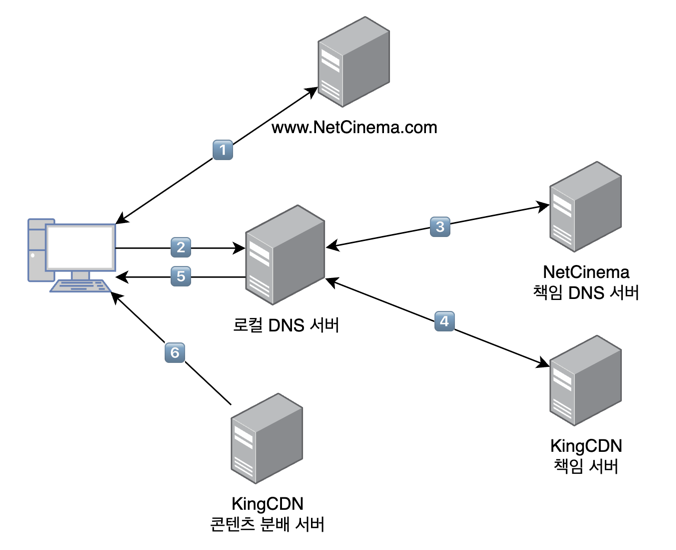

## 인터넷 비디오
- 비디오는 이미지의 연속으로서 일반적으로 초당 24개 또는 30개의 이미지로 일정한 속도로 표시된다.
- 압축되지 않은 디지털 인코딩된 이미지는 픽셀 단위로 구성되며, 각 픽셀은 휘도와 색상을 나타내는 여러 비트들로 인코딩된다.
- 인터넷 비디오는 매우 높은 비트 전송률을 요구한다.
- 스트리밍 비디오에서 가장 중요한 성능 척도는 평균 종단 간 처리량이다.
- 연속재생을 제공하기 위해, 네트워크는 압축된 비디오의 전송률 이상의 스트리밍 애플리케이션에 대한 평균 처리량을 제공해야 한다.
- 압축을 사용하여 동일한 비디오를 여러 버전의 품질로 만들어 제공할 수 있다.   
  ex) 초고속 인터넷 연결을 가진 사용자는 3Mbps 버전을 선택할 수 있으며, 3G를 통해 동영상을 시청하는 경우 300kbps 버전을 선택할 수 있다.

## HTTP 스트리밍 및 DASH
- HTTP 스트리밍에서 비디오는 HTTP 서버 내의 특정 URL을 갖는 일반적인 파일로 저장된다.
### HTTP 스트리밍 동작 원리
1. 비디오는 HTTP 서버 내의 특정 URL을 갖는 일반적인 파일로 저장되어 있다.
2. 사용자가 비디오 시청을 원하면 클라이언트는 서버에게 TCP 연결을 설정하고, 해당 URL에 대한 HTTP GET 요청을 발생시킨다.
3. 서버는 기본 네트워크 프로토콜 및 트래픽 조건이 허용되는 대로 HTTP 응답 메시지 내에서 비디오 파일을 전송한다.
4. 서버로부터 전송된 바이트는 클라이언트 측 애플리케이션 버퍼에 저장되고, 버퍼의 바이트 수가 미리 정해진 임곗값을 초과하면 클라이언트 애플리케이션이 재생을 시작한다.
5. 스트리밍 비디오 애플리케이션(유튜브, 넷플릭스 등 웹사이트)은 클라이언트 애플리케이션 버퍼에서 주기적으로 비디오 프레임을 가져와서 프레임을 압축해제한 다음 사용자의 화면에 표시한다.

### DASH
HTTP 스트리밍에는 중요한 문제점이 존재하는데, 그것은 모든 클라이언트가 그들 사이의 가용 대역폭의 차이에도 불구하고 똑같이 인코딩된 비디오를 전송받는다는 점이다.   
가용 대역폭의 차이는 서로 다른 클라이언트들 뿐만 아니라 동일한 클라이언트에서도 시간과 장소에 따른 차이가 발생한다.   

이 문제를 해결하고자 새로운 형태의 HTTP 기반 스트리밍인 **DASH**(Dynamic Adaptive Streaming over HTTP)가 개발되었으며, 특징은 다음과 같다.

- 비디오는 여러 가지 버전으로 인코딩되며, 각 버전은 비트율과 품질 수준이 서로 다르다.
- 클라이언트는 동적으로 서로 다른 버전의 비디오를 몇 초 분량의 길이를 갖는 비디오 조각(chunk) 단위로 요청한다.
  - 가용 대역폭이 충분할 때는 높은 비트율의 버전을, 가용 대역폭이 적을 때는 낮은 비트율의 버전을 요청한다.
- 클라이언트는 HTTP GET 요청을 이용해 다른 버전의 비디오 조각을 매번 선택한다.
- 각 비디오 버전은 HTTP 서버에 서로 다른 URL을 가지고 저장된다.
- HTTP 서버는 비트율에 따른 각 버전의 URL을 제공하는 **manifest file**을 가지고 있다.
  1. 클라이언트는 먼저 manifest file을 요청하여 서버에서 제공되는 다양한 버전에 대해 알게 된다.
  2. 이후 클라이언트는 매번 원하는 버전의 비디오 조각 단위 데이터를 선택하여 HTTP 요청 메시지에 URL과 byte-range를 지정하여 요청한다.
  3. 비디오 조각 단위 데이터를 다운로드하는 동안에 클라이언트는 측정된 수신 대역폭과 비트율 결정 알고리즘을 이용해 다음에 선택할 비디오 조각 단위 데이터의 버전을 결정한다.

## 콘텐츠 분배 네트워크 (CDN)
유튜브는 어떻게 수천만에 이르는 소장 비디오를 가지고 매일 수억 명의 사용자들에게 스트리밍 서비스를 제공할 수 있을까?

### 단일한 거대 데이터 센터 구축의 단점
인터넷 비디오 회사에서 스트리밍 서비스를 제공하는 가장 단순한 방법은 단일한 거대 데이터 센터를 구축하는 것이다.   
하나의 데이터 센터에서 모든 비디오 자료를 관리하고, 전세계 사용자에게 비디오 스트림을 직접 전송하면 되지 않을까?

그러나 여기에는 3가지의 큰 문제가 존재한다.

1. 클라이언트가 데이터 센터로부터 지역적으로 먼 지점에 있는 경우, 서버로부터 클라이언트의 패킷 경로는 많은 다양한 통신 링크와 ISP를 거쳐가게 된다. 이러한 ISP는 각기 다른 대륙에 위치할 수도 있으며, 이 링크들 중 하나라도 비디오 소비율보다 낮은 전송 용량을 갖는다면 종단 간 처리율이 낮아질 것이다. 이는 곧 좋지 않은 사용자 경험을 유발한다.
2. 인기 있는 비디오는 같은 통신 링크를 통해 여러 번 반복적으로 전송될 것이다. 이는 네트워크 대역폭의 낭비는 물론이고 인터넷 비디오 회사는 회선을 제공하는 ISP들에게 동일한 바이트를 전송하는 것에 대해 중복 비용을 지불하는 결과를 초래한다.
3. 단일한 데이터 센터에 한 번이라도 장애가 발생하면 전체 서비스가 중단될 수 있다.

이러한 이유로 대부분의 비디오 스트리밍 회사들은 CDN을 사용한다.

### 콘텐츠 분배 네트워크(Content Distribution Network, CDN)
- 다수의 지점에 분산된 서버들을 운영하며, 비디오 및 다른 형태의 웹 콘텐츠 데이터의 복사본을 이러한 분산 서버에 저장한다.
- 사용자는 최신의 서비스와 사용자 경험을 제공할 수 있는 지점의 CDN 서버로 연결된다.
- 일반적으로 서버의 위치에 대해 다음 두 가지 철학 중 하나를 채용하고 있다.
  - **Enter Deep** 
    - 서버 클러스터를 세계 곳곳의 접속 네트워크에 구축함으로써 **ISP의 접속 네트워크로 깊숙이 들어가는 개념** 
    - 서버를 최대한 사용자 가까이에 위치시켜 사용자와 CDN 서버 사이의 링크 및 라우터 수를 줄이고, 사용자가 경험하는 지연 시간 및 처리율을 개선한다.
    - 문제는 고도로 분산된 설계로 인해 서버 클러스터를 유지 관리하는 비용이 커진다는 것이다.
  - **Bring Home**
    - 좀 더 적은 수의 핵심 지점에 큰 규모의 서버 클러스터를 구축하여 **ISP를 Home으로 가져오는 개념**
    - Enter Deep에 비해 클러스터 유지 관리하는 비용이 감소한다.
    - 문제는 사용자가 느끼는 지연 시간과 처리율은 상대적으로 나빠진다는 것이다.
- CDN은 클러스터에 대해 push 방식이 아닌 pull 방식을 사용한다.   
  ex) 어떤 사용자가 지역 클러스터에 없는 비디오를 요청하면, 해당 비디오를 중앙 서버나 다른 클러스터로부터 전송 받아 사용자에게 서비스하는 동시에 복사본을 만들어 저장한다.
- 클러스터의 저장 공간이 가득 차면 자주 사용되지 않는 비디오 데이터는 삭제된다.

### 동작 원리 (with DNS)

1. 사용자가 NetCinema의 웹 페이지를 방문한다.
2. 사용자가 http://video.netcinema.com/6Y7B23V 링크를 클릭하면, 사용자의 호스트는 video.netcinema.com에 대한 DNS 질의를 보낸다.
3. 사용자의 로컬 DNS 서버는 호스 이름의 'video' 문자열을 감지하고는 해당 질의를 NetCinema의 책임 DNS 서버로 전달한다. NetCinema 책임 DNS 서버는 해당 DNS 질의를 KingCDN으로 연결하기 위해 IP 주소 대신에 KingCDN의 호스트 이름을 로컬 DNS 서버에게 전달한다.
4. 이 시점부터 DNS 질의는 KingCDN의 사설 DNS 구조로 들어가게 된다. 사용자의 로컬 DNS 서버는 KingCDN의 호스트 이름에 대한 두 번째 질의를 보내고, 이는 KingCDN의 DNS에 의해 KingCDN 콘텐츠 서버의 IP 주소로 변환되어 로컬 DNS 서버에게 응답된다.
5. 로컬 DNS 서버는 콘텐츠를 제공할 CDN 서버의 IP 주소를 사용자 호스트에게 알려준다.
6. 클라이언트는 KingCDN 서버의 IP 주소로 직접 TCP 연결을 설정한 후 비디오에 대한 HTTP GET 요청을 전송한다. 만약 DASH가 사용된다면 서버는 먼저 각기 다른 버전의 비디오에 대한 URL 목록을 포함하는 manifest file을 클라이언트에게 전송하고, 클라이언트는 동적으로 각기 다른 버전의 비디오 조각 단위 데이터를 선택할 수 있게 된다.
