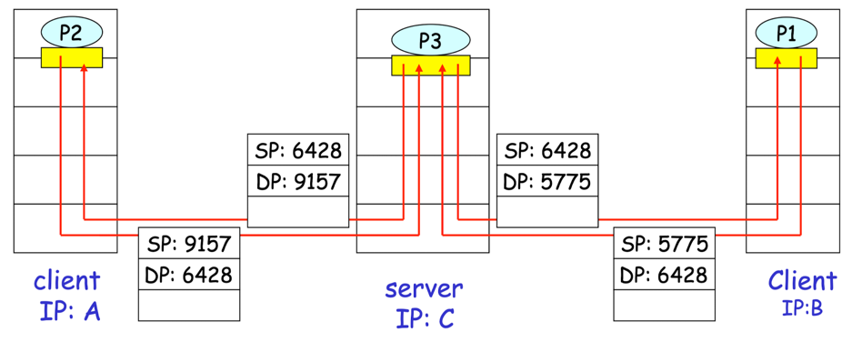
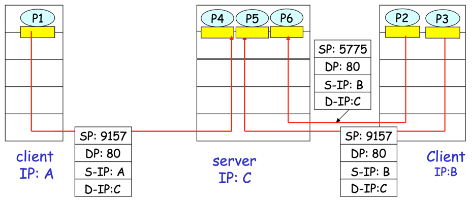

## 다중화(Multiplexing)와 역다중화(Demultiplexing)
목적지 호스트에서의 전송 계층은 네트워크 계층으로부터 세그먼트를 수신하고, 애플리케이션 프로세스에게 이 세그먼트의 데이터를 전달한다.   
이때 하나의 호스트에는 여러 프로세스가 존재하는데, 이들 중 **올바른 프로세스(소켓)에게 데이터를 전달하는 작업**이 역다중화(Demultiplexing)다.

반대로 **출발지 호스트에서 소켓으로부터 데이터를 모으고, 이에 대한 세그먼트를 생성하기 위해 각 데이터를 헤더 정보로 캡슐화하여 네트워크 계층으로 전달하는 작업**을 다중화(Multiplexing)라고 한다.

### 호스트가 수신한 세그먼트를 어떻게 적절한 소켓으로 향하게 하는걸까?
전송 계층 세그먼트는 필드 집합을 가지고 있는데, 여기에는 해당 세그먼트가 전달될 적절한 소켓을 가리키는 필드가 포함되어 있다.   
그리고 소켓은 하나의 유일한 식별자를 가지고 있으며, 이 식별자의 포맷은 UDP 소켓인지 또는 TCP 소켓인지에 따라 달라진다.

수신 측 전송 계층은 이러한 소켓의 식별자와 세그먼트의 필드 집합을 검사하고, 세그먼트를 해당 소켓으로 전달하는 것이다.

## 비연결형 다중화와 역다중화

- UDP 소켓은 도착지 IP 주소(Destination IP, D-IP)와 도착지 포트 번호(Destination Port, DP) 2가지 요소로 식별할 수 있다.
- 호스트에서 UDP 세그먼트를 수신하면 전송 계층은 세그먼트의 DP를 검사하고, 세그먼트를 해당 포트 번호에 매핑되는 소켓으로 향하게 한다.
- UDP의 경우 소켓과 소켓 사이에 1:1 매핑 개념이 없다. 다시 말해서, 동일한 소켓으로 여러 프로세스의 소켓과 데이터를 주고 받는다.

>  호스트 A의 UDP 소켓 19157을 가진 프로세스가 호스트 B의 UDP 소켓 46428을 가진 프로세스에게 애플리케이션 데이터를 전송하는 과정
> 1. 호스트 A의 전송 계층은 데이터와 SP, DP를 포함하는 세그먼트 생성
> 2. 전송 계층은 만들어진 세그먼트를 네트워크 계층으로 전달
> 3. 네트워크 계층은 세그먼트를 IP 데이터그램으로 캡슐화하고 최선형 전달 서비스로 세그먼트를 수신 호스트로 전달
> 4. 세그먼트가 수신 호스트 B에 도착하면, 수신 호스트는 세그먼트 안의 DP를 검사하고, 그 세그먼트를 적절한 소켓에 전달 (역다중화)

> 비연결형 다중화/역다중화에서 SP, S-IP는 왜 필요할까? 송신 측 입장에서 도착지만 알면 되는거 아닌가?   
> 
> 송신 측 입장에서 도착지 정보만 알면 데이터를 전송할 수 있지만, 수신 측에서 응답을 보내려면 출발지 정보가 필요하다.   
> 
> 따라서, 출발지 포트 번호와 출발지 IP 주소는 네트워크 통신에서 필수적인 요소로서, 데이터의 정확한 송수신과 네트워크 관리에 중요한 역할을 한다.

## 연결지향형 다중화/역다중화

- 서버 호스트는 동시에 많은 TCP 소켓을 지원할 수 있다.
- 서버 호스트에서 지원하는 각각의 소켓은 프로세스에 접속되어 있으며, 이들 소켓은 4개 요소(SP, DP, S-IP, D-IP)의 집합에 의해 식별된다.
- TCP 세그먼트가 호스트에 도착하면, 4가지 필드 모두는 해당되는 소켓으로 세그먼트를 전달하기(역다중화) 위해 사용된다.

> 위 연결지향형 다중화/역다중화 그림에서 P1, P2, P3의 도착지 포트 번호는 모두 80을 가리킨다. 하지만 이들은 모두 다른 소켓으로 향하고 있다.
> 
> 각 소켓은 고유의 ID를 가지는데, ID는 4가지 필드(SP, DP, S-IP, D-IP)로 구성된다. 다시 말해서, 도착지 정보 뿐만 아니라 출발지 정보까지 합쳐야 TCP 소켓을 식별할 수 있다.   
> 이는 한 머신에 같은 포트 번호에 매핑되는 여러 소켓이 존재할 수 있기 때문이다.
> 
> 예를 들어, 4명의 다른 사용자가 동시에 google.com에 접속하면 웹 서버에서는 4개의 소켓이 생성된다.
