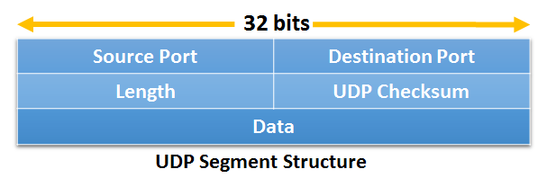
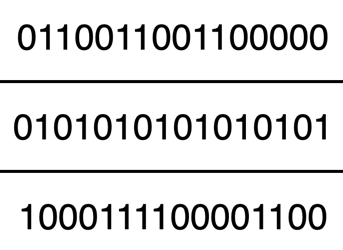
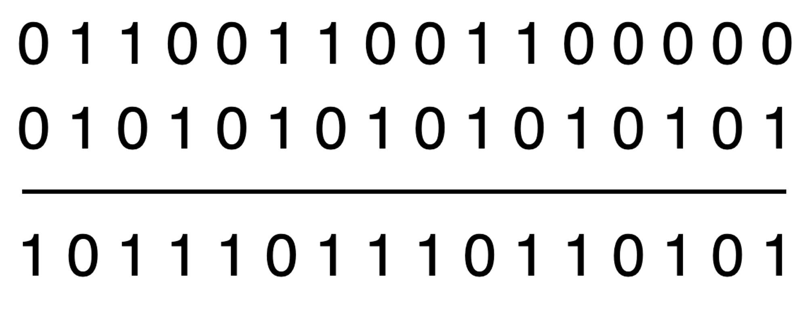
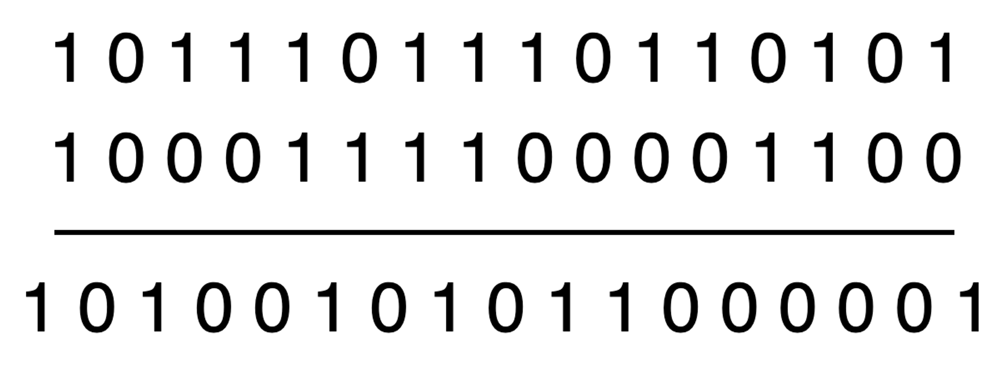
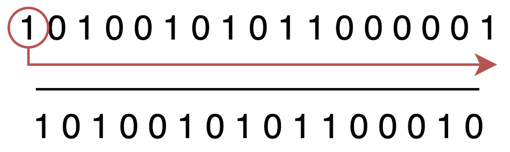
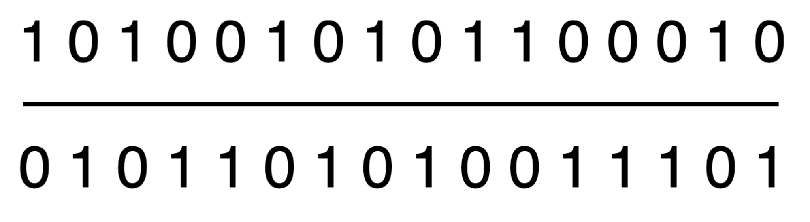

## UDP 특징
- **전송 계층 프로토콜이 할 수 있는 최소 기능으로 동작**한다. 즉, 다중화/역다중화 기능과 간단한 오류 검사 기능을 제외하면 IP에 아무것도 추가하지 않는다.
- 신뢰적 데이터 전송을 보장하지 않기 때문에 세그먼트가 유실될 수 있다.
- 세그먼트를 송신하기 전에 핸드셰이크를 수행하지 않는 **비연결형** 프로토콜이기 때문에, **연결 설정을 위한 어떤 지연도 없다.** 
- 각 연결에 대해 많은 상태 정보를 유지하느라 서버에 부담을 주는 TCP와 달리, UDP는 **상태 정보를 유지하지 않기 때문에** 서버는 부담이 감소하여 **더 많은 클라이언트를 동시에 처리**할 수 있게 된다.
- TCP는 세그먼트마다 20바이트의 헤더 오버헤드를 갖지만, UDP는 단지 8바이트의 오버헤드를 가진다.
- 신뢰적 데이터 전송을 애플리케이션 레벨에서 구현할 수 있는 애플리케이션에 적합하다.

> 애플리케이션 계층 프로토콜 중 하나인 DNS는 TCP의 연결 설정 지연을 피하기 위해서 UDP를 사용한다.
> 
> 1. 호스트의 DNS 애플리케이션이 질의를 생성할 때, DNS 질의 메시지를 작성하고 UDP에게 메시지 전달
> 2. UDP는 핸드셰이크 없이 메시지에 헤더 필드를 추가한 후에 최종 세그먼트를 네트워크 계층에 전달
> 3. 네트워크 계층은 UDP 세그먼트를 데이터그램으로 캡슐화하고 네임 서버에 데이터그램 송신   
>    (이때 질의 호스트에서의 DNS 애플리케이션은 질의에 대한 응답 대기중)

## UDP 세그먼트 구조

- 애플리케이션 데이터는 UDP 세그먼트의 데이터 필드에 위치한다.
- UDP 헤더는 2바이트씩 구성된 단 4개의 필드만 갖는다.
  - 다중화/역다중화를 위한 **포트 번호(port)** 필드
  - 다음 세그먼트가 어디서 시작하는지 알기 위해 필요한 **길이(length)** 필드
  - 세그먼트에 오류가 발생했는지 검사하기 위한 **체크섬(checksum)** 필드

## UDP 체크섬
- 역다중화를 수행하기 전에 **세그먼트에 오류가 발생했는지 감지**하기 위해 사용되는 필드
- 송신 측에서 UDP는 세그먼트의 모든 16비트 워드를 더해 1의 보수를 취한 후, 오버플로를 윤회식 자리올림(wrap around)하여 체크섬 필드에 삽입한다.
- 만약 비트 중에 하나라도 0이 있다면 패키에 오류가 발생했음을 의미
- 오류 검사는 제공하지만, 오류 회복은 제공하지 않는다.

### 체크섬 동작 원리
다음과 같은 3개의 16비트 워드가 있다고 가정한다.

이 중에서 처음 2개의 워드 합은 다음과 같다.

앞 계산의 결과와 세 번째 워드 합은 다음과 같다.

마지막 합은 오버플로가 발생했기 때문에 윤회식 자리올림(wrap around)을 수행하며, 그 결과는 다음과 같다.

마지막으로 앞의 결과에서 1의 보수를 수행하면 다음과 같은 결과가 나온다.

앞의 결괏값을 체크섬 필드에 삽입하면 끝이다.

수신 측 전송 계층에서는 세그먼트의 체크섬을 포함한 4개의 모든 16비트 워드를 더한다.   
이때 더한 값이 1111111111111111로 나온다면 오류가 발생하지 않은 것이고, **모든 비트 중 하나라도 0이 있다면 오류가 발생한 것**이다.

### UDP에서 체크섬을 제공하는 이유
많은 링크 계층 프로토콜에서는 오류 검사를 제공한다. 그런데 왜 UDP까지 체크섬을 통해 오류를 검사할까?

그 이유는 출발지와 목적지 사이의 모든 링크가 오류 검사를 제공한다는 보장이 없기 때문이다.   
즉, 링크 중에서 하나가 오류 검사를 제공하지 않는 프로토콜을 사용할 수도 있는 것이다.   
그러므로 세그먼트들이 정확하게 링크를 통해 전송되었을지라도, 세그먼트가 라우터의 메모리에 저장될 때 비트 오류가 발생할 수 있다.

따라서 전송 계층 UDP에서도 안전 장치로 오류 검사를 제공한다.
