## 신뢰적인 데이터 전송(Reliable Data Transfer, RDT)이란?  
신뢰적인 데이터 전송이란, (상위 계층 객체에게 제공되는) **데이터가 전송될 수 있는 신뢰적인 채널의 서비스 추상화를 구현하는 것**을 의미한다. 

신뢰적인 채널에서는 전송된 데이터가 손상되거나 손실되지 않는다. 그리고 모든 데이터는 전송된 순서 그대로 전달된다.   
예를 들어, TCP는 비신뢰적인 네트워크 계층의 바로 상위에 구현된 신뢰적인 데이터 전송 프로토콜이다.

반면에 비신뢰적인 채널에서는 전송된 데이터가 손상되거나 손실될 수 있다.

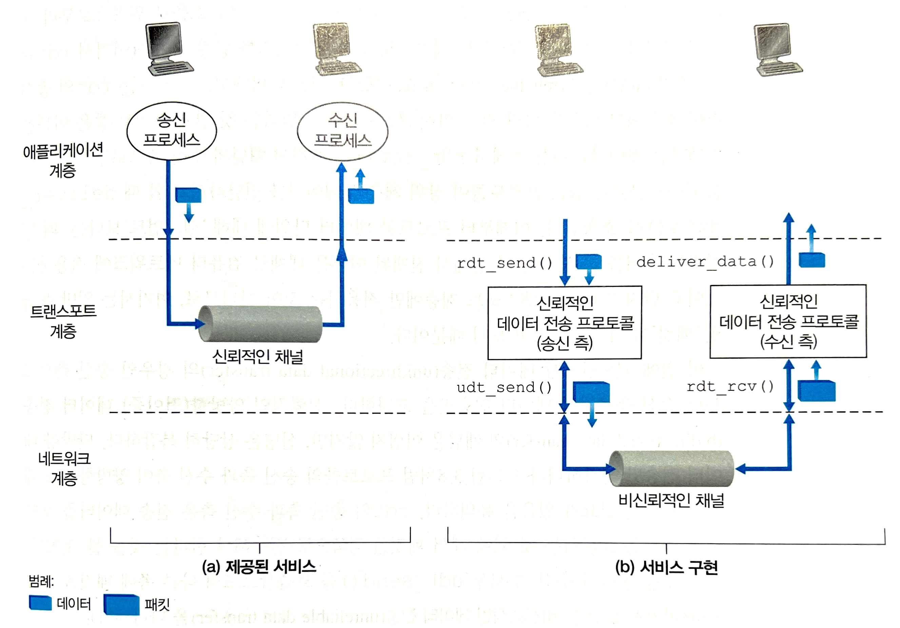

- `rdt_send()`: RDT의 송신 측 호출
- `rdt_rcv()`: 채널의 수신 측으로부터 패킷이 도착했을 때 RDT의 수신 측 호출
- `deliver_data()`: RDT 프로토콜이 상위 계층에 데이터 전달할 때 호출
- `udt_send()`: RDT의 송/수신 측에서 UDT(Unreliable Data Transfer) 호출

하위 계층이 비신뢰적일지라도 전송 계층은 신뢰적인 네트워크인 것처럼 구현되어야 하는데, 이는 어떻게 구현할 수 있을까?   

## 신뢰적인 데이터 전송 프로토콜의 구축
> ### 유한상태 머신(Finite-State Machine, FSM)
> 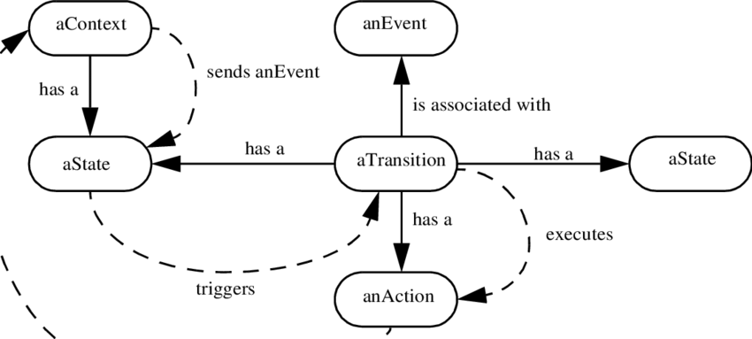
> 
> - 화살표는 한 상태로부터 다른 상태로의 전이를 나타낸다.
>   - 하나의 상태만을 갖는 경우 전이는 필연적으로 그 상태로부터 자신으로 되돌아옴
> - 전이를 일으키는 이벤트는 변화를 표기하는 가로선 위에 나타낸다.
> - 이벤트가 발생했을 때 취해지는 액션은 가로선 아래에 나타낸다.
> - 어떠한 행동도 취해지지 않거나 이번트 발생 없이 행동이 취해질 때, 동작이나 이벤트가 없음을 명확하게 표시하기 위해 각각 가로선 아래나 위에 기호 `𝞚`를 사용한다.
> - FSM의 초기 상태는 점선 화살표로 표시된다.
> - [참고](https://ko.wikipedia.org/wiki/%EC%9C%A0%ED%95%9C_%EC%83%81%ED%83%9C_%EA%B8%B0%EA%B3%84)

### RDT1.0: 완벽하게 신뢰적인 채널상에서의 신뢰적인 데이터 전송
하위 채널이 완전히 신뢰적인 채널일 경우, 즉 패킷 손상이나 손실이 없을 경우 rdt의 역할은 무엇일까?

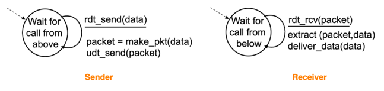

- 송신자와 수신자의 FSM은 각각 하나의 상태만을 갖고 있다.
- 하위 채널이 완전히 신뢰적이므로 rdt는 단순히 데이터를 보내고 받기만 하면 된다.
- 완전히 신뢰적인 채널에서는 오류가 생길 수 없으므로 수신 측이 송신 측에게 어떤 피드백도 제공할 필요가 없다.

### RDT2.0: 비트 오류가 있는 채널상에서의 신뢰적인 데이터 전송
하위 채널에서 데이터 손실은 발생하지 않지만 오류는 발생할 수 있을 경우, rdt의 역할은 무엇일까?

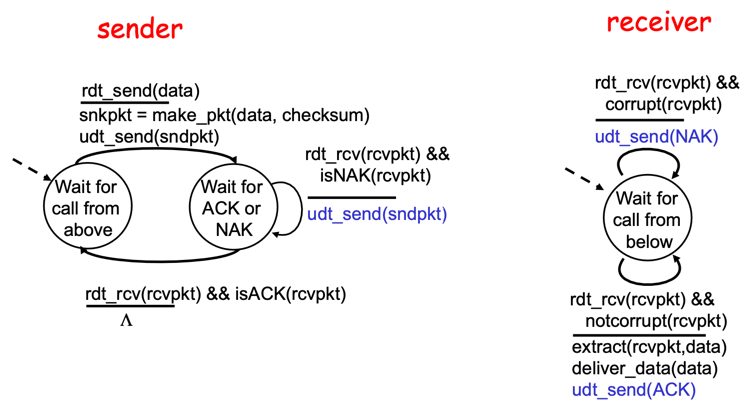
 
비트 오류를 처리하기 위해 기본적으로 다음과 같은 3가지 부가 프로토콜 기능이 **자동 재전송 요구(Automatic Repeat reQuest, ARQ)** 프로토콜에 요구된다.
- 패킷 헤더에 체크섬을 추가하여 **오류를 검출**한다.
- 수신 측 rdt는 패킷을 정상적으로 수신했을 때 ACK를, 패킷에 오류가 발생했을 때 NAK를 송신 측에게 전송함으로써 **피드백**을 수행한다.
  - 원칙적으로 ACK와 NAK 같은 패킷은 단지 한 비트 길이면 된다.   
    ex) 0 값은 NAK를 가리키고, 1 값은 ACK를 가리킴
- 송신 측 rdt는 NAK를 수신하면 패킷 전송중에 오류가 발생했다고 판단하여 패킷을 **재전송**한다.

### RDT2.1: 비트 오류가 있는 채널상에서 순서 번호를 이용한 신뢰적인 데이터 전송
과연 위에서 언급한 3가지 기능을 통해 오류를 완전히 해결할 수 있을까?   

만약 ACK 또는 NAK가 손상된다면, 송신자는 수신자가 데이터를 올바르게 수신했는지 알 방법이 없게 된다.   

다시 말해서, 수신 측에서 데이터를 올바르게 수신하여 ACK를 전송하더라도 오류가 발생하여 송신 측에서 잘못된 패킷을 받을 수 있다.   
이때 송신 측에서는 데이터를 다시 전송할 것이고, 수신 측은 그 데이터가 새로운 다음 데이터인지 중복 전송된 데이터인지 알 수 없다.

이처럼 ACK 또는 NAK가 손상되는 문제는 (다행스럽게도) 다음과 같은 방법으로 간단하게 해결할 수 있다.

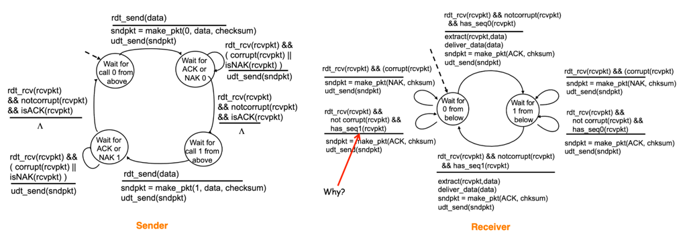

1. 송신 측에서는 전송하는 각 패킷에 한 비트의 **순서 번호**(**sequence number**)를 삽입하여 전송한다.
2. 송신 측에서는 수신 측에서 보낸 ACK 또는 NAK가 왜곡되었을 경우 현재 패킷을 재전송한다. 
3. 송신 측에서 전송한 패킷이 중복되었을 경우 수신 측은 그 패킷을 버리고 (패킷을 정상적으로 수신하기는 했으므로) ACK를 전송한다.
4. 송신 측에서는 ACK를 확인한 후, 다음 패킷에 이전에 삽입한 순서 번호와 다른 순서 번호를 삽입하여 전송한다.
5. 수신 측에서 패킷을 정상적으로 수신한 경우, 순서 번호가 올바르다면 하위 채널에 패킷을 전달한 후 송신 측에게 ACK를 전송한다.

### RDT2.2: 비트 오류가 있는 채널상에서 NAK가 없는 신뢰적인 데이터 전송
RDT2.1에서는 수신자로부터 송신자까지의 ACK와 NAK을 모두 포함했는데, 사실 NAK는 없어도 상관없으며 오히려 깔끔해진다는 장점이 있다.

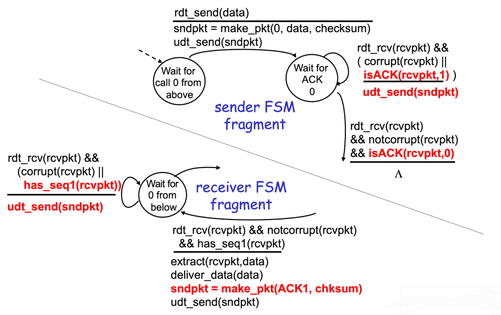

수신 측에서 NAK를 전송하는 대신, 가장 최근에 정확하게 수신된 패킷에 대해 ACK를 전송함으로써 NAK를 전송한 것과 같은 효과를 얻을 수 있다.   
같은 패킷에 대해 2개의 중복 ACK를 수신한 송신 측은 수신 측에서 두 번 ACK 처리한 패킷의 다음 패킷을 정확하게 수신하지 못했다는 것을 안다.

이를 위해 수신 측에서는 반드시 ACK를 전송할 때 패킷의 순서 번호까지 함께 전송해야 한다. 수신 측 FSM에서 `make_pkt(ACK, 0, checksum)`이 이를 의미한다.

### RDT3.0: 비트 오류와 손실이 있는 채널상에서의 신뢰적인 데이터 전송
비트가 손상되는 것 외에도 하위 채널에서는 패킷이 손실될 수도 있다. 이 경우 rdt는 어떤 역할을 수행해야 할까?

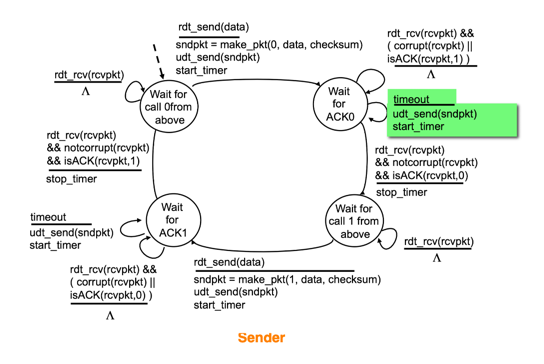

- 패킷을 전송했지만 일정 시간동안 피드백이 오지 않으면, 송신 측에서는 패킷 손실로 판단하여 패킷을 재전송한다.   
- 송신 측은 적어도 송신 측과 수신 측 사이의 왕복 시간 지연(중간 라우터에서의 버퍼링 포함)에 수신 측에서 패킷을 처리하는 데 필요한 시간을 더한 만큼 오래 기다린다.      
  이러한 문제를 해결하기 위해, 송신 측에서는 패킷 손실이 일어났을 만한 **합리적인 시간**을 현명하게 선택해야 한다.
- 패킷 또는 ACK 응답이 손실되지 않고 단지 지연될 경우, 송신 측에서의 재전송은 패킷 중복을 낳을 것이다. 그러나 이 문제는 순서 번호를 이용해 해결할 수 있다. 
- 시간 기반의 재전송 매커니즘을 구현하기 위해, 주어진 시간 후에 송신 측을 인터럽트(중단)할 수 있는 **카운트다운 타이머**가 필요하다.

아래 그림을 보면 패킷의 순서 번호가 0과 1이 번갈아 일어나므로, 프로토콜 rdt3.0을 alternating-bit protocol이라고 부르기도 한다.

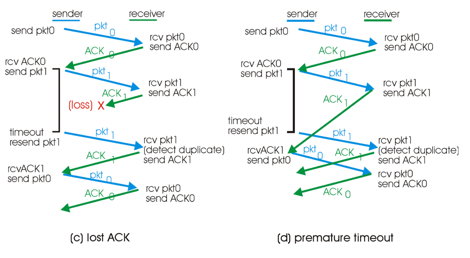

## 파이프라이닝된 신뢰적 데이터 전송 프로토콜
rdt3.0은 기능적으로는 정확한 프로토콜이지만, 전송 후 대기 프로토콜이라는 점에서 성능에 문제가 존재한다.

다음과 같이 대륙의 끝과 끝에 위치한 두 호스트가 통신한다고 가정해보자.

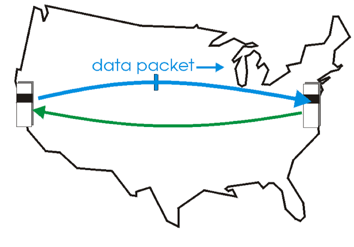

전송 후 대기 프로토콜의 경우 데이터 패킷을 전송하기까지 0.008ms가 걸리고, 그 다음에 송신 측에서 ACK 패킷을 수신하기까지 30.008ms가 걸린다고 생각해보면, 이는 정말 좋지 않은 성능임을 알 수 있다.

이러한 성능 문제를 해결하기 위해 아래 그림처럼 ACK 응답을 기다리지 않고 여러 패킷을 전송하도록 허용하면, 송신자의 네트워크 이용률을 대폭 향상시킬 수 있을 것이다.

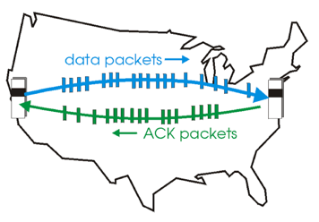

이처럼 많은 전송중인 패킷을 파이프라인에 채워 넣음으로써 나타내는 기술을 **파이프라이닝**이라고 한다.

파이프라이닝 방식은 rdt에서 다음과 같은 중요성을 지니고 있다.
- 각각의 전송 중인 패킷은 유일한 순서 번호를 가져야 하고, 아직 ACK 처리가 되지 않은 전송 중인 패킷이 여러개 존재할 수 있을지도 모르기 때문에 **순서 번호의 범위가 증가**해야 한다.
- 프로토콜의 **송신 측과 수신 측은 패킷 하나 이상을 버퍼링**, 즉 일시적으로 저해야 한다.
  - 손상 패킷과 손실 패킷을 재전송할 수 있도록 하기 위해, 최소한 송신 측은 전송되었거나 ACK 되지 않은 패킷을 버퍼링해야 한다.    
    송신 측은 버퍼에 손실 패킷과 손상 패킷을 저장하고, ACK를 받으면 해당 패킷을 버퍼에서 제거한다.
  - 모든 패킷을 올바른 순서로 조립하여 상위 계층에 전달하기 위해, 수신 측은 도착하지 않는 패킷들을 일시적으로 저장할 필요가 있다.   
    ex) 패킷 1, 2, 4가 도착하고 패킷 3이 지연된 경우, 패킷 3이 도착할 때까지 패킷 4를 버퍼에 저장

## GBN(Go-Back-N, N부터 반복) 프로토콜
[애니메이션](https://www2.tkn.tu-berlin.de/teaching/rn/animations/gbn_sr/)

- 패킷으로 파이프라인을 채우는 것을 가능하게 하여, 전송 후 대기 프로토콜에서의 채널 이용률 문제를 회피한다.
- GBN 송신자는 ACK를 기다리지 않고 여러 패킷을 전송할 수 있다.
- 파이프라인에서 ACK가 되지 않은 패킷의 최대 허용 수 N보다 크면 안 된다.

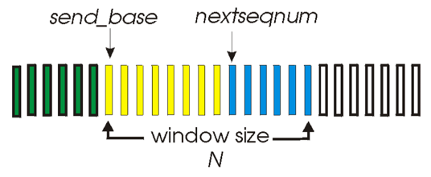

- `N`: 윈도우 크기
- `send_base`: ACK가 되지 않은 가장 오래된 패킷의 순서 번호
- `nextseqnum`: 사용되지 않은 가장 작은 순서 번호 (전송될 다음 패킷의 순서 번호)
- `[0, base-1]` = 순서 번호는 이미 전송되고 ACK 된 패킷들
- `[base, nextseqnum-1]` = 송신은 되었지만 아직 ACK 되지 않은 패킷들
- `[nextseqnum, base+N-1]` = 상위 계층으로부터 데이터가 도착하면 바로 전송될 수 있는 패킷들
- `[base+N, ~]` = 파이프라인에서 ACK 되지 않은 패킷의 ACK가 도착할 때까지 사용 불가

프로토콜이 동작할 때 윈도우는 순서 번호 공간에서 오른쪽으로 이동되며, 이러한 이유로 GBN 프로토콜은 **슬라이딩 윈도우 프로토콜**이라고 불린다.

### 확장된 FSM
다음은 rdt3.0에서 base와 nextseqnum 변수를 추가한 FSM인데, 이러한 변수에서의 동작과 이러한 변수를 포함하는 조건부 동작을 추가했다는 의미에서 확장된 FSM이라고 부른다.

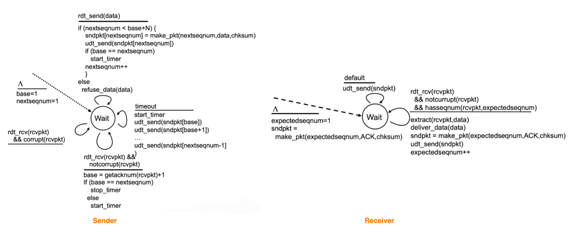

- `expectedseqnum`: 다음 순서 패킷의 순서 번호

### GBN 송신자의 역할
GBN 송신자는 다음과 같은 3가지 타입의 이벤트에 반응해야 한다.
- **상위로부터의 호출**
  1. `rdt_send()`가 상위로부터 호출되면, 송신자는 우선 윈도우가 가득 찼는지, 즉 N개의 아직 ACK 되지 않은 패킷이 있는지 확인하낟.
  2. 만약 윈도우가 가득 차 있지 않다면, 패킷이 생성되고 송신된다. 그리고 변수들이 적절하게 갱신된다.
  3. 만약 윈도우가 가득 차 있다면, 송신자는 단지 데이터를 상위 계층으로 반환하며, 상위 계층은 나중에 다시 시도하게 된다.
- **ACK의 수신**
  1. GBN 프로토콜에서 순서 번호 n을 가진 패킷에 대한 ACK는 누적 ACK로 인식된다.
  2. **누적 ACK**: 수신 측에서 올바르게 수신된 n을 포함하여, n까지의 순서 번호를 가진 모든 패킷에 대한 ACK
- **타임아웃**
  1. 타이머는 손실된 데이터 또는 손실된 ACK 패킷으로부터 회복하는 데 사용된다.
  2. 만약 타임아웃이 발생하면, 송신자는 이전에 전송했지만 아직 ACK 되지 않은 모든 패킷을 재전송한다.
  3. 만약 전송했지만 아직 ACK 되지 않은 패킷이 존재한다면 타이머는 다시 시작되고, 그렇지 않다면 타이머는 멈춘다.

### GBN 수신자의 역할
- 만약 순서 번호 n을 가진 패킷이 오류 없이 그리고 순서대로 수신된다면, 수신자는 패킷 n에 대한 ACK를 송신하고 상위 계층에 패킷의 데이터 부분을 전달한다.
- 그 외의 경우, 수신자는 패킷을 버리고 가장 최근에 제대로 수신된 순서의 패킷에 대한 ACK를 재전송한다.
- 수신자는 올바르게 수신되었지만 순서가 틀린 패킷을 버림으로써, 어떤 순서가 잘못된 패킷에 대해 버퍼링을 할 필요가 없다.

### GBN 프로토콜의 동작
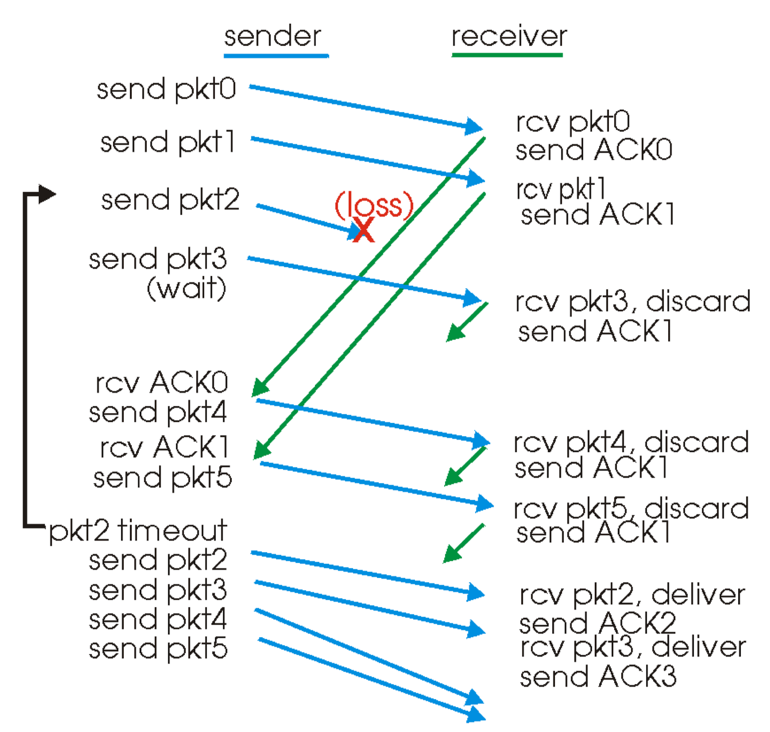

- 윈도우 크기의 제한 때문에 송신자는 패킷 0부터 3까지 송신한 뒤 하나 이상의 패킷이 ACK 되는 것을 기다려야 한다.
- 각각의 성공적인 ACK가 수신될 때마다, 윈도우는 앞으로 이동하고 송신자는 하나의 새로운 패킷을 전송한다.
- 수신자는 패킷 2가 손실되었으므로, 패킷 3, 4, 5를 순서가 잘못된 패킷으로 판단하여 제거한다.

## SR(Selective Repeat, 선택적 반복) 프로토콜
GBN은 패킷 하나의 오류 때문에 많은 패킷을 재전송하므로, 많은 패킷을 불필요하게 재전송하는 문제가 발생한다.   
다시 말해서, 채널 오류의 확률이 증가할수록 파이프라인은 불필요한 재전송 데이터로 채워진다. 이는 곧 성능 이슈를 야기하는 것이다.

이러한 성능 문제를 해결하기 위해,
- 송신자는 수신 측에서 오류가 발생한 패킷을 수신했다고 의심되는 패킷만을 다시 전송함으로써, 불필요한 재전송을 피할 수 있다.
- 필요에 따라 각각의 개별적인 재전송은 수신자가 올바르게 수신한 패킷에 대한 개별적인 ACK를 요구한다.
- SR 수신자는 패킷의 순서와는 무관하게 손상 없이 수신된 패킷에 대한 ACK를 보낸다.
- 먼저 수신된 패킷(#3)은 빠진 패킷(#2)이 수신될 때까지 버퍼에 저장하고, 빠진 패킷(#2)이 수신된 시점에서 일련의 패킷(#0~3)을 순서대로 상위 계층에 전달한다.

### SR 송신자의 이벤트와 행동
- **상위로부터 데이터 수신**
  1. 상위에서 데이터가 수신될 때, 송신자는 패킷의 다음 순서 번호를 검사한다.
  2. 순서 번호가 송신자 윈도우 내에 있으면 데이터는 패킷으로 송신된다.
  3. 그렇지 않으면 GBN처럼 나중에 전송하기 위해 버퍼에 되돌려진다.
- **타임아웃** 
  1. 타임아웃 시 오직 한 패킷만이 전송되기 때문에, 각 패킷은 자신의 논리 타이머가 있어야 한다.
  2. 일반적으로 하나의 하드웨어 타이머가 여러 개의 논리 타이머를 흉내내는 데 사용된다.
- **ACK 수신**
  1. ACK가 수신되었을 때, 송신자는 그 ACK가 윈도우 내에 있다면 그 패킷을 수신한 것으로 표기한다.
  2. 만약 패킷 순서 번호가 send_base와 같다면, 윈도우 베이스는 가장 작은 순서 번호를 가진 아직 ACK 되지 않은 패킷으로 옮겨진다.
  3. 만약 윈도우가 이동하고 나서 윈도우 내의 순서 번호를 가진 미전송 패킷이 있다면, 이 패킷들은 전송된다.

### SR 수신자의 이벤트와 행동
- **`[rcv_base, rcv_base+N-1]` 내의 순서 번호를 가진 패킷이 손상 없이 수신되는 경우**
  1. 만약 범위에 속하는 패킷이 이전에 수신되지 않았던 것이라면 버퍼에 저장된다.
  2. 만약 버퍼에 방금 저장한 패킷이 수신 윈도우의 base와 같은 순서 번호를 가졌다면, 해당 패킷과 이전에 버퍼에 저장되어 연속적으로 번호를 가진 패킷들은 상위 계층으로 전달된다.
- **`[rcv_base-N, rcv_base-1]` 내의 순서 번호를 가진 패킷이 수신되는 경우**
  1. 수신된 패킷이 수신자가 이전에 ACK를 보낸 것이라도 ACK가 생성되어야 한다.
- **그 외의 경우**
  1. 패킷을 무시한다.

> #### 왜 수신자는 현재 윈도우 base보다 작은 특정 순서 번호를 가진 이미 수신된 패킷을 무시하지 않고 ACK를 보내는 것일까?
> 수신자가 송신자에게 보내는 send_base 패킷에 대한 ACK가 손실된다면, 수신자가 그 패킷을 이미 수신했음이 분명하더라도 송신자는 해당 패킷을 재전송할 것이다.   
> 특히 수신자가 이 패킷에 대한 ACK를 보내지 않는다면, 송신자의 윈도우는 결코 앞으로 이동하지 않는다.
> 
> 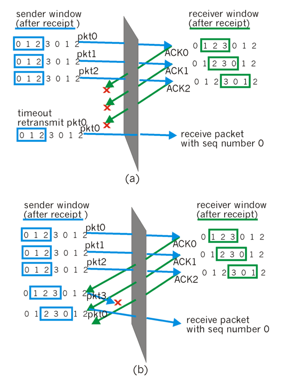
> 
> 따라서 SR 수신자는 이미 수신된 패킷에 대한 ACK도 반드시 응답해야 한다.

## RDT 매커니즘과 그 사용 목적
| 매커니즘        | 사용 설명                                                                                                                                           |
|-------------|-------------------------------------------------------------------------------------------------------------------------------------------------|
| **체크섬**         | 전송된 패킷 안의 비트 오류를 발견하는 데 사용된다.                                                                                                                   |
| **타이머**         | 채널 안에서 패킷이 손실되어 발생되는 패킷의 타임아웃/재전송에 사용된다.                                                                                                        |
| **순서 번호**       | 송신자에서 수신자로 가즌 데이터 패킷의 순서 번호를 붙이기 위해 사용된다.   수신자는 순서 번호의 간격을 통해 손실된 패킷을 검사한다.   또한 수신자는 중복된 순서 번호를 통해 패킷의 중복 여부를 검사한다.                   |
| **확인응답(ACK)**   | 수신자가 한 패킷 또는 패킷 집합이 정확하게 수신되었다는 응답을 송신자에게 보내기 위해 사용된다.   ACK는 일반적으로 패킷 또는 이미 ACK된 패킷들의 순서 번호를 전달한다.   ACK는 프로토콜에 따라 개별적이거나 누적된 것일 수 있다. |
| **부정 확인응답(NAK)** | 수신자가 패킷이 정확하게 수신되지 않았다는 응답을 송신자에게 보내기 위해 사용된다.   NAK는 일반적으로 정확하게 수신되지 않은 패킷의 순서 번호를 전달한다.                                                   |
| **윈도우, 파이프라이닝** | 송신자는 주어진 범위에 있는 순서 번호를 가진 패킷만 전송하도록 제한될 수 있다.   ACK는 아직 없지만 허가된 패킷이 전송될 수 있으므로, 송신자의 이용률은 전송 후 대기 모드의 동작보다 증가할 수 있다.                        |
