## TCP 개요
- TCP 프로토콜은 오직 종단 시스템에서만 동작하며, 중간의 네트워크 요소(라우터, 스위치 등)에서는 TCP 연결을 감지하지 못한다.
- 항상 단인 송신자와 단일 수신자 사이의 **점대점**(**point-to-point**) 방식으로 동작하며, **멀티캐스팅이 불가능**하다.
- 데이터 전송의 효율성과 속도를 높이기 위해, 여러 데이터 패킷을 동시에 전송하고 처리하는 **파이프라이닝** 방식을 사용한다. 
- **전이중**(**full-duplex**) 서비스를 제공하여 양방향 통신이 가능하다. 즉, 통신하는 두 프로세스는 송신자와 수신자 모든 역할을 수행할 수 있다.
- 서로 다른 2개의 프로세스가 통신하기 전에, 두 프로세스는 서로 handshake를 먼저 수행한다. (**연결지향형**)

### TCP 연결 과정 (3-way handshake)
1. 클라이언트 프로세스는 TCP에게 서버 프로세스와 연결 설정하기를 원한다고 알린다. 
    `clientSocket.connect((serverName, serverPort))`
2. 클라이언트가 먼저 특별한 TCP 세그먼트를 서버에 전송한다.
3. 서버는 두 번째 특별한 TCP 세그먼트로 응답한다.
4. 마지막으로 클라이언트가 세 번째 특별한 세그먼트로 다시 응답한다.

이때 처음 2개의 세그먼트에는 페이로드, 즉 애플리케이션 계층 데이터가 존재하지 않는다. (3번째 세그먼트는 페이로드 포함 가능)

### 데이터 송수신 과정
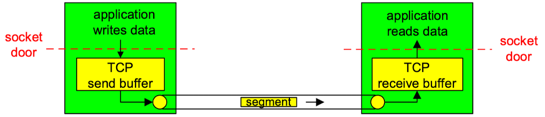

- 클라이언트 프로세스는 소켓을 통해 데이터의 스트림을 전송 계층에 전달한다.
- 데이터가 소켓을 통해 전달되면, 해당 데이터는 클라이언트에서 동작하고 있는 TCP에 맡겨진다.
- TCP는 데이터를 **송신 버퍼**(**send buffer**)로 보내며, 때때로 송신 버퍼에서 데이터 묶음을 만들어 네트워크로 보내기도 한다.
  - 세그먼트로 모아 담을 수 있는 최대 데이터의 양은 **MSS**(**Maximum Segment Size**)로 제한된다.

    > MSS는 TCP 세그먼트에 담을 수 있는 최대 데이터 크기를 의미한다. TCP는 이 세그먼트 단위로 데이터를 나누어 전송한다.

  - MSS는 일반적으로 **MTU**(**Maximum Transmission Unit**)에 의해 일단 결정되고, 그 후에 TCP 세그먼트와 TCP/IP 헤더 길이가 단일 링크 계층 프레임에 딱 맞도록 하여 정해진다.

    > MTU는 네트워크에서 전송할 수 있는 가장 큰 프레임의 크기를 의미한다. 각 네트워크 요소는 자체적으로 정의된 MTU 값을 가지며, 이 값은 링크 계층에서 한 번에 전송할 수 있는 최대 크기의 데이터 패킷을 결정한다.   
      이때 이더넷과 PPP 링크 계층 프로토콜은 모두 1500바이트의 MTU를 가지므로, MSS의 일반적인 값은 1460바이트다.   
      MSS는 헤더를 포함하는 TCP 세그먼트의 최대 크기가 아니라, 세그먼트에 있는 애플리케이션 계층 데이터에 대한 최대 크기임에 주의하자.
    
- TCP는 TCP 헤더와 클라이언트 데이터를 하나로 짝지어 TCP 세그먼트를 구성한다.
- 구성된 세그먼트는 네트워크 계층에 전달되며, 네트워크 계층 IP 데이터그램 안에 각각 캡슐화된 후 네트워크로 송신된다.
- TCP가 세그먼트를 수신했을 때, 세그먼트의 데이터는 TCP 연결의 수신 버퍼에 위치하고 애플리케이션은 이 버퍼로부터 데이터의 스트림을 읽는다.

## TCP 세그먼트 구조
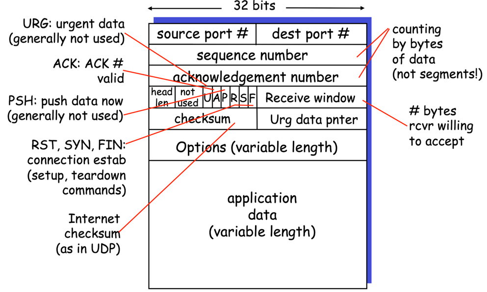

- `source port`, `dest port`: 상위 계층으로부터 다중화와 역다중화를 하는 데 사용 (like UDP)
- `checksum`: 오류 검출하는 데 사용 (like UDP)
- `sequence number`, `ack number`: 신뢰적 데이터 전송을 위해 사용되는 송신 측과 수신 측의 순서 번호
- `receive window`: 수신자가 받아들이려는 바이트의 크기를 나타내기 위해 사용 (in 흐름 제어)
- `header length`: TCP 헤더의 길이 (option 필드 때문에 가변적인 길이가 될 수 있음)
- `options`: 송신자와 수신자가 최대 세그먼트 크기(MSS)를 협상하거나 고속 네트워크에서 이용하기 위한 윈도 확장 요소로 사용
- `flag`
  - `ACK`: 확인 응답 필드에 있는 값이 유용함을 가리키는 데 사용
  - `RST`, `SYN`, `FIN`: 연결 설정과 해제에 사용
  - `PSH`: 수신자가 데이터를 상위 계층에 즉시 전달해야 함을 나타내는 데 사용
  - `URG`: 송신 측 상위 계층 개체가 '긴급'으로 표시하는 데이터임을 가리키는 데 사용
    - TCP는 긴급 데이터가 존재할 때 수신 측 상위 계층 개체에게 통지해야 하고, 긴급 데이터의 끝에 대한 포인터를 전달한다.

### 순서 번호와 확인응답 번호
- **순서 번호(Sequence Number)**
  - TCP 세그먼트에서 데이터 스트림의 첫 번째 바이트의 위치를 나타내는 숫자
    
    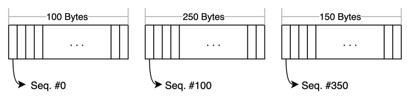
  
- **확인응답 번호(ACK Number)**
  - 수신자가 받은 데이터에 대해 송신자에게 확인 응답을 보내는 메커니즘 
  - ACK 번호는 다음에 수신자가 기대하는 바이트의 순서 번호를 의미
  - **Cumulative ACK**: TCP에서는 수신자가 연속된 데이터의 가장 마지막 바이트에 대한 확인 응답을 보내므로, 중간에 손실된 데이터가 있다면 손실된 데이터 이후의 모든 데이터를 다시 전송해야 할 수도 있음

### 순서 번호와 확인응답 번호 예제 (feat. 텔넷)
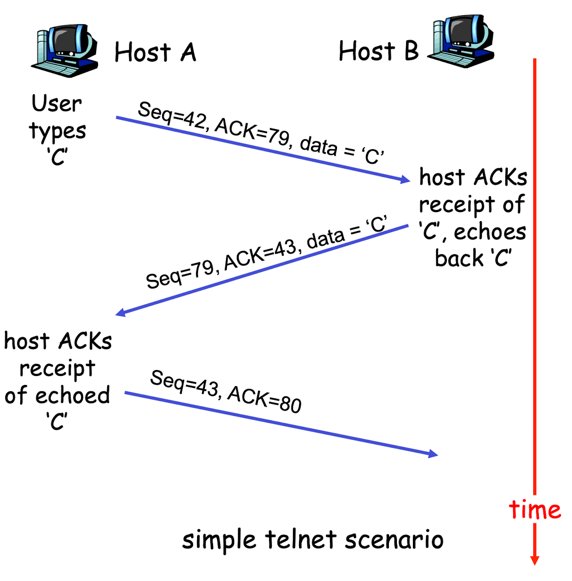

## 왕복 시간(RTT) 예측과 타임아웃
### RTT와 SampleRTT
- **RTT(Round-Trip Time)**: TCP 세그먼트가 송신된 시점부터 해당 세그먼트에 대한 ACK를 수신할 때까지의 시간
- **SampleRTT**: 특정 세그먼트가 송신된 시간부터 그 세그먼트에 대한 ACK가 도착한 시간까지의 시간
  
  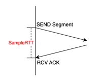
  
  TCP가 네트워크의 상태를 파악하고 재전송 타이머(Timeout)를 설정하는 데 사용된다.

### SampleRTT의 문제점
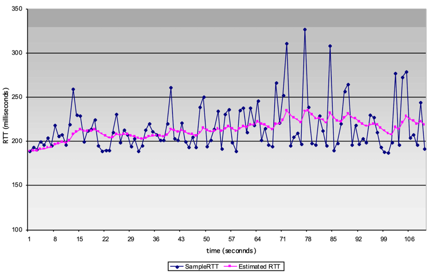

- 네트워크 상태에 따라 **SampleRTT는 크게 변동될 수 있다**.   
  ex) 각 세그먼트가 거치는 라우터의 Queuing Delay가 다르기 때문에 SampleRTT 값이 불규칙할 수 있다.
- 재전송된 세그먼트의 ACK가 원본 세그먼트에 대한 응답인지, 재전송된 세그먼트에 대한 응답인지 구분하기 어렵기 때문에, TCP는 **재전송된 세그먼트에 대해 SampleRTT를 계산하지 않는다**.

### EstimatedRTT 계산
SampleRTT의 변동성을 보완하기 위해, TCP는 SampleRTT의 가중 평균인 **EstimatedRTT**를 사용하여 네트워크 상태를 예측한다.    
이때 가중치를 부여하여 최근의 SampleRTT를 더 반영하게 된다.

`EstimatedRTT = (1−α)*EstimatedRTT + α*SampleRTT`

여기서 α는 가중치를 결정하는 상수로, 보통 0.125로 설정된다.

### DevRTT와 타임아웃 설정
EstimatedRTT만으로는 타임아웃 설정에 충분하지 않기 때문에, SampleRTT의 변동성을 반영하는 **DevRTT**도 고려한다.

`DevRTT = (1−β)*DevRTT + β*|SampleRTT−EstimatedRTT|`

여기서 β는 보통 0.25로 설정된다.

그리고 타임아웃 값은 다음과 같이 구할 수 있다.

`TimeoutInterval = EstimatedRTT + 4*DevRTT`

이 공식에서 타임아웃 간격은 EstimatedRTT에 DevRTT의 네 배를 더한 값으로 설정된다.    
DevRTT가 큰 경우 여윳값이 커지며, 작은 경우 여윳값이 작아져 타임아웃이 보다 정확해진다.

### 타임아웃 설정의 중요성
- 타임아웃 값이 너무 짧으면 불필요한 재전송이 발생할 수 있어 네트워크 효율이 저하된다.
- 타임아웃 값이 너무 길면 데이터 전송 지연이 증가하고, 손실된 세그먼트에 대한 재전송이 지연될 수 있다.

따라서 TCP에서 타임아웃 값은 적절한 EstimatedRTT와 DevRTT를 기반으로 설정하여 네트워크 상태에 최적화된 값을 사용하는 것이 중요하다. 이를 통해 불필요한 재전송을 줄이고, 효율적인 데이터 전송을 유지할 수 있다.

## 신뢰적인 데이터 전송
TCP는 IP의 비신뢰적인 서비스 위에 신뢰적인 데이터 전송 서비스를 제공하며, 이러한 rdt는 다음과 같은 기능을 수행한다.
- 프로세스가 자신의 수신 버퍼로부터 읽은 데이터 스트림이 손상되지 않았으며 손실이나 중복이 없다는 것, 그리고 순서가 유지된다는 것을 보장한다.

### TCP 송신자의 주요 이벤트
- #### 애플리케이션으로부터 수신된 데이터
  - 상위 애플리케이션으로부터 데이터를 받고, 세그먼트로 이 데이터를 순서 번호와 함께 캡슐화하고, IP에게 이 세그먼트를 넘긴다.
  - 타이머가 이미 다른 세그먼트에 대해 실행 중이 아니면, TCP는 세그먼트를 IP로 넘길 때 타이머를 시작한다.
  - 타이머에 대한 만료 주기는 `TimeoutInterval`이다.
- #### 타이머 타임아웃
  - 타임아웃을 일으킨 세그먼트를 재전송하여 응답하고, 타이머를 다시 시작한다.
- #### ACK 수신
  송신자는 데이터가 성공적으로 전달되었음을 알리기 위해 수신된 ACK를 사용한다. 이때 수신된 ACK가 이전에 송신한 세그먼트 중 아직 확인되지 않은 세그먼트에 대한 것이라면, 
  - 송신기는 해당 세그먼트가 성공적으로 전달되었음을 기록한다. 즉, 이 ACK를 통해 어느 부분까지의 데이터가 수신자에게 제대로 도착했는지를 확인하고, 그 정보를 업데이트한다.
  - 아직 ACK 되지 않은 세그먼트들이 남아 있다면 타미어를 다시 시작한다.

### 재전송 시나리오
다음은 여러 경우에 따른 재전송 시나리오를 보여준다.

1. **손실된 확인응답에 기인하는 재전송**
  
   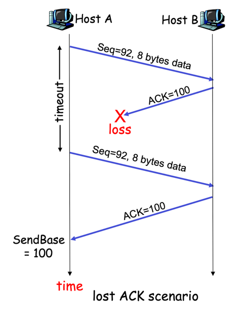
  
2. **세그먼트 100이 재전송되지 않는 경우**

   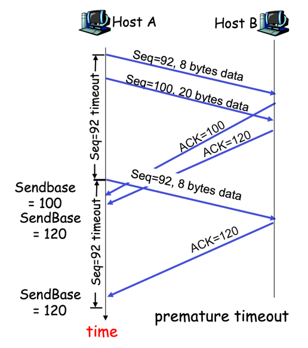

3. **누적 확인응답의 첫 번째 세그먼트 재전송 방지**

   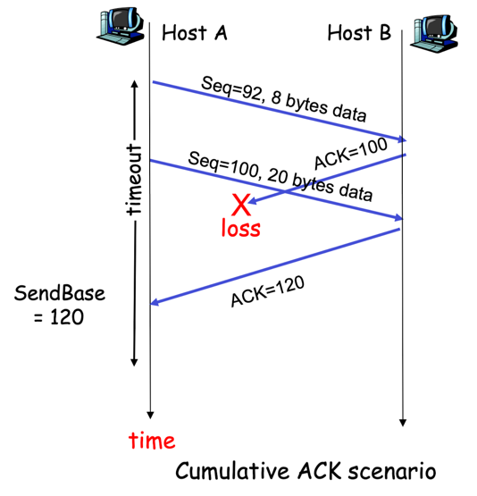

### Fast Retransmit (빠른 재전송)
타임아웃의 주기가 때때로 비교적 길다는 문제점이 존재한다.    
세그먼트를 잃었을 때, 긴 타임아웃 주기는 잃어버린 패킷을 다시 보내기 전에 송신자를 오랫동안 기다리게 해서 종단 간의 지연을 증가시킨다.

이러한 문제를 해결하기 위해, TCP는 **빠른 재전송**(**fast retransmit**) 방식을 사용한다.

송신자가 많은 양의 세그먼트를 연속적으로 보냈을 때, 하나의 세그먼트가 손실된다면 많은 연속적인 중복 ACK를 수신하게 될 것이다.     
만약 같은 데이터에 대해 3개의 중복 ACK를 수신한다면, 송신자는 해당 세그먼트 이후의 데이터가 손실된 것으로 추정하고, 타이머 만료 전에 해당 세그먼트를 빠르게 재전송한다.

## 흐름 제어
수신 측 애플리케이션이 데이터를 읽는 속도가 비교적 느린 상태에서 송신자가 전송량을 늘린다면, 수신 버퍼에 오버플로가 발생하게 된다.   
따라서 **애플리케이션이 수신 버퍼에서 데이터를 읽는 속도에 따라 송신자의 데이터 전송량과 속도를 조절**해야 한다.

TCP는 송신자가 수신자의 버퍼를 오버플로시키는 것을 방지하기 위해, 애플리케이션에게 흐름 제어(flow control) 서비스를 제공한다.

### 동작 원리
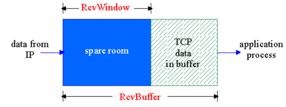

TCP는 연결상의 각 호스트에 별개의 수신 윈도우(`RcvWindow`)라는 변수를 유지하여 흐름 제어를 제공한다.   
여기서 말하는 `RcvWindow`는 수신 측에서 가용한 버퍼 공간이 얼마나 되는지를 송신자에게 알려주는 데 사용되며, 세그먼트 헤더의 `receive window` 필드에 포함된다.

TCP 연결상에서 각 호스트는 개별적으로 수신 버퍼를 할당 받는데, 이 수신 버퍼의 크기를 `RcvBuffer`라는 변수로 나타낸다.

1. 수신자는 처음에 `RcvWindow`를 `RcvBuffer`로 설정한다.
2. 수신자는 송신자에게 전송하는 모든 세그먼트의 윈도우 필드에 현재 `RcvWindow` 값을 설정함으로써, 수신 버퍼에 얼마만큼의 여유 공간이 있는지를 송신자에게 알려준다.
3. 송신자는 확인되지 않은(ACK 되지 않은) 데이터 전송량을 `RcvWindow` 값으로 제한한다.

### 수신 윈도우의 크기가 0이라면 어떻게 될까?
수신자가 `RcvWindow` 값이 0이라고 알리면 송신자는 데이터를 더 이상 전송하지 않을텐데, 이로 인해 교착 상태가 발생할 수 있다.      
예를 들어, 수신 측 애플리케이션이 어느 정도의 데이터를 읽어 들여 수신 버퍼에 여유가 생기더라도, 수신자가 어떤 데이터를 전송하지 않는 한 송신자는 가만히 있게 된다.

이를 해결하기 위해, 송신자는 주기적으로 데이터를 전송하여 수신자로부터 ACK 응답을 받아내고, 그 세그먼트에 있는 `RcvWindow` 값을 확인한다.

### 세그먼트의 크기는 얼마나 잡아야 할까?
세그먼트의 크기는 가능한 최대 크기로 만드는 것이 좋다. 데이터 크기에 상관 없이 헤더 크기는 40 byte로 고정되어 있으므로, 세그먼트의 크기가 크다는건 결국 데이터 크기가 크다는 것을 의미하기 때문이다. 즉, 오버헤드가 감소한다.   

과연 애플리케이션의 쓰기 속도가 굉장히 느려도 세그먼트의 크기는 클수록 좋을까?   
예를 들어 송신 버퍼에 데이터가 1byte씩 들어오는 경우, 1byte 그대로 세그먼트에 담아서 보내야 할까? 아니면 어느 정도 쌓일 때까지 기다려야 할까?

이에 대한 해답은 **데이터의 양이 적어도 기다리지 말고 일단 전송**하는 것이다.   
ACK가 오기 전에 세그먼트의 크기가 max에 도달하면 당연히 그대로 전송하면 될 것이고, 아직 충분히 쌓이지 않았더라도 ACK가 왔을 때 바로 전송하면 된다.

ACK가 오는 동안 버퍼에 데이터가 많이 채워지지 않았다는 것은 애플리케이션의 쓰기 속도가 느리다는 것이고, 이 경우 기다려봤자 더 쌓일 기대치가 낮기 때문이다.

이는 단순하지만 합리적인 솔루션이다.

## TCP 연결 관리
### 3-way handshake
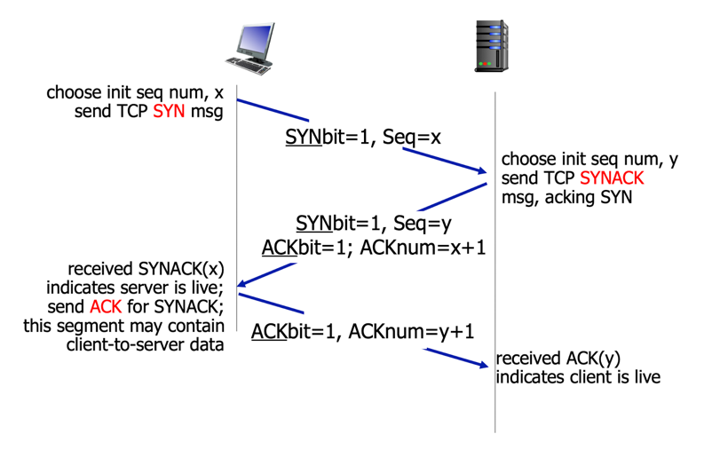

1. 클라이언트 측 TCP는 서버 TCP에게 SYN 세그먼트 송신
   - 이 세그먼트는 애플리케이션 계층 데이터를 포함하지 않는다.
   - 세그먼트의 헤더에 있는 플래그 필드 중 SYN 비트를 1로 설정한다.
   - 클라이언트는 특정 보안 공격을 피하고자 순서 번호(`client_isn`)를 임의로 선택하고, 이를 SYN 세그먼트 헤더의 순서 번호 필드에 넣는다.
   - 세그먼트는 IP 데이터그램 안에 캡슐화되어 서버로 송신된다.
2. SYN 세그먼트를 포함하는 IP 데이터그램이 서버 호스트에 도착하면, 서버는 데이터그램으로부터 SYN 세그먼트 추출 & 연결에 TCP 버퍼와 변수를 할당한 뒤 클라이언트 TCP로 연결 승인 세그먼트 송신 
   - 이 세그먼트는 애플리케이션 계층 데이터를 포함하지 않는다.
   - 세그먼트 헤더 안에 3개의 중요한 정보를 포함한다.
     - SYN 비트를 1로 설정
     - 확인응답 필드에 `client_isn+1` 삽입
     - 순서 번호 필드에 서버의 최초 순서 번호(`server_isn`) 삽입 
3. 연결 승인 세그먼트를 수신하면, 클라이언트는 연결에 버퍼와 변수 할당 & 서버로 또 다른 세그먼트 송신
   - TCP 세그먼트 헤더의 확인응답 필드에 `server_isn+1` 값을 넣음으로써 서버의 연결 승인 세그먼트를 확인한다.
   - 연결이 설정되었기 때문에 SYN 비트는 0으로 설정한다.
   - 마지막 세그먼트에는 데이터를 담아서 전달할 수 있다. 

### TCP 연결 종료
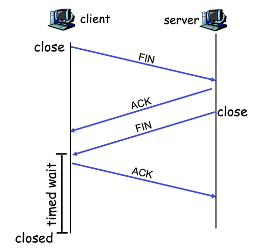

- TCP 연결에 참여하는 두 프로세스 중 하나가 연결을 끝낼 수 있다.
- 연결이 끝날 때, 호스트의 자원(버퍼와 변수)은 회수된다.

1. 클라이언트 TCP는 서버 프로세스에게 FIN 세그먼트를 전송한다.
2. 서버는 FIN 세그먼트를 받아 ACK를 응답으로 전송한다. 그리고나서 FIN 비트가 1로 설정된 자신의 종료 세그먼트를 전송한다.
3. 클라이언트는 서버의 (FIN 비트가 1로 설정된) 종료 세그먼트를 받고, ACK를 응답으로 전송한다.
4. 서버는 ACK 응답을 받고, 연결이 종료된다.

### TCP 상태 전이 다이어그램
TCP 연결이 존재하는 동안 각 호스트에서 동작하는 TCP 프로토콜은 다음과 같이 다양한 TCP 상태를 두루 전이한다.

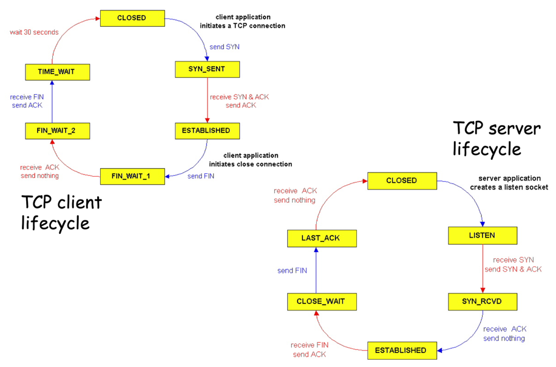
