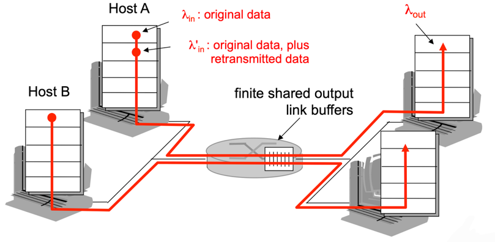

## 혼잡의 원인과 비용
3가지 시나리오를 통해 혼잡의 **원인**과 **비용**에 대해 살펴보자.

### 시나리오 1: 2개의 송신자와 무한 버퍼를 갖는 하나의 라우터
두 호스트 A와 B가 각각 출발지와 목적지 사이에 단일 홉을 공유하는 연결을 가지고 있을 경우 (`𝞴_in`: 데이터 송신률, `𝞴_out`: 데이터 수신률)

 

- 전송 계층 프로토콜은 단순히 데이터를 캡슐화하고 전송하기만 한다. (오류 복구 및 재전송, 흐름 제어 또는 혼잡 제어 수행 X)
- 호스트 A와 B가 전송하는 패킷은 라우터와 용량 R의 공유 출력 링크를 통과한다.
- 라우터는 패킷 도착률이 출력 링크의 용량을 초과하여 입력되는 패킷들을 저장하는 버퍼를 가지고 있다.
- 라우터가 가지는 버퍼의 크기는 무제한이다.

위 가정들을 바탕으로 한 호스트 A의 연결 성능은 다음과 같다.

왼쪽 그림은 **연결당 처리량**(**per-connection throughput**)을, 오른쪽 그림은 링크 용량 근처에서의 동작 결과를 나타낸다. 
- 0과 R/2 사이의 전송률에 대해 수신자 측의 처리량은 송신자의 전송률과 같다. (두 연결 사이에서 링크 용량을 공유한 결과)
  - 안정 상태의 링크에서는 두 호스트가 각각의 전송률을 아무리 높게 설정하더라도 R/2보다 더 높은 처리량을 얻을 수 없다.
- R 근처의 전체 처리량에서 동작하는 것은 처리량 관점에서는 링크를 최대로 활용하므로 이상적이지만, 지연 관점에서는 이상적이지 않다. 
- **혼잡 비용**: 패킷 도착률이 링크 용량에 근접함에 따라 큐잉 지연 증가

### 시나리오 2: 2개의 송신자와 유한 버퍼를 갖는 하나의 라우터

- 라우터 버퍼의 크기는 유한하므로, 이미 버퍼가 가득 찼을 때 도착하는 패킷들은 버려진다.
- 각 연결은 신뢰적이다. 즉, 패킷이 라우터에서 버려지면 송신자에 의해 재전송된다.

위 가정들을 바탕으로 한 호스트 A의 연결 성능은 재전송이 어떻게 수행되는지에 따라 다음과 같이 구분된다. 

- **a.** 송신자가 라우터에 있는 버퍼가 비어 있는지 그렇지 않은지를 알 수 있고, 버퍼가 비어 있을 때만 패킷을 전송하는 경우
  - 최초 데이터 전송률과 제공된 부하(`𝞴'_in`)가 동일하므로 어떤 손실도 발생하지 않고, 연결의 처리량은 데이터 전송률과 같다.
  - 송신된 모든 것이 수신되기 때문에 성능은 이상적이다.
  - 패킷 손실이 절대로 발생하지 않는다고 가정하므로, 평균 호스트 송신률은 R/2을 초과할 수 없다. 
- **b.** 패킷이 확실히 손실된 것을 알았을 때만 송신자가 재전송하는 경우
  - 송신자는 버퍼 오버플로 때문에 버려진 패킷을 보상하기 위해 재전송을 수행해야 한다.
- **c.** 송신자에서 너무 일찍 타임아웃되어, 패킷이 손실되지 않았지만 큐에서 지연되고 있는 패킷을 재전송하는 경우
  - 커다란 지연으로 인한 송신자의 불필요한 재전송은 라우터가 패킷의 불필요한 복사본들을 전송하는 데 링크 대역폭을 사용하는 원인이 된다.
  - 각 패킷이 두 번씩 전달되므로 제공된 부하가 R/2일 때 처리량은 R/4이 된다.

### 시나리오 3: 4개의 송신자와 유한 버퍼를 갖는 라우터, 그리고 멀티홉 경로

- 각각의 호스트는 안정적인 데이터 전송을 위해 타임아웃/재전송 메커니즘을 사용한다.
- 모든 호스트는 동일한 데이터 전송률을 갖고, 모든 라우터 링크는 R byte/sec 용량을 갖는다.
- 호스트 A\~C 연결은 D\~B 연결과 라우터 R1을 공유한다.

위 가정을 바탕으로 한 연결 성능은 다음과 같다.

- 데이터 전송량이 적고 재전송이 거의 없을 경우 버퍼 오버플로는 거의 발생하지 않으므로, 데이터 전송률이 증가할수록 처리량은 증가한다.
- A\~C와 B\~D 트래픽은 버퍼 공간을 R2 라우터에서 경쟁해야 하므로, R2를 성공적으로 통과하는 A\~C 트래픽의 양은 B\~D에서 제공된 부하가 클수록 더 작아진다.
- B\~D 트래픽의 제공된 부하가 무한대에 가까워지면 R2의 빈 버퍼는 즉시 B\~D 패킷으로 채워지고 R2에서 A\~C 연결의 처리량은 0이 된다.
- **혼잡 비용**: 패킷이 버려지면, 그 지점까지 패킷을 전송하는 데 사용된 상위 라우터에서 사용된 전송 용량은 낭비된 것

## 혼잡 제어에 대한 접근법
### 종단 간의 혼잡 제어 (End-to-End Congestion Control)
- 네트워크 자체로부터 혼잡 상태에 대한 직접적인 피드백 X
- 패킷 손실이나 네트워크 지연을 통해 혼잡 상태를 간접적으로 판단
- TCP 프로토콜에서 주로 사용되는 방식

### 네트워크 지원 혼잡 제어 (Network-Assisted Congestion Control):
- 네트워크의 라우터가 혼잡 상태에 대한 정보를 종단 시스템(송신자와 수신자)으로 전달
- 일부 프로토콜에서 혼잡 상태를 나타내기 위해 단일 비트 사용
- 라우터에서 송신자가 데이터를 전송할 명시적인 속도 지정
