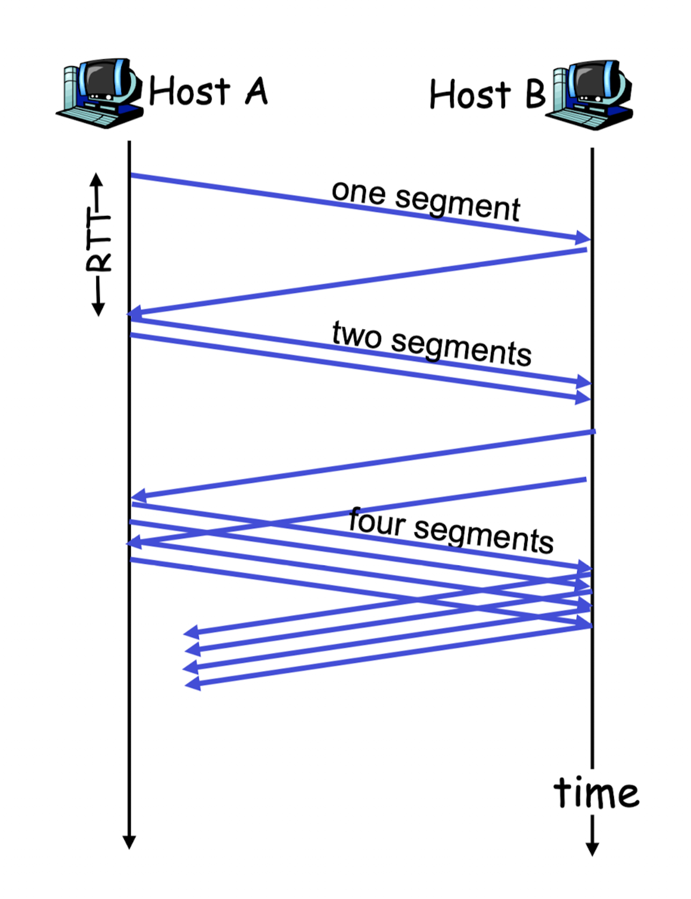
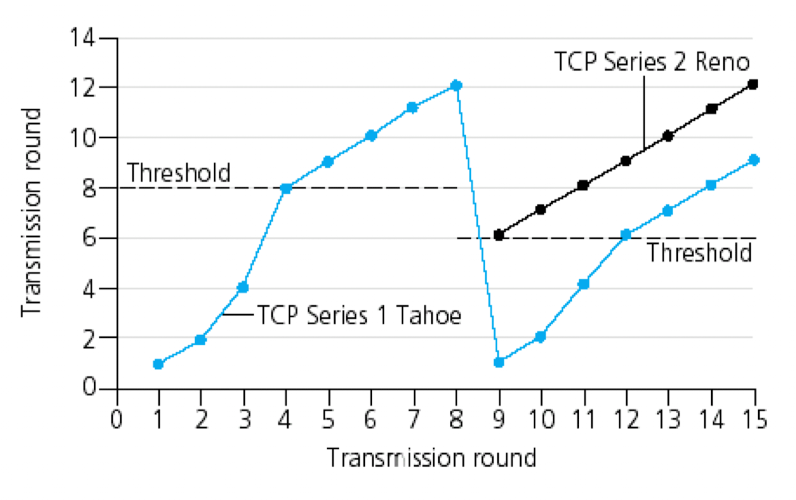
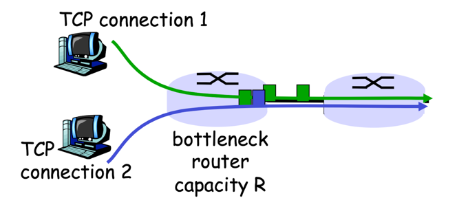
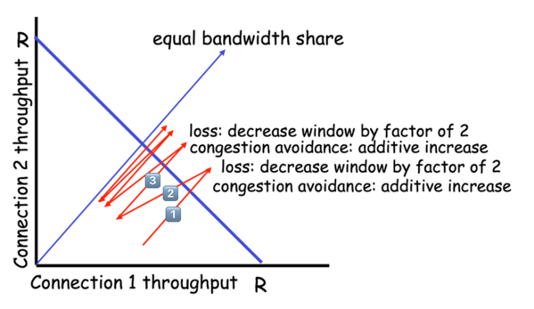

## 전통적인 TCP의 혼잡 제어
TCP는 네트워크 혼잡에 따라 연결에 트래픽을 보내는 전송률을 송신자가 제한하도록 하는 방식으로 접근한다.

예를 들어, 만약 송신자가 네트워크 혼잡이 없음을 감지하면 송신율을 높이고, 반대로 혼잡을 감지하면 송신율을 낮춘다.

여기서 다음과 같은 3가지 의문점이 들 것이다.
1. TCP 송신자는 자신의 연결에 송신자 전송 트래픽 전송률을 어떻게 제한하는가?
2. TCP 송신자는 자신과 목적지 사이 경로의 혼잡을 어떻게 감지하는가?
3. 송신자는 종단 간의 혼잡을 감지함에 따라 송신율을 변화시키기 위해 어떤 알고리즘을 사용해야 하는가?

이에 대한 답변은 다음과 같다.

### TCP 송신자는 자신의 연결에 송신자 전송 트래픽 전송률을 어떻게 제한하는가?
- 송신 측에서 동작하는 TCP 혼잡 제어 메커니즘은 추가적인 변수인 혼잡 윈도우(cwnd, congestion window)를 추적한다.
- `cwnd`는 TCP 송신자가 네트워크로 트래픽을 전송할수 있는 속도에 제약을 가한다.
- 송신하는 쪽에서 ACK 되지 않은 데이터 양은 `cwnd`와 `rwnd`의 최솟값을 초과하지 않도록 한다.  
  `LastByteSent - LastByteAcked ≤ min(cwnd, rwnd)`

### TCP 송신자는 자신과 목적지 사이 경로의 혼잡을 어떻게 감지하는가?
- 타임아웃 또는 수신자로부터 3개의 중복된 ACK의 수신이 발생하는 것을 TCP 송신자 측에 '손실 이벤트'가 발생한 것으로 정의한다.
- 과도한 혼잡이 발생하면 경로에 있는 하나 이상의 라우터 버퍼들이 오버플로될 것이고, 그 결과 데이터그램은 버려지게 된다.
- 버려진 데이터그램은 송신 측에서 손실 이벤트를 발생시키고, 송신자는 송신자와 수신자 사이 경로상에 혼잡이 발생했음을 알게 된다.

### 송신자는 종단 간의 혼잡을 감지함에 따라 송신율을 변화시키기 위해 어떤 알고리즘을 사용해야 하는가?
TCP는 다음과 같은 처리 원칙을 따른다.

- 손실된 세그먼트는 네트워크 혼잡을 의미하며, 이에 따라 한 세그먼트를 손실했을 때 TCP 전송률을 줄여야 한다.
- ACK 도착은 네트워크가 송신자의 세그먼트를 수신자에게 성공적으로 전송했다는 것이고, 이에 따라 이전에 확인응답되지 않은 세그먼트에 대해 ACK가 도착하면 송신자의 전송률은 증가할 수 있다.
- TCP 송신자는 혼잡이 발생하는 시점까지 전송률 증가시키고, 그 시점 이후부터는 감소시킨다. 그리고 다시 혼잡 시작이 발생했는지를 보기 위한 탐색을 시작한다.

TCP는 위 원칙을 바탕으로 다음과 같은 TCP 혼잡 제어 알고리즘을 고려한다.

### 슬로 스타트(Slow Start)
- TCP가 처음으로 연결을 설정하거나 타임아웃 이후 전송을 재개할 때, 초기 `cwnd`를 최대한 작게(1MSS) 설정하고, 네트워크의 혼잡 상태를 빠르게 파악하기 위해 윈도우 크기를 지수적으로 증가시키는 과정
- 동작 방식

  

  1. 연결 시작 시, TCP는 `cwnd`를 일반적으로 1 MSS(Maximum Segment Size)로 설정한다.
  2. 각 ACK(Acknowledgement)가 수신될 때마다 `cwnd`는 1 MSS씩 증가한다.
  3. 매 RTT(Round Trip Time)마다 `cwnd`는 두 배로 증가한다.
  4. 이 과정은 혼잡 임계값(ssthresh, slow start threshold)에 도달할 때까지 계속된다.

- 슬로 스타트(`cwnd`의 지수적 증가)가 끝나는 3가지 시점
  1. 만약 타임아웃으로 표시되는 손실 이벤트가 있을 경우 TCP 송신자는 cwnd 값을 1로 설정하고 새로운 슬로 스타트를 시작한다.      
  또한, `ssthresh`의 값을 `cwnd`/2(혼잡이 검출되었을 시점에서의 `cwnd` 값의 절반)로 정한다.
  2. `ssthresh`는 혼잡이 마지막으로 검출된 시점에서의 `cwnd` 값의 반이므로, 이 값에 도달하거나 지나칠 때 `cwnd`를 계속 두 배로 하는건 신중하지 않다.   
  따라서 `cwnd`가 `ssthresh`보다 크거나 같아질 때 슬로 스타트를 종료하고, TCP는 혼잡 회피 모드로 전환한다.
  3. 3개의 중복 ACK를 검출하는 시점에 TCP는 빠른 재전송을 수행하여 빠른 회복 상태로 들어간다.

### 혼잡 회피(Congestion Avoidance)
- 슬로 스타트 후 네트워크가 이미 상당히 혼잡해졌을 수 있다고 가정하고, 윈도우 크기를 선형적으로 증가시켜 혼잡을 피하는 단계
- 네트워크 혼잡을 최소화하면서도 가능한 최대의 전송 속도를 유지하는 것이 목적이다.
- 동작 방식
  1. cwnd가 혼잡 임계값(ssthresh)에 도달하면, TCP는 혼잡 회피 단계로 전환한다.
  2. 혼잡 회피 단계에서는 각 RTT마다 `cwnd`가 1 MSS씩 증가한다.
  3. 혼잡 회피는 네트워크에 부하를 적게 가하면서, 안정적으로 전송 속도를 조절한다.
- 혼잡 회피는 슬로 스타트 이후의 정상적인 데이터 전송 과정에서 주로 사용된다.

### 빠른 회복(Fast Recovery)
- 중복된 ACK를 3번 수신했을 때 TCP가 슬로 스타트로 돌아가지 않고, 혼잡 회피와 유사한 방법으로 전송 속도를 빠르게 회복하는 메커니즘
- 동작 방식
  1. 3개의 중복된 ACK가 수신되면, TCP는 패킷 손실이 발생했다고 판단한다.
  2. 이때 `ssthresh`는 현재 `cwnd`의 절반으로 설정한다.
  3. `cwnd`는 `ssthresh`로 설정되고, 중복된 ACK가 수신될 때마다 `cwnd`가 1 MSS씩 증가한다.
  4. 손실된 패킷을 재전송한 후, TCP는 혼잡 회피 모드로 진입해 `cwnd`를 선형적으로 증가시킨다.

### 정리

1. 슬로 스타트가 처음 시작되며, 윈도우 크기는 지수적으로 증가한다.
2. cwnd가 혼잡 임계값에 도달하면 혼잡 회피로 전환되어, 윈도우 크기가 선형적으로 증가한다.
3. 만약 패킷 손실이 발생(중복된 3번의 ACK 수신)하면, 중복 ACK가 감지되고 빠른 회복을 실행한다.   
   윈도우 크기가 줄어들지만, 굳이 많은 손해를 보지 않기 위해 슬로 스타트로 돌아가지 않고 빠른 회복 단계로 전환된다.  
   만약 TCP가 패킷 손실을 감지했을 때 슬로 스타트로 돌아가면, `cwnd`(혼잡 윈도우 크기)를 1 MSS로 다시 설정하고, 처음부터 천천히 전송 속도를 증가시켜야 한다.    
   이렇게 되면 네트워크에서 사용할 수 있는 용량을 제대로 활용하지 못하고, 데이터 전송 속도가 급격히 감소하게 된다.
4. 만약 타임아웃이 발생하면, 네트워크 상태가 매우 나쁘다고 판단하여 TCP는 슬로 스타트로 돌아가 초기부터 다시 시작된다.

## 공평성
각각 다른 종단 간의 경로를 갖지만 R bps의 전송률인 병목 링크를 지나는 K개의 TCP 연결이 있을 때, 각 연결의 평균 전송률이 R/K에 가깝다면 혼잡 제어 메커니즘이 **공평**하다고 한다.

예를 들어, 다음과 같이 전송률이 R인 링크 하나를 공유하는 2개의 TCP 연결이 있다고 가정해보자.

두 연결이 같은 MSS와 RTT를 가지며, 송신할 많은 양의 데이터가 있고, 어떠한 다른 TCP 연결도 이 공유된 링크를 통과하지 않는다.

이러한 상황에서 2개의 TCP 연결에 의해 실현되는 처리율은 다음과 같다.

1. 초기 상태에서는 연결 1과 2 모두 낮은 처리량을 가진다. 이 지점에서는 두 연결이 혼잡 회피를 통해 각자 처리량(cwnd)을 점진적으로 증가시킨다.
2. 혼잡 회피를 통해 두 연결의 처리량이 점진적으로 증가하다가, 어느 시점에서 패킷 손실이 발생한다. 이로 인해 두 연결 모두 혼잡 윈도우의 크기를 절반으로 줄이고, 처리량도 감소하게 된다.
3. 패킷 손실로 인한 처리량 감소 이후, 두 연결은 다시 혼잡 회피 단계로 들어가 처리량을 다시 증가시킨다.
4. 이를 반복하면 어느 순간 동등한 대역폭을 공유하게 된다.

### 공평성과 UDP
인터넷 전화와 비디오 회의 같은 많은 멀티미디어 애플리케이션은 비록 네트워크가 혼잡하더라도 자신의 전송률이 조절되는 것을 원하지 않는다.   
따라서 공평성을 제공하는 TCP를 이용하는 대신, 혼잡 제어를 가지고 있지 않은 UDP상에서 동작하는 것을 좋아한다.
