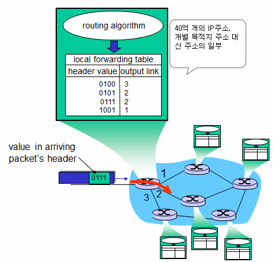
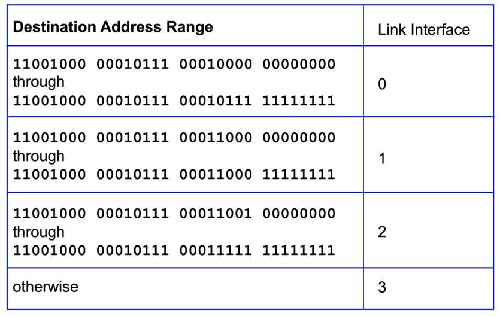
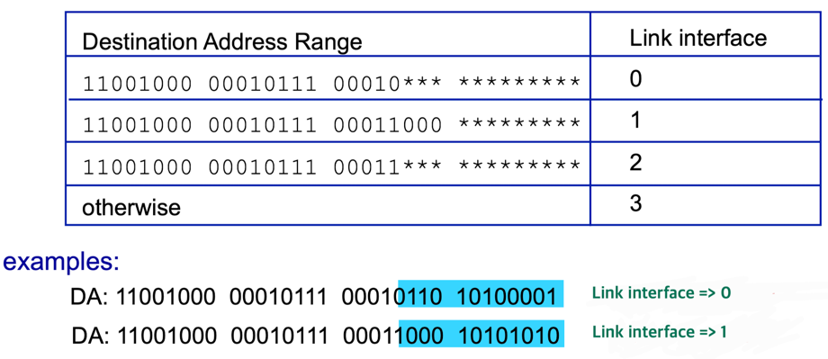

## 포워딩과 라우팅: 데이터 평면과 제어 평면
라우터는 포워딩과 라우팅 2가지 작업을 수행한다.

### 포워딩(forwarding)
- 패킷이 라우터의 입력 링크에 도달했을 때, 그 패킷을 적절한 출력 링크로 이동시키는 작업
- 네트워크 계층의 데이터 평면에 해당한다.
- 자동차가 하나의 교차로를 지나는 과정과 유사하다.

### 라우팅(routing)
- 패킷의 출발지부터 목적지까지의 경로를 결정하는 작업
- 네트워크 계층의 제어 평면에 해당한다.
- 일련의 교차로에 연결된 도로에서 이용 가능한 경로를 선택하는 과정과 유사하다.

### 포워딩과 라우팅 사이의 상호 작용

- 라우팅 알고리즘은 다른 라우터의 알고리즘과 소통하며 포워딩 테이블에 값을 채운다.
- 패킷이 라우터의 입력 링크에 도착하면, 라우터는 포워딩 테이블을 참조해서 패킷의 목적지 주소와 매핑되는 출력 링크 인터페이스를 결정한다.

### 포워딩 테이블(forwarding table)
- 패킷이 올바른 목적지로 전달될 수 있도록 경로를 지정하는 데 사용되는 자료구조
- 구성 요소
  - **목적지 주소(Destination Address)**: 네트워크 패킷이 가야 할 최종 목적지의 IP 주소
  - **네트워크 마스크(Subnet Mask)**: 목적지 주소의 범위를 정의하는 데 사용
  - **다음 홉(Next Hop)**: 패킷을 전달할 다음 네트워크 장치의 주소
  - **출력 링크 인터페이스(Output Link Interface)**: 패킷을 전달할 출력 링크 인터페이스
- 포워딩 테이블의 목적지 주소에 실제 주소가 들어가면 테이블의 크기가 커지기 때문에, 실제 주소 대신 주소의 범위가 들어간다.
    
    

### Longest prefix matching

패킷의 목적지 주소를 기준으로 포워딩 테이블에서 가장 긴 prefix가 일치하는 항목을 찾아, 해당 출력 링크 인터페이스로 포워딩하는 방식

## 네트워크 서비스 모델
네트워크 계층에서는 오직 최선을 다할 뿐 모든 것을 보장하지는 않는 서비스 모델인 **최선형 서비스**(**best effort service**)를 사용한다.

왜 네트워크 계층에서는 더 좋은 모델(ATM 구조, Integrated service 구조)이 존재함에도 불구하고 왜 최선형 서비스를 채택했을까?

이는 대규모 네트워크에서 높은 QoS(Quality of Service)를 보장하려면 그만큼 관리가 어렵기 때문이다.   
최선형 서비스는 높은 QoS를 보장하지 않는 만큼, 특별한 설정이나 복잡한 관리가 필요하지 않다. 즉, 단순하고 유지보수가 용이하며, 비용을 절감할 수 있다.

따라서 경제적이고 다양한 트래픽을 유연하게 처리할 수 있는 최선형 서비스를 사용하는 것이다.   
다만, 최선형 서비스는 그 어떤 것도 보장하지 않기 때문에(비신뢰적), 상위 계층(전송 계층)에서 이를 보완한다.

> ### ATM 네트워크 구조
> 순서화 패킷 전달, 지연 제한 이내의 보장된 전달, 최소 대역폭 보장 서비스를 제공하는 네트워크 구조

> ### Integrated service 구조
> 지연 제한 이내의 보장된 전달, 혼잡 방지 서비스를 제공하는 네트워크 구조
