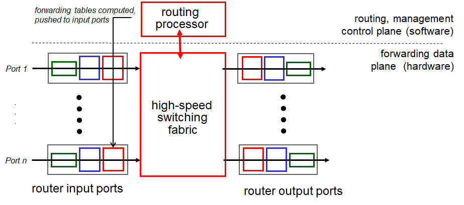
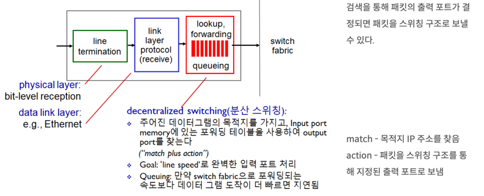

## 라우터 내부 구조
라우터의 내부 구조는 다음과 같다.

라우팅 프로세서는 포워딩 테이블을 생성하여 input port에 저장한다.

이때 input port를 확대하면 다음과 같다.

보다시피 input port에는 포워딩 테이블이 존재하고, 라우터에는 이러한 input port가 여러개 존재한다.   
즉, 포워딩 테이블은 각 input port에 독립적으로 저장되며, 이로 인해 여러 패킷을 병렬로 포워딩할 수 있게 된다.

그리고 input port에는 입력 버퍼(입력 큐)가 존재하는데, 이는 포워딩 속도보다 패킷이 도착하는 속도가 빠를 때 버퍼링(속도 조절)하기 위한 용도로 쓰인다.

이러한 버퍼는 라우터에 들어온 패킷들이 하나의 output port로 몰릴 경우를 대비하기 위해 input port 뿐만 아니라 output port에도 존재한다.
