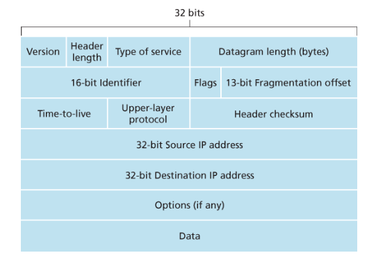
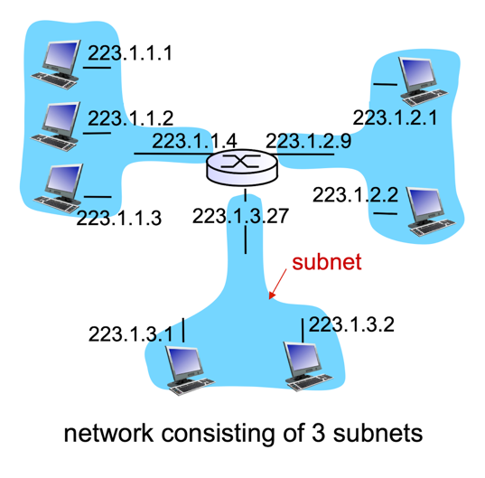
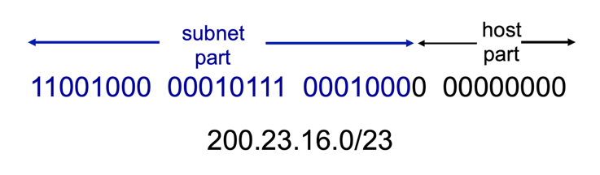
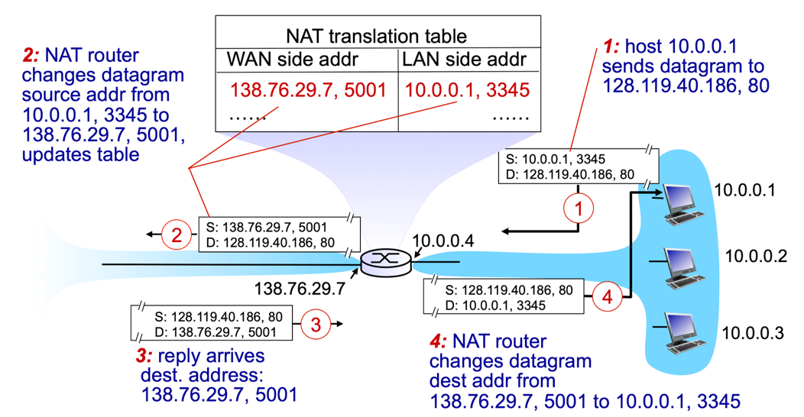
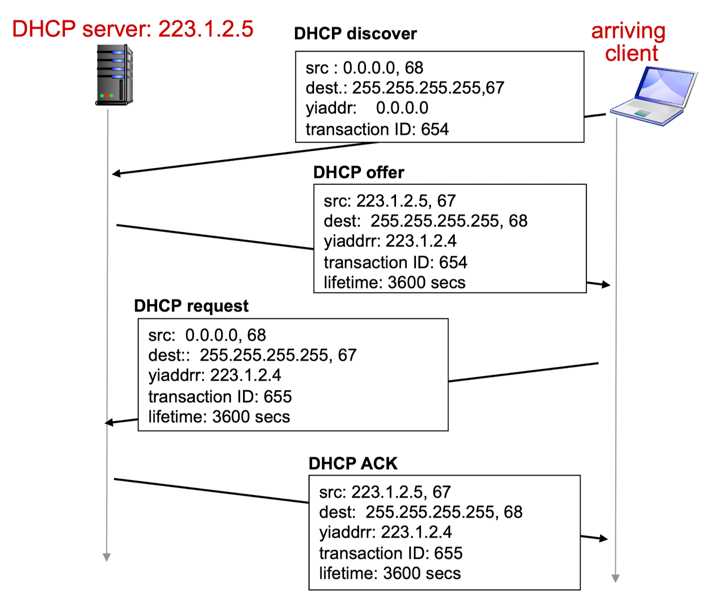
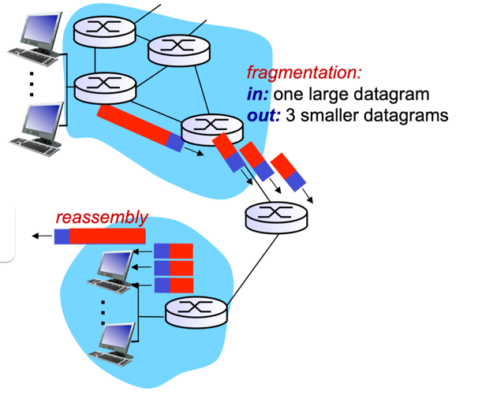
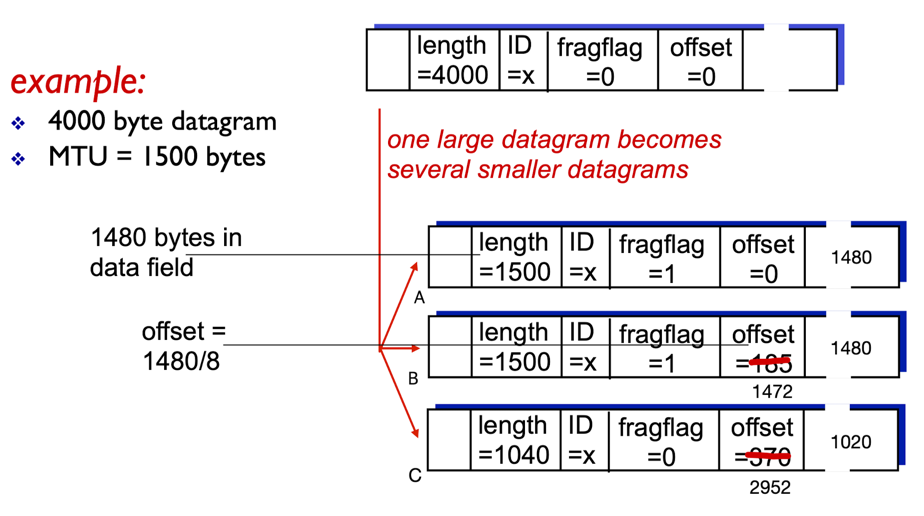

## IP 데이터그램 포맷
IP 데이터그램은 총 20바이트의 헤더(옵션은 없다고 가정)를 가지며, 아래는 IP 데이터그램 포맷을 나타낸 그림이다.

- #### Version (버전 번호)
  - 데이터그램의 IP 프로토콜 버전
  - 라우터는 버전 번호를 확인하여 데이터그램의 나머지 부분을 어떻게 해석할지 결정함
  - IP 버전에 따라 다른 데이터그램 포맷 사용
- #### Header Length (헤더 길이)
  - IP 데이터그램에서 실제 페이로드가 시작하는 곳을 결정하는 데 사용
  - IPv4 데이터그램은 옵션을 포함하지 않으므로, 대체로 IPv4 데이터그램 헤더는 20바이트임
- #### Type of Service (서비스 타입)
  - 각기 다른 유형의 IP 데이터그램을 구별하는 데 사용   
    ex) 실시간 데이터그램과 비실시간 트래픽을 구분하는 데 유용함
  - ToS 비트 중 2개는 명시적 혼잡 알림에 사용됨
- #### Datagram Length (데이터그램 길이)
  - 바이트로 계산한 IP 데이터그램(헤더 + 데이터)의 전체 길이
  - 이 필드의 크기는 16비트이므로 IP 데이터그램의 이론상 최대 길이는 65,535바이트임.   
    하지만 1,500바이트보다 큰 경우는 거의 없으므로 최대 크기의 이더넷 프레임의 페이로드 필드에 IP 데이터그램이 장착될 수 있음
- #### Identifier, Flags, Fragmentation offset (식별자, 플래그, 단편화 오프셋)
  - IP 단편화와 관련 있는 필드들
  - 큰 IP 데이터그램은 여러 개의 작은 IP 데이터그램으로 분할된 후 목적지로 독립적으로 전달되는데, 여기서 페이로드 데이터가 최종 호스트의 전송 계층으로 전달되기 전에 다시 모임
- #### TTL(Time-to-live)
  - 네트워크에서 데이터그램이 무한히 순환(라우팅 루프)하지 않도록 하는 데 사용
  - 라우터가 데이터그램을 처리할 때마다 감소하고, TTL 필드가 0이 되면 라우터가 데이터그램을 폐기함
- #### Protocol (프로토콜)
  - IP 데이터그램에서 데이터 부분이 전달될 목적지의 전송 계층의 특정 프로토콜 
  - 일반적으로 IP 데이터그램이 최종 목적지에 도착했을 때만 사용됨
  - 네트워크 계층과 전송 계층을 묶는 역할
  - ex) 6 - TCP / 17 - UDP
- #### Header checksum (헤더 체크섬)
  - 라우터가 수신한 IP 데이터그램의 비트 오류를 탐지하는 데 사용
  - 라우터는 수신한 각 IP 데이터그램마다 헤더 체크섬을 계산하고, 이 값과 데이터그램 헤더의 체크섬이 다르면 오류 상태임을 감지함
  
  > 왜 TCP/IP 스택에서는 두 가지 계층에서 각각 별도로 오류 검사를 해야 할까?
  > 1. IP 계층은 IP 헤더만 체크섬으로 오류 검사를 수행하고, TCP/UDP 계층은 전체 데이터에 대해 체크섬을 수행한다.
  > 2. TCP/UDP와 IP는 각각 독립적인 프로토콜로, 반드시 서로를 사용할 필요는 없으며, 다른 프로토콜과 함께 사용할 수 있다.

- #### Source&Destination IP Address (출발지와 목적지 IP 주소)
  - 출발지에서 데이터그램을 생성할 때, 자신의 IP 주소와 목적지 IP 주소를 각각 출발지 IP 주소 필드와 목적지 IP 주소 필드에 삽입함
- #### Options (옵션)
  - IP 데이터그램에 추가적인 정보나 기능을 포함시켜 헤더를 확장하는 역할을 수행
  - 옵션 필드를 이용한 확장을 통해 라우팅 제어, 경로 추적, 시간 기록, 보안 등의 특정 네트워크 요구 사항 충족 가능
- #### Data (페이로드)
  - IP 헤더가 감싸고 있는 실제 전송하고자 하는 데이터

## IPv4 주소체계
- 32비트(4바이트) 길이, 즉 2^32개(약 40억개)의 주소 사용 가능
- 라우터의 인터페이스 식별자
- 읽기 쉽도록 8비트씩 끊고 10진수로 변환하여 표현함

### 서브넷(Subnet)
서브넷을 결정하려면 먼저 호스트나 라우터에서 각 인터페이스를 분리하고 고립된 네트워크를 만든다.   
이 고립된 네트워크의 종단점은 인터페이스의 끝이 된다. 이렇게 고립된 네트워크 각각을 **서브넷**이라고 부른다.

- 서브넷은 같은 네트워크 ID(prefix)를 가진 집합을 의미한다.
- 라우터는 여러 인터페이스(IP 주소)를 가지며, 각 인터페이스의 서브넷은 모두 다르다.      
  즉, 다른 서브넷에 가기 위해서는 라우터를 거쳐야만 한다.
- 위 그림에서 IP 주소체계는 서브넷에 223.1.1.0/24라는 주소를 할당하는데, 여기서 '/24'는 **서브넷 마스크**를 의미한다.
  - 32비트 주소의 왼쪽 24비트가 서브넷 주소라는 것을 가리킴

### CIDR(Classless InterDomain Routing)
- IP 주소를 보다 유연하고 효율적으로 할당하고 라우팅하기 위해 사용되는 주소 지정 방식 
- 기존의 클래스 기반(Classful) IP 주소 지정 방식의 비효율성을 해결하기 위해 도입되었으며, 네트워크를 더 세밀하게 나누고 관리할 수 있게 한다.
- 32비트 IP 주소를 두 부분으로 나누고, 이는 다시 점으로 된 십진수 형태의 a.b.c.d/x를 가지며, 여기서 x는 첫 부분의 비트 수(prefix 길이)다.
  
  

- a.b.c.d/x 형식 주소에서 x는 프리픽스 길이를 나타내며, IP 주소의 앞쪽에서부터 x비트가 네트워크 부분을 구성한다. 이 네트워크 부분을 **프리픽스(prefix)**라고 부른다.

## 네트워크 주소 변환 (Network Address Translation, NAT)
### 등장 배경
IPv4의 주소는 32비트로 약 40억개의 주소를 할당할 수 있다. 하지만 이는 점점 고갈되어 주소 부족 문제가 발생하게 되었고, 이를 해결하고자 126비트로 구성된 IPv6를 고안했다.   
그러나 IPv4에서 IPv6로 변경하기에는 그 범위가 너무나도 컸고, 엄청난 경제적 부담으로 다가왔다.   
따라서 임시 해결책을 도입하여 주소 부족 문제를 버티고 있는데, 이것이 바로 NAT다.

### 동작 원리

IP 주소는 유일해야 하는데, IPv4는 40억개밖에 할당하지 못하기 때문에 네트워크 내부에서만 유일한 주소를 배정한다.      
배정한 IP 주소는 특정 네트워크 내부에서만 유일하므로, 외부로 유출되면 안 된다. 따라서 출발지 IP 주소를 Gateway IP 주소로 변경해야 한다.

이렇게 했을 때, 외부 네트워크 관점에서는 해당 네트워크가 단 하나의 IP 주소만 사용한다고 느끼게 되며, 다음과 같은 이점이 존재한다.
- ISP로부터 IP 주소 범위를 제공받을 필요 없다.
- 외부 네트워크에 알리지 않고 로컬 네트워크 내 장치의 주소를 변경할 수 있다.
- ISP를 변경해도 로컬 네트워크 내 장치의 주소를 변경할 필요 없다.
- 로컬 네트워크 내의 장치는 외부 네트워크에서 직접 주소 지정이 불가능하여 보안상의 이점이 있다.

### NAT 라우터의 역할
- 모든 송신 데이터그램의 출발지 IP 주소와 포트 번호를 NAT IP 주소와 새로운 포트 번호로 변환하여 NAT 변환 테이블에 저장한다.    
  원격 클라이언트나 서버는 응답 시 NAT IP 주소와 새로운 포트 번호를 사용한다.
- 수신 데이터그램의 도착지 IP 주소와 포트 번호를 NAT 변환 테이블에 저장된 IP 주소와 포트 번호로 변경한다.

## DHCP(Dynamic Host Configuration Protocol)
### 목표
- 호스트가 네트워크에 연결될 때 네트워크 서버로부터 동적으로 IP 주소를 얻을 수 있도록 한다.
- 사용 중인 IP 주소의 임대 기간을 갱신할 수 있다.
- 주소를 재사용할 수 있다. (연결되어 있을 때만 주소를 유지)
- 다양한 네트워크에 자주 접속해야 하는 모바일 사용자들에게 편리한 네트워크 연결을 제공한다.

### 동작 원리

1. 클라이언트는 `DHCP discover` 메시지를 브로드캐스트로 전송한다.
   - 아직 IP가 할당되기 전이라서 출발지 IP 주소는 `0.0.0.0`이다.
   - 브로드캐스트이므로 도착지 IP 주소는 `255.255.255.255`다.
   - `DHCP offer` 메시지를 수신하기 위해, 식별자 역할을 하는 트랜잭션 ID를 함께 전달한다.
2. `DHCP discover` 메시지를 수신한 DHCP 서버는 `DHCP offer` 메시지로 응답한다.
   - 요청을 보낼 당시 클라이언트의 IP 주소는 할당되기 전이므로, DHCP 서버 또한 브로드캐스트로 메시지를 전송한다.
   - 클라이언트가 요청할 때 전달한 트랜잭션 ID를 그대로 다시 전달한다.
3. 여러 클라이언트가 offer 메시지를 수신하지만, 그중 동일한 트랜잭션 ID를 전달한 클라이언트만이 `DHCP request` 메시지를 전송한다.
   - `DHCP request`는 `DHCP offer`를 받아들인다는 요청을 의미한다.
   - 다른 DHCP 서버에게도 (IP 주소를 이미 할당 받는다고) 알리기 위해 브로드캐스트로 전송한다.
4. DHCP 서버는 `DHCP ACK` 메시지를 전송하면서 IP 주소를 할당한다.

> #### 굳이 왜 request와 ACK를 통해 한 번 더 요청/응답을 주고 받을까?
> discover를 전송하면 많은 DHCP 서버로부터 offer가 올텐데, 그중에서 선택해야 하기 때문이다.   
> ex) 스타벅스에서 WIFI를 탐색하면 스타벅스 뿐만 아니라 주변 모든 가게의 WIFI도 잡힌다.

### DHCP를 통해 전달되는 추가 정보
DHCP 서버는 서브넷에 할당된 IP 주소 외에도 아래 정보들을 반환할 수 있다.
- 클라이언트를 위한 첫 번째 라우터의 주소
  - Gateway IP 주소를 알아야 거기까지 패킷을 전달할 수 있기 때문
- DNS 서버의 이름 및 IP 주소
  - DNS 서버의 IP 주소를 알아야 웹 브라우징이 가능하기 때문
- 네트워크 마스크 (네트워크 부분과 호스트 부분 구분을 나타냄)
  - 클라이언트가 같은 서브넷 내의 다른 장치들과 통신할 때 서브넷 마스크 정보가 필요하기 때문

## IP 단편화
IP 단편화는 큰 IP 데이터그램을 네트워크의 MTU 크기에 맞게 나누어 전송하는 과정이며, 재조립은 목적지에서 이 단편화된 데이터그램들을 다시 합쳐 원래의 데이터로 복구하는 과정이다.    
이를 통해 네트워크는 다양한 MTU 환경에서도 안정적인 데이터 전송을 보장한다.

만약 패킷의 크기가 MTU보다 클 경우, 패킷이 여러개로 나눠진 뒤에 각각 독립적으로 전달된다. 그리고나서 분할되어 온 여러 조각들을 다시 모아서 하나의 패킷으로 재조립한다.

### 예제

- ID는 패킷 고유 ID를 의미하며, 단편화된 모든 패킷의 ID는 동일하다.
- fragflag의 값은 뒤에 단편화된 패킷이 존재하면 1, 아니면 0으로 설정된다.
  - A와 B의 뒤에는 단편화된 패킷(각각 B와 C)이 존재하므로 1로 설정
  - 반면에, C의 뒤에는 단편화된 패킷이 없으므로 0으로 설정
- offset은 시작 바이트 값을 나타낸다.
  - A는 맨앞이라 0으로 설정
  - B는 1480번째부터인데, 여기서 8을 뺀 1472로 설정
  - C는 2960번째부터인데, 여기서 8을 뺀 2952로 설정
  - 패킷 헤더의 필드 크기를 줄이기 위해 3bit를 줄이기 때문에 2^3=8을 빼는 것임
