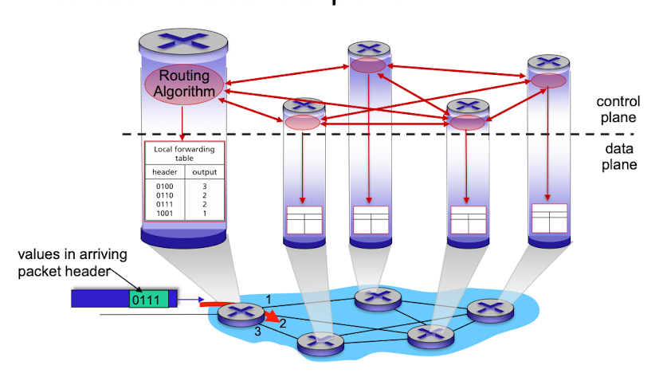
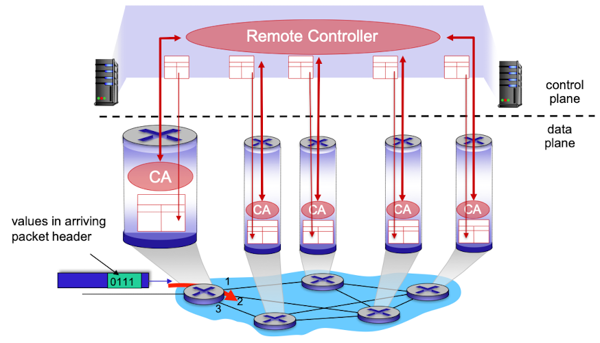
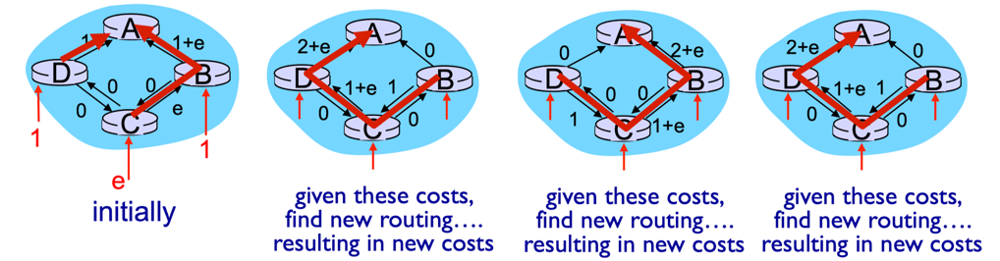
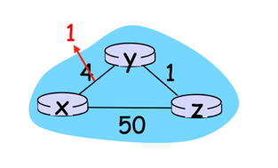
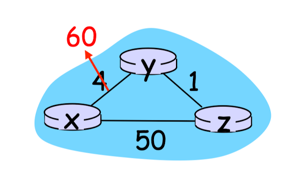

## 네트워크 트래픽을 제어하는 방식
### 라우터별 제어

- 라우팅 알고리즘들이 모든 라우터 각각에서 동작하는 방식
- 포워딩과 라우팅 기능이 모두 개별 라우터에 포함되어 있다.
- 각 라우터는 다른 라우터의 라우팅 구성요소와 통신하여 자신의 포워딩 테이블 값을 계산하는 라우팅 구성요소를 가지고 있다.
- OSPF와 BGP 프로토콜 모두 여기에 해당한다.

### 논리적 중앙 집중형 제어

- 논리적 중앙 집중형 컨트롤러가 포워딩 테이블을 작성하고, 이를 모든 개별 라우터가 사용할 수 있도록 배포하는 방식
- 컨트롤러는 잘 정의된 프로토콜을 통해 각 라우터의 제어 에이전트(Control Agent, CA)와 상호작용하여, 라우터의 플로우 테이블을 구성 및 관리한다.
  - 일반적으로 CA는 컨트롤러와 통신하고 컨트롤러의 명령을 수행하는 최소한의 기능만 가진다.
- 라우터별 제어 방식과 달리, CA는 서로 상호작용하지 않으며 포워딩 테이블을 계산하는 데도 적극적으로 참여하지 않는다. 

## 라우팅 알고리즘을 분류하는 일반적인 방법
라우팅 알고리즘을 분류하는 방법에는 2가지가 존재한다.

### 중앙 집중형(centralized) vs 분산형(decentralized)
- #### 중앙 집중형(centralized) 라우팅 알고리즘
  - 네트워크 전체에 대한 완전한 정보(연결 상태와 링크 비용)를 가지고 출발지와 목적지 사이의 최소 비용 경로를 계산한다.
  - 최소 비용 경로를 계산하는 데 필요한 정보는 알고리즘이 실제 계산을 수행하기 전에 얻어야 한다.
  - 계산 자체는 한 장소(논리적 중앙 집중형 컨트롤러)에서 수행되거나, 모든 라우터 각각의 라우팅 모듈로 복사될 수 있다.
  - 전체 상태 정보를 갖는 알고리즘을 **링크 상태(Link State, LS)** 알고리즘이라 한다.

- #### 분산형(decentralized) 라우팅 알고리즘
  - 반복된 계산과 이웃 노드와의 정보 교환을 통해 노드는 점차적으로 목적지 또는 목적지 집합까지의 최소 비용 경로를 계산한다.
  - 각 노드는 자신과 직접 연결된 링크에 대한 정보만 가지고 있을 뿐, 모든 링크의 비용에 대한 완전한 정보를 가지고 있지 않다.   
  - 각 노드가 네트워크 내 다른 모든 노드까지 비용의 추정값을 벡터 형태로 유지한다고 해서 **거리 벡터(Distance Vector, DV)** 알고리즘이라 부른다.

### 정적(static) vs 동적(dynamic)
- #### 정적(static) 라우팅 알고리즘
  - 종종 사람이 개입(e.g. 사람이 직접 링크 비용을 수정)함으로 인해 경로가 매우 느리게 변한다.

- #### 동적(dynamic) 라우팅 알고리즘
  - 네트워크 트래픽 부하나 topology 변화에 따라 라우팅 경로를 변경한다.
    - **topology**: 네트워크에서 장치들이 어떻게 연결되어 있는지를 나타내는 구조적 배치 또는 물리적, 논리적 구성도
  - 주기적으로, 혹은 topology나 링크 비용의 변경에 직접적으로 응답하는 방식으로 수행된다.
  - **네트워크 변화에 빠르게 대응**할 수 있지만, 경로의 루프(loop)나 진동(oscillation) 같은 문제에 취약하다. 
  
## 링크 상태(Link State, LS) 라우팅 알고리즘
- 네트워크 내의 모든 라우터가 서로 연결된 링크의 상태와 비용 정보를 교환하여 최적의 경로를 계산하는 라우팅 방식
- 다익스트라 알고리즘 사용
- `D(v) = min{ D(v), D(w) + c(w, v) }`
  - `D(v)`: 현재 반복 시점에서 출발지 노트부터 목적지 노드 v까지의 최소 비용 경로의 비용
  - `c(x, y)`: 노드 x에서 노드 y로 가는 링크의 비용 

### 동작 원리
1. 각 노드(라우터)는 자신과 직접 연결된 **모든 링크의 식별자와 비용 정보를 수집**한다.
2. 수집된 정보를 네트워크 상의 다른 모든 노드에 **브로드캐스팅**한다.    
   이를 통해 모든 노드는 네트워크의 전체 topology를 동일하게 인식하게 된다.
3. 각 노드는 수신한 링크 상태 정보를 기반으로 네트워크의 전체 그래프를 구성한 후, **다익스트라 알고리즘**과 같은 최단 경로 알고리즘을 사용해 **다른 모든 노드로의 최소 비용 경로를 계산**한다.   
4. 최소 비용 경로 계산 결과를 바탕으로 **포워딩 테이블을 업데이트**한다.

### LS 알고리즘에서 발생 가능한 문제
- #### 알고리즘 복잡성
  - 기본적인 다익스트라 알고리즘의 시간 복잡도는 `O(n^2)`이다. (n: 노드 수)
  - 네트워크 규모가 커질수록 경로 계산과 데이터 처리 시간이 길어져 전반적인 성능이 저하된다.
  - 최소 힙이나 우선순위 큐 같은 효율적인 자료구조를 이용하여 경로 계산의 복잡도를 `O(nlogn)`으로 줄일 수는 있다.

- #### 진동 문제
    

  - 라우팅 알고리즘이 링크의 비용을 네트워크 트래픽에 따라 변경하는 과정에서 경로가 계속 변동하며 발생하는 현상
  - 경로가 지속적으로 변경되면서 데이터 전송이 일관되지 않고, 성능 저하와 패킷 손실이 발생할 수 있다.
  - 링크 상태 정보의 빈번한 변경으로 인해 라우팅 프로토콜의 오버헤드가 증가하고, 라우터의 계산 부담이 커진다.

## 거리 벡터(Distance Vector, DV) 라우팅 알고리즘
- 라우터가 인접한 라우터들과 경로 정보를 주기적으로 교환하면서 최적의 경로를 계산하는 방식
- 벨만 포드 알고리즘 사용
- `D_x(y) = min{ c(x, v) + D_v(y) }`
  - `D_x(y)`: 노드 x에서 노드 y로 가는 최소 비용 경로의 비용
  - `c(x, v)`: 노드 x에서 노드 v로 가는 링크의 비용
  - min 계산은 노드 x의 모든 이웃에 적용
  
### 특징
- **반복적(iterative)**: 이웃끼리 더 이상 정보를 교환하지 않을 때까지 프로세스가 지속됨
- **비동기적(asynchronous)**: 모든 노드가 서로 정확히 맞물려 동작할 필요 없음
- **분산적(distributed)**: 각 노드는 하나 이상의 직접 연결된 이웃으로부터 정보를 받고 계산을 수행하며, 그 결과를 다시 이웃에게 배포함

### 동작 원리
1. 각 노드는 특정 이벤트(근접 링크의 비용 변화 or 이웃으로부터 새로운 거리 벡터 메시지 수신)가 발생할 때까지 대기한다.
2. 만약 거리 벡터가 변경되는 등 이벤트가 발생하면, 새로운 경로와 비용을 계산한다.
3. 계산 결과 어떤 목적지로 가는 거리 벡터가 변경되었다면, 이웃 노드들에게 변경된 정보를 전달한다.

### 링크 비용이 긍정적으로 변경될 경우

1. 노드 y가 링크 비용 변화를 감지하고, 거리 벡터를 업데이트하여 이웃 노드들에게 알린다.
2. 노드 z는 y로부터 업데이트 내용을 수신하고, 라우팅 테이블을 업데이트한 후 새로운 최소 비용을 계산하여 이웃 노드들에게 알린다.
3. 노드 y는 z로부터 업데이트 내용을 수신하고, 자신의 거리 테이블을 업데이트한다. 그러나 비용이 변하지 않았으므로 y는 추가적인 메시지를 전달하지 않는다.

이처럼 링크 비용이 감소하는 경우, 좋은 소식은 네트워크에 빠르게 전파된다. 이는 네트워크의 안정화와 성능 향상에 긍정적이다.

### 링크 비용이 부정적으로 변경될 경우

링크 비용이 증가하는 경우, 즉 나쁜 소식은 네트워크에 느리게 전파된다.    
이는 **무한-계수(count to infinity)** 문제라고 불리며, 라우터들이 거리 벡터를 업데이트하며 잘못된 비용을 전달하게 되는 상황을 의미한다.

예를 들어, 위 그림처럼 링크 비용이 4에서 60으로 증가했을 때, 네트워크가 안정화되기까지 44번의 반복이 필요하다.

이 문제의 근본적인 원인은 링크 비용이 변경되었을 때 노드 z가 노드 y에게 잘못된 정보를 알려주기 때문이다.

count to infinity 문제를 해결하기 위해 **poisoned reverse**를 사용하는데, 이는 노드들이 잘못된 정보를 알려주지 못하도록(역류하지 않도록) 독약을 뿌린다는 것을 의미한다.

노드 z가 y를 통해 x로 가야 하는 경우, 즉 `d_z(x)`는 y에 의존적인 값이므로 y에게 알려주면 문제가 발생하게 된다.   
따라서 y에게는 `d_z(x)`를 무한대라고 알린다.

그러나 이 방법이 count to infinity 문제를 완전히 해결하지는 못할 수 있으며, 일부 경우에서 문제 발생 가능성이 여전히 존재한다.

## LS 라우팅 알고리즘과 DV 라우팅 알고리즘 비교
### 메시지 복잡성(message complexity)
- #### LS 라우팅 알고리즘
  - 각 노드는 네트워크 내 각 링크 비용을 알아야 한다.
  - 이를 위해 `O(nE)`개의 메시지가 전송되어야 한다.
    - n: 노드 개수, E: 링크 개수
  - 링크 비용이 변할 때마다 새로운 링크 비용이 네트워크 내 모든 노드에게 전달되어야 한다.

- #### DV 라우팅 알고리즘
  - 매 반복마다 직접 연결된 이웃끼리 메시지를 교환한다.
  - 알고리즘 결과가 수렴하는 데 걸리는 시간은 많은 요소에 좌우된다.
  - 새롭게 변한 링크 비용이 링크에 연결된 어떤 노드의 최소 비용 경로에 변화를 준 경우에만 수정된 링크 비용을 전파한다. 

### 수렴 속도(speed of convergence)
- #### LS 라우팅 알고리즘
  - `O(nE)`개의 메시지를 필요로 하므로, `O(n^2)`의 시간 복잡도를 가진다.

- #### DV 라우팅 알고리즘
  - 천천히 수렴하며, 알고리즘이 수렴하는 동안 라우팅 루프와 계수 문제가 발생할 수 있다.

### 견고성(robustness)
만약 라우터가 고장나거나 오작동하게 된다면 어떻게 될까?

- #### LS 라우팅 알고리즘
  - 라우터는 연결된 링크에 대해 잘못된 비용 정보를 브로드캐스팅할 수 있다.
  - 라우터는 링크 상태 브로드캐스팅을 통해 수신한 패킷을 변질시키거나 폐기할 수 있다.
  - 그러나 하나의 링크 상태 노드는 자신의 포워딩 테이블만 계산하고, 다른 노드들 역시 자신의 테이블을 만들기 위한 유사한 계산을 수행한다.   
    이는 LS 알고리즘에서 경로 계산이 어느 정도 분산되어 수행됨을 의미하며, 이를 통해 어느 정도의 견고성을 제공한다.

- #### DV 라우팅 알고리즘
  - 라우터는 잘못된 최소 비용 경로를 일부 혹은 모든 목적지에 전파할 수 있다.   
    이는 다른 라우터들이 오작동한 라우터에게 대규모 트래픽을 보내게 만들며, 인터넷의 상당 부분이 여러 시간동안 단절된다.
  - 사용하는 네트워크에서 하나의 라우터의 잘못된 계산은 전체로 확산될 수 있다.
