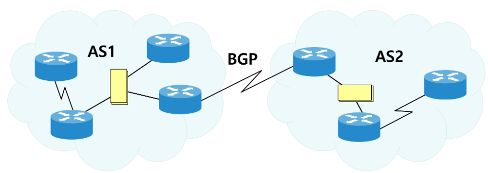

## 대규모 네트워크에서 LS와 DV 라우팅 알고리즘의 한계
오늘날 인터넷은 약 6억개의 라우터로 구성되는 만큼 대규모 네트워크를 형성한다.   
이러한 대규모 네트워크에서 LS와 DV 라우팅 알고리즘을 사용하는 것은 아래 2가지 문제를 일으킨다.

### 확장(scale)
- 라우터의 수가 증가함에 따라 라우팅 정보의 통신, 계산, 저장에 필요한 오버헤드가 걷잡을 수 없이 증가한다.
- 수많은 라우터 각각에 모든 목적지 정보를 저장하기 위해서는 **막대한 양의 메모리가 필요**하다.
- LS 알고리즘의 경우, 모든 라우터 사이에서 연결 상태와 링크 비용을 브로드캐스팅하는 데 필요한 오버헤드가 굉장히 크다.
- 수많은 라우터들 사이에서 반복 수행되는 DV 알고리즘은 절대로 수렴하지 않을 것이다.

### 관리 자율성(administrative autonomy)
- 인터넷은 ISP들의 네트워크이고, 각 ISP는 자신의 라우터들로 구성된 네트워크를 관리한다.
- ISP는 일반적으로 자신의 네트워크를 정책과 요구에 맞게 운용하기를 원하는데, LS 알고리즘은 네트워크의 모든 라우터가 전체 네트워크의 링크 상태 정보를 가지고 있어야 하기 때문에 독립적으로 구성할 수 없게 된다.

## 자율 시스템(Autonomous System, AS)
위에서 살펴본 2가지 문제를 해결하기 위해 라우터들을 영역으로 묶어서 관리하기로 했으며, 이러한 영역을 자율 시스템(AS)이라고 부른다.   

각 AS 내의 라우터들은 동일한 라우팅 프로토콜을 사용하는데, 이를 **Intra-AS 라우팅 프로토콜**이라 한다.

### AS 간의 연결

여러 AS들이 상호 연결되어 인터넷을 구성하며, 각 AS는 자신의 내부 라우팅을 관리하면서도 다른 AS와의 연결을 통해 전체 네트워크에 통신을 제공한다.

이처럼 대규모 네트워크를 계층 구조로 관리하기 위해, 각 라우터의 포워딩 테이블은 AS 내부와 외부로의 경로를 모두 포함하여 구성된다.      
Intra-AS 라우팅 알고리즘은 내부 목적지에 대한 엔트리를 설정하고, Inter-AS 라우팅 알고리즘은 외부 목적지에 대한 엔트리를 설정한다.

## 개방형 최단 경로 우선(Open Shortest Path First, OSPF) 프로토콜
- 인터넷에서 AS 내부 라우팅에 널리 사용되는 프로토콜 
- 라우팅 프로토콜의 작동 방식이 외부에 공개되어 있다. 
- 링크 상태 정보를 flooding하는 LS 알고리즘을 사용하여 라우팅을 수행한다.
    - `flooding`: 수신되는 링크만을 제외시킨 채, 패킷을 나머지 모든 링크로 단순하게 복사 전송하는 방식
- OSPF를 이용하여 각 라우터는 전체 AS에 대한 완벽한 topology(그래프)를 얻을 수 있다.
- 라우터는 인접한 라우터만이 아니라 AS 내의 다른 모든 라우터에게 라우팅 정보를 브로드캐스팅한다.

### OSPF에 구현된 개선사항
- **보안**: 라우터들 간의 정보 교환 인증을 통해 신뢰할 수 있는 라우터들만이 AS 내부의 OSPF 프로토콜에 참여할 수 있고, 악의적인 침입자의 공격을 막을 수 있다.
- **복수 동일 비용 경로**: 하나의 목적지에 대해 동일한 비용을 가진 여러 개의 경로가 존재할 때, OSPF는 여러 개의 경로를 사용할 수 있도록 한다.
- **유니캐스트와 멀티캐스트 라우팅의 통합 지원**: MOSPF(Multicast OSPF)는 멀티캐스트 라우팅 기능을 제공하기 위해 OSPF를 단순 확장했으며, 이는 기존의 OSPF 링크 DB를 사용하고 OSPF 링크 상태 브로드캐스트 메커니즘에 새로운 형태의 링크 상태 알림을 추가한다.
- **단일 AS 내에서의 계층 지원**: OSPF의 AS는 계층적인 영역으로 구성될 수 있으며, 각 영역은 자신의 OSPF LS 라우팅 알고리즘을 수행한다.
  - 한 영역 내의 라우터는 동일한 영역 내의 라우터들에게만 링크 상태를 브로드캐스팅한다.
  - 각 영역 내에서 하나 혹은 그 이상의 **영역 경계 라우터**(area border router)가 영역 외부로의 패킷 라우팅을 책임진다.
