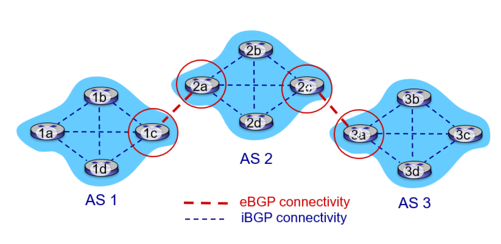
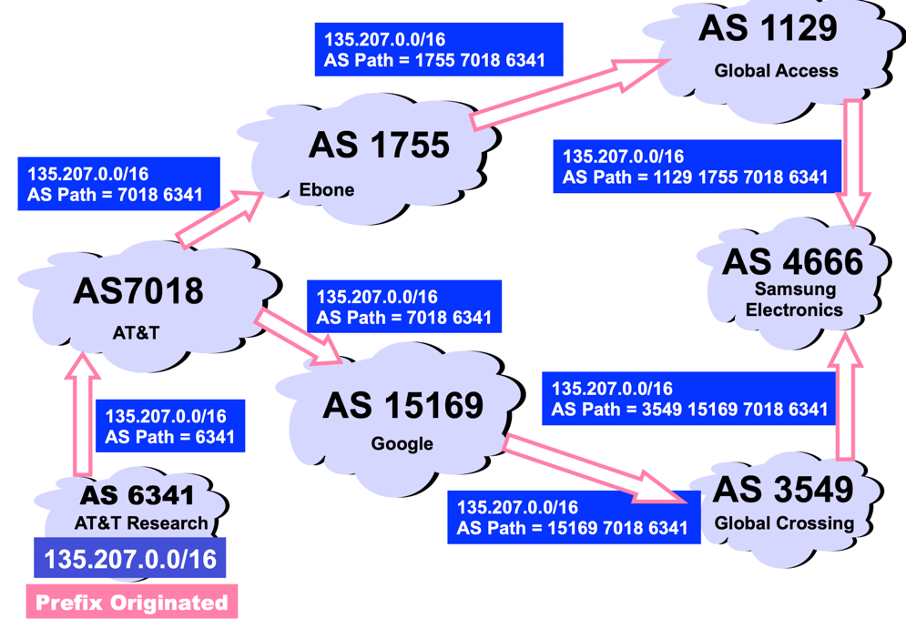

## BGP(Border Gateway Protocol)
자율 시스템(Autonomous System, AS) 간에 경로 정보를 교환하기 위해 사용되는 프로토콜

### BGP의 역할
AS 간 라우팅 프로토콜로서 BGP는 각 라우터에게 다음과 같은 수단을 제공한다.

1. 이웃 AS를 통해 도달 가능한 서브넷 주소 prefix 정보를 얻는다. 이를 통해 각 서브넷은 자신의 존재를 인터넷 전체에 알릴 수 있게 된다.
2. 서브넷 주소 prefix로의 최적의 경로를 결정한다.    
   최적의 경로를 결정하기 위해, 라우터는 BGP의 경로 결정 프로시저를 수행한다. 이때 최적의 경로는 도달 가능 정보 뿐만 아니라 정책을 기반으로도 결정된다.

### BGP 경로 정보 알리기

1. `AS 3`의 게이트웨이 라우터인 `3d`는 `AS 2`의 게이트웨이 라우터인 `2c`에게 eBGP 메시지 `"AS3 3d"`를 보내 `3d`가 `AS 3`에 존재한다고 알린다.
2. `2c`는 iBGP 메시지 `"AS3 3d"`를 `AS 2` 내부의 모든 라우터에게 전송한다.
3. `2a`는 eBGP 메시지 `"AS2 AS3 3d"`를 `1c`에게 전송하여, `3d`에 도달하기 위해서는 먼저 `AS 2`를 통과해야 한다고 알린다.
4. `1c`는 iBGP 메시지 `"AS2 AS3 3d"`를 `AS 1` 내의 모든 라우터에게 전송한다.

이 과정을 통해 각 AS는 특정 라우터의 존재와 그 라우터에 도달하기 위한 AS의 경로를 알게 된다.

- **eBGP(external BGP)**: 2개의 AS를 연결하는 BGP 연결
- **iBGP(internal BGP)**: 같은 AS 내의 라우터 간 BGP 연결

### 최적의 경로를 결정하는 방법
라우터가 BGP 연결을 통해 주소 prefix를 다른 라우터에게 알릴 때 몇몇 BGP 속성을 포함한다.   
즉, prefix와 BGP 속성들을 조합하면 경로가 된다.

BGP 속성들 중 가장 중요하게 살펴볼 것은 `AS_PATH`와 `NEXT_HOP`이다.

- #### AS_PATH
  

  - 메시지의 루프를 감지하고 방지하기 위해 활용되는 속성
  - ex) 어떤 라우터가 자신의 AS가 경로 리스트에 포함된 것을 발견하면 그 메시지를 버린다.
  - AS_PATH에는 메시지가 통과하는 AS들의 리스트를 담는다.
  - 각 AS의 고유 정책에 따라 다양한 경로 선택이 가능하다.   
    ex) 더 빠른 경로를 선택 or 비용이 적게 들도록 customer를 통과하는 경로를 선택

- #### NEXT_HOP
  - AS_PATH가 시작되는 라우터 인터페이스의 IP 주소
