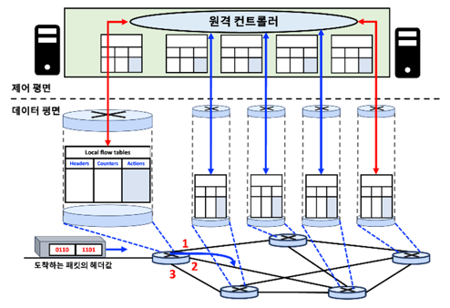
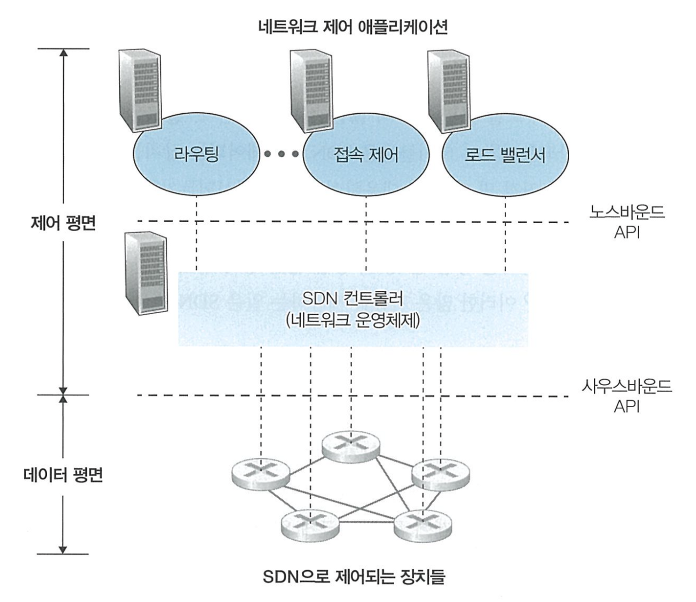
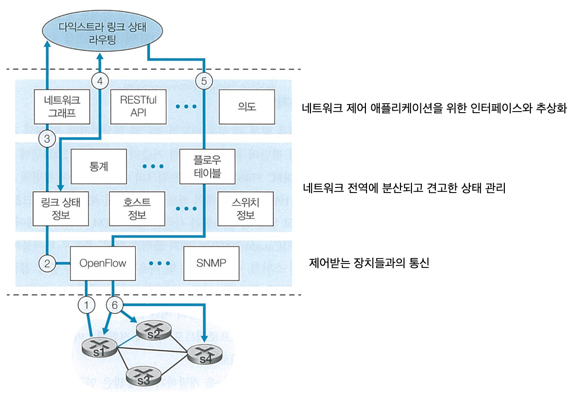

## SDN의 4가지 특징
### 플로우 기반 포워딩
- SDN으로 제어되는 스위치들에서의 패킷 전달은 전송 계층, 네트워크 계층, 또는 링크 계층 헤더의 어떤 값을 기반으로 하든 이루어질 수 있다.
- 모든 네트워크 스위치의 플로우 테이블 항목들을 계산하고 관리, 설치하는 일들은 모두 SDN 제어 평면의 임무다.

### 데이터 평면과 제어 평면의 분리

- 데이터 평면은 네트워크 스위치들로 구성되는데, 이들은 상대적으로 단순한 장치들로서 자신들의 플로우 테이블 내용을 기반으로 ‘매치 플러스 액션’을 수행한다.
- 제어 평면은 서버와 스위치들의 플로우 테이블을 결정, 관리하는 소프트웨어로 이루어져 있다.

### 네트워크 제어 기능이 데이터 평면 스위치 외부에 존재함
- 제어 평면을 이루는 소프트웨어는 네트워크 스위치로부터 멀리 떨어진 별도의 서버에서 수행된다.
- 제어 평면은 2개의 구성요소, 즉 SDN 컨트롤러(네트워크 운영체제)와 네트워크 제어 애플리케이션들의 집합으로 이루어져 있다.
- SDN 컨트롤러는 정확한 상태 정보(원격 링크와 스위치, 호스트들의 상태)를 유지하고, 이 정보를 네트워크 제어 애플리케이션들에 제공한다.      
  그리고 애플리케이션들이 하부 네트워크 장치들을 모니터링, 프로그래밍, 그리고 제어까지 할 수 있도록 수단을 제공한다.

### 프로그램이 가능한 네트워크
- 제어 평면에서 수행 중인 네트워크 제어 애플리케이션을 통해 네트워크를 프로그래밍할 수 있다.
- 네트워크 제어 애플리케이션들은 SDN 컨트롤러가 제공하는 API를 이용하여 네트워크 장치들에 있는 데이터 평면을 명세하고 제어한다.
  - ex) 라우팅 네트워크 제어 애플리케이션은 SDN 컨트롤러가 갖고 있는 노드 및 링크 상태 정보에 기반한 다익스트라 알고리즘을 수행하여 출발지와 목적지 사이의 종단 간 경로를 결정
  - ex) 어떤 패킷을 스위치에서 막을지 결정하는 접속 제어 수행
  - ex) 서버의 부하를 분산시키는 방식으로 패킷 전달

## SDN 제어 평면: SDN 컨트롤러와 SDN 네트워크 제어 애플리케이션
SDN 제어 평면은 크게 컨트롤러와 네트워크 제어 애플리케이션이라는 2가지 구성요소로 나뉜다.    
그리고 SDN 컨트롤러의 기능은 크게 3개의 계층으로 구성된다.

### 통신 계층
- SDN 컨트롤러와 제어받는 네트워크 장치들 사이의 통신
- SDN 컨트롤러는 원격의 SDN 기능이 가능한 장치(스위치, 호스트 등)들이 알린 이벤트(연결된 링크가 동작을 시작했거나 단절되었음을 나타내는 메시지, 장치가 네트워크에 합류했다는 메시지, 장치가 동작 중임을 나타내는 신호)들을 통해 SDN 컨트롤러에게 네트워크 상태에 대한 최신의 정보를 제공한다.
- SDN 컨트롤러가 원격의 SDN 기능이 가능한 장치들의 동작을 제어하려면, 컨트롤러와 그 장치들 사이에 정보를 전달하는 프로토콜(OpenFlow)이 필요하다.
- 컨트롤러와 제어받는 장치들 간의 통신은 사우스바운드(southbound)라고 알려진 컨트롤러 인터페이스를 넘나든다.

### 네트워크 전역 상태 관리 계층
- SDN 제어 평면의 궁극적인 제어 결정(희망하는 종단 간 포워딩, 로드 밸런싱 등)을 위해서는, 컨트롤러가 네트워크 호스트와 링크, 스위치, SDN으로 제어되는 다른 장치들에 대한 최신 정보를 알아야 한다.

### 네트워크 제어 애플케이션 계층과의 인터페이스
- SDN 컨트롤러는 노스바운드(northbound) 인터페이스를 통해 네트워크 제어 애플리케이션과 상호작용한다.
- 애플리케이션은 상태 변화 이벤트가 발생하면 알려달라고 등록해두고, SDN으로 제어되는 장치에서 네트워크 이벤트 알림이 오면 적절한 조치를 취할 수 있다.

## OpenFlow 프로토콜
- SDN 컨트롤러가 네트워크 장비를 제어하고 관리할 수 있도록 해주는 표준화된 인터페이스 
- SDN의 제어 평면과 데이터 평면 사이의 통신을 담당하며, 네트워크 장비들이 어떤 방식으로 트래픽을 처리할지 결정할 수 있게 한다.
- SDN 컨트롤러와 SDN으로 제어되는 스위치 또는 OpenFlow API를 구현하는 다른 장치 사이에서 동작한다.
- TCP상에서 디폴트 포트 번호 6653을 가지고 동작한다.

### 컨트롤러에서 제어되는 스위치로 전달되는 주요 메시지
- **설정**: 컨트롤러가 스위치의 설정 파라미터들을 문의하거나 설정할 수 있도록 하기 위해 사용
- **상태 수정**: 컨트롤러가 스위치 플로우 테이블의 엔트리를 추가/제거 또는 수정하거나 스위치 포트의 특성을 설정하기 위해 사용
- **상태 읽기**: 컨트롤러가 스위치 플로우 테이블과 포트로부터 통계 정보와 카운터값을 얻기 위해 사용
- **패킷 전송**: 컨트롤러가 제어하는 스위치의 지정된 포트에서 특정 패킷을 내보내기 위해 사용

### SDN으로 제어되는 스위치에서 컨트롤러로 전달되는 주요 메시지
- **플로우 제거**: 컨트롤러에게 어떤 플로우 테이블 엔트리가 시간이 만료되었거나 상태 수정 메시지를 수신한 결과로 삭제되었음을 알림
- **포트 상태**: 스위치가 컨트롤러에게 포트의 상태 변화를 알리기 위해 사용
- **패킷 전달**: 어떤 엔트리와도 일치하지 않는 패킷을 처리하기 위해 컨트롤러에 보내기 위해 사용

## 데이터 평면과 제어 평면의 상호작용

데이터 평면과 제어 평면의 상호작용을 확인하기에 앞서 아래 내용을 가정한다.
- 스위치 s1과 s2 사이의 링크가 단절되어 있다.
- 최단 경로 알고리즘이 사용되고 있다.
- s1, s3, s4로 들어오고 나가는 플로우 포워딩 규칙은 변경이 되었으나, s2의 동작은 바뀌지 않았다.
- 통신 계층 프로토콜로는 OpenFlow가 사용되며, 제어 평면은 링크 상태 라우팅 외의 기능 수행하지 않는다.

이러한 가정을 바탕으로 두 평면은 다음과 같이 상호작용한다.

1. 스위치 s2와의 링크 단절을 감지한 s1은 OpenFlow의 포트 상태 메시지를 사용하여 링크 상태의 변화를 SDN 컨트롤러에게 알린다.
2. 링크 상태 변화를 알리는 OpenFlow 메시지를 받은 SDN 컨트롤러는 링크 상태 관리자에게 알리고, 링크 상태 관리자는 링크 상태 DB를 갱신한다.
3. 다익스트라 링크 상태 라우팅을 담당하는 네트워크 제어 애플리케이션은 링크 상태의 변화가 있을 경우 알려달라고 이전에 등록해두는데, 이 애플리케이션이 링크 상태의 변화에 대한 알림을 받게 된다.
4. 링크 상태 라우팅 애플리케이션은 링크 상태 관리자에게 요청하여 갱신된 링크 상태를 가져오며, 이 작업은 상태 관리 계층에 있는 다른 구성요소의 도움이 필요할 수도 있다.   
   갱신된 링크 상태를 가져온 후 새로운 최소 비용 경로 계산한다.
5. 링크 상태 라우팅 애플리케이션은 갱신되어야 할 플로우 테이블을 결정하는 플로우 테이블 관리자와 접촉한다.
6. 플로우 테이블 관리자는 OpenFlow 프로토콜을 사용하여 링크 상태 변화에 영향을 받는 스위치들의 플로우 테이블을 갱신한다.

이처럼 컨트롤러가 플로우 테이블을 마음대로 변경할 수 있기 때문에, 단순히 애플리케이션 제어 소프트웨어를 바꿈으로써 원하는 어떤 형태의 포워딩 방식도 구현 가능하다.   
이러한 변경의 용이성은 (여러 독집적인 제조사에 의해 ISP에 공급되었을 수도 있는) 모든 라우터의 소프트웨어를 바꿔야 했던 전형적인 라우터별 제어 평면의 경우와 대조적이다.
