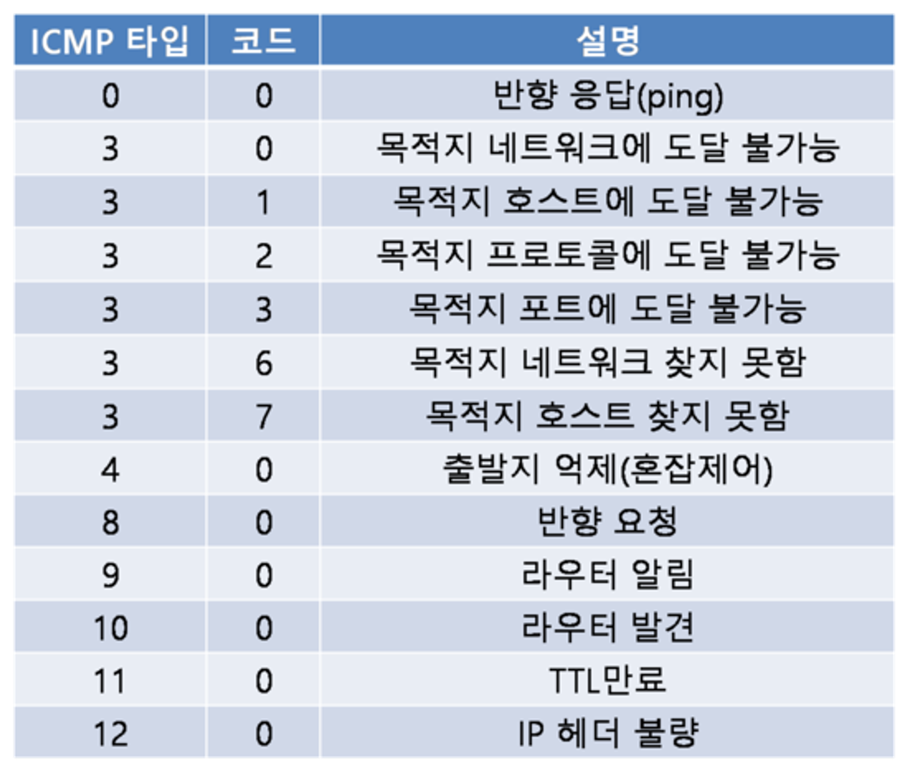

## 인터넷 제어 메시지 프로토콜(Internet Control Message Protocol, ICMP)
- 호스트와 라우터가 서로 간에 네트워크 계층 정보를 주고받기 위해 사용되는 프로토콜
- 가장 전형적인 사용 형태는 오류 보고다.   
  ex) HTTP 연결 수행 시 `목적지 네트워크에 도달할 수 없음(Destination network unreachable)` 같은 오류 메시지를 볼 때가 있는데, 이 메시지는 라우터가 호스트에게 오류가 발생했음을 알리기 위해 ICMP 메시지를 만들어 보낸 것이다.

## ICMP 메시지 타입

ICMP 메시지에는 `타입(type)`과 `코드(code)` 필드가 있고, ICMP 메시지의 발생 원인이 된 IP 데이터그램의 헤더와 첫 8바이트를 가진다. (송신자가 오류를 발생시킨 패킷을 알 수 있도록 하기 위해)

예를 들어, ping 프로그램은 타입 8, 코드 0인 ICMP 메시지를 특정 호스트에 보내고, 목적지 호스트는 에코(반향) 요청을 보고 나서 타입 0, 코드 0인 ICMP 메시지를 보낸다.