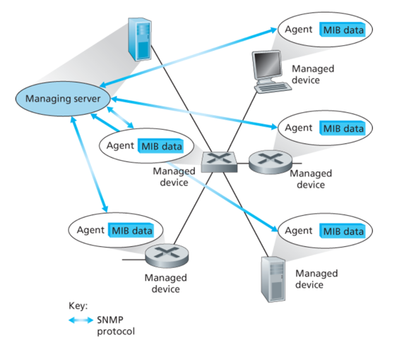
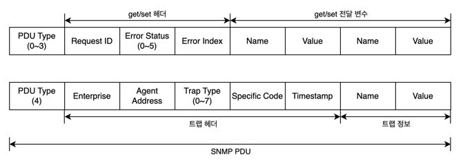

## 네트워크 관리란?
네트워크 관리는 적정한 비용으로 요구사항(실시간, 운용 성능, 서비스 품질 등)을 만족시키기 위해 네트워크와 구성요소 자원을 (감시, 테스트, 폴링, 설정, 분석, 평가, 제어하는) 하드웨어, 소프트웨어, 인간 요소 등을 배치하고, 통합, 조정하는 것이다.

## 네트워크 관리의 요소

### 관리 서버(Managing server)
- 네트워크 운영 센터의 중앙 집중형 네트워크 관리 스테이션에서 동작하는, 일반적으로 네트워크 관리자와 상호작용하는 애플리케이션
- 네트워크 관리 정보 수집, 처리, 분석, 발송을 제어한다.
- 하나의 네트워크는 여러 개의 관리 서버를 가질 수 있다.

### 피관리 장치(Managed device)
- 관리 대상 네트워크에 존재하는 네트워크 장비들(호스트, 라우터, 스위치, 미들박스, 모뎀, 온도계 등) 

### 데이터(Data)
- 각 피관리 장치는 '상태(state)'라고 부르는, 장치와 관련된 데이터를 갖는다.
- 데이터 유형
  - **설정 데이터(Configuration data)**: 장치 인터페이스에 관리자가 할당 및 설정한 IP 주소 또는 인터페이스 속도와 같은 장치 정보
  - **동작 데이터(Operational data)**: (OSPF 프로토콜의 인접 항목 목록처럼) 장치가 동작하면서 획득하는 정보
  - **장치 통계(Device statistics)**: 인터페이스에서 삭제된 패킷 수, 또는 장치의 냉각 팬 속도와 같이 장치가 운영되면서 갱신되는 상태 표시기 및 계수기
- 네트워크 관리자는 원격 장치의 데이터를 질의할 수 있으며, 경우에 따라 장치 데이터 값을 작성함으로써 원격 장치를 제어할 수 있다.

### 네트워크 관리 에이전트(Network management agent)
- 관리 서버와 통신하는 피관리 장치상의 소프트웨어 프로세스
- 관리 서버의 명령과 제어에 따라 피관리 장치에 국한되는 행동을 취한다.   
  ex) 관리 서버가 특정 라우터의 CPU 사용량을 모니터링하라고 명령을 내렸다면, 그 라우터에 설치된 에이전트는 해당 라우터의 CPU 사용량을 측정하고, 그 결과를 관리 서버로 전송하는 작업을 수행한다. 이때 에이전트는 오직 그 라우터(피관리 장치)에 국한된 작업만 수행한다.

### 네트워크 관리 프로토콜(Network management protocol)
- 네트워크 관리자가 네트워크를 관리할 수 있도록 기능을 제공한다.
- 관리 서버와 피관리 장치들 사이에서 동작한다. 
- 관리 서버가 피관리 장치의 상태에 대해 질의할 수 있도록 해준다.
- 관리 서버가 에이전트를 통해 피관리 장치에 특정 행동을 취할 수 있도록 해준다.
- 에이전트가 예외적인 사건(부품 고장, 성능 임계치 위반 등)을 관리 서버에게 알리기 위해 사용되기도 한다.

## 네트워크 관리 방법
### CLI(Command Line Interface)
- 네트워크 운영자는 CLI를 통해 장치에 직접 명령을 보낼 수 있다.
- CLI를 통해 보내는 명령은 피관리 장치의 콘솔에 직접 입력하거나 관리 서버/컨트롤러와 피관리 장치 사이의 Telnet 또는 SSH 연결을 통해 전달할 수 있다.
- 대체로 오류가 발생하기 쉽고, 대규모 네트워크를 자동화하거나 효율적으로 관리하기 어렵다.

### SNMP(Simple Network Management Protocol)/MIB(Management Information Base)
- 네트워크 운영자는 SNMP를 사용하여 MIB에 있는 데이터를 질의하거나 설정할 수 있다.
- MIB 데이터는 특정 장치에 종속되지 않으며, 네트워크의 다양한 장비에서 일관되게 사용할 수 있는 정보로 구조화되어 있다. 이는 네트워크 관리 시스템이 다양한 장비에서 데이터를 수집하고 분석할 수 있게 해준다.
- 일반적으로 네트워크 운영자는 SNMP/MIB를 통해 동작 상태 및 장치 통계 정보를 질의 및 모니터링한 다음, CLI를 사용하여 장치를 실제로 제어하고 설정한다.

### NETCONF/YANG
- 가장 최근에 나타난 네트워크 관리 방식
- 정확성의 제약 정도를 구체화하고 여러 장치에 대한 세세한 관리 작업을 제공하는 등 설정 관리에 훨씬 더 중점을 둔다.
- **YANG**: 설정 및 동작 데이터를 모델링하는 데 사용되는 데이터 모델링 언어
- **NETCONF**: 원격 장치와 YANG 호환 작업 및 데이터를 주고받거나 원격 장치 간에 통신하는 데 사용되는 프로토콜

## SNMP와 MIB
### SNMPv3(Simple Network Management Protocol version 3)
- 관리 서버와 그 관리 서버를 대표하여 실행되고 있는 에이전트 사이에서, 네트워크 관리 제어 및 정보 메시지를 전달하기 위해 사용되는 프로토콜
- SNMP의 일반적인 사용 방식
  - **요청-응답 방식**
    - SNMP 관리 서버는 에이전트에게 요청을 송신하고, 이를 받은 SNMP 에이전트는 요청에 대한 작업을 수행한 후 응답을 보낸다.
    - 일반적으로 요청은 피관리 장치와 관련된 MIB 객체 값들을 질의 또는 수정하기 위해 이용된다.
  - **에이전트가 요청을 받지 않았더라도 트랩 메시지(trap message)를 관리 서버에게 전송하는 방식**
    - 트랩 메시지들은 관리 서버들에게 MIB 객체 값들을 변화시킨 예외 상황의 발생을 통지하기 위해 이용된다.

### SNMPv3 PDU 타입
- SNMPv3는 일반적으로 PDU(Protocol Data Unit)로 알려진 7가지 타입의 메시지를 정의하고 있다.

| SNMPv3 PDU 타입 | 송신자-수신자 | 설명 |
|---------------|---------|----|
| GetRequest | 관리자-에이전트 | 하나 또는 그 이상의 MIB 객체 인스턴스의 값을 가져온다. |
| GetNextRequest | 관리자-에이전트 | 목록 또는 테이블에서 다음 MIB 객체 인스턴스의 값을 가져온다. |
| GetBulkRequest | 관리자-에이전트 | 큰 블록 단위의 데이터(큰 테이블의 값들)를 가져온다. |
| InformRequest | 관리자-관리자 | 원격으로 접근하는 원격 관리 서버에게 MIB 값을 알린다. | 
| SetRequest | 관리자-에이전트 | 하나 또는 그 이상의 MIB 객체 인스턴스들의 값을 설정한다. |
| Response | 에이전트-관리자 or 관리자-관리자 | GetRequest, GetNextRequest, GetBulkRequest, SetRequest PDU 또는 InformRequest에 대한 응답으로 발생한다.
| SNMP-Trap | 에이전트-관리자 | 관리자에게 예외적인 이벤트 발생을 알린다. |

### SNMP PDU 포맷

### MIB(Management)
MIB 객체는 다음과 같은 정보들을 의미한다.
- IP 데이터그램 헤더의 오류로 인해 라우터에서 버려지는 데이터그램 개수
- 이더넷 인터페이스 카드의 반송파 감지 오류 횟수를 세는 카운터
- DNS 서버에서 실행되는 소프트웨어 버전과 같은 설명 정보
- 특정 장치가 올바르게 작동하는지 여부와 같은 상태 정보
- 어떤 목적지로의 라우팅 경로 같은 프로토콜에 특정된 정보

## 네트워크 설정 프로토콜(NETCONF)과 YANG
### NETCONF 프로토콜
- 관리 서버와 피관리 네트워크 장치 사이에서 다음과 같이 동작한다.
  - 피관리 장치의 설정 데이터를 검색, 셋업, 수정
  - 피관리 장치의 동작 데이터 및 통계 질의
  - 피관리 장치에서 생성된 알림을 구독하기 위한 메시지 전송 기능 제공
- 원격 프로시저 호출(Remote Procedure Call, RPC) 패러다임을 사용한다.
- 관리 서버는 피관리 장치를 제어하기 위해 구조화된 XML 문서 형식의 설정 내용을 보내 피관리 장치에서 활성화한다.
- XML로 인코딩된 프로토콜 메시지는 TCP 상의 TLS(Transport Layer Security) 프로토콜과 같은 안전한 연결 지향 세션을 통해 관리 서버와 피관리 장치 사이에서 교환된다.

### YANG
- NETCONF가 사용하는 네트워크 관리 데이터의 구조, 구문 및 의미를 정확하게 표현하는 데 사용되는 데이터 모델링 언어
- SMI와 마찬가지로 몇개의 내장 데이터 유형을 제공하며 데이터 모델링을 하는 사람이 유효한 NETCONF 설정에 의해 충족되어야만 하는 제약 조건을 표현할 수 있도록 한다.