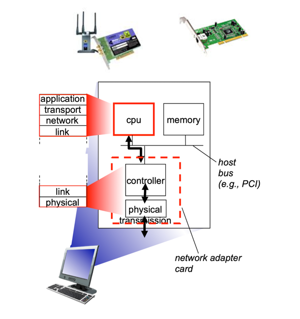
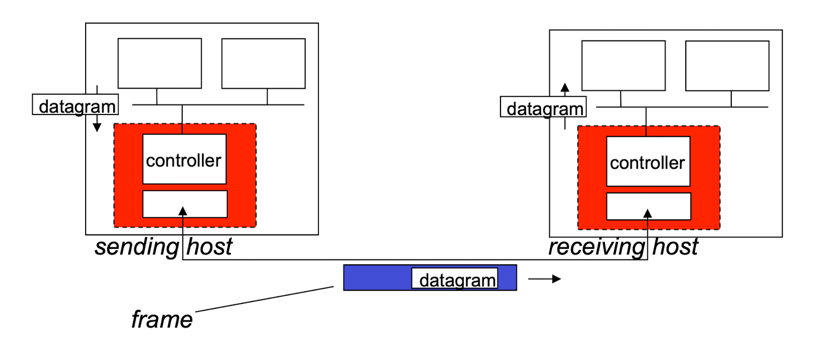

## 링크 계층이 제공하는 서비스
### 프레임화(framing)
- 상위 계층에서 내려온 데이터그램을 링크 상으로 전송하기 전에 프레임에 캡슐화한다.

### 링크 접속(link access)
- 매체 접속 제어(Medium Access Control, MAC) 프로토콜은 링크상으로 프레임을 전송하는 규칙을 명시한다.
- 링크의 한쪽 끝에 단일 송신자와 다른쪽 끝에 단일 수신자가 있는 점대점 링크의 경우, 송신자는 링크가 사용되지 않을 때마다 프레임을 전송할 수 있다.
- 하나의 브로드캐스트 링크를 여러 노드가 공유하는 경우(다중 접속 문제), MAC 프로토콜은 여러 노드로부터의 프레임 전송을 조정한다.

### 신뢰적 전달(reliable delivery)
- 전송 계층에서 신뢰적 전달 서비스를 제공하는 것처럼, 링크 계층에서도 이를 제공한다.
  - 전송 계층에서는 오류가 발생한 경우 데이터를 종단 간에 재전송하는 것과 달리,
  - 링크 계층에서는 오류가 발생한 링크에서 오류를 정정한다.
- 무선 링크처럼 오류율이 높은 링크에서 주로 사용한다.
- 낮은 비트율을 가진 링크에서는 신뢰적 전달이 불필요한 오버헤드가 될 수 있기 때문에, 대다수 유선 링크 계층 프로토콜은 제공하지 않는다.

### 흐름 제어(flow control)
- 인접한 노드들 간의 송수신 속도를 제어한다.

### 오류 검출(error detection)
- 신호의 약화나 잡음으로 인해 발생할 수 있는 비트 오류를 검출한다.
- 송신 노드에서 프레임에 오류 검출 비트를 설정하게 하고, 수신 노드에서 오류 검사를 수행하게 한다.

### 오류 정정(error correction)
- 수신 노드는 재전송 없이 비트 오류를 식별하고 정정한다.

## 링크 계층이 구현되는 위치

- 일반적으로, 링크 계층은 **네트워크 인터페이스 카드**(**Network Interface Card, NIC**)로 알려진 네트워크 어댑터에 구현된다.
- 대부분의 링크 계층 기능이 NIC에 구현되어 있으며, 일부 기능은 OS에 구현되어 있다.   
  따라서 링크 계층을 "하드웨어와 소프트웨어가 만나는 부분"이라고 부른다.
- NIC에 있는 **링크 계층 컨트롤러**는 링크 계층 서비스의 대다수가 하드웨어로 구현되어 있는 단일의 특수 용도 칩을 의미한다.

### 네트워크 어댑터의 상호 작용

- 송신 측
  - 데이터그램을 프레임에 캡슐화한다.
  - 오류 검출 비트 추가, 신뢰적 전달, 흐름 제어 등 다양한 서비스를 제공한다.
- 수신 측
  - 오류 검출, 신뢰적 전달, 흐름 제어 등 다양한 서비스를 제공한다.
  - 데이터그램을 추출하여 상위 계층으로 전달한다.
