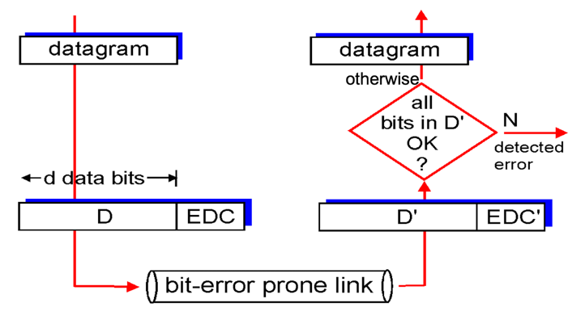

오류 검출 비트를 사용해도, 여전히 미검출된 비트 오류가 존재할 수 있다. 이로 인해 수신자는 잘못된 데이터그램을 상위 계층으로 전달하는 문제가 발생한다.   
따라서 오류 미검출 확률이 낮은 기법을 선택할 필요가 있다.

일반적으로 더 향상된 오류 검출 및 정정 기술은 더 큰 오버헤드를 필요로 한다.    
이는 더 많은 수의 EDC(Error Detection and Correction) 비트를 계산하고 전달하기 위해 더 많은 계산 시간을 소요하기 때문이다.

## 오류 검출 과정

1. 송신 노드에서 데이터 D에 오류 검출 및 정정(Error Detection and Correction, EDC) 비트를 추가한다.
2. 여기서 보호되는 데이터는 네트워크 계층에서 온 데이터그램 뿐만 아니라 데이터 링크 프레임 헤더에 있는 정보도 포함된다.
3. D와 EDC는 프레임에 포함되어 수신 노드로 전송되며, 수신 노드에서는 비트열 D'과 EDC'을 수신한다.    
   (D'와 EDC'는 전송 도중에 비트가 변경될 수 있으므로 원래의 D나 EDC와 다를 수 있다.)
4. 수신 노드는 자신이 수신한 D'과 EDC'만으로 원래의 D가 D'과 동일한지 결정한다.

## 패리티 검사(Parity Checking)
- 사용자가 단순히 한 비트를 추가하고, 그 비트값을 d+1개의 비트들에서 1의 총 개수가 짝수가 되도록 선택한다.
- 수신자는 수신된 d+1개의 비트들에서 1의 개수를 계산한다.
  - 만약 1의 값을 가진 비트가 홀수개라면, 수신자는 임의의 홀수개의 비트 오류가 있음을 알게된다.
  - 짝수개의 비트 오류가 발생하는 경우에는 이를 검출하지 못한다.

## 체크섬(Checksum)
- 송신 측에서 생성된 체크섬 값을 수신 측에서 비교함으로써, 전송된 데이터에 오류가 발생했는지를 검출한다.
- 상대적으로 패킷 오버헤드가 작다.
- CRC에 비해 오류 면에서 취약하다.

### 동작 원리
- 데이터의 바이트를 16비트 정수 단위로 취해서 더한다.
- 더한 값의 1의 보수가 인터넷 체크섬이 되며, 이를 세그먼트 헤더에 넣는다.
- 수신자는 수신 데이터 합의 1의 보수를 취한 후 그 결과가 모두 1인 비트로 구성되어 있는지 계산함으로써 체크섬을 검사한다. 즉, 하나라도 0이면 오류가 발생한 것이다.

> ### 왜 전송 계층에서는 체크섬을, 링크 계층에서는 CRC를 사용할까?
> 전송 계층은 일반적으로 호스트 운영체제의 일부로서 소프트웨어로 구현된다.   
> 즉, 전송 계층의 오류 검출이 소프트웨어로 구현되므로, 체크섬처럼 간단하고 빠른 오류 검출 기법이 필요하다.   
> 반면 링크 계층에서의 오류 검출은 어댑터 안의 전용 하드웨어로 구현되므로, 더 복잡한 CRC 연산을 빨리 수행할 수 있다.

## 순환 중복 검사(C R C, CRC)
- 오늘날 네트워크에서 널리 사용되는 기법이다.
- 다항식 코드(polynomial code)로도 알려져 있다.
  - 전송되는 비트열에 있는 0과 1 값을 계수로 갖는 다항식처럼 비트열을 생각할 수 있고, 또한 비트열에 적용되는 연산을 다항식 연산으로 이해하는 것이 가능하기 때문이다.

### 동작 원리
(101101이라는 이진수로 표현된 데이터가 있다고 가정한다)

1. CRC를 계산하기 위해 생성 다항식을 정의한다.   
   ex) 1101이라는 생성 다항식을 사용하며, 실제로는 x^3 + x^2 + 1로 표현할 수 있다. 
2. 데이터 뒤에 생성 다항식의 차수 만큼의 0을 추가한다.   
   ex) 생성 다항식의 차수가 3이라면, 데이터에 3개의 0을 추가하여 101101000이 된다.
3. 확장된 데이터를 생성 다항식으로 나눈다. 이 나눗셈은 XOR 연산을 통해 수행되며, 나머지를 구한다.   
   ex) 101101000을 1101로 나누면 나머지가 나오며, 이 나머지가 CRC 값이 된다.
4. 계산된 나머지(CRC 코드)를 원래 데이터에 추가하여 전송한다.   
   ex) CRC 코드가 101일 때, 최종적으로 전송되는 데이터는 101101101이 된다.
5. 수신 측에서는 수신한 데이터에 대해 동일한 생성 다항식을 사용해 나눗셈 연산을 다시 수행한다.    
   이 과정에서 나머지가 0이 나오면 데이터 전송 중에 손상되지 않았음을 의미하고, 나머지가 0이 아니라면 데이터에 오류가 발생했음을 나타낸다.
