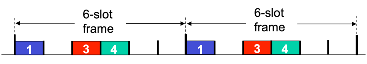
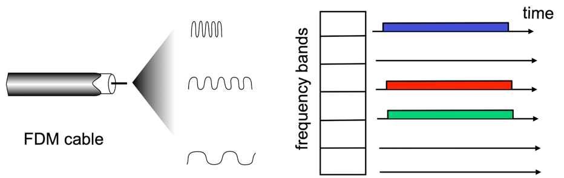
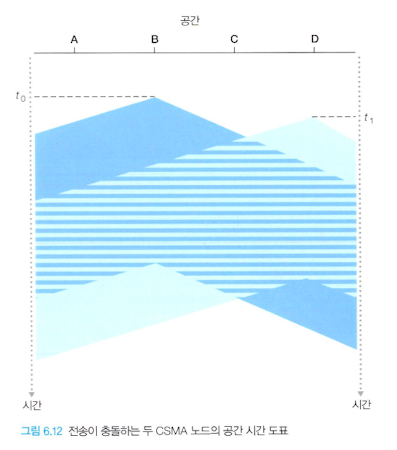
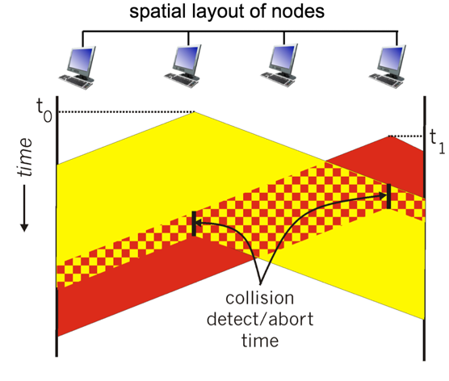
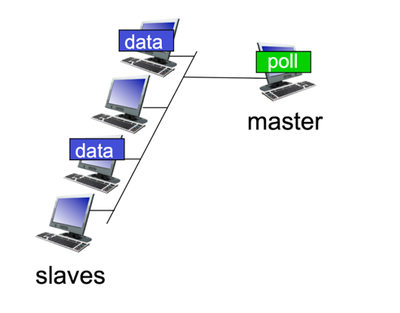
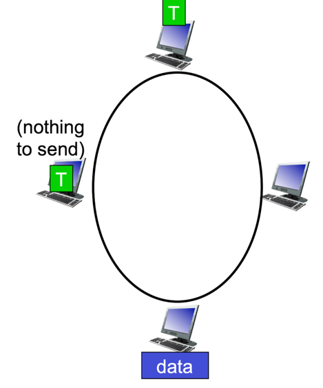

## 다중 접속 문제
동일한 하나의 공유된 브로드캐스트 채널에는 다수의 송수신 노드들이 연결되어 있다.   
이러한 2개 이상의 노드들이 동시에 프레임을 전송하면, 모든 노드가 동시에 여러 개의 프레임을 수신하여 충돌이 발생한다.   
이로 인해 어떤 수신 노드도 전송된 프레임의 의미를 파악할 수 없게 되고, 브로드캐스트 채널은 충돌 기간만큼 낭비된다.

이러한 다중 접속 문제를 해결하기 위한 프로토콜이 **다중 접속 프로토콜**(**Multiple Access Protocol**)이다.

## 다중 접속 프로토콜의 지향점
1. 단 하나의 노드가 전송할 데이터가 있을 때는 그 노드가 R bps의 처리율을 가져야 한다.
2. M개의 노드가 전송할 데이터가 있을 때는 각 노드가 R/M bps의 처리율을 가져야 한다. 즉, 모든 노드가 공평하게 대역폭을 사용해야 한다.
3. 분산되어 있어야 한다. 즉, 고장으로 인해 전체 시스템을 정지시킬 수 있는 마스터 노드가 없어야 한다.
4. 단순해서 구현하는 데 비용이 적게 들어야 한다.

## 채널 분할 프로토콜(Channel Partitioning Protocol)
### 시분할 다중 접속(Time-Division Multiple Access, TDMA)

- 시간을 **시간 프레임**으로 나누고, 또한 각 시간 프레임을 N개의 **시간 슬롯**으로 나눈다.
- 각 시간 슬롯은 N개 노드에게 각각 할당된다.
- 노드는 전송할 패킷이 있을 때마다 TDM 프레임에서 자신에게 할당된 시간 슬롯 동안 패킷 비트들을 전송한다.

### 주파수 분할 다중 접속(Frequency-Division Multiple Access, FDMA)

- R bps의 채널을 다른 주파수로 나눠서 각 주파수를 N개 노드 중 하나에게 할당한다.
- 하나의 큰 R bps 채널로부터 N개의 R/N bps의 작은 채널을 만든다.

### 단점
- 전송할 패킷이 있는 노드가 단 하나인 경우에도 노드 전송률이 평균 R/N로 제한된다.
- 노드가 전송 순서상 자신의 차례를 항상 기다려야 한다.

## 랜덤 접속 프로토콜(Random Access Protocol)
- 전송 노드는 항상 채널의 최대 전송률인 R bps로 전송한다.
- 전송 전에 노드 간 사전 조율이 이루어지지 않는다.
- 충돌이 발생했을 때, 노드는 해당 프레임을 재전송하기 전에 랜덤 지연 시간동안 기다린다.
- 충돌과 관련된 각 노드는 자신만의 랜덤 지연 시간을 선택한다.

### CSMA(Carrier Sense Multiple Access)
- 패킷을 전송하기 전에 캐리어를 감지(carrier sensing)하는 방식으로 다중 접속 문제를 제어하는 프로토콜
  - 채널에서 패킷이 전송되고 있지 않음을 감지하면 프레임을 전송하고,
  - 전송되고 있음을 감지하면 랜덤 지연 시간동안 기다린다.
- 채널 전파 지연이 길수록 충돌을 완전히 방지하기 어렵다.

  

### CSMA/CD (Carrier Sense Multiple Access/Collision Detection)

1. 어댑터는 네트워크 계층으로부터 데이터그램을 받아서 링크 계층 프레임을 만든 후에 그 프레임을 어댑터의 버퍼에 저장한다.
2. 어댑터는 채널이 유휴(idle) 상태임을 감지하면 프레임 전송을 시작한다. 반대로 바쁜(busy) 상태임을 감지하면, 어떤 신호 에너지도 감지되지 않을 때까지 더 기다렸다가 프레임을 전송하기 시작한다.
3. 전송하는 동안 어댑터는 브로드캐스트 채널을 사용하는 다른 어댑터로부터의 신호 에너지가 있는지 감지한다.
4. 프레임 전체를 전송하는 동안 다른 어댑터로부터의 신호 에너지가 감지되지 않으면, 프레임 전송을 완료한다.
   그러나 전송 도중에 다른 어댑터로부터의 신호 에너지를 감지하면, 자신의 프레임 전송을 취소한다.
5. 어댑터는 전송을 취소한 후 임의의 랜덤 시간만큼 기다린 후 2번으로 돌아간다.

## 순번 프로토콜(Taking-Turns Protocol)
- 채널 분할 프로토콜과 랜덤 접속 프로토콜의 장점만 가지도록 한 프로토콜

### 폴링 프로토콜(Polling Protocol)

- 노드 중 하나를 마스터 노드로 지정하는 방식
- 마스터 노드는 각 노드를 라운드 로빈 방식으로 폴링(노드가 최대로 전송할수 있는 프레임을 알림)한다.
- 충돌 뿐만 아니라 랜덤 접속 프로토콜의 단점인 빈 슬롯을 제거함으로써 훨씬 높은 효율을 제공한다.
- 마스터 노드가 고장나면 전체 채널이 동작하지 못하게 되는데, 이는 다중 접속 프로토콜의 지향점 중 3번째를 위반한다.

### 토큰 전달 프로토콜(Token-Passing Protocol)

- 토큰이라고 알려진 작은 특수 목적 프레임이 정해진 순서대로 노드 간에 전달되는 방식   
  ex) 노드 1은 항상 노드 2에게 토큰을 전송하며, 노드 2는 항상 노드 3에게 토큰을 전송하고, 노드 N은 항상 노드 1에게 토큰을 전송한다.
- 노드가 토큰을 수신했을 때 전송할 프레임이 있으면, 프레임을 최대 개수까지 전송한 뒤 토큰을 다음 노드로 전달한다.
- 분산 방식이며 효율이 매우 높다.
- 노드가 잘못해서 토큰을 놓아주지 않거나, 토큰이 사라지면 전체가 동작하지 않는다.
