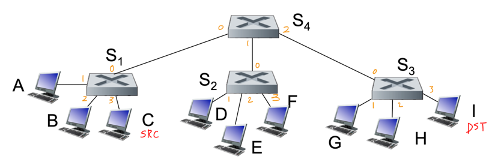

## MAC 주소
- 동일한 네트워크 내의 물리적으로 연결된 인터페이스 간에 프레임을 전달하는 데 사용되는 주소
- 대부분 LAN의 경우 MAC 주소의 길이 = 6바이트 (2^48개의 LAN 주소 사용 가능)
  - 6바이트의 주소는 주로 16진수 표기법으로 표시되며, 주소의 각 바이트는 2개의 16진수로 표시됨    
    ex) `1A-2F-BB-76-09-AD`
- 원래 영구적으로 설계되었으나, 이제는 소프트웨어를 사용해 어댑터의 MAC 주소 변경 가능
- 어떤 어댑터도 동일한 주소를 갖지 않음
- 계층 구조가 아닌 평면 구조를 가지며, 어댑터의 위치에 따라 MAC 주소가 변경되지 않음

## ARP(Address Resolution Protocol)
- 네트워크 계층 주소(IP 주소)를 링크 계층 주소(MAC 주소)로 변환해주는 프로토콜
- ARP를 통해 송신 호스트는 특정 IP 주소를 가진 목적지 호스트의 MAC 주소 결정 가능
- (인터넷의 임의의 장소에 있는 호스트의 호스트 네임을 해결하는) DNS와 달리, 동일한 서브넷상에 있는 호스트나 라우터 인터페이스의 IP 주소만을 해결

### ARP 테이블
- IP 주소와 MAC 주소 간의 매핑 정보를 포함하는 테이블
- 각 호스트와 라우터는 자신의 메모리에 ARP 테이블을 갖고 있음
- 테이블에서 각 매핑이 언제 삭제되는지를 나타내는 TTL(Time-To Live) 값을 포함함
- 일반적인 엔트리의 종료 시간 = 엔트리가 ARP 테이블에 들어간 후 20분
- 플러그 앤 플레이(plug-and-play)
  - 노드의 ARP 테이블이 자동으로 구축되므로, 시스템 관리자가 테이블을 구성할 필요 없음
  - 호스트가 서브넷으로부터 연결이 끊어지면, 이 호스트에 대한 엔트리는 그 서브넷의 다른 ARP 테이블에서 제거됨

### 동작 원리 (in 동일한 LAN)
1. 송신 노드가 수신 노드로 데이터그램을 전송하고자 하며, 송신 노드의 ARP 테이블에 수신 노드의 MAC 주소가 없는 상태다.
2. 송신 노드는 수신 노드의 IP 주소를 포함한 ARP 쿼리 패킷을 구성한 후 브로드캐스트한다.
3. 브로드캐스트 주소는 `FF-FF-FF-FF-FF-FF`이며, LAN의 모든 노드가 ARP 쿼리 패킷을 수신한다.
4. 수신 노드는 ARP 패킷을 수신하고, 자신의 MAC 주소를 포함한 응답을 송신 노드에게 유니캐스트로 전송한다.
5. 송신 노드는 IP 주소와 MAC 주소 쌍을 자신의 ARP 테이블에 저장하고, 이 정보는 갱신되지 않으면 시간이 지나면서 만료된다.

## 이더넷
- 컴퓨터와 네트워크 장치들을 서로 연결하여 데이터를 전송할 수 있게 해주는 통신 프로토콜
- 유선 LAN 기술 중에서 가장 널리 사용되는 방식 
- 비교적 저렴하며, 간단한 구조를 가지고 있음
- **비연결형(connectionless)**
  - 송신 NIC와 수신 NIC 간에 핸드셰이킹 과정이 없음 
  - 즉, 데이터 전송 전에 송수신 장치 간의 연결을 설정하지 않음
- **비신뢰성(unreliable)**
  - 수신하는 NIC는 송신하는 NIC에게 ACK 또는 NACK 신호를 보내지 않음 
  - 전송 도중 프레임이 손실된 경우, 상위 계층의 신뢰할 수 있는 프로토콜을 사용할 때에만 손실된 데이터가 복구됨
  - 그렇지 않으면 데이터는 손실된 채로 남게 됨

### 이더넷 프레임 구조

- `preamble`
  - 데이터 전송 전 송신기와 수신기의 동기화를 위한 패턴
  - 정확한 데이터 전송을 가능하게 하기 위함
- `source address` & `dest address`
  - 송신 MAC 주소와 수신 MAC 주소
  - 각각 6바이트로 구성됨
  - 어댑터가 수신 MAC 주소와 일치하는 프레임을 받으면 프레임의 데이터를 네트워크 계층 프로토콜로 전달하고, 그렇지 않으면 폐기함
- `type`
  - data 안에 담기는 것이 무엇인지 나타내는 정보
  - ex) ARP Query, IP 패킷, ...
- `CRC`
  - 수신 측에서 오류를 검출하고 프레임을 삭제하는 데 사용되는 필드

### 이더넷의 CSMA/CD 사용
- **No slots**
  - 이더넷은 특정 시간 슬롯을 사용하지 않고 데이터 전송을 관리함
- **Carrier Sense**
  - 어댑터는 다른 어댑터가 데이터를 전송 중인지 감지하고, 만약 다른 어댑터가 전송 중이라면 전송을 시작하지 않음
- **Collision Detection**
  - 전송 중인 어댑터는 다른 어댑터가 동시에 전송하고 있는지 감지하고, 충돌이 발생하면 전송을 중단함
- **Random Access**
  - 충돌 후 재전송 시도 전에 어댑터는 랜덤한 시간을 기다렸다가 전송을 시도함

### 충돌을 감지하기 위한 최소 프레임 크기
충돌이 발생했음에도 불구하고 감지가 안되는 경우, 어떻게 해결해야 할까?

예를 들어, 호스트 A가 Carrier Sense 후에 프레임을 전송하고, 이로 인해 채널에 신호가 퍼진다고 가정하자.   
호스트 G가 A의 프레임 전송에 의한 신호를 받기 전에 Carrier Sense를 수행하면, 문제 없다고 판단하여 프레임을 전송한다. 이렇게 되면 결국 충돌이 발생하고, G는 그 충돌을 감지하여 프레임 전송을 중지한다.   
하지만 A가 프레임을 이미 전송한 후 G로 인해 생긴 신호를 수신하면 충돌을 감지하지 못한다.   
즉, 충돌이 발생했음에도 불구하고 A는 그 충돌을 감지하지 못한 것이다. 이는 A가 전송에 실패한 프레임이 영원히 재전송되지 않는 문제를 야기한다.

만약 A가 전송하는 프레임의 크기가 조금만 더 컸어도 충돌을 감지할 수 있었을 것이다. 따라서 충돌을 무조건 탐지할 수 있도록 최소 프레임 크기를 지정한다.   
즉, 전송하고자 하는 프레임의 크기가 최소 프레임 크기보다 작다면, padding(의미 없는 비트)을 추가하여 억지로 최소 프레임 크기를 맞춘다.

이를 통해 충돌을 100% 감지할 수 있게 되고, 링크 계층에서는 (ACK, NACK와 같은) 피드백을 필요로 하지 않는다.

## 링크 계층 스위치
- 프레임을 전달하는 링크 계층 장치
- 수신된 프레임의 MAC 주소를 검사하여, 해당 프레임을 전송해야 하는 하나 이상의 링크에 선택적으로 전달함
- 네트워크에 투명하게 동작하여, 호스트는 스위치의 존재를 인식하지 못함
- 플러그 앤 플레이 방식으로 동작하며, 자가 학습 기능을 가지고 있어 별도의 구성 작업이 필요 없음
- **각 링크를 독립적인 충돌 도메인으로 처리함으로써, 여러 호스트의 프레임 동시 전송이 가능하게 하여 네트워크 효율성을 높임** 

### 포워딩과 필터링
- **필터링(Filtering)**: 프레임을 인터페이스로 전달할지 또는 폐기할지 결정하는 스위치의 기능
- **포워딩(Fowarding)**: 프레임이 전송될 인터페이스를 결정하고 프레임을 해당 인터페이스로 내보내는 기능
- 필터링과 포워딩 모두 스위치 테이블 이용
  - 스위치 테이블 엔트리에는 **MAC 주소**, **MAC 주소로 가게 하는 스위치 인터페이스**, **해당 엔트리가 테이블에 만들어진 시점에 대한 정보(TTL)**가 들어 있음

### 자가 학습(Self Learning)
- 스위치는 자신의 테이블을 자동으로, 동적으로, 자치적으로 구축 가능
- #### 동작 원리
  1. 스위치 테이블은 초기에 비어 있다.
  2. 인터페이스로 수신한 각 프레임에 대해 스위치는 다음과 같은 정보를 저장한다. 
     - 프레임의 출발지 주소 필드에 있는 MAC 주소
     - 프레임이 도착한 인터페이스
     - 현재 시간(TTL)
  3. 일정 시간이 지난 후에도 스위치가 해당 주소를 출발지 주소로 하는 프레임을 수신하지 못하면 테이블에서 이 주소를 삭제한다.

### 동작 원리

1. 호스트 C는 IP 주소와 MAC 주소를 포함하는 프레임 전송
2. S1 테이블에 (C, 3) 기록 
3. S1은 I의 인터페이스를 모르기 때문에 flooding 수행
   - A, B로 향하는 프레임은 폐기됨
4. S4 테이블에 (C, 0) 기록
5. S4는 I의 인터페이스를 모르기 때문에 flooding 수행
6. S2에 (C, 0) 기록
7. S2는 I의 인터페이스를 모르기 때문에 flooding 수행
   - D, E, F로 향하는 프레임은 폐기됨
8. S3에 (C, 0) 기록
9. S3는 I의 인터페이스를 모르기 때문에 flooding 수행
   - G, H로 향하는 프레임은 폐기됨
10. 호스트 I는 프레임 수신

### 링크 계층 스위치의 특성
- #### 충돌 제거
  - 스위치로 (허브 없이) 구축된 LAN에는 충돌로 인해 낭비되는 대역폭이 없음
  - 스위치는 프레임을 버퍼링하며 어느 시점이든 세그먼트에 하나 이상의 프레임을 전송하지 않음
  - 스위치의 최대 총 처리율 = 모든 스위치 인터페이스 속도의 합

- #### 이질적인 링크들
  - 스위치는 링크들을 별개로 분리하기 때문에 LAN의 각 링크는 상이한 속도로 동작할 수 있으며 상이한 매체 이용 가능

- #### 관리
  - 스위치는 향상된 보안을 제공할 뿐만 아니라 네트워크 관리를 쉽게 할 수 있게 해줌
  - ex) 어댑터가 오동작해서 이더넷 프레임을 계속 보내는 경우 스위치는 이 문제를 감지하고 오동작하는 어댑터의 연결을 의도적으로 끊음

### 스위치 vs 라우터
- 라우터는 네트워크 계층에서 동작하며, IP 주소를 기반으로 데이터를 처리하고 라우팅 알고리즘을 사용하여 네트워크 트래픽의 경로를 결정한다.
- 스위치는 링크 계층에서 동작하며, MAC 주소를 기반으로 데이터를 전송하고, 자가 학습 메커니즘을 통해 포워딩 테이블을 업데이트한다.
- 두 장치 모두 데이터 패킷을 저장하고, 이를 적절한 경로로 전달하는 방식으로 동작한다. 즉, **저장 후 전달(store-and-forward)** 방식으로 동작한다.
