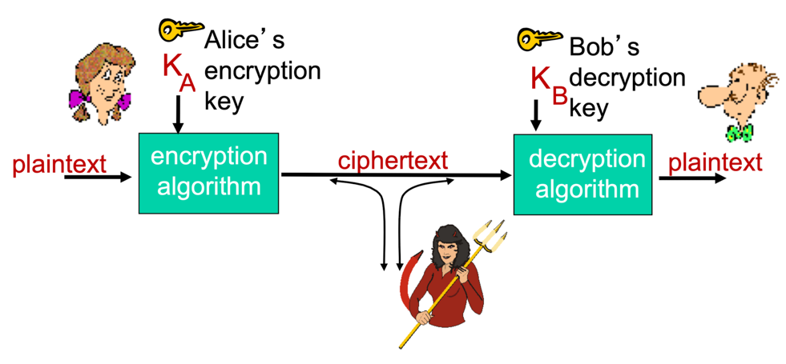
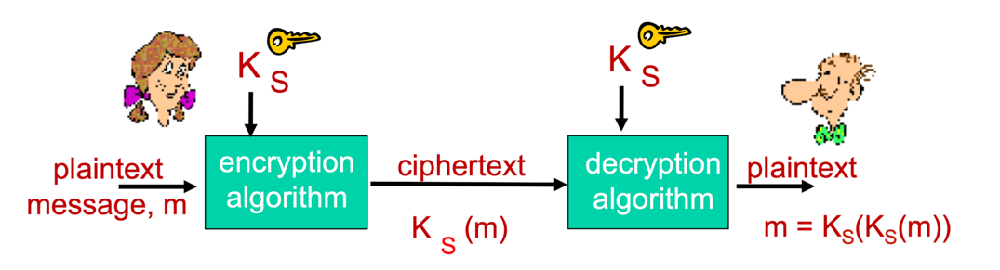
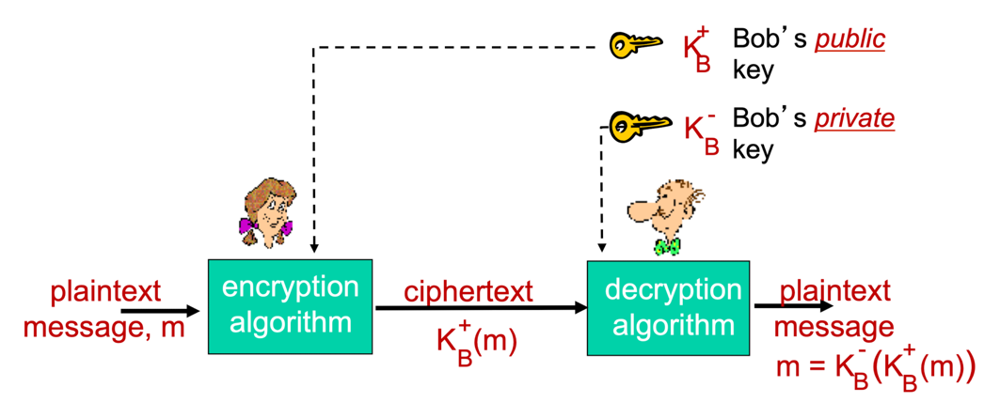
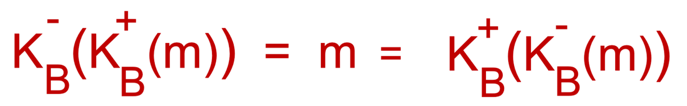

## 암호화 관련 용어

- **평문(plaintext)**: 전송하고자 하는 원래 형태의 메시지
- **암호문(ciphertext)**: 암호화된 메시지
- **키(key)**: 평문을 암복호화하는 데 필요한 숫자나 문자열로 구성된 비밀 정보
  > 현대 많은 암호화 기술 자체는 표준화되어 누구나 쉽게 사용할 수 있다. 모든 이가 데이터를 암호화하는 방법을 알고 있다면, 전송한 데이터를 침입자가 복원할 수 없도록 하는 비밀 정보가 필요하다.
- **암호화 알고리즘(encryption algorithm)**: 키와 평문 메시지를 입력 받아 암호문을 생성하는 알고리즘
- **복호화 알고리즘(decryption algorithm)**: 키와 암호문을 입력 받아 평문으로 복원하는 알고리즘
- 평문 m을 키 K_A로 암호화한 암호문을 K_A(m)이라고 할 때, `m = K_B(K_A(m))`으로 나타낼 수 있다.

## 암호화 기법 해독 시나리오
- **암호문만을 이용한 공격(cipher-text only attack)**
  - 침입자가 평문 메시지에 대한 어떤 사전 정보도 없이 가로챈 암호문에만 접근할 수 있는 경우
- **알려진 평문 공격(known-plaintext attack)**
  - 침입자가 평문과 암호문의 쌍을 어느 정도 알고 있는 경우
- **선택 평문 공격(chosen-plaintext attack)**
  - 송신자에게 특정 평문 메시지를 선택해 보내게 함으로써, 이에 대응하는 암호문 형태를 얻는 경우

## 대칭키 암호화

- 송신자와 수신자가 동일한 비밀키를 사용하여 메시지를 암복호화하는 방식
- 암호화 알고리즘은 송신자의 비밀키를 사용하여 평문 메시지를 암호화함
- 복호화 알고리즘은 송신자의 비밀키와 동일한 수신자의 비밀키를 사용하여 암호문을 복호화함
- 연산 속도가 매우 빠름
- 대표적으로 DES와 AES가 존재함

### DES(Data Encryption Standard)
- 1993년 NIST에 의해 지정된 미국의 암호화 표준
- 56비트 대칭키를 사용하고, 64비트의 평문 입력을 암호화함
- 블록 암호화 방식이며, 암호 블록 체이닝(Cipher Block Chaining) 기법을 사용함
- 56비트 키의 제한으로 인해 보안성이 떨어질 수 있음
- **동작 원리**
  - 초기 순열을 시작으로 16번의 동일한 함수 적용 단계를 거침
  - 각 라운드는 48비트의 키를 사용하며, 마지막에 최종 순열을 거쳐 암호화가 완료됨

### AES(Advanced Encryption Standard)
- 2001년 NIST가 DES를 대체한 대칭키 암호화 표준
- AES는 128비트 블록 단위로 데이터를 처리함
- 128, 192, 또는 256비트 길이의 키를 사용할 수 있어 다양한 보안 수준을 제공함
- AES는 다양한 키 길이와 높은 복잡성으로 인해, DES에 비해 훨씬 강화된 보안성을 가지고 있음 

> ### 블록 암호화
> - 메시지를 k비트의 블록 단위로 암호화하는 방식   
>   ex) k=64일 때, 메시지를 64비트의 블록들로 쪼개어 각 블록을 독립적으로 암호화함
> - **일대일 사상**: 각 k비트 블록의 평문(입력)을 서로 다른 k비트 블록의 암호문(출력)으로 대응시킴       
>   ex) k=3일 때, 3비트 입력(평문)이 3비트 출력(암호문)으로 대치됨

### 문제점
- 송신자와 수신자는 **사전에 동일한 비밀키 값을 안전하게 공유하고 합의해야 하는 문제**가 존재함
- 키를 안전하게 전달하는 방법을 마련하지 않으면 전체 보안이 무너질 수 있음
- 이를 해결하기 위해 공개키 암호화 방식을 사용

## 공개키 암호화

- 모두가 알 수 있는 공개키로 암호화하고, 수신자만이 알 수 있는 비밀키를 사용해 복호화하는 방식
- 송신자와 수신자는 사전에 비밀키를 공유할 필요 없음
- 대칭키 암호화에 비해 연산 속도가 매우 느림

### RSA
- 공개키 암호화의 대표적인 알고리즘 중 하나로, 대규모의 소수(Prime Numbers)를 이용해 공개키와 비밀키를 생성하는 방식
- 보안성이 매우 높아 인터넷 보안, 디지털 서명, 데이터 암호화 등 다양한 분야에서 널리 사용됨
- 키 생성, 암호화, 복호화 과정에서 대규모 정수 연산을 수행하므로 상대적으로 연산 속도가 느리지만, 높은 보안을 제공함
  - 공개키를 알고 있을 때, 비밀키를 알아내려면 두 소수의 곱으로 구성된 n을 소인수 분해해야 하는데, 이는 매무 어려움
- 공개키와 비밀키의 적용 순서와 상관없이 결과가 항상 같음 

    

### 세션키
공개키 암호화 방식을 사용할 경우, 메시지 암호화 속도가 매우 느리다.   
따라서 일반적으로 대칭키를 교환하는 용도로만 사용하고, 대칭키를 공유한 이후부터 대칭키를 사용해서 메시지를 암호화한다.   
즉, **공개키 암호화는 초반에 대칭키를 비밀스럽게 교환하기 위한 장치로 사용**된다.
