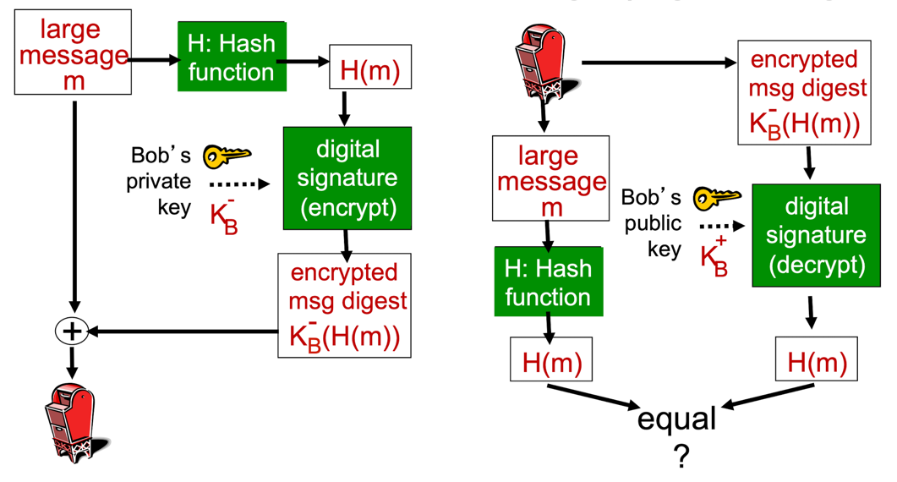

## 암호화 해시 함수(Cryptographic Hash Function)
- `H(x) = H(y)`가 되는 서로 다른 두 메시지 x와 y를 찾는 일이 산술적으로 실행 불가능함
  - 침입자가 해시 함수에 의해 보호되는 어떤 메시지를 대신할 다른 메시지를 찾아내는 일이 실행 불가능한 정도의 계산을 요하는 일이어야 함
- 론 리베스트의 MD5 해시 알고리즘의 128비트 해시 계산 과정
  1. **덧붙이는 단계(padding step)**   
     하나의 '1'을 메시지 뒤에 붙이고 충분히 많은 '0'을 뒤에 덧붙여서 메시지 길이가 단위 길이 조건을 만족시키게 함
  2. **추가 단계(append step)**   
     덧붙이기 전 메시지 길이를 64비트로 표현하여 추가함
  3. **버퍼 초기화 단계 (initialize MD buffer step)**   
     MD5 알고리즘은 네 개의 32비트 레지스터 A, B, C, D로 구성된 초기화된 버퍼를 사용함.    
     각 버퍼는 특정 초기값으로 설정되며, 메시지 블록 처리를 통해 변경됨
  4. **메시지 처리 단계 (process message step)**
     메시지는 512비트 블록 단위로 처리됨.      
     각 블록은 16개의 32비트 워드로 나뉘고, 이 워드들이 여러 번의 해싱 라운드를 거침.   
     각 라운드는 비트 연산, 덧셈, 상수값 사용 등을 통해 버퍼 값을 갱신하며, 총 64라운드가 수행됨   
     최종적으로 갱신된 A, B, C, D 값을 결합하여 128비트 해시 값을 생성함

## 인증(Authentication)
### Protocol ap1.0

- 송신자는 단순히 자신의 이름만을 전달하는 방식
- 네트워크에서 송신자는 수신자를 볼 수 없기 때문에 침입자가 자신을 송신자라고 간단히 주장할 수 있음

### Protocol ap2.0

- 송신자는 자신의 이름과 IP 주소를 함께 전달하는 방식
- 침입자는 송신자의 IP 주소를 스푸핑해서 패킷을 쉽게 만들 수 있음

### Protocol ap3.0

- 송신자는 자신의 이름과 IP 주소, 그리고 비밀번호를 함께 전달하는 방식
- 침입자의 playback attack으로 인해 비밀번호가 탈취될 수 있음
  - **playback attack**: 통신 과정을 기록해두었다가 똑같이 따라하는 공격 방식

> #### 전송하는 비밀번호를 암호화한다면?
> 비밀번호를 암호화하더라도 침입자는 암호문을 기록 및 playback하면 끝임 

### Protocol ap4.0

- 침입자의 playback attack을 피하기 위해, **nonce**(일회용 랜덤 숫자 R)를 사용하는 방식
- 수신자는 메시지를 수신하면 R을 전달하고, 송신자는 사전에 공유된 비밀키로 R을 암호화하여 전달함
- 둘 사이에 비밀키 공유가 필요함

### Protocol ap5.0

- nonce를 공개키 암호화하는 방식
- 송신자는 자신의 비밀키로 R을 암호화하여 전달하고, 수신자는 송신자에게서 공개키를 얻어 복호화함
- 하지만 수신자 입장에서 얻은 공개키가 정말로 송신자의 것인지 알 방법이 없음

    
  
  - 이러한 문제는 인증 기관의 비밀키 서명을 통해 해결 가능

## Certification Authorities(CA)
- 공개키를 특정 엔티티(사람, 라우터 등)와 연결하는 역할을 수행하는 기관
- 엔티티는 자신의 공개키를 CA에 등록하며, 이때 신원을 증명할 수 있는 정보를 제공해야 함
- CA는 해당 공개키와 엔티티를 연결하는 인증서를 생성하고, CA의 비밀키로 이 인증서에 디지털 서명함

### 공개키 요청 시 과정

- Alice가 Bob의 공개키를 원할 때, Bob 또는 다른 출처에서 Bob의 인증서를 얻음
- Alice는 CA의 공개키를 사용해 인증서를 검증하여 Bob의 공개키를 얻을 수 있음

## 전자 서명(Digital Signature)
- 메시지의 무결성을 보장하며, 법적 효력까지 발휘할 수 있는 중요한 암호화 기술
- 송신자가 문서에 전자 서명을 함으로써, 해당 문서가 본인의 소유임을 증명할 수 있음
- 서명은 검증 가능하고 위조가 불가능한 특성을 가지며, 수신자는 이를 통해 문서의 출처를 증명할 수 있음

### 과정

- 송신자는 메시지를 자신의 비밀키로 암호화하여 (수신자 입장에서 신뢰적인 메시지인지 검증하기 위해) 평문과 함께 전송함
- 수신자는 송신자로부터 서명된 메시지와 평문을 수신하면, 송신자의 공개키를 사용하여 서명을 검증함
  - 공개키 암호화된 메시지를 비밀키로 복호화한 메시지가 평문과 동일하다면, 이 메시지는 변조되지 않았음을 확인

### 메시지 다이제스트(Message Digest)

- 긴 메시지를 공개키로 암호화하는 것은 계산 비용이 매우 비싸기 때문에, 계산이 쉽고 고정된 길이의 디지털 지문을 생성함
- 해시 함수를 메시지에 적용하여 고정 크기의 메시지 다이제스트를 얻으며, 이 다이제스트는 원본 메시지를 대표하는 고유한 지문 역할을 수행함
