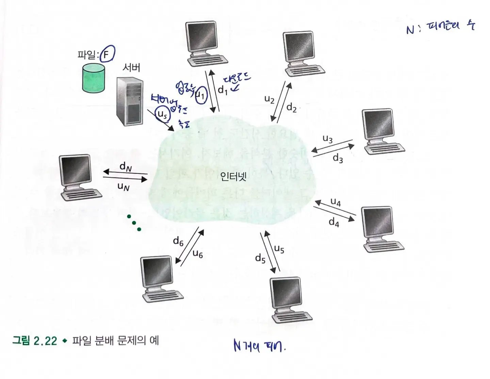
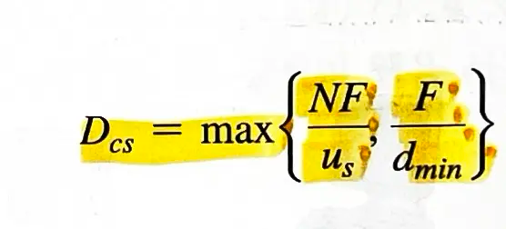
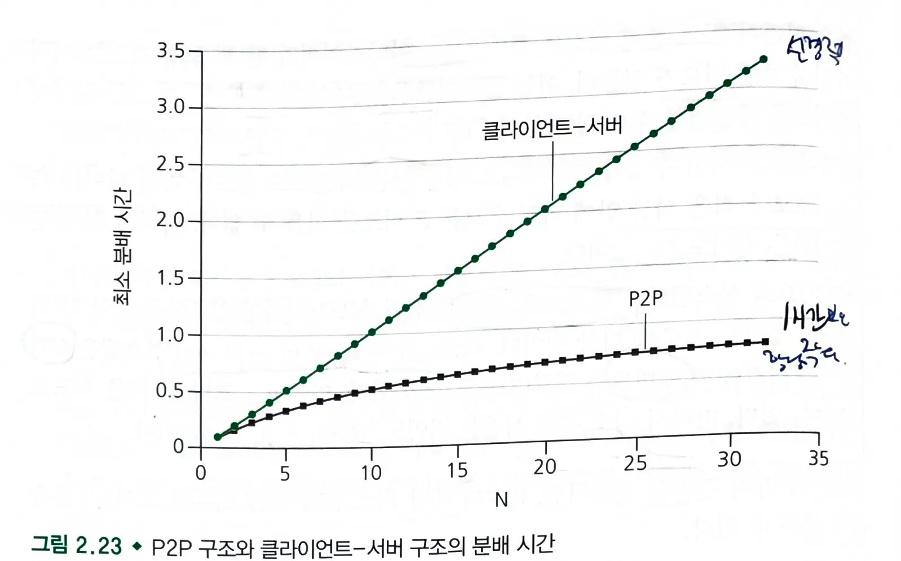
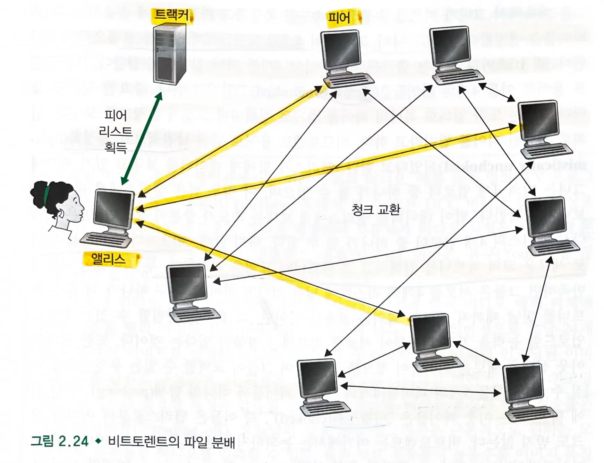

# 2.5. P2P 파일 분배

- **P2P** 구조 : 항상 켜져 있는 기반구조 서버에 최소한으로 의존한다.
- 간헐적으로 연결되는 **호스트 쌍들(피어)가 서로 직접 통신**한다.
    - 피어 : 사용자가 제어하는 데스크톱과 랩톱이 소유 (서비스 제공자 X)
- P2P 애플리케이션: 커다란 파일을 한 서버에서 다수의 호스트로 분배한다.
    - 각 피어는 수신한 파일의 임의의 부분을 다른 피어들에게 재분배할 수 있어서 서버의 분배 프로세스를 도운다.
  > 클라이언트-서버의 경우 서버는 파일 복사본을 각 피어들에게 보내야 한다.
    - ex) 비트토렌트

## P2P 구조의 확장성

### 분배 시간 구하기

- 분배시간 : 모든 N개의 피어들이 파이라의 복사본을 얻는 데 걸리는 시간
- 클라이언트 - 서버
  
- NF/us : N개의 피어에게 파일 복사본 전송
- F/d(min) : 피어가 파일의 모든 F 비트를 얻는 시간

- P2P 구조
  
- 한 피어가 파일 데이터 일부를 수신할 때, 피어는 자신의 업로드 용량을 그 데이터를 다른 피어들에게 재분배하는데 이용할 수 있다.
- F/us : 서버가 한 피어에게 파일 전송하는 시간
    - 피어들이 그들 사이에 비트를 재분배할 수 있으므로 서버는 한번만 보내면 된다.
- F/d(min) : 피어가 파일의 모든 F 비트를 얻는 시간
- NF/us + (u1+u2...+un) : N개의 피어에게 보낼 N개의 파일을 전체 업로드 용량(서버+피어 업로드 속도)으로 나눈 것

### 클라이언트-서버 vs P2P 분배 시간

- 클라이언트-서버의 경우 피어의 수가 증가함에 따라 **분배 시간이 선형적으로 증가**한다.
- P2P 구조의 경우 최소 분배 시간이 클라이언트-서버 구조의 분배 시간보다 항상 작지는 않다.
    - 임의의 피어 숙 N **(모든 N)에 대해서 한 시간보다 작다.**

## 비트토렌트

- 파일 분배를 위한 인기있는 P2P 프로토콜
- **토렌트** : **특정 파일 분배에 참여하는 모든 피어들의 모임**
    - 토렌트에 참여하는 피어들은 서로에게서 같은 크기의 청크(chunk)를 다운로드한다.
    - 피어가 청크를 다운로드할 때, 피어는 또한 청크를 다른 피어들에게 업로드한다.
    - 파일을 얻고 떠나거나. 토렌트에 남아 다른 피어들에게 청크를 업로드해 줄 수도 있다.
- 트랙커 : 토렌트에 참여하는 피어들 추적

1. 새로운 피어(앨리스)가 참여하면 트랙커는 참여하고 있는 피어 집합에서 임의로 피어들의 부분 집합을 선택하여 50개 피어들의 IP 주소를 앨리스에게 보낸다.
2. 앨리스는 이 리스트에 있는 모든 피어들과 동시에 TCP 연결을 시작한다. (연결된 피어들을 이웃 피어라고 부른다.)
3. 주기적으로 앨리스는 이웃 피어들 각각에게 그들이 갖고 있는 청크 리스트를 요구한다. 이를 바탕으로 지금 갖고 있지 않은 청크를 해당 이웃에게 요구한다.

### 어느 청크를 먼저 요구할 것인가?

- **가장 드문 것** 먼저 요구한다.
- 이웃들 중에 가장 적은 반복 복사본을 가진 청크를 결정하고, 드문 청크를 먼저 요구한다.
- 가장 드문 청크들은 더 빨리 재분배될 수 있다.

### 어느 피어에게 청크를 요청할 것인가? = 현명한 교역

- 앨리스가 **가장 빠른 속도로 데이터를 제공하는 이웃에게 우선순위**를 준다.
- **10초**마다 각 이웃에 대해 비트 수신 속도를 측정하고 가장 빠르게 전송하는 4개의 상위 피어를 결정한다.
    - **4개의 상위 피어는** **활성화**되었다고 하며, 앨리스는 4개의 피어에게 청크를 보냄으로써 보답한다.
- **30초**마다 임의로 하나의 피어를 추가로 선택하여 청크를 보낸다.
    - **낙관적으로 활성화**되었다고 한다.
    - 밥이 선정되었을때 앨리스는 밥에게 청크를 보내기 시작하고, 앨리스가 밥의 4개 업로드가 된다면 밥도 앨리스에게 청크를 보내기 시작한다.
    - 30초마다 새로운 교역 파트너를 선택한다.
- **5개의 피어(상위 4개 피어 + 탐색 피어)** 를 제외한 피어들은 비활성화되었으며 앨리스로부터 어떠한 청크도 받지 않는다.
- 교역을 위한 보상 방식을 TFT(tit for tat)이라고 부른다.
