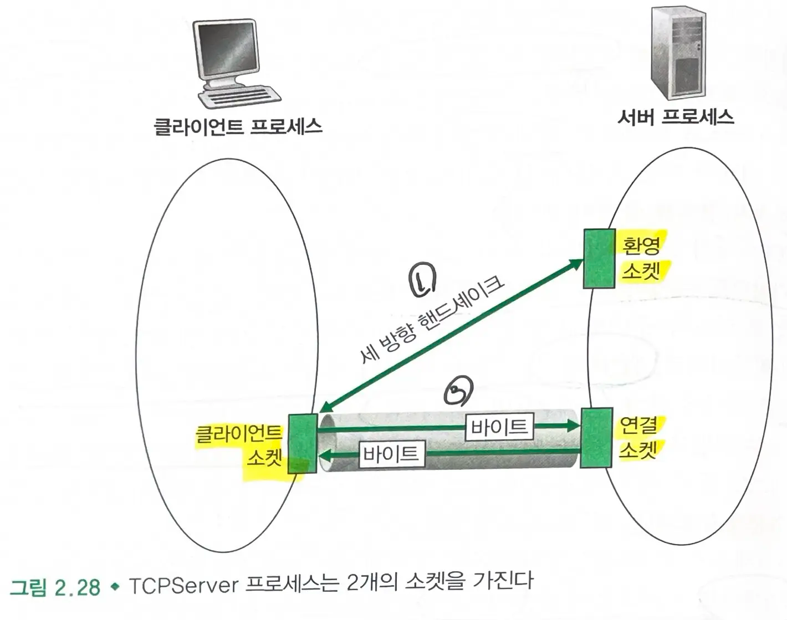

# 2.7. 소켓 프로그래밍 - 네트워크 애플리케이션 생성

### 네트워크 애플리케이션

- 2개의 **서로 다른 종단 시스템**에 존재하는 **클라이언트 프로그램**과 **서버 프로그램**으로 구성된다.
    1. 클라이언트와 서버 프로세스가 생성된다.
    2. 두 프로세스가 소켓으로부터 읽고, 쓰기를 통해 서로 통신한다.
- 두가지 형태가 있다.
    1. **RFC에 정의된 표준 프로토콜을 구현**하는 클라이언트-서버 애플리케이션
        - **개방형**
            - 클라이언트와 서버는 RFC에 정의된 규칙을 따라야 한다.
            - 잘 알려진 포트를 사용한다.
    2. **개인의 독점적인 네트워크 애플리케이션**
        - RFC 또는 다른 곳에 공식적으로 출판되지 않은 애플리케이션 계층 프로토콜을 채택한다.
            - 다른 독립 개발자는 이 애플리케이션과 상호작용하는 코드를 개발할 수 없다.
            - 잘 알려지지 않은 포트를 사용한다.
- **TCP**를 이용할 것인지, **UDP**를 이용할 것인지 선택해야 한다.
    - TCP : 연결지향형 서비스, 신뢰적 바이트 스트림 채널 제공
    - UDP : 비연결형, 전송에 대한 보장을 하지 않음

## 2.7.1. UDP를 이용한 소켓 프로그래밍

### UDP 소켓 프로그래밍

1. **목적지 주소**(Ip 주소 + 포트번호)를 붙여넣는다.
    - 한 호스트가 여러 소켓을 갖는 많은 네트워크 애플리케이션 프로세스를 실행할 수 있으므로 포트번호로 수신할 소켓을 식별한다.
2. 송신자의 **소스 주소**(ip주소 + 포트번호)는 하부 운영체제에 의해 자동으로 붙여진다.

### 클라이언트-서버 애플리케이션 (UDP)

1. 클라이언트는 서버에게 키보드로 읽은 한 줄의 문자를 보낸다.
2. 서버는 데이터를 수신하고 대문자로 바꾸어 클라이언트에게 보낸다(응답한다).
3. 클라이언트는 데이터를 수신하고 화면에 나타낸다.

#### UDPClient.py

```python
from socket import *

serverName = 'hostName'
serverPort = 12000

clientSocket = socket(socket.AF_INET, socket.SOCK_DGRAM)

message = raw_input('Input lowcase sentence:')
clientSocket.sendto(message (serverName, serverPort))

modifiedMessage, serverAddress = clientSocket.recv-from(2048)
print modifiedMessage

clientSocket.close()
```

```python
from socket import *
```

- socket 모듈을 import 한다.

```python
serverName = 'hostName'
serverPort = 12000
```

- serverName: 서버의 ip 주소나 호스트 이름을 제공한다.

> 호스트 이름을 사용하는 경우 ip 주소를 얻기 위해 dns 검색이 자동으로 수행된다.

- serverPort : 연결할 서버 포트를 명시한다.

```python
clientSocket = socket(socket.AF_INET, socket.SOCK_DGRAM)
```

- 하부 네트워크로 IPv4를 사용하고(`socket.AF_INET`) UDP인 소켓(`socket.SOCK_DGRAM`)을 생성한다.

> 소켓의 포트번호는 운영체제가 대신 수행한다.

```python
message = raw_input('Input lowcase sentence:')
```

- 메세지를 작성한다.

```python
clientSocket.sendto(message (serverName, serverPort))
```

- 메세지를 소켓을 통해 목적지 호스트로 보낸다.

```python
modifiedMessage, serverAddress = clientSocket.recv-from(2048)
print modifiedMessage
```

- 클라이언트 소켓에 패킷이 도착하면 메세지는 modifiedMessage에 할당되고, 소스 주소는 serverAddress에 할당된다.
- 메세지를 출력한다.

```python
clientSocket.close()
```

- 소켓을 닫으면 프로세스가 종료된다.

#### UDPServer.py

```python
from socket import *

serverPort = 12000
# 소켓 생성
serverSocket = socket(AF_INET, SOCK_DGRAM)

serverSocket.bind(('', serverPort))
print("The server is ready to receive")

while True:
	message, clientAddress = serverSocket.recvfrom(2048)
	modifiedMessage = message.decode().upper()
	serverSocket.sendto(modifiedMessage.encode(), clientAddress)
```

```python
serverSocket.bind(('', serverPort))
print("The server is ready to receive")
```

- **포트 번호 12000을 서버의 소켓에 할당**한다.
    - 서버 IP 주소의 12000번 포트로 패킷을 보내면 해당 소켓으로 패킷이 전달된다.

```python
while True:
	message, clientAddress = serverSocket.recvfrom(2048)
	modifiedMessage = message.decode().upper()
	serverSocket.sendto(modifiedMessage.encode(), clientAddress)
```

- while 루프에서 UDPServer는 패킷이 도착하기를 기다린다.
- 패킷이 서버 소켓에 도착하면 패킷 데이터는 message에 할당되고 소스 주소(ip주소 + 포트번호)는 clientAddress에 할당된다.
- 메세지를 대문자로 변경한 후 서버의 소켓에 보내면 클라이언트 주소로 패킷이 보내진다.

## 2.7.2 TCP 소켓 프로그래밍

- TCP : 연결 지향 프로토콜
    - 클라이언트와 서버가 서로에게 **데이터를 보내기 전에 먼저 TCP 연결을 설정**해야 한다.
- TCP 연결 생성시 클라이언트 소켓 주소(ip주소 +포트번호)와 서버 소켓 주소(ip주소+포트번호)를 연결과 연관시킨다.

### TCP vs UDP

- **TCP 연결이 설정**된 후 데이터를 **소켓을 통해 TCP 연결로 보낸다**.
- **UDP**에서는 **연결 과정이 없고**, **각 패킷마다 목적지 주소를 붙여야 한다.**

### 클라이언트-서버 프로그램 상호작용



0. **서버는 대기 상태**이다.
    - TCP 서버는 클라이언트가 접속을 시도하기 전에 프로세스를 먼저 수행하고 있어야 한다.
    - 서버 프로그램은 임의의 컴퓨터에서 수행되고 있는 클라이언트로부터의 초기 접속을 처리하는 **소켓**을 가져야 한다.
1. **클라이언트는 서버로의 접속을 먼저 시도**한다.
    - 클라이언트 프로그램에서 TCP 소켓을 생성할때 서버의 **환영 소켓의 주소**를 명시한다.
2. **클라이언트와 서버의 환영 소켓은 세 방향 핸드쉐이크**를 하고 **TCP 연결을 설정**한다.
    - 세 방향 핸드쉐이크 동안 서버는 해당 클라이언트에게 지정되는 **연결 소켓을 생성**한다.
3. 클라이언트와 서버의 연결 소켓은 TCP를 통해 데이터를 전달한다.

#### 환영 소켓 vs 연결 소켓

- **환영 소켓**
    - 서버와 통신하고자 하는 모든 클라이언트가 초기에 접속하는 곳
    - 새로운 연결 요청을 받기만 한다.
- **연결 소켓**
    - 클라이언트와 통신하기 위해 서버 쪽에 새롭게 생성되어 클라이언트에게 지정된다.
    - 클라이언트와 서버의 연결 소켓은 **TCP 연결**이 형성된다.
    - tcp에 의해 보낸 데이터가 순서를 지켜 전송된다. (TCP의 신뢰적 서비스)

#### TCPClient.py

```python
from socket import *

serverName = 'servername'
serverPort = 12000

clientSocket = socket(AF_INET, SOCK_STREAM)

# TCP 연결
clientSocket.connect((serverName, serverPort))
# 메세지 읽어서 서버로 전송
sentence = raw_input('Input lowercase sentence:')
clientSocket.send(sentence.encode())
# 메세지 수신 후 출력
modifiedSentence = clientSocket.recv(1024)
print('From server:', modifiedSentence.decode())

clientSocket.close()
```

```python
clientSocket = socket(AF_INET, SOCK_STREAM)
```

- 하위 네트워크가 **IPv4인 TCP 소켓을 생성**한다.

```python
clientSocket.connect((serverName, serverPort))
```

- **클라이언트와 서버 사이에 TCP 연결을 설정한다.**

```python
clientSocket.send(sentence.encode())
```

- 메세지를 전송한다.
- TCP 연결을 통해 보내므로 목적지 주소는 명시하지 않는다.

```python
modifiedSentence = clientSocket.recv(1024)
```

- 메세지를 수신한다.

#### TCPServer.py

```python
from socket import *

serverPort = 12000
# TCP 소켓 생성
serverSocket = socket(AF_INET, SOCK_STREAM)

serverSocket.bind(('', serverPort))
serverSocket.listen(1)
print('The server is ready to recieve')

while True:
	connectionSocket, addr = serverSocket.accept()
	sentence = connectionSocket.recv(1024).decode()
	capitalizedSentence = sentence.upper()
	connectionSocket.send(capitalizedSentence.encode())
	connectionSocket.close()
```

> serverSocket : 환영 소켓
> connectionSocket : 연결 소켓

```python
serverSocket.bind(('', serverPort))
serverSocket.listen(1)
```

- 서버 포트번호 12000을 소켓과 연관 시킨 뒤 **대기한다(listen)**

```python
connectionSocket, addr = serverSocket.accept()
```

- 클라이언트가 연결을 시도하면, **환영 소켓(serverSocket)이 연결을 받아들인다.**
- 서버는 이 클라이언트를 위한 **연결 소켓을 생성**한다.
- 핸드쉐이킹을 완료하고 **서버와 연결 소켓 사이에 TCP 연결을 생성**한다.

> 클라이언트 -> 환영 소켓 : SYN // 서버는 해당 클라이언트의 연결을 담당할 연결 소켓 생성
> 연결 소켓 -> 클라이언트 : SYN-ACK
> 클라이언트 -> 연결 소켓 : ACK // 핸드쉐이크 완료, **클라이언트 - 연결 소켓 사이 TCP 연결 설정**

```python
	sentence = connectionSocket.recv(1024).decode()
	capitalizedSentence = sentence.upper()
	connectionSocket.send(capitalizedSentence.encode())
```

- TCP 연결을 통해 연결 소켓으로 온 메세지를 수신한다.
- 대문자로 바꾼 후 전송한다.

```python
	connectionSocket.close()
```

- 해당 클라이언트에게 지정된 연결 소켓은 닫는다.
- 서버의 환영 소켓은 언제든 열려있으므로 클라이언트는 언제든 접속이 가능하다.
