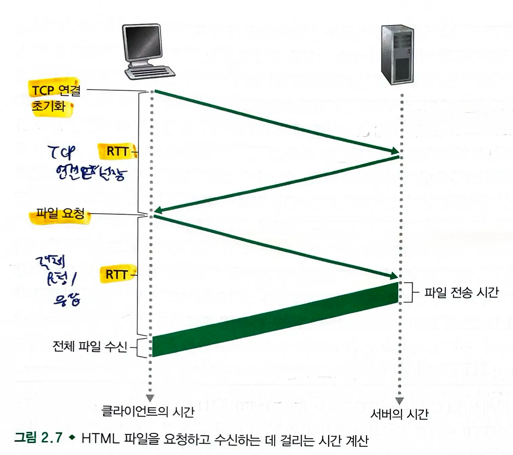
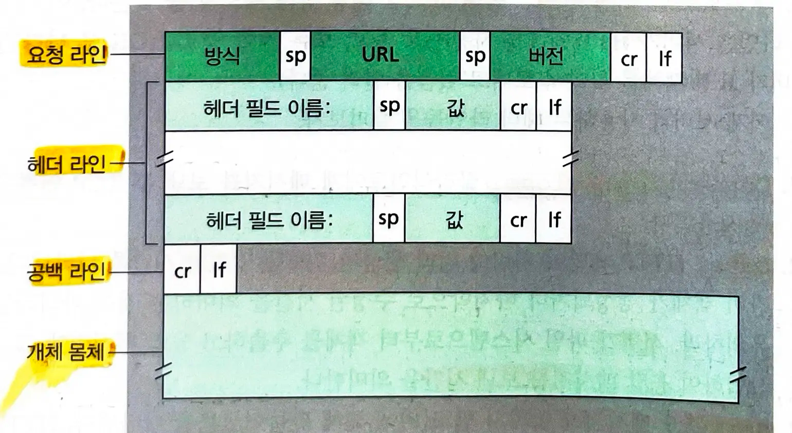
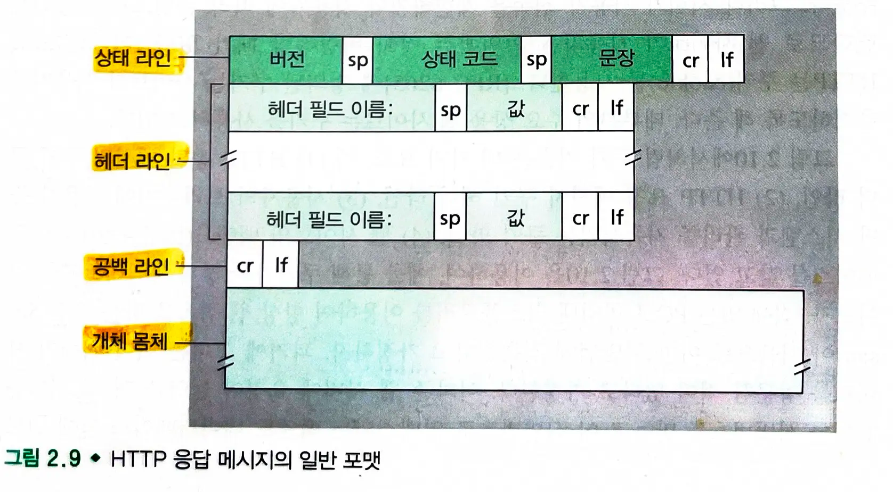

# 2.2. 웹과 HTTP

- 1990년대 초 월드와이드웹이 등장했다.
- 웹은 일반 대중의 눈길을 끈 인터넷 애플리케이션이다.
    - 온-디맨드 방식으로 동작한다. (원할때 원하는 것을 수신한다.)
    - 모든 사람이 매우 낮은 비용으로 발행자가 될 수 있다.

## 2.2.1 HTTP(HyperText Transfer Protocol) 개요

- **HTTP: 웹의 애플리케이션 계층 프로토콜**
    - **클라이언트** 프로그램과 서버 **프로그램으로** 구성된다.
        - 클라이언트와 서버는 서로 HTTP 메세지를 교환하여 통신한다.
- HTTP는 메세지의 구조 및 클라이언트와 서버가 메세지를 어떻게 구현하는지 정의한다.
    - **웹 클라이언트가 웹 서버에게 웹 페이지를 어떻게 요청하는지**와 **서버가 클라이언트로 어떻게 웹 페이지를 전송하는지**를 정의한다.

### 웹 페이지

- **객체**(object)로 구성된다.
    - 객체 : 단순히 단일 url로 지정할 수 있는 하나의 파일(html, jpeg, gif)
- 대부분의 웹 페이지는 **기본 html 파일과 여러 참조 객체(파일들)로 구성**된다.
    - 기본 html 파일은 페이지 내부의 다른 객체를 **그 객체의 url로 참조**한다.
        - url : 서버의 호스트 네임 + 객체의 경로 이름
- **웹 브라우저** (HTTP 상의 클라이언트)
    - 요구한 웹 페이지를 보여주고 여러가지 인터넷 항해와 구성 특성을 제공한다.
- **웹 서버**
    - url로 각각을 지정할 수 있는 웹 객체를 갖고 있다.
    - ex) apache, IIS

### HTTP는 TCP를 전송 프로토콜로 사용한다.

-
    1. HTTP 클라이언트는 **TCP 연결**을 시작한다.
-
    2. 브라우저와 서버 프로세스는 **각 소켓 인터페이스**를 통해 TCP로 접속한다.

    - 클라이언트: **클라이언트 프로세스와 TCP 연결** 사이의 출입구
    - 서버: **서버 프로세스와 TCP 연결** 사이의 출입구
-
    3. 클라이언트: HTTP 요청 매세지를 소켓 인터페이스로 보내고 소켓 인터페이스로부터 HTTP 응답 메세지를 받는다.
       서버: 소켓 인터페이스로부터 욫어 메세질르 받고 응답 메세지를 소켓 인터페이스로 보낸다.

### HTTP는 비상태 프로토콜이다.

- 서버가 클라이언트에게 요청 파일을 보낼 때, 서버는 클라이언트에 관한 어떠한 상태 정보도 저장하지 않는다.
- **HTTP 서버는 클라이언트에 대한 정보를 유지하지 않는다.**

## 2.2.2 비지속 연결과 지속 연결

- 클라이언트와 서버는 상당 기간동안 통신한다.
    - 클라이언트-서버 상호작용이 TCP에서 발생할때, 각 요구-응답 쌍이 분리된 TCP 연결을 통해 보내져야하는가? = **비지속 연결**
    - 각 요구/응답 쌍이 분리된 TCP 연결을 통해 보내져야 하는가? = **지속 연결**
- HTTP의 기본 모드는 지속 연결이다.

### 비지속 연결 HTTP

- 각 TCP 연결은 하나의 요청 메세지와 하나의 응답 메세지만 전송한다.
- 페이지가 기본 html 파일과 10개의 jpeg 이미지로 구성되고, 이 11개의 객체가 같은 서버에 있다고 가정한다.

-
    1. HTTP 클라이언트는 HTTP의 기본 포트 번호 80을 통해 **TCP 연결**을 시도한다.
-
    2. HTTP 클라이언트는 TCP 연결 소켓을 통해 서버로 **HTTP 요청 메세지**를 보낸다.
-
    3. HTTP 서버는 저장장치로부터 **요청 url의 객체를 추출**하고 **응답 메세지에 캡슐화**하여 **TCP 연결 소켓을 통해 보낸다**.
-
    4. HTTP 서버는 TCP에게 TCP 연결을 끊으라고 한다. (실제로는 클라이언트가 응답 메세지를 올바르게 받을 때까지 연결을 끊지 않는다.)
-
    5. 클라이언트가 응답 메세지를 받으면, **TCP 연결이 중단**된다. 클라이언트는 응답 메세지로부터 파일을 추출하고 html 파일을 조사하고 10개의 jpeg 객체에 대한 참조를 찾는다.
-
    6. 그 이후에 참조되는 **각 jpeg 객체에 대해 처음 4개의 단계를 반복**한다.

    - 10개의 이미지에 대한 참조를 발견하였으므로, 각 이미지에 대해 새로운 TCP 연결 및 HTTP 요청을 하고 응답을 받아야한다.
    - 비효율적이므로 HTTP의 기본 모드는 지속 연결이다.

#### 동시성 정도

- 이미지를 얻을때 10개의 TCP 연결이 순차적일지 병렬(동시)일지 조정할 수 있다.
    - 기본 모드에서 대부분의 브라우저는 5~10개의 TCP 연결을 동시에 설정하고 각 연결은 하나의 요청/응답 처리를 담당한다.
    - 동시 연결을 사용하면 응답 시간을 줄일 수 있다.

#### 요청-응답 시간

- **RTT**(round trip time): 패킷이 클라이언트로부터 서버까지 가고, 다시 클라이언트로 되돌아오는 데 걸리는 시간
- TCP 연결은 **세 방향 핸드쉐이킹**을 포함한다.
    - 총 시간: **TCP 연결 설정(RTT) + 객체 요청/응답(RTT) + 파일 전송 시간**
    - HTTP 요청 메세지(파일 요청)을 두번째 RTT에서 수행하면서 핸드쉐이크 세번째 부분(응답)을 함께 보낸다.

#### 비지속 연결의 단점

- 각 요청 객체에 대한 새로운 연결이 설정되고 유지되어야한다.
    - TCP 버퍼가 할당되어야하고 TCP 변수들이 클라이언트와 서버 양쪽에 유지되어야 한다.
- 각 객체는 2 RTT를 필요로 한다.

### 지속 연결 HTTP

- **HTTP 1.1 지속 연결**에서 **서버는 응답을 보낸 후에 TCP 연결을 그대로 유지**한다.
    - 같은 클라이언트와 서버 간의 이후 요청과 응답은 같은 연결을 통해 보내진다.
    - **전체 웹 페이지(기본 html + 10개의 이미지)를 하나의 지속 TCP 연결을 통해 보낼 수 있다.**
    - 같은 서버에 있는 여러 웹 페이지들을 하나의 지속 TCP 연결을 통해 보낼 수 있다.
    - 이들 객체에 대한 요구는 **진행중인 요구에 대한 응답을 기다리지 않고 연속해서 만들어질 수 있다**. (파이프라이닝)
- HTTP의 기본 모드는 파이프라이닝을 이용한 지속 연결이다.
- **HTTP/2** : 같은 연결상에서 다중 요청과 응답이 가능하고 이 연결 내에서 HTTP 메세지 요청과 응답의 우선순위 기법이 가능하도록 HTTP 1.1 기반으로 제안

## 2.2.3 HTTP 메세지 포맷

### HTTP 요청 메세지

- 메세지는 ASCII 타입으로 작성된다.
- 각 중은 cr, lf(\n)으로 구별되고 마지막 줄에 이어서 추가 cr과 lf가 따른다.
- http 요청 메세지의 첫 줄은 요청 라인이라 부르고, 이 후 줄들은 헤더 라인이라고 부른다.
    - 요청 라인 : method + url + http 버전
    - 헤더 라인
        - Host : 객체가 존재하는 호스트, 웹 프록시 캐시에서 필요하다.
        - Connection: close : 지속 연결 사용을 원하지 않는다는 것을 이야기한다.
        - User-agent: 서버에게 요청을 하는 브라우저 타입
            - 서버가 같은 객체에 대한 다른 버전을 다른 타입의 사용자 에이전트에게 보낼 수 있다.
        - Accept-language: 같은 객체에 대한 언어 버전 선택
- 개체 몸체: 헤더 라인의 cr, lf 이후에 존재하며 post 방식에서 사용된다.

> 폼으로 생성된 요구가 반드시 psot 방식일 필요는 없다. get 요청 + query parameter로 가능하다.

### HTTP 응답 메세지

- **상태 라인**
    - **버전 + 상태 코드 + 상태 메세지**
        - 200 OK : 요청 성공, 응답이 보내졌다.
        - 301 Moved Permanently : 요청 객체가 영원히 이동되었고 새로운 url은 응답 메세지의 location: 헤더에 나와있다.
        - 400 Bad Request : 서버가 요청을 이해할 수 없다.
        - 404 Not Found: 요청 문서가 서버에 존재하지 않는다.
        - 500 Http Version Not Supported : 요청 http 프로토콜 버전을 서버가 지원하지 않는다.
- **헤더 라인**
    - **Connection**:close : 클라이언트에 메세지를 보낸 후 TCP 연결을 닫는다.
    - **Date**: Http 응답이 서버에 의해 생성되고 보낸 날짜와 시간
        - 객체가 생성되거나 마지막으로 수정된 시간을 의미하는 것은 아니다.
    - **Server**: Apache/2.2.3 메세지가 아파치 웹 서버에 의해 만들어졌음을 나타낸다.
    - **Last-Modified**: 객체가 생성되거나 마지막으로 수정된 시간과 날짜, 객체 캐싱에 매우 중요하다.
    - **Content-Length** : 송신되는 객체의 바이트 수
    - **Content-Type:** text/html 개체 몸체 내부의 객체가 HTML 텍스트임을 나타낸다.

## 2.2.4 사용자와 서버 간의 상호작용: 쿠키

- HTTP 서버는 상태를 유지하지 않는다. 하지만 서버가 사용자에 따라 콘텐츠를 제공하길 원하므로 **웹 사이트가 사용자를 확인**하는 것이 바람직할 때가 있다.
- 쿠키 : **사용자 식별**에 사용한다.
    - HTTP 응답 메세지 쿠키 헤더 라인
    - HTTP 요청 메세지 쿠키 헤더 라인
    - 사용자의 브라우저에 사용자 중단 시스템과 관리를 지속시키는 쿠키 파일
    - 웹 사이트의 백엔드 데이터베이스
- 쿠키는 stateless http에서 사용자 세션 계층을 생성하는데 이용될 수 있다.

### 쿠키 동작 과정

![[2.2. 웹과 HTTP-20240724210451860.webp|568]]

1. 웹 서버에 요청이 들어올 때 서버는 **유일한 식별번호**를 만들고 **백엔드 데이터베이스 안에 엔트리를 만든다**.
2. 웹 서버는 브라우저에 응답하면서 **set-cookie 헤더로 식별 번호**를 보낸다.
3. 브라우저가 응답 메세지를 받고 나서 관리하는 특정 쿠키 파일에 해당 쿠키를 덧붙인다.
    1. 호스트 네임 + 식별 번호
4. 브라우저는 웹 요청을 보낼때마다 식별번호를 포함하는 쿠키 헤더 파일을 넣는다.

> 해당 유저가 회원가입을 한다면 식별 번호와 연관된 모든 정보를 유저와 연관시킨다.

## 2.2.5 웹 캐싱

- 웹 캐시 = 프록시 서버
    - 원출처의 웹 서버를 대신하여 HTTP 요구를 충족시키는 네트워크 개체
    - 자체 저장 디스크를 가지고 있어 최그 ㄴ호출된 객체의 사본을 저장 및 보존한다.
- 브라우저는 사용자의 모든 HTTP 요구가 웹 캐시에 가장 먼저 보내지도록 구성한다.

### 웹 캐시 동작 과정

1. **브라우저는 웹 캐시와 TCP 연결을 설정**하고 웹 캐시에 있는 객체에 대한 **HTTP 요청**을 보낸다.
2. 웹 캐시는 객체의 사본이 자신에게 저장되어있는지 확인한다.
    1. **만약 저장되어 있다면 조건부 GET을 수행하여 최신 데이터일 경우 응답 메세지에 객체를 함께 전송한다.**
    2. 저장되어있지 않다면
        1. **캐시는 원 출처 서버로 TCP 연결**을 설정하여 **HTTP 요청**을 보내고 응답을 받는다.
        2. 캐시는 **응답 객체를 지역 저장 장치에 복사**하고 **클라이언트 브라우저에 응답 메세지와 함께 객체의 사본을 보낸다**.

### 웹 캐시의 장점

1. 웹 캐시는 클라이언트 요구에 대한 응답 시간을 줄일 수 있다.
2. 웹 캐시는 링크상의 웹 트래픽을 대폭으로 줄일 수 있다.

> 또한 인터넷 전체의 웹 트래픽을 실질적으로 줄일 수 있다.
> CDN(콘텐츠 전송 네트워크)는 많은 지역적으로 분산된 캐시를 설치하며 이를 통해 많은 트래픽을 지역화하고 있다.

### 조건부 GET

- 모든 객체들이 최신의 것임을 확인하면서 캐싱하는 방식
    -
        1. GET 방식을 사용
    -
        2. If-Modified-Since 헤더라인을 포함한다.

#### 조건부 GET 동작 방식

- **캐싱되지 않은 데이터를 요청할때** (브라우저<->캐시<->서버)

1. **브라우저는 캐시**와 TCP 연결을 설정하고 HTTP 요청을 보낸다.
2. 객체가 캐시에 없으므로 브라우저 요청을 대신해 프록시 캐**시는 요청 메세지를 서버**로 보낸다.
3. 웹 서버는 캐시에게 객체를 가진 응답 메세지를 보낸다.
4. 캐시는 요청하는 브라우저에게 객체를 보내 주고 자신에게도 객체를 저장한다. 또한 **Last-Modified-At**(마지막으로 수정한 날짜)를 저장한다.

- **캐싱된 데이터를 요청할때** (브라우저 <-> 서버)

1. 브라우저는 로컬 캐시를 확인하고 유효하지 않을 경우(유효기간 만료) **조건부 GET으로 갱신 조사를 시작**한다. (**if-modified-since**: 마지막으로 갱신된 날짜)
    1. 서버에게 그 객체가 명시된 날짜 이후 수정된 경우에만 그 객체를 보낼 것을 말한다.
2. 변경되지 않았을 경우 **304 Not Modified**를 보내고 객체를 보내지 않는다. 브라우저는 캐시에서 값을 꺼내 사용한다.
   (변경되었을 경우 **200 OK**와 함께 새로운 객체를 보내고, 브라우저는 새 객체로 캐시를 업데이트하고 Last-Modified-At 값을 저장한다.

> 변경되지 않을 경우 객체를 포함하지 않음으로써 대역폭을 줄일 수 있다.
