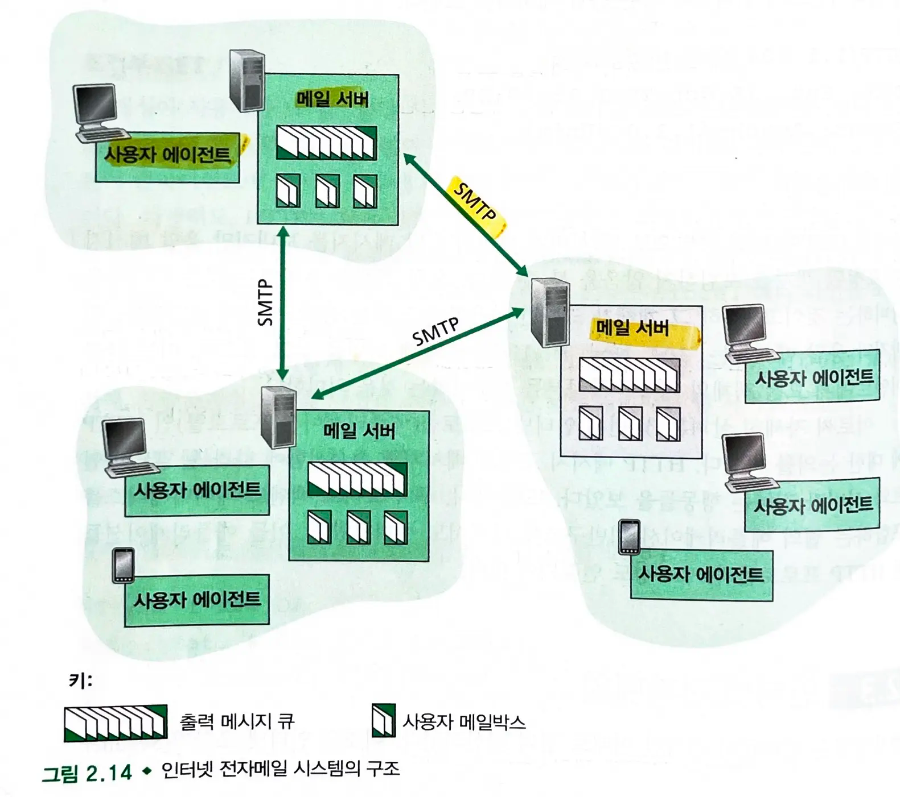
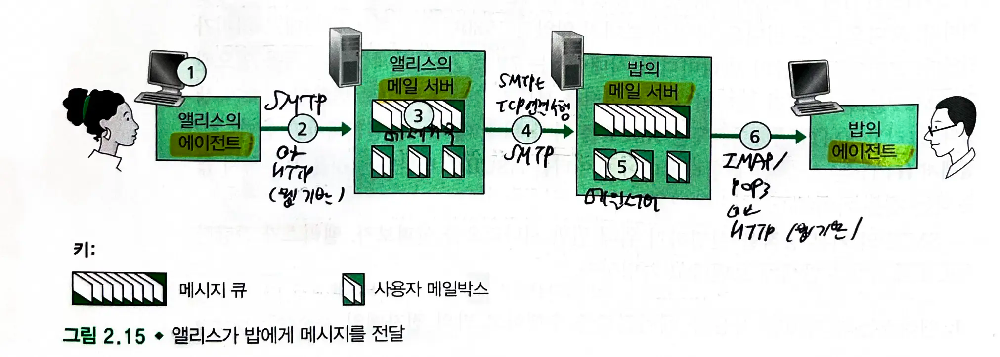

# 2.3. 인터넷 전자메일
- 전자메일은 비동기적인 통신 매체이다.
    - 분배가 쉽고, 빠르고 저렴하다.

### 인터넷 전자메일 시스템의 구조

- **사용자 에이전트**, **메일 서버**, **SMTP** 3가지 요소로 구성된다.
- **사용자 에이전트** : 사용자가 메세지를 읽고, 응답하고 전달하고 저장하고 구성하게 해준다.
- **메일 서버** : 메일 박스를 가진다.
    - 메일 박스 : 사용자에게 온 메세지를 유지하고 관리한다.
- 동작 과정
    1. 송신자의 **사용자 에이전트**에서 송신자의 메일 서버로 메세지를 전달한다. 메세지는 **메세지 큐**에 놓인다.
    2. 송신자의 **메일 서버**에서 수신자의 **메일 서버**로 메세지를 전달한다.
        1. 수신자의 메일 서버로 메세지를 전달할 수 없다면 메세지 큐에 저장했다가 30분 뒤 재시도한다.
        2. 계속 성공하지 못할 경우 메세지를 제거하고 송신자에게 알린다.
    3. 수신자의 **메일 박스**에 저장된다.
    4. 수신자가 메일 박스에 있는 메세지를 보려면 사용자 계정과 비밀번호를 이용하여 **인증**해야한다.

### SMTP
- **인터넷 전자메일을 위한 애플리케이션 계층 프로토콜**
- **TCP**를 통해 **송신자의 메일 서버**로부터 **수신자의 메일 서버**로 메세지를 전송한다.
- 클라이언트 : 송신자 메일 서버, 서버: 수신자 메일 서버

## 2.3.1 SMTP
- HTTP보다 훨씬 오래되었다.
- 모든 메일 메세지의 body(헤더 포함)는 7비트 ASCII이어야 한다.

### 송신자의 에이전트 -> 송신자의 메일 서버
- **송신자 에이전트**는 **송신자 메일 서버**로 메세지를 보낼때 SMTP를 사용한다.
- 바로 수신자의 메일 서버로 보내지 않고 송신자의 메일 서버에 메세지를 보내는 이유 (**송신자 메일 서버 존재 이유**)
    - 송신자의 PC는 송신자에게 오는 메세지를 받기 위해 **항상 켜져있어야한다**. 이는 비현실적이다.
    - 송신자의 에이전트는 로컬 PC에서 수행하고, 메일 서버는 전통적으로 사용자들과 **공유**하고 **ISP들이 관리**한다.

### 송신자의 메일서버 -> 수신자의 메일 서버
- **송신자의 메일 서버(SMTP 클라이언트)** 는 **수신자의 메일 서버(STMP 서버)** 에게 **TCP 연결**을 설정한다.
- 초기 **SMTP 핸드쉐이킹** 이후에 메세지를 수신자의 **메일 서버**에 보낸다.
    - 핸드쉐이킹시 송신자의 전자메일 주소와 수신자의 전자메일 주소를 제공한다.
    - HELO, MAIL FROM, RCPT TO, DATA , QUIT을 보내며 내용은 DATA로 보내고 .으로 마무리한다.
- 수신자의 메일 서버는 메세지를 수신하고 **메일 박스**에 저장한다.
- 수신자는 편한 시간에 메세지를 읽기 위해 **사용자 에이전트를 시동**한다.
> 중간 메일 서버를 사용하지 않는다.

### STMP는 지속 연결을 사용한다.
- 송신 메일 서버가 같은 수신 메일 서버로 보내는 여러 메세지를 갖고 있다면 같은 TCP 연결을 통해서 모든 메세지를 전달할 수 있다.
## 2.3.2 HTTP와의 비교
### STMP와 HTTP의 공통점
- 한 호스트에서 다른 호스트로 파일을 **전송하는데** 사용한다.
    - HTTP: 웹 서버에서 웹 클라이언트로 파일(혹은 객체) 전송
    - SMTP: 한 메일 서버로부터 다른 메일 서버로 파일 전송
- 둘 다 **지속 연결**을 사용한다.

### SMTP와 HTTP의 차이점
1. HTTP는 **pull 프로토콜**이지만, SMTP는 **push 프로토콜**이다.
    - **HTTP**: TCP 연결은 파일을 **수신**할 컴퓨터가 먼저 초기화한다.
    - **SMTP**: TCP 연결은 파일을 **송신**할 컴퓨터가 먼저 초기화한다.
2. SMTP는 각 메세지의 몸체를 포함하여 각 메세지가 **7비트 ASCII 포맷**이어야한다. (인코딩 필요)
    - HTTP 데이터는 이러한 제한이 없다.
3. HTTP는 자신의 HTTP 응답 메세지에 **각 객체를 캡슐화**한다(개별 HTTP 응답).
    - 그러나 SMTP는 **모든 메세지의 객체를 한 메세지**로 만든다.

## 2.3.3 메일 메세지 포맷
- 헤더가 메세지 몸체 앞에 온다.
    - 여기에서 헤더는 메일 메세지 자체의 일부이다.
- 헤더와 몸체는 빈 줄(**crlf**)로 분리된다.
- 헤더에 **from**과 **to**는 반드시 가져야하고, 옵션으로 subject **헤더**를 가질 수 있다.

## 2.3.4 메일 접속 프로토콜
- 수신자는 자신의 ISP 내부에 있는 메일 서버에 있는 메세지를 어떻게 읽을 수 있을까?
    - SMTP는 push 프로토콜이므로 메세지를 수신하기 위해 pull 할 수 없다.
- 메일 접속 프로토콜인 POP3, IMAP을 사용한다.

### POP3
- 매우 간단한 메일 접속 프로토콜
    - 아주 짧고 읽기 쉽다.
- 사용자 에이전트가 메일 서버의 포트 **110**번으로 **TCP** 연결을 열 때 시작
1. **인증**
    - 사용자 이름과 비밀번호를 보낸다.
2. **트랜잭션**
    - 메세지를 가져오고 삭제를 위해 메세지에 표시하거나 그 삭제 표시를 지울 수도 있으며 메일 통계를 얻을 수도 있다.
    - 명령어: list, retr, dele, quit
    - 다운로드 후 삭제 모드와 다운로드 후 유지 모드가 존재한다.
3. **갱신**
    - 클라이언트가 POP3 세션을 끝내는 quit 명령이 내려진 후에 일어난다. 메일 서버는 삭제 표시된 메세지를 삭제한다.
> POP3 서버는 여러 상태 정보를 유지하지만 세션 사이의 상태 정보를 전달하지는 않는다.

### IMAP
- POP3는 사용자에게 **원격 폴더**를 생성하거나 폴더에 메세지를 할당하는 수단을 제공하지 않는다.
- IMAP은 위 문제를 해결하며 매우 **복잡하게 구현**된다.
- **폴더에 각 메세지를 연결한다.** (서버에서 **폴더 구조**를 만들고 관리할 수 있다.)
    - 처음 메세지가 서버에 도착하면 수신자의 INBOX 폴더와 연결된다.
    - 사용자가 폴더를 생성하고 하나의 폴더에서 다른 폴더로 메세지를 옮기는 명령을 제공한다.
    - 특정 조건에 맞는 원격 폴더를 찾는 명령도 제공한다.
    - POP3와 달리 IMAP 세션을 통해 **사용자 상태 정보를 유지**한다. (읽음 표시, 폴더 구조 여러 기기에서 **동기화**)
- 사용자 에이전트가 메세지의 구성 요소를 얻을 수 있게 허용한다.
    - 메세지의 메세지 헤더만을 얻거나 멀티파트 MIME **메세지의 일부만** 얻을 수도 있다.
### 웹 기반 전자메일
- 많은 사람들이 **웹 브라우저**를 통해 전자메일을 보내거나 받는다.
- 사용자 에이전트는 일반 **웹 브라우저**이고 사용자는 HTTP를 통해 **메일 서버**에 있는 원격 메일 박스와 통신하게 된다.
- 수신 메세지는 **HTTP** 프로토콜을 이용해 수신자의 브라우저에 전달된다.
- 그러나 여전히 **송신자의 메일 서버와 수신자의 메일 서버는 SMTP를 이용해 메세지를 전달하거나 수신**한다.
> 웹 브라우저 --(**HTTP**)-> 메일 서버 --(**SMTP**)-> 메일 서버 (수신자) --(**HTTP**)-> 웹 브라우저(수신자)

