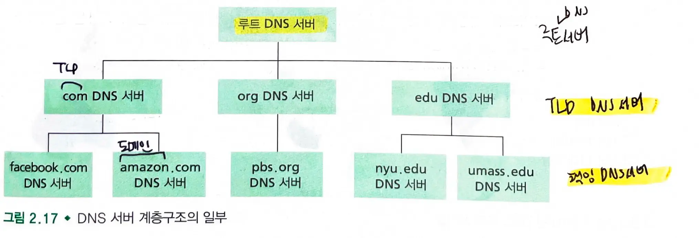
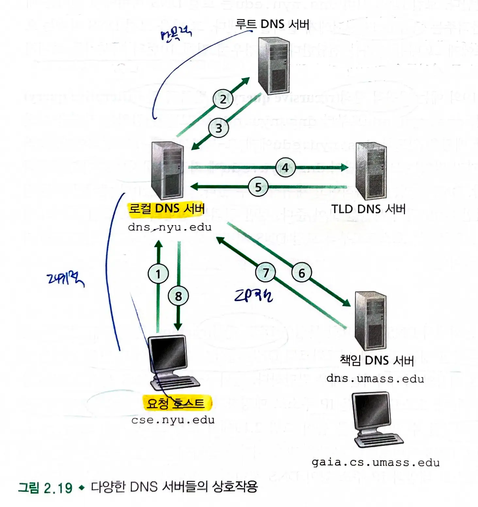
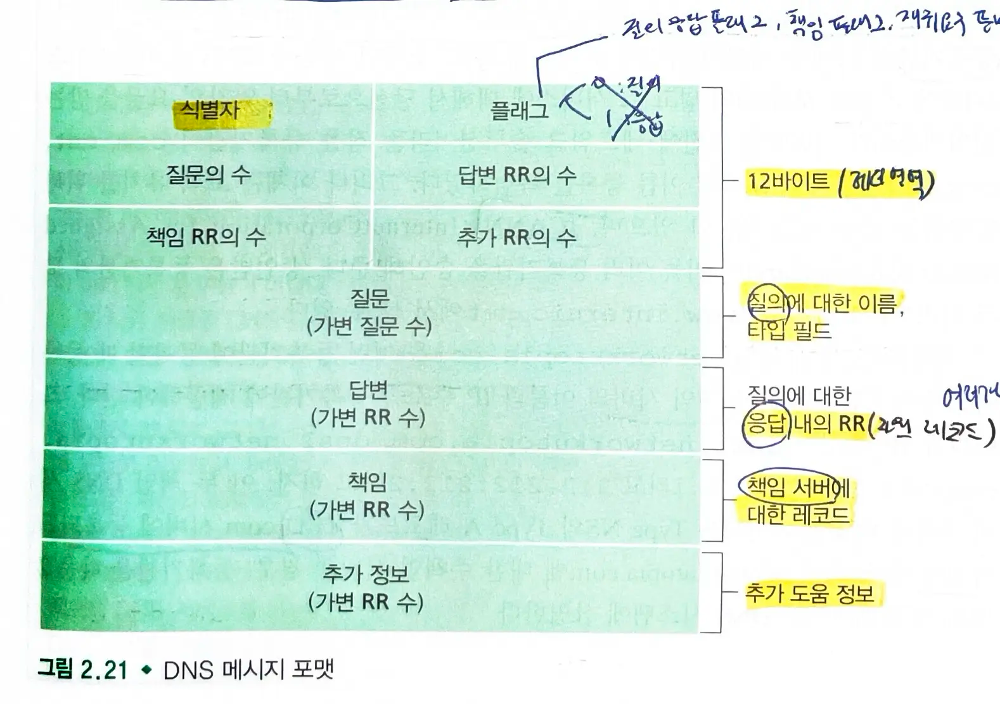

- **호스트 네임**(hostname) : 호스트에 대한 하나의 **식별자**, 기억하기 쉽다.
    - ex) www.facebook.com
- **IP 주소** : 호스트의 위치 정보 제공, 호스트의 식별자로도 사용됨
    - 4바이트로 구성
    - .으로 계층 구조 표현
    - ex) 121.7.106.83

> 사람은 기억하기 쉬운 호스트 네임을 좋아하고, 라우터는 고정 길이의 계층 구조를 가진 IP 주소를 좋아한다.

## 2.4.1 DNS가 제공하는 서비스

### DNS

- **호스트 네임을 IP 주소로 변환**해주는 디렉터리 서비스 (domain name system)
- 정의
    1. **DNS 서버들의 계층구조**로 구현된 분산 데이터베이스
    2. 호스트가 분산 데이터베이스로 질의하도록 허락하는 **애플리케이션 계층 프로토콜**
- DNS 서버는 주로 BIND 소프트웨어를 수행하는 유닉스 컴퓨터이다.
    - unix: 장기간 운영에 안정적이다.
- **UDP** 상에서 수행되며 포트번호 53을 이용한다.
    - udp 사용 이유: 빠르고, 연결 관리가 필요없어 네트워크 부하가 적다. 단순하다.

### DNS 동작 과정

1. **브라우저**는 url로부터 **호스트 네임**을 추출하고 호스트 네임을 **dns** 애플리케이션의 클라이언트 측에 넘긴다.
2. **dns 클라이언트**는 **dns 서버**로 호스트 네임을 포함하는 질의를 보낸다.
3. dns 클라이언트는 호스트 네임에 대한 **ip** 주소를 가진 응답을 받는다.
4. 브라우저는 해당 **ip** 주소와 그 주소의 **80번** 포트에 위치하는 http 서버 프로세스로 **tcp** 연결을 초기화한다.

> 원하는 ip 주소는 가까운 dns 서버에 캐시되어 있을 수 있다.

### DNS 기타 기능

- 호스트 네임을 ip 주소로 변환하는 것 외에 다른 여러 기능을 제공한다.
- **호스트 엘리어싱**(host aliasing)
    - 복잡한 호스트 네임 대신 기억하기 쉬운 별칭 호스트 네임을 가질 수 있다.
    - dns는 별칭 호스트 네임에 대한 정식 호스트 네임을 얻기 위해 이용될 수 있다.
- **메일 서버 엘리어싱**(mail server aliasing)
    - dns는 메일 서버의 별칭 호스트 네임에 대한 정식 호스트네임을 얻기 위해 이용될 수 있다.
    - **mx**(도메인의 메일 서버 지정)는 **기업의 메일 서버와 웹 서버가 같은 호스트 네임을 갖는 것을 허용**한다.
- **부하 분산**
    - dns는 중복 웹 서버 같은 **여러 중복 서버 사이에 부하를 분산**하기 위해 사용한다.
    - **여러 ip 주소가 하나의 정식 호스트 네임과 연관**되어있다.
    - 클라이언트가 호스트 네임에 대한 dns 질의를 하면, 서버는 ip 주소 집합 전체를 가지고 응답한다. 하지만 각 응답의 주소는 순환식으로 보낸다.
        - 클라이언트는 대체로 주소 집합 내부의 첫번째 ip 주소로 http 요청 메세지를 보낸다.
        - dns의 순환 방식은 **여러 중복 서버들 사이에서 트래픽을 분산**하는 효과를 낸다.
    - dns 순환 방식은 전자메일에서 사용되어 여러 메일 서버가 동일한 별칭을 가질 수 있다.

### DNS 프로토콜이 애플리케이션 계층 프로토콜인 이유

- HTTP, FTP, SMTP 처럼 **클라이언트-서버 구조로 통신하는 종단 사이에서 수행**된다.
- 통신하는 종단 시스템 사이에서 **DNS 메세지를 전달하기 위해 하위 종단 전송 프로토콜에 의존**한다.
- 다른 애플리케이션 계층 프로토콜과 다른점
    - DNS는 사용자가 상호작용하는 애플리케이션이 아닌 **핵심적인 인터넷 기능을 제공**한다.
        - 사용자 애플리케이션과 다른 소프트웨어를 위해 호스트 네임을 ip 주소로 변환하는 기능을 제공한다.

## 2.4.2 DNS 동작 원리 개요

### DNS 서버가 하나라면?

- **서버의 고장** : 이 네임 서버가 고장나면 전체 인터넷이 작동하지 않는다.
- **트래픽 양**: 단일 DNS 서버가 모든 DNS 질의를 처리해야한다.
- **먼 거리의 중앙 집중 데이터베이스**: 먼 거리일 경우 심각한 지연을 발생시킨다.
- **유지관리**: 단일 네임 서버는 모든 인터넷 호스트에 대한 레코드를 유지해야한다.
  => 확장성이 전혀 없으므로 DNS는 분산되도록 설계되었다.

### 분산 계층 데이터베이스

- DNS 서버는 루트 DNS 서버와 최상위 레벨 도메인 네임(TLD) DNS 서버, 책임 DNS 서버로 나뉜다.
    - **루트 DNS 서버**
        - 인터넷에는 400개 이상의 루트 DNS 서버가 존재하고, 대부분 북미 지역에 위치한다.
    - **최상위 레벨 도메인 (TLD) 서버**
        - com, org, net, edu같은 **상위 레벨 도메인**과 uk, fr, ka 같은 모든 **국가의 상위 레벨 도메인**에 대한 TLD 서버가 있다.
    - **책임 DNS 서버**
        - 기관의 책임 DNS 서버는 호스트 네임을 IP 주소로 매핑하는 공개적인 DNS 레코드를 가지고 있다.
        - 기관은 책임 DNS 서버를 구현하거나 일부 서비스 제공자의 책임 DNS 서버에 레코드를 저장하도록 비용을 지불한다.
        - 대부분의 대학과 큰 기업들은 기본 책임 DNS 서버와 보조 책임 DNS 서버를 유지하고 구현한다.
- **로컬 DNS 서버**
    - 서버들의 계층구조에 엄격하게 속하지는 않지만 DNS 구조의 중심이다.
    - ISP들은 로컬 DNS 서버를 갖는다.

### 질의 과정

1. 호스트가 ISP에 연결될 때, ISP는 호스트에게 IP 주소를 할당하고(DHCP) 로컬 DNS 서버의 IP 주소도 함께 제공한다.
2. 호스트가 **DNS 질의**를 보내면 **로컬 DNS 서버**에 전달되고, 로컬 DNS 서버는 이 질의를 **DNS 서버 계층(루트-TLD-책임)으로 전달**한다.

- 로컬 DNS 서버는 DNS 질의 메세지를 **루트 서버**에 전달한다.

3. 루트 서버는 최상위 레벨 도메인을 가진 TLD 서버 IP 주소를 로컬 DNS 서버에게 보낸다. (로컬 DNS 서버가 TLD 서버의 ip 주소 정보를 캐싱하고 있다면 이 과정은 생략된다.)
4. 로컬 DNS 서버는 **해당 TLD 서버**에 질의 메세지를 보내고, TLD 서버는 도메인을 가진 책임 서버의 IP 주소를 보낸다.
5. 로컬 DNS 서버는 **해당 책임 서버**에 질의 메세지를 보내고 호스트 네임의 IP 주소를 얻는다.
   => 요청하는 호스트~로컬 DNS 서버까지의 질의는 **재귀적**이고, 나머지는 **반복적** 질의이다.

> 처음 요청은 호스트->로컬 DNS 서버 -> 루트 DNS 서버이고, 다음 요청은 로컬 DNS 서버->TLD DNS 서버이다.

### TLD 서버는 일반적으로 호스트 네임에 대한 책임 서버를 알고 있지 않다.

- TLD 서버는 호스트 네임에 대한 책임 DNS를 아는 **중간 DNS 서버**만 알고 있다.
- 반복적 질의를 한번 더 하게 된다.

### DNS 캐싱

- **지연 성능 향상**과 **네트워크의 DNS 메세지 수를 줄이기** 위해 캐싱을 사용한다.
- DNS 서버가 DNS 응답을 받았을 때 **로컬 메모리에 응답 정보를 저장**한다.
- 호스트 DNS와 IP 주소 사이의 매핑은 영구적인 것이 아니기 때문에 **일정 기간(보통 2일) 이후 저장된 정보를 제거**한다.
- 로컬 DNS 서버는 TLD 서버의 IP 주소를 저장할 수 있으므로 **질의 사슬에서 루트 DNS 서버를 우회**할 수 있다. (흔히 일어난다.)

## 2.4.3 DNS 레코드와 메세지

- DNS 서버들은 호스트 네임을 IP 주소로 매핑하기 위한 자원 레코드를 저장한다.

### 자원 레코드

- (Name, Value, Type, TTL)
- **Type=A** : 표준 호스트 네임에 대한 **IP 주소 매핑** 제공
    - (호스트네임, 호스트네임의 IP 주소, A, TTL)
- **Type=NS** : 도메인에 대한 **책임 DNS의 호스트 네임** 제공
    - (도메인, 책임 DNS 서버의 호스트 네임, NS, TTL)
- **Type=CNAME** : 별칭 호스트 네임에 대한 **정식 호스트 네임** 제공
    - (별칭 호스트네임. 정식 호스트 네임, CNAME, TTL)
- **Type=MX**: 별칭 호스트 네임에 대한 **메일 서버 정식 호스트 네임** 제공
    - (별칭 호스트네임. 정식 호스트 네임, MX, TTL)

> 메일서버와 다른 서버(ex) 웹 서버)들이 같은 별칭을 가질 수 있다.

#### DNS 서버에 따른 자원 레코드 응답

- 책임 서버일 경우
    - **Type A** 레코드를 포함한다.
- 책임 서버가 아닐 경우
    - **Type NS** 레코드(책임 DNS 서버 레코드) + **Type A** 레코드(책임 DNS 서버의 IP 주소)

> dns 질의 메세지는 nslookup으로 확인 가능하다.

### DNS 메세지

- **헤더 영역**
    - **식별자**: 클라이언트가 보낸 질의와 수신된 응답 간의 일치 식별
    - **플래그** : 질의/응답 플래그, 책임 플래그, 재귀 요구 플래그, 재귀-가능 필드
- **질문 영역**: 현재 질의에 대한 정보
    - **이름** 필드 + **타입** 필드(A, NS, CNAME, MX)
- **답변 영역**: 질의된 이름에 대한 **자원 레코드**(RR)
    - 한 호스트 네임에 여러 IP 주소를 가질 수 있으므로, 여러개의 RR이 포함될 수 있다.
- **책임 영역**: 다른 책임 서버의 레코드
- **추가 영역**: 다른 도움이 되는 레코드
    - MX일 경우 Type A 레코드 포함

### DNS 데이터베이스에 레코드 삽입

- 도메인 네임을 새롭게 등록하고자 할때, 우선 **등록기관에 해당 도메인을 등록**해야한다.
    - **등록기관**: 도메인 네임의 유일성을 확인하고 그 도메인 이름을 DNS 데이터베이스에 넣고 그 서비스에 관해서 요금을 받는 상업기관
- **주책임 서버**와 **부 책임 서버**의 이름과 IP 주소를 등록기관에 제공해야한다.
    - 두 **책임 서버** 각각에 대해 등록기관은 **TLD** 서버에 **Type NS** 레코드와 **Type A** 레코드(책임 서버의 ip 주소)를 등록한다.
    - **책임** DNS 서버에 **Type A** 레코드(등록하려는 도메인 이름의 ip 주소)와 **MX** 레코드(전자메일 지원 경우)를 등록한다.
