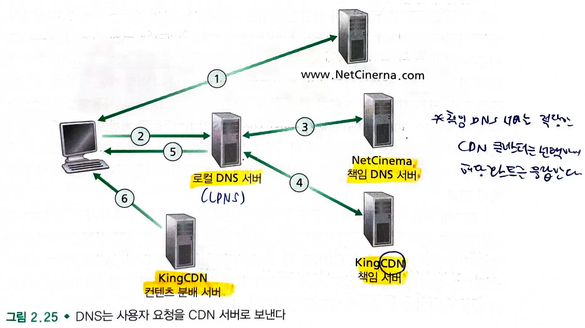

# 2.6. 비디오 스트리밍과 컨텐츠 분배 네트워크

## 2.6.1 인터넷 비디오

- 비디오는 **이미지의 연속**이며 이미지는 픽셀 단위로 구성된다.
    - 각 픽셀들은 **압축**될 수 있다.
- **비디오 품질과 비트 전송률은 비례한다.**
    - 비트 전송률이 높을 수록 이미지 품질은 높아지며 전반적인 사용자 시청 환경이 향상된다.
    - 네트워크에서 비디오는 높은 비트 전송률을 요구한다.

### 스트리밍 비디오 애플리케이션

- 미리 녹화된 **비디오가 서버에 저장**된다.
- 사용자는 비디오 시청을 서버에게 **온디맨드(on-demand)로 요구**한다.
- **성능 척도 : 평균 종단간(end-to-end) 처리량**
    - 네트워크는 압축된 비디오의 전송률 이상의 스트리밍 애플리케이션에 대한 평균 처리량을 제공해야한다.
- 압축을 사용하여 **동일한 비디오를 여러 버전의 품질**로 만들 수 있다.
    - 사용자는 사용 가능한 대역폭을 선택하여 보고 싶은 버전을 결정할 수 있다.

## 2.6.2 HTTP 스트리밍 및 DASH

### HTTP 스트리밍

- 비디오는 HTTP 서버 내의 특정 URL을 갖는 일반적인 **파일**
- 사용자가 비디오 시청을 원하면 클라이언트는 서버에게 **TCP 연결**을 설립하고 해당 URL에 대한 **HTTP GET 요청**을 발생시킨다.
- 서버는 HTTP 응답 메세지 내에서 **비디오 파일을 전송**한다.
- 클라이언트는 **애플리케이션 버퍼에 전송된 바이트가 저장**된다.
    - 이 버퍼의 바이트 수가 **임계값을 초과하면 클라이언트 애플리케이션이 재생을 시작**한다.
    - 스트리밍 비디오 애플리케이션은 클라이언트 **애플리케이션 버퍼에서 주기적으로 비디오 프레임을 가져와**서 프레임을 **압축해제**한 다음 사용자의 **화면에 표시**한다.
- 비디오 스트리밍 애플리케이션은 비디오의 후반부에 해당하는 프레임을 수신하고 버퍼링할 때 이미 받은 앞부분의 비디오를 표시한다.
  > 전체 파일을 다운로드하지 않고도 비디오를 시청할 수 있다.

#### 왜 HTTP 요청 전에 TCP 연결이 설정되어야 할까?

- 애플리케이션 계층은 전송 계층 위에 있다.
- TCP 3 way handshake로 연결을 설정하고 연결이 설정되면 그 위에서 HTTP 프로토콜이 동작한다.
    - TCP는 도로, HTTP는 차량
- 하위 계층부터 순차적으로 연결을 설정하고 통신한다.
    - 물리 계층(물리적 연결) -> 데이터 링크 계층(MAC 주소, ARP 통해 IP에 해당하는 MAC 찾기)-> 네트워크 계층(IP로 라우팅)-> 전송 계층(TCP 연결 설정) -> 애플리케이션 계층(HTTP
      GET)

### DASH(Dynamic Adaptive Streaming over HTTP)

- 클라이언트들이 그들 사이의 **가용 대역폭의 차이**에도 불구하고 **똑같이 인코딩된 비디오를 전송받**는다.
    - 동일 클라이언트도 시간에 따라 차이가 발생한다.
- **DASH**
    - 비디오는 **여러 개의 서로 다른 버전으로 인코딩**되며, 각 버전은 **서로 다른 비트율과 품질 수준**을 갖고 있다.
    - 클라이언트는 **HTTP GET** 요청을 이용해 다**른 인코딩률을 가진 버전의 비디오 조각(chunk)을 매번 선택**한다.
        - 가용 대역폭이 적을 때에는 낮은 비트율의 비디오 버전을, 높을때는 높은 비트율의 비디오 버전 선택
    - 세션 유지 중에 시간에 따라 변화하는 종단간 가용 대역폭에 적응할 수 있도록 허용한다.
        - 이동 사용자의 경우 접속하는 기지국에 따라 가용 대역폭이 변화하므로 DASH가 적합하다.
    - **Manifest** : 비트율에 따른 각 비디오 버전의 URL

#### DASH 작동방식

1. 클라이언트는 **Manifest 파일을 요청**하여 서버에서 제공하는 다양한 버전을 알게 된다.
2. **클라이언트는 매번 원하는 버전의 비디오 조각 단위 데이터를 선택**하여 HTTP GET 요청 메세지에 **URL과 byte-range를 지정하여 요청**한다.
3. 비디오 조각 단위 데이터를 다운로드하는 동안에 클라이언트는 측정된 수신 대역폭과 비트율 결정 알고리즘을 이용해 **다음에 선택할 비디오 조각 단위 데이터의 버전을 결정**한다.

## 2.6.3 콘텐츠 분배 네트워크 (CDN)

### 단일 데이터 센터 vs CDN

1. **단일한 거대 데이터 센터를 구축**하고 **모든 비디오 자료를 데이터 센터에 저장**한 뒤 전 세계의 사용자에게 **비디오 스트림을 데이터 센터로부터 직접 전송**
    - 클라이언트가 데이터 센터로부터 먼 지점에 있는 경우 종단 간 처리율이 낮아지고, 클라이언트는 화면 정지 현상이 잦아진다.
    - 인기 있는 비디오는 같은 통신 링크를 통해 여러번 반복적으로 전송된다. 대역폭의 낭비는 물론이고 ISP에게 중복 비용을 지불한다.
    - 한번의 장애로 전체 서비스가 중단된다.

- **콘텐츠 분배 네트워크(CDN)**
    - 다수의 지점에 **분산된 서버를 운영**하고, **데이터 복사본을 분산 서버에 저장**한다.
    - **사용자는 최선의 서비스와 사용자 경험을 제공할 수 있는 지점의 CDN 서버로 연결**된다.

> 캐시 서버를 이용해 본 서버로 들어오는 요청을 분산하여 처리한다. 속도도 더 빠르다.

#### CDN이 서버의 위치를 결정하는 방법

1. Enter Deep
    - 서버 클러스터를 세계 곳곳의 접속 네트워크에 구축한다.
    - **서버를 최대한 사용자 가까이에 위치**시켜 지연시간을 줄인다.
    - 분산된 서버를 유지관리하는 비용이 크다.
2. Bring Home
    - **보다 적은 수의 핵심 지점에 큰 규모의 서버 클러스터를 구축**한다.
    - **인터넷 교환지점에 배치**한다.
    - 지연 시간과 처리율이 상대적으로 나쁘다.

#### Pull 방식

- 지역 클러스터에 없는 비디오를 요청하면, 해당 비디오를 중앙 서버나 다른 클러스터로부터 **전송받아 사용자에게 서비스**하는 동시에, **복사본을 만들어 저장**한다.

### CDN 동작

- 특정 비디오의 재생을 요청하면,

1. 그 시점에서 **클라이언트에게 가장 적당한 CDN 클러스터를 선택**한다.
2. 클라이언트의 요청을 해당 클러스터의 **서버로 연결**한다.

- 대부분의 CDN은 **사용자의 요청을 가로채고 다른 곳으로 연결하는데 DNS를 활용**한다.

1. 사용자가 **NetCinema** 웹페이지를 방문한다.
2. 사용자가 비디오 링크를 클릭하면, 사용자의 호스트는 해당 url에 링크를 보낸다.
3. 사용자의 지역 DNS 서버는 해당 쿼리를 NetCinema의 **책임 DNS 서버로** 전달한다. NetCinema 책임 DNS 서버는 KingCDN의 호스트 이름을 알려준다
4. LDNS는 **KingCDN의 호스트 이름에 대한 ip주소를 얻고** 호스트에게 알려준다.
5. 호스트는 해당 ip 주소로 tcp 연결을 설정하고 http get 요청을 전송한다.

### 클러스터 선택 정책

- 클라이언트를 동적으로 어떤 서버 클러스터 또는 CDN 데이터 센터로 연결하는 방식
- **클라이언트의 LDNS(Local DNS)의 ip주소**를 알게 되면, CDN은 **해당 ip를 기반으로 최선의 클러스터를 선택**한다.
    - 클라이언트에게 **가장 지리적으로 가까운 클러스터를 할당**한다.
    - 네트워크 길이의 홉수에 따라 일부 사용자는 상당히 멀리 있는 DNS 서버를 LDNS로 사용하도록 설정될 수 있으므로 항상 잘 동작하지 않는다.
    - 최선의 클러스터를 선택하기 위해 CDN은 주기적으로 클러스터와 클라이언트 간의 지연 및 손실 성능에 대한 **실시간 측정을 수행**한다.

## 2.6.4 사례 연구 : 넷플릭스, 유튜브, Kankan

### 넷플릭스

- 비디오 배포에는 아마존 클라우드와 자체 CDN 인프라가 있다.

#### 아마존 클라우드

- 콘텐츠 수집 : 넷플릭스는 영화를 받아서 아마존 클라우드 시스템의 호스트에 업로드한다.
- 콘텐츠 처리 : **아마존 클라우드 시스템의 기기에서는 각 영화의 여러 가지 형식의 비디오를 생성**한다.
- CDN으로의 버전 업로드: 아마존 클라우드 시스템의 호스트는 버전을 CDN으로 업로드한다.

#### 자체 CDN 인프라

- IXP 및 거주용 ISP 자체에서 **서버 랙을 설치**한다.
    - 1XP는 수십개의 서버와 스트리밍 비디오 라이브러리가 있다.,
    - 로컬 IXP는 하나의 서버만 가질 수 있으며 가장 인기 있는 비디오만 포함할 수 있다.
    - **Pull-caching**하며(중앙 서버로부터 가져와 캐싱) **사용량이 적은 시간에 비디오를 CDN 서버에 푸시하여 배포**한다.
        - 곧 인기를 끌 것이라 예상되는 컨텐츠를 미리 CDN 서버에 배포한다.
- dns 리디렉션을 사용할 필요가 없다(아마존 클라우드에서 해준다.)

#### 과정

- 사용자가 재생할 영화를 선택하면 아마존 클라우드에서 실행 중인 넷플릭스 소프트웨어가 해당 영화를 가진 CDN Server를 선택한다.
- 클라이언트가 로컬 ISP를 사용하고 있고 이 랙에 요청된 사본이 있을 경우 해당 랙 서버가 선택되고 그렇지 않은 경우 근처 IXP가 선택된다.
- 클라이언트는 해당 영화의 다른 버전에 대한 url을 가진 매니페스트 파일과 ip 주소를 보낸다.
    - dash를 이용해 클라이언트와 cdn 서버는 상호작용한다.

### 유튜브

- 서로 다른 IXP 및 ISP 위치에 서버 클러스터를 설치하여 **거대한 데이터 센터에서 직접 동영상을 배포**한다.
- **사용자를 특정 서버 클러스터와 연결하는데 DNS를 사용**하며, 클라이언트와 클러스터 간 **RTT가 가장 적은 곳을 연결**한다.
- HTTP 스트리밍을 통해 사용자가 스스로 버전을 선택하여 볼 수 있게 하였고(DASH 선택X) 보유한 비디오에 대한 여러 버전을 생성하여 제공한다.

### Kanban

- **P2P 전송을 사용**하여 서비스 제공자가 인프라 구축 및 대역폭 비용을 절감하였다.
    - 한 피어가 비디오 시청을 원하면 트랙커와 접촉하여 비디오 복사본을 가진 피어를 발견한다
    - 피어가 비디오 조각 단위의 데이터(가까운 시간 안에 재생)를 요청하여 발송한다.
- 최근에는 **CDN-P2P** 방식을 채택하여 P2P 스트리밍이 불충분하면 CDN 연결로 스트리밍하고, 충분하면 피어를 통해서만 스트리밍한다.
