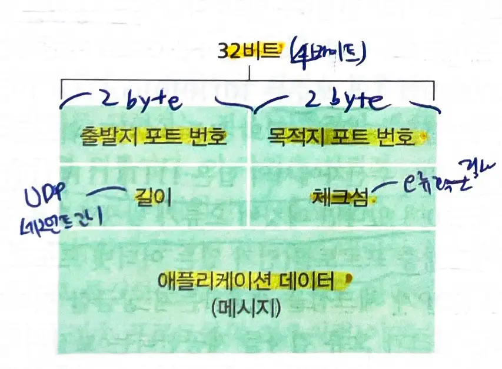

# 3.3 비연결형 전송 UDP
- UDP는 전송 계층 프로토콜이 할 수 있는 최소 기능으로 동작한다.
	- **다중화/역다중화 기능**과 **오류 검사 기능**
	- 거의 IP와 직접 통신하는 셈이다.
- UDP 과정
	- 애플리케이션 프로세스로부터 메세지를 가져와서 출발지 포트번호와 목적지 포트번호와 다른 두 필드를 추가한 후 세그먼트를 네트워크 계층으로 넘겨준다.
	- 네트워크 계층은 세그먼트를 IP 데이터그램으로 캡슐화하고, 세그먼트를 수신 호스트에게 최선형 전달 서비스로 전달한다.
	- 세그먼트가 수신 호스트에 도착하면 UDP는 목적지 포트 번호를 사용해 적절한 소켓을 찾아 전달한다.
- 비연결형: **세그먼트 송신 전에 핸드쉐이크를 사용하지 않는다**.
- DNS는 일반적으로 UDP를 사용하는 애플리케이션 계층 프로토콜의 예이다.

### UDP가 일부 애플리케이션에 적합한 이유
#### 무슨 데이터를 언제 보낼지에 대해 애플리케이션 레벨에서 더 정교하게 제어할 수 있다.
- UDP는 애플리케이션 프로세스가 **데이터를 전달하자마자 세그먼트로 만들고 네트워크 계층으로 전달**한다.
- **TCP는 혼잡제어 메커니즘**을 가지고 있어 지연이 발생할 수 있고, **목적지가 세그먼트의 수신 여부를 확인할 때까지 세그먼트 재전송**을 계속한다.
	- 혼잡제어 메커니즘 : 목적지 호스트들과 출발지 호스트들 사이에서 하나 이상의 링크가 과도하게 혼잡해지면, 전송 계층 TCP 송신자를 조절한다.

#### 연결 설정이 없다.
- **TCP는 세방향 핸드쉐이크를 사용**한다.
	- HTTP는 신뢰성이 중요하기 때문에 TCP를 사용한다.
- **UDP**는 형식적인 **예비동작 없이 전송하므로 어떤 지연도 없다.**
	- **DNS**가 UDP에서 동작하는 이유는 연결로 인한 지연을 없애기 위해서이다.

#### 연결 상태가 없다.
- TCP는 종단 시스템에서 연결 상태를 유지한다.
	- **상태 정보**는 TCP의 신뢰적인 데이터 전송 서비스를 구현하고 혼잡 제어를 제공하기 위해서 필요하다.
- UDP는 연결 상태를 유지하지 않으며 어떤 파라미터도 기록하지 않는다.
	- 좀 더 많은 클라이언트를 수용할 수 있다.

#### 작은 패킷 헤더 오버헤드
- **TCP**는 세그먼트마다 **20바이트의 헤더 오버헤드**를 갖는다.
- **UDP**는 **8바이트의 오버헤드**를 갖는다.

### 애플리케이션의 전송 계층 프로토콜
- TCP
	- 전자메일 SMTP
	- 원격 터미널 접속 Telnet
	- 웹 HTTP
	- 파일 전송 FTP
> 신뢰적인 데이터 전송 서비스
- UDP
	- 원격 파일 서버 `NFS` 
	- 스트리밍 멀티미디어 `통상 독점 프로토콜` UDP 또는 TCP
	- 인터넷 폰 `통상 독점 프로토콜` UDP 또는 TCP
	- 네트워크 관리 `SNMP` UDP 또는 TCP
		- 네트워크가 혼잡한 상태일때 동작해야하므로
	- 이름 변환 `DNS` 
		- TCP의 연결 설정 지연을 피하기 위해서

#### UDP도 애플리케이션을 통해 신뢰적인 데이터 전송이 가능하다.
- 애플리케이션이 신뢰성을 애플리케이션 자체에서 제공할 수 있다.
- 구글의 Chrome 브라우저에서 사용되는 `QUIC` 프로토콜
> 애플리케이션 개발자가 오랜 시간 디버깅을 할 수 있다..

## 3.3.1 UDP 세그먼트 구조

- **애플리케이션 데이터** : UDP 데이터그램의 데이터 필드
- 2바이트씩 구성된 4개의 필드
	- **출발지 포트 번호**
	- **목적지 포트번호 (역다중화)**
	- **길이** : 페더를 포함하는 UDP 세그먼트 길이(바이트 단위)
	- **체크섬** : 세그먼트에 오류가 발생했는지 검사

## 3.3.2 UDP 체크섬
- UDP 체크섬은 오류 검출을 제공한다.
- 체크섬 : 세그먼트가 출발지에서 목적지로 이동했을 때 UDP 세그먼트 안의 비트에 대한 변경사항이 있는지 검사한다.
- 과정
	1. 세그먼트 안에 있는 모든 16비트 워드 단위로 더한다.
	2. 1의 보수를 수행한다.
- 결과값의 비트에서 하나라도 0이 있다면 패킷에 오류가 발생한 것이다. 

### 링크 계층 프로토콜에서 오류 검사를 하는데, UDP에서 또 오류 검사를 하는 이유는?
- 출발지와 목적지 사이의 모든 링크가 오류 검사를 제공한다는 보장이 없기 때문이다.

#### 종단간의 원리
- 하위 레벨에 위치한 기능들은 상위 레벨에서 이들을 제공하는 비용을 비교했을 때, 중복되거나 거의 유용되지 않을 수 있다.
	- 종단간의 데이터 전송 서비스가 오류 검사를 제공한다면, UDP는 종단간의 전송 계층에서 오류 검사를 제공해야한다.
- **네트워크 기능은 가능한 한 통신의 끝단(endpoints=종단)에서 구현되어야 한다.**
	- 네트워크의 복잡성을 줄이고 중간 노드의 기능을 단순화한다.
	- 하위 계층의 신뢰성에 의존하지 않고, 서비스를 보장한다.
