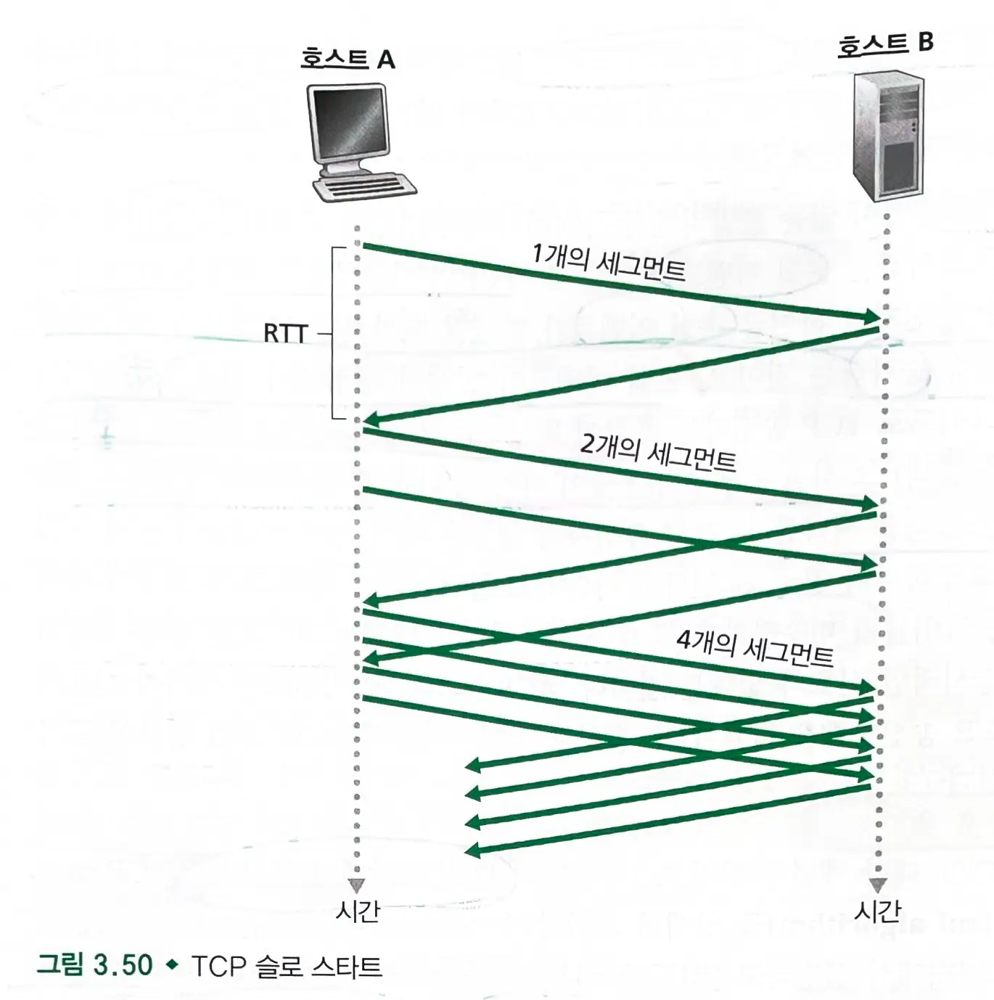
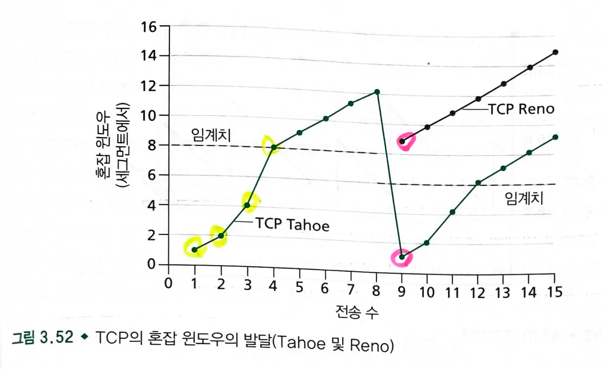
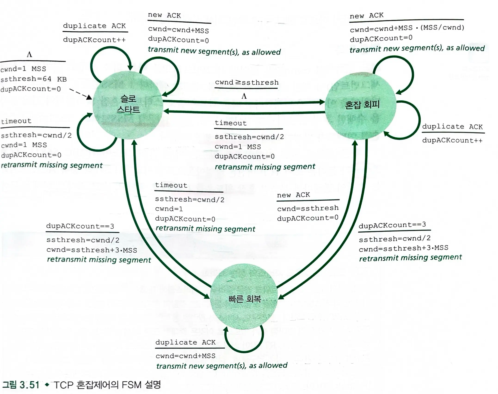
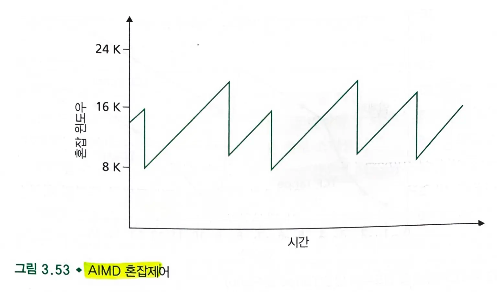
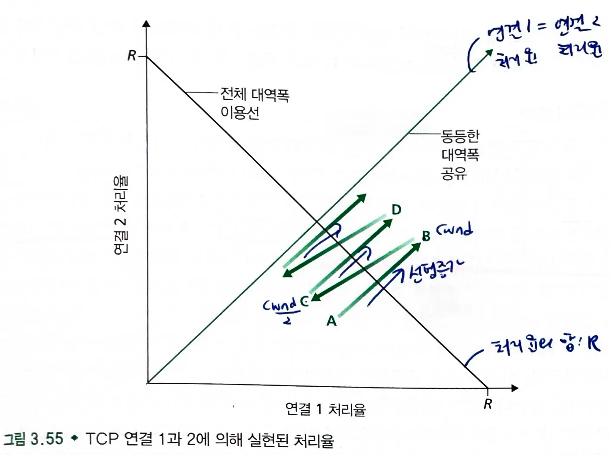
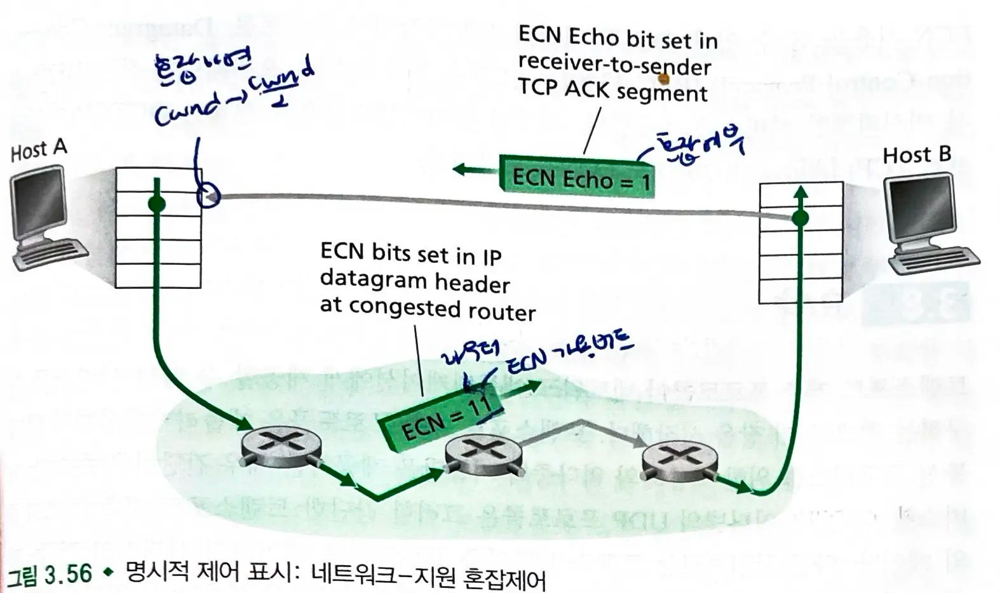

# 3.7. TCP 혼잡제어

- TCP는 다른 호스트에서 동작하는 두 프로세스 사이의 **신뢰적인 전송 서비스**를 사용한다.
  - IP 계층이 네트워크 혼잡에 관래 종단 시스템에게 어떠한 피드백도 제공하지 않으므로, TCP는 **종단간의 혼잡제어를 사용**해야 한다.
- **네트워크 혼잡에 따라** 연결에 트래픽을 보내는 **전송률을 각 송신자가 제한**한다.
  - TCP 송신자가 자신과 목적지 간의 경로에 **혼잡이 없으면 송신율을 높인다.**
  - 송신자가 경로 사이에 **혼잡을 감지하면 송신율을 줄인다.**

#### 혼잡 윈도우(cwnd)

- TCP 송신자가 네트워크로 트래픽을 전송할 수 있는 비율을 제한한다.
  - **네트워크 혼잡을 방지하기 위해 송신자가 설정한 윈도우 크기**이다.
  - 송신자는 `cwnd` 바이트만큼의 데이터를 전송할 수 있고, `RTT`가 끝나는 시점에 확인응답(`ACK`)을 수신한다.
  - 송신자의 수신율 : `cwnd/RTT` byte/s

```
LastByteSent - LastByteAcked <= min{cwnd, rwnd}
```

> rwnd : 수신자가 현재 처리할 수 있는 데이터의 양을 뜻한다. 수신 윈도우 크기이다.

- TCP는 확인 응답(**ACK**)를 받을 때마다 **혼잡 윈도우 크기를 증가**시킨다.
  - TCP는 자체 클로킹이다.
- 혼잡 감지
  - 타임아웃 또는 3중 중복 ACK
  - **손실된 세그먼트는 혼잡을 의미하며, 혼잡윈도우 크기를 줄여야한다.**

#### 대역폭 탐색

- 손실 이벤트가 발생할 때까지 `ACK`가 도착함에 따라 전송률을 증가하고, `손실 이벤트`가 발생한 시점에서 전송률을 줄인다.
  - 네트워크 혼잡 상태에 대한 명시적인 신호가 없으므로 ACK과 손실 이벤트에 따라 혼잡을 판단하고 동작한다.

## TCP 혼잡 제어 알고리즘

- TCP 혼잡 제어 알고리즘에는 **슬로 스타트**, **혼잡 회피**, **빠른 회복**이 있다.

> 슬로 스타트와 혼잡 회피는 TCP의 필수 요소이다.

- `타임아웃` : 혼잡 이벤트
  - 네트워크의 심각한 혼잡상태를 의미하며 공격적인 대응을 한다.
- `3중 중복 ACK` : 손실 이벤트
  - 네트워크의 일시적인 혼잡상태를 의미하며 온건한 대응을 한다.
- `ssthresh` : slow start 임계치, 안전한 윈도우 크기의 최대값

### a) 슬로 스타트



- TCP 연결이 시작할때, cwnd 값은 일반적으로 `1 MSS`로 초기화된다.
  - 초기 전송률 : MSS / RTT
- cwnd를 `1 MSS`에서 시작하여 한 전송 세그먼트가 첫번째로 확인응답을 받을 때마다 `1 MSS` 증가한다.
  - 송신자는 각 `ACK`마다 `cwnd`를 `1 MSS`만큼 증가시키므로, **지수적으로 증가**한다.
  - 1개 세그먼트 -> 2개 세그먼트 -> 4개 세그먼트

> 매 RTT마다 cnwd 2배로 증가

-
  1. **타임아웃**(=혼잡)이 있을 경우

  - `cwnd`를 1로 하고, `ssthresh`는 `cwnd/2`로 설정한 후 **슬로 스타트**를 시작한다.
  - `ssthresh`(slow start threshold, 슬로 스타트 임계치) 값을 `cwnd/2`로 정한다.

> cwnd는 2배씩 증가하므로 ssthresh는 혼잡이 발생했을 때의 직전으로 설정한다.

-
  2. `cwnd`가 `ssthresh`와 같으면, **슬로 스타트는 종료**되고 TCP는 **혼잡 회피 모드**로 전환한다.

  - cwnd를 느리게 증가시킨다.
-
  3. `3개의 중복 ACK`가 있을 경우(=손실 발생)

  - 공통 : 빠른 재전송을 수행한다.
    - TCP Tahoe : `ssthresh`를 `cwnd/2`로 설정하고, `cwnd`는 1로 설정한 후 **슬로 스타트**부터 다시 시작한다.
    - TCP Reno: `ssthresh`를 `cwnd/2`로 설정하고, `cwnd`는 `ssthresh + 3 MSS`로 설정한 뒤 **빠른 회복** 상태로 들어간다.

> 3중 중복 ACK는 일부 패킷은 성공적으로 전송되었음을 의미하므로 타임아웃보다 덜 혼잡한 상태를 뜻한다.
> 그래서 cwnd는 1이 아닌 절반으로 설정한다.

> TCP Tahoe는 손실 발생시 보수적으로 대응하여 슬로 스타트부터 다시 시작한다.
> TCP Reno는 빠른 회복을 통해 전송률을 급격하게 낮추지 않고 최적화한다.

### b) 혼잡 회피

- 혼잡 회피 상황에서 `cwnd`는 혼잡이 발생하기 직전(혼잡 발생시 cwnd의 절반) 값이다.
  - 매 RTT마다 1 **MSS만큼 cwnd를 증가**시킨다.
  - `cwnd`가 `ssthresh`에서 선형적으로 증가한다.
-
  1. **타임아웃** 발생시(=혼잡 발생)

  - `cwnd`를 1로 하고, `ssthresh`는 `cwnd/2`로 설정한 후 **슬로 스타트**를 시작한다.
-
  2. **3개의 중복 ACK** 발생시(=손실 발생)

  - 공통 : 빠른 재전송을 수행한다.
    - TCP Tahoe : `ssthresh`를 `cwnd/2`로 설정하고, `cwnd`는 1로 설정한 후 **슬로 스타트**부터 다시 시작한다.
    - TCP Reno: `ssthresh`를 `cwnd/2`로 설정하고, `cwnd`는 `ssthresh + 3 MSS`로 설정한 뒤 **빠른 회복** 상태로 들어간다.

### c) 빠른 회복

- 매 **중복된 ACK**를 수신시
  - 1 MSS만큼 증가한다. (선형 증가)

> 여전히 네트워크가 작동중이므로 선형적으로 증가

- **새로운 ACK** 수신시
  - `cwnd`를 `ssthresh`로 설정하고 **혼잡 회피**로 전환한다.

> 손실된 세그먼트가 성공적으로 전달되었으므로 ssthresh를 현재 cwnd로 설정하고, 과도한 부하를 막기 위해 슬로 스타트가 아닌 혼잡 회피로 진행한다.

- **타임아웃 발생**시
  - `cwnd`를 1로 하고, `ssthresh`는 `cwnd/2`로 설정한 후 **슬로 스타트**를 시작한다.

- 빠른 회복은 TCP 요소 중 선택사항이다.
  - 초기 TCP 버전인 TCP Tahoe는 빠른 회복을 채택하지 않았다.
  - TCP Reno는 빠른 회복을 채택하였다.

#### TCP Reno vs Tahoe



> 현재 대부분의 알고리즘은 Reno 알고리즘을 이용한다.

### TCP 혼잡제어: 복습



> TCP Reno 혼잡제어

- `AIMD` (additive increase, multiplicative decrease, 가법적 증가 승법적 감소)
- 혼잡 회피에서 매 RTT마다 **1 MSS씩 cwnd가 증가**하다가, 손실(3중 ACK) 발생시 **cwnd가 절반**으로 줄어든다.
  

> TCP 처리율은 주기적으로 증가했다가 감소하는 패턴을 보인다. (톱니모양)

### TCP 처리율의 거시적 설명

- TCP 전송률 = w / RTT
  - w는 윈도우 크기
  - RTT 왕복시간
- 손실 이벤트 발생시 `cwnd`가 절반으로 줄어들기 때문에, 전송률은 `w / (2 * RTT)`가 된다.
  - 매 RTT마다 1 MSS만큼 증가하므로, 다시 W/RTT에 도달할때까지 `MSS/RTT`만큼 증가한다.
    - W는 손실 이벤트가 발생하는 시점의 w 값이다.
- TCP 연결의 평균 처리율 = `0.75W / RTT`
  - 평균적으로 대역폭의 75%를 활용한다.

### 광대역 경로상의 TCP

```
연결의 평균 처리율 = 1.22 * MSS / RTT√L
```

## 3.7.1 공평성



- RTT당 1 MSS씩 증가하다가(선형 증가), 손실이 발생하면 윈도우를 절반으로 감소시킨다.

### 공평성과 UDP

- tcp는 혼잡제어를 통해 애플리케이션의 전송률을 조절한다.
- 많은 어플리케이션은 혼잡제어를 가지고 있지 않은 udp에서 동작하는 것을 오히려 좋아한다.
  - 네트워크가 혼잡할 때, 애플리케이션이 혼잡할 때 공평한 레벨로 등급을 낮추고 패킷을 손실하는 것을 막기보다는 (tcp),
    일정한 속도로 네트워크에 데이터를 공급하고 패킷이 가끔 손실되는 것을 감수하는 것을 좋아한다. (udp)
- udp는 혼잡제어를 하지 않으므로 **udp가 tcp의 트래픽을 밀어낼 가능성이 있다.**

### 공평성과 병렬 TCP 연결

- tcp는 다중 병렬 연결이 가능하므로, 애플리케이션이 다중 병렬 tcp 연결 사용시 밴드폭의 큰 부분을 얻으므로 다른 어플리케이션에 비해 불공평하게 많이 할당받을 수 있다.

> 네트워크는 각 tcp 연결을 독립적으로 취급하기 때문에, 각 연결은 개별적으로 대역폭을 할당받는다.
> 하나의 애플리케이션이 여러 tcp 연결을 사용하면, 실질적으로 더 많은 네트워크 리소스를 사용하게 된다.

## 3.7.2 명시적 혼잡 표시(`ECN`): 네트워크-지원 혼잡제어



- TCP는 네트워크 계층으로부터 명시적인 혼잡표시를 받지 않고, 패킷의 손실로부터 혼잡을 추측한다.
- 최근에는 네트워크가 명시적으로 TCP 송신자와 수신자에게 혼잡을 알리는 **명시적 혼잡 표시**가 구현되었다.
  - 명시적 혼잡 표시(Explicit Congestion Notification = `ECN`)
- ECN 비트는 두 비트가 사용된다.
  - **첫번째 비트는 라우터가 경험하는 혼잡을 표시**하며, 목적지 호스트로 전송되면 목적지 호스트가 송신 호스트에게 알려준다. (ECN Echo = 1)
  - **두번째 비트는 송신자와 수신자가 ECN-가용하다는 것을 알림**으로써 ECN-표시된 네트워크 혼잡에 대응한 행동을 취할 수 있록 한다.
- `ECN Echo = 1` : 혼잡 표시
  - `ECE` 비트는 TCP ACK 세그먼트에 정의되며, ECE 비트를 받으면 **송신 TCP는 cwnd를 절반으로 줄인다**. (`CWR` = Congestion Window Reduced, 혼잡 윈도우 축소)

