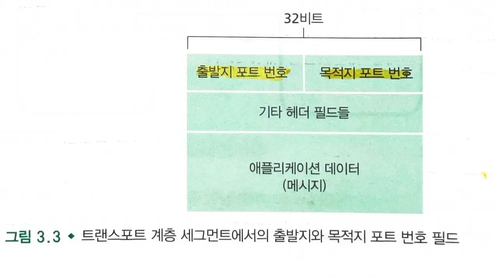
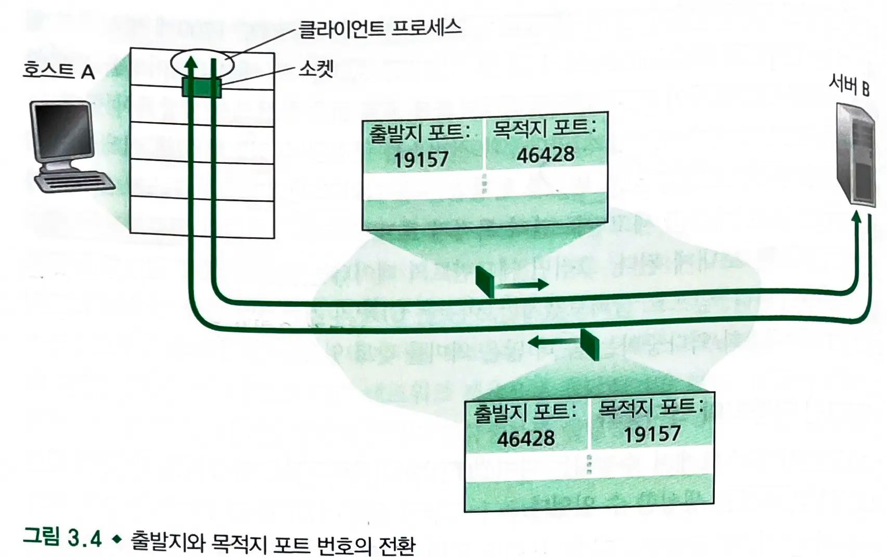
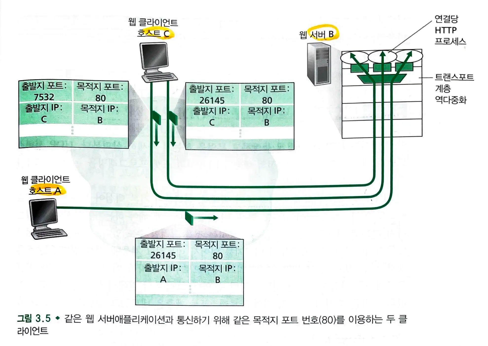

# 3.2 다중화와 역다중화
- **전송 계층** : 호스트 대 호스트 전달 서비스에서 호스트에서 동작하는 애플리케이션에 대한 **프로세스-대-프로세스** 전달 서비스로 확장
    - **전송 계층**은 **네트워크 계층**으로부터 **세그먼트를 수신**한다.
    - 전송 계층은 **애플리케이션 프로세스**에게 **세그먼트의 데이터를 전달**한다.
- 프로세스는 **소켓**을 가지고 있다.
    - **소켓** : **네트워크**에서 **프로세스**로 데이터를 전달하고, 프로세스에서 네트워크로 데이터를 전달하는 **출입구**
        - **전송 계층**은 데이터를 중간 매개자인 **소켓**에게 전달하고, 소켓이 **프로세스**에게 데이터를 전달한다.
        - 각각의 소켓은 유일한 **식별자**를 가진다.
        - 전송 계층 세그먼트는 세그먼트에 필드 집합을 가지고 있고, 수신 측의 전송 계층은 **수신 소켓을 식별하기 위해 세그먼트의 필드를 검사**한다.
### 다중화
- 호스트에서 **데이터**에 헤더 정보로 **캡슐화**하여 **세그먼트**를 만들고, 세그먼트를 **소켓**을 통해 **네트워크 계층으로 전달**하는 작업
    - 애플리케이션 계층 -> 전송 계층 -> 네트워크 계층 ...

### 역다중화
- 전송 계층 세그먼트의 데이터를 올바른 **소켓**으로 전달하는 작업
    - 전송 계층 -> 애플리케이션 계층
    - 세그먼트를 프로세스의 소켓으로 전달
> 다중화와 역다중화는 한 계층에서의 한 프로토콜이 그 상위 계층의 여러 프로토콜에 의해 사용될 때마다 관련된다.

#### 역다중화 작동방식
1. 호스트의 각 소켓은 포트 번호를 할당받는다.
2. 세그먼트가 호스트에 도착하면, 전송 계층은 **세그먼트 안의 목적지 포트 번호를 검사**하고, 상응하는 소켓으로 세그먼트를 보낸다.
3. 세그먼트의 데이터는 소켓을 통해 해당되는 **프로세스로 전달**된다.
> 위는 UDP의 기본 방식이고 TCP는 좀 더 복잡하고 많은 의미를 가진다.

### 전송 계층 다중화의 요구사항
1. 소켓은 **유일한 식별자**를 가진다.
2. 각 **세그먼트**는 세그먼트가 전달될 적절한 소켓을 가리키는 **필드**를 가진다.

- **출발지 포트번호 필드**와 **목적지 포트번호 필드**
    - 각 포트번호는 0~65535이며 그 중에서 0~1023까지의 포트 번호를 잘 알려진 포트 번호라고 하여 사용을 제한하고 있다.
> 출발지 포트 번호는 수신하는 사람이 응답 메세지를 보낼 때 사용한다.

## 비연결형(UDP) 다중화와 역다중화

### 포트번호 할당
- 서버
    - 소켓 생성 후 `bind()`로 특정 포트번호를 할당할 수 있다.
- 클라이언트
    - 전송 계층이 포트 번호를 자동으로 할당한다. (1024~645535)

### UDP 다중화 / 역다중화
- 호스트 A **프로세스**가 호스트 B의 **프로세스**로 데이터 전송을 원한다.
    - 호스트 B는 포트번호 46428번을 가진 UDP 소켓을 가진다.
- **다중화**
    - 호스트 A의 전송 계층은 애플리케이션 데이터 + 출발지 포트번호 + 목적지 포트번호 + 2개의 다른 값을 포함하는 **세그먼트를 생성**한다.
    - 네트워크 계층은 세그먼트를 전달받아 **IP 데이터그램으로 캡슐화하여 수신 호스트로 전달**한다.
- **역다중화**
    - 수신 호스트는 세그먼트의 목적지 포트 번호를 검사하고 **식별자로 소켓을 찾아 세그먼트를 전달**한다.
> 동일한 목적지 IP 주소와 목적지 포트번호를 가지면 2개의 세그먼트들은 같은 목적지 소켓으로 전달된다.

## 연결지향형(TCP) 다중화와 역다중화

- 네트워크 계층에서 호스트에 TCP 세그먼트가 도착하면, 역다중화하기 위해 **4개의 값**으로 소켓을 식별한다.
    - 출발지 ip 주소, 출발지 포트 번호, 목적지 ip 주소, 목적지 포트 번호
> 목적지 ip, 포트번호가 같아도 출발지의 ip주소나 포트번호가 다르면 다른 소켓으로 향한다.

### TCP(연결지향적)
- **TCP는 연결을 설정하고 유지**한다.
- 각 연결은 **4-튜플로 고유하게 식별**한다.
    - `출발지 ip 주소, 출발지 포트 번호, 목적지 ip 주소, 목적지 포트 번호`
> 서버 프로세스는 각기 다른 클라이언트가 보낸 세그먼트를 출발지 ip주소와 포트번호로 구별한다.

### UDP(비연결 지향적)
- UDP는 연결을 설정하지 않는다. 각 데이터그램은 독립적으로 처리된다.
- UDP 소켓은 일반적으로 **목적지 IP 주소와 포트번호**로만 바인딩된다.

## 웹 서버와 TCP
### 소켓과 프로세스, 스레드
- 서버 프로세스는 각기 다른 클라이언트가 보낸 세그먼트를 **출발지 ip주소와 포트번호로 구별**한다.
    - 각 프로세스는 연결 소켓을 가지며, 이 연결 소켓을 통해서 HTTP 요청을 수신하고, HTTP 응답을 전송한다.
> 항상 연결 소켓과 프로세스가 일대일 대응이 이뤄지는 것은 아니다.

- 오늘날의 많은 고성능 웹 서버들은 **하나의 프로세스**만 사용한다.
    - 새로운 각각의 클라이언트 연결을 위해 **새로운 연결 소켓과  새로운 스레드를 생성**한다.

### 지속적인 HTTP
- 지속적인 연결동안 클라이언트와 서버는 **동일한 서버 소켓을 통해 HTTP 메세지를 교환**한다.

### 비지속적인 HTTP
- 모든 요청/응답마다 **소켓이 생성되어 TCP 연결을 수행하고 종료**된다.
    - 서버: 소켓 생성(`socket()`) -> ip주소와 포트번호에 바인딩(`bind()`)-> 리스닝(`listen()`)-> 연결요청(`accept()`) 후 소켓 새로 생성
    - 클라이언트: 소켓 생성(`socket()`) -> tcp 연결(`connect()`) -> 메세지 전송(`send()`)
- 웹 서버 성능에 부담을 준다.

