# 3.4 신뢰성 있는 데이터 전송의 원리
- 신뢰적인 데이터 전송을 구현하는 문제는 전송 계층 뿐 아니라 링크 계층, 애플리케이션에서도 발생할 수 있다.
    - 네트워크에서 가장 중요한 문제 중 하나이다.

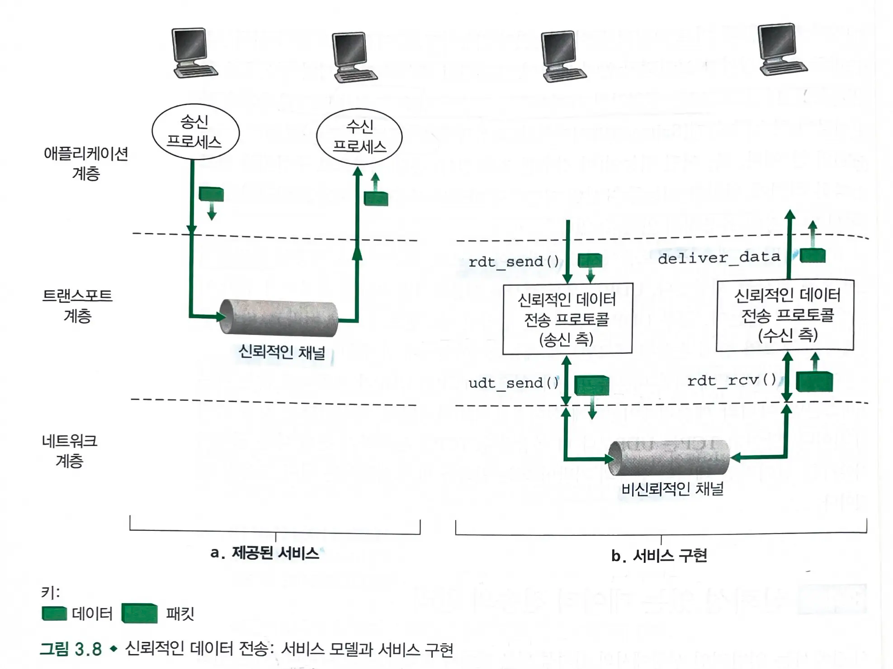

- 신뢰적인 데이터 전송 프로토콜 (**rdt** = reliable data transfer protocol)
    - 상위 계층 개체에게 제공되는 서비스 추상화는 데이터가 전송될 수 있는 **신뢰적인 채널의 서비스 추상화**다.
        - 신뢰적인 채널에서는 **데이터가 손상되거나 손실되지 않고**, **전송된 순서대로 전달**된다.
    - 비신뢰적인 하위 계층으로 인해 신뢰적인 데이터 전송 프로토콜이 어려워진다.
- 메서드
    - `rdt_send` : 신뢰적으로 데이터를 전송한다.
    - `udt_send` : 비신뢰적인 데이터 전송(`udt`)로 패킷을 전송한다.
        - 단순히 데이터를 전송한다.
    - `rdt_rcv:` 수신측에서 패킷을 수신한다.
        - **신뢰적으로 데이터를 수신한다.**
    - `deliver_data` : 패킷을 상위 계층으로 전달한다.
> 세그먼트는 전송 계층의 데이터 단위이므로 컴퓨터 네트워크에서 적용되는 일반 용어인 패킷이라는 단어를 사용한다.

- **단방향 통신**
    - 송신자에서 수신자로 데이터 전송을 하는 것을 단방향 데이터 전송이라고 한다.
    - 제어 패킷을 **양쪽(송신, 수신)으로 전송**해야 한다.

## 3.4.1 신뢰적인 데이터 전달 프로토콜의 구축
### 완벽하게 신뢰적인 채널 상에서의 신뢰적인 데이터 전송: rdt1.0
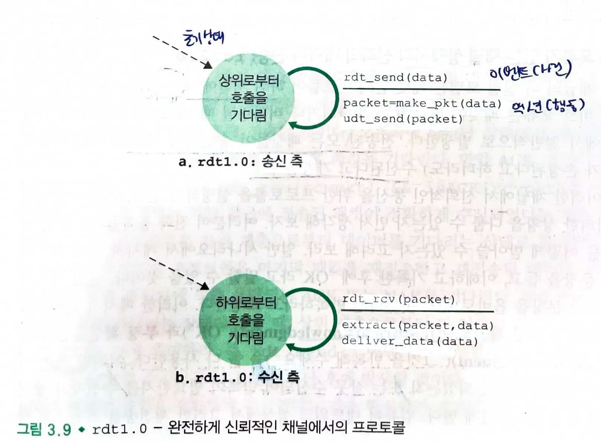

- 하위 채널이 완전히 신뢰적인 경우
- 송신
    - 상위 계층으로 데이터를 받아들이고, 데이터를 포함한 패킷을 생성하여 하위 계층으로 보낸다.
- 수신
    - 하위 계층에서 데이터를 수신하고, 패킷에서 데이터를 추출한 후 데이터를 상위 계층으로 전달한다.

### 비트 오류가 있는 채널 상에서의 신뢰적인 데이터 전송:  rdt 2.0
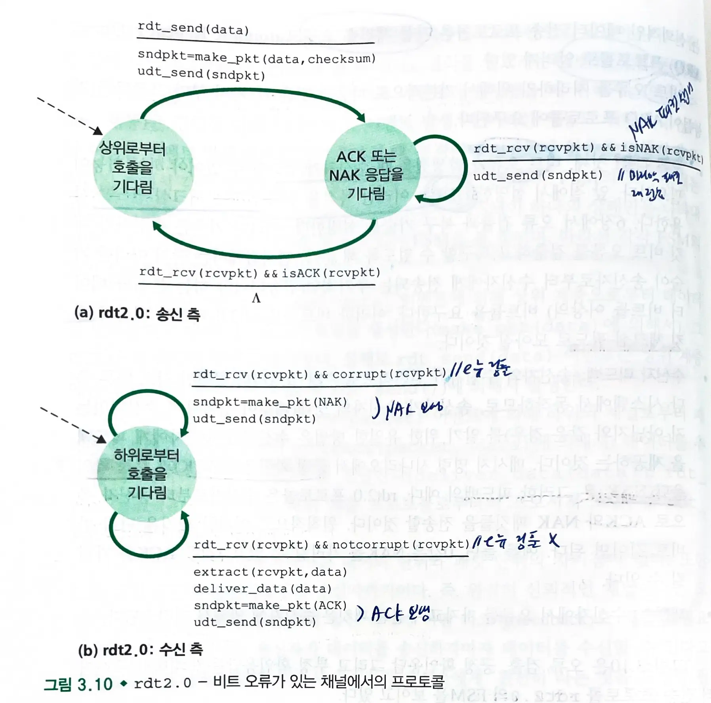

- 패킷 안의 비트들이 **하위 채널에서 손상**되는 모델
    - 패킷의 비트가 손상되지만 전송된 패킷들이 송신한 순서대로 수신된다고 가정
- 긍정 확인 응답 : **ACK**
    - 정확하게 수신되었는지 알려주는 제어 메세지
    - 수신자는 상위 계층으로부터 데이터를 기다리는 상태로 돌아간다.
- 부정 확인 응답 : **NAK**
    - 잘못 수신되어 반복(재전송)이 필요하다는 것을 알려주는 제어 메세지
    - 수신자는 마지막 패킷을 재전송하고 해당 패킷에 대한 ACK와 NAK를 기다린다.
> 전송 후 대기 프토토콜 : 송신자는 수신자가 현재의 패킷을 정확하게 수신했다는 것을 확신하기 전까지 새로운 데이터를 전달하지 않는다.

> 신뢰적인 데이터 전송 프로토콜은 자동 재전송 요구(ARQ) 프로토콜로 알려져 있다.

#### ARQ 프로토콜 요구사항
- **오류 검출**
    - 비트 오류가 발생했을 때 수신자가 검출한다.
    - UDP는 `인터넷 체크섬 필드`를 사용한다.
    - 수신자가 **패킷 비트 오류를 검출하고 복구**할 수 있다.
- **수신자 피드백**
    - 수신자가 송신자에게 잘 전달되었는지 피드백을 준다.
    - 긍정 확인응답(`ACK`), 부정 확인 응답(`NAK`)
- **재전송**
    - 수신자에서 오류를 가지고 수신된 패킷은 송신자에 의해서 재전송된다.

#### ACK나 NAK가 손상되었을 경우 해결방안
1. 재전송을 요청한다.
    - 재전송 요청 패킷이 손상된다면 패킷에 대한 재전송인지 피드백 재전송인지 인지하기 어렵다.
2. 송신자가 비트 오류를 해결할 수 있도록 충분한 체크섬 비트들을 추가한다.
    - 패킷이 손실될 수 있지만 즉각적으로 문제를 해결할 수 있다.
3. 현재 패킷을 재전송한다. (중복 패킷)
    - 수신시에 새로운 패킷인지 재전송된 패킷인지 알 수 없다.
      **=> 데이터 패킷에 순서번호를 추가하여 재전송하자.**

- **중복 ACK**
    - **손상된 패킷을 수신하면 가장 최근에 정확하게 수신된 패킷에 대해 ACK를 송신**한다. (=NAK 송신 효과)
    - 송신자는 중복 패킷을 받으면 다음 패킷을 정확하게 수신하지 못했다는 것을 안다.

### rdt 2.1 : 패킷에 순서번호 부여
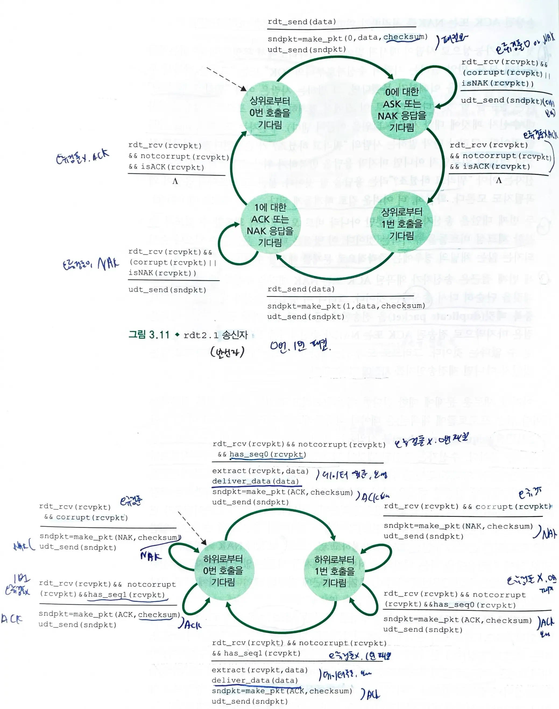

- 순서번호를 통해 중복 패킷을 판단한다.
    - 패킷에 순서번호를 포함하여 전송한다.
- **순서가 바뀐 패킷이 수신**되면, 수신자는 이미 **전에 수신한 패킷에 대한 ACK를 전송**한다.
    - 수신자는 ACK는 보내지만 기다리는 시퀀스를 게속 기다린다.
    - 송신자는 정상적으로 받은 패킷의 다음 패킷부터 재전송한다.
- **손상된 패킷이 수신**되면, 수신자는 **NAK를 전송**한다.

### rdt 2.2 : NAK 없는 신뢰적인 전송 프로토콜

- **ACK만 사용한다.**(NAK 제거하고 ACK에 순서번호를 붙여 사용한다.)
    - 순서가 바뀌거나 손상된 패킷이 수신되면 마지막으로 성공적으로 수신한 패킷의 ACK를 보낸다. (중복 ACK)
    - 수신자는 다른 순서번호의 ACK를 받으면 NAK으로 간주한다.
- 수신자는 **ACK에서 확인 응답시 패킷의 순서번호를 포함**해야한다.
    - 수신자는 ACK에 **마지막으로 올바르게 수신한 패킷의 순서번호를 포함**한다.
    - 송신자는 확인 응답된 **패킷의 순서번호를 검사**하여, 수신된 패킷의 순서번호가 이전 패킷의 순서번호일 경우 재전송한다.

### rdt 3.0: 비트 오류와 손실 있는 채널 상에서의 신뢰적 데이터 전송
- 하위 채널이 패킷을 손실하는 경우
    - 어떻게 손실된 패킷을 검출할까?
    - 패킷 손실이 발생했을 때 어떤 행동을 할 것인가?
- 송신자에게 손실된 패킷의 검출과 회복 책임을 부여한다.
    - 송신자가 충분한 시간을 기다린 후 패킷을 잃어버렸다는 확신이 들면 재전송한다.
> 손실이 일어났을만한 시간을 현명하게 선택하자.
- **카운트 다운 타이머**를 사용하여 주어진 시간이 경과된 후에 손신자를 인터럽트 한다.

#### 송신자의 동작
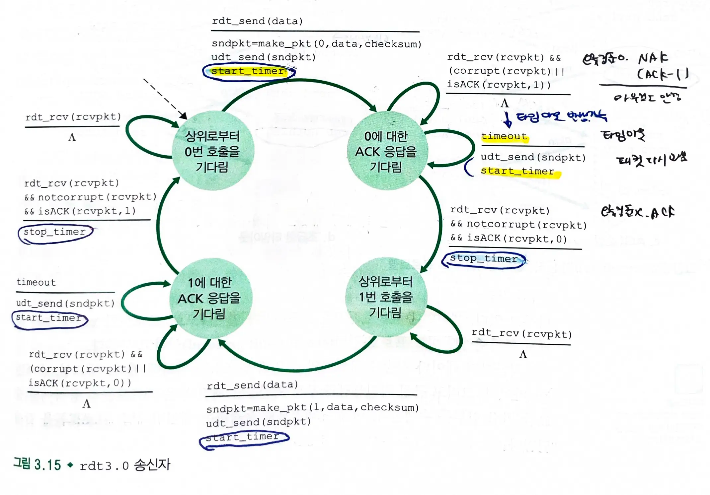

1.  매 패킷이 송신된 시간에 **타이머를 시작**한다.
2.  **타이머 인터럽트에 반응**한다.
3.  **타이머를 멈춘다**.

#### 얼터네이팅 비트 프로토콜
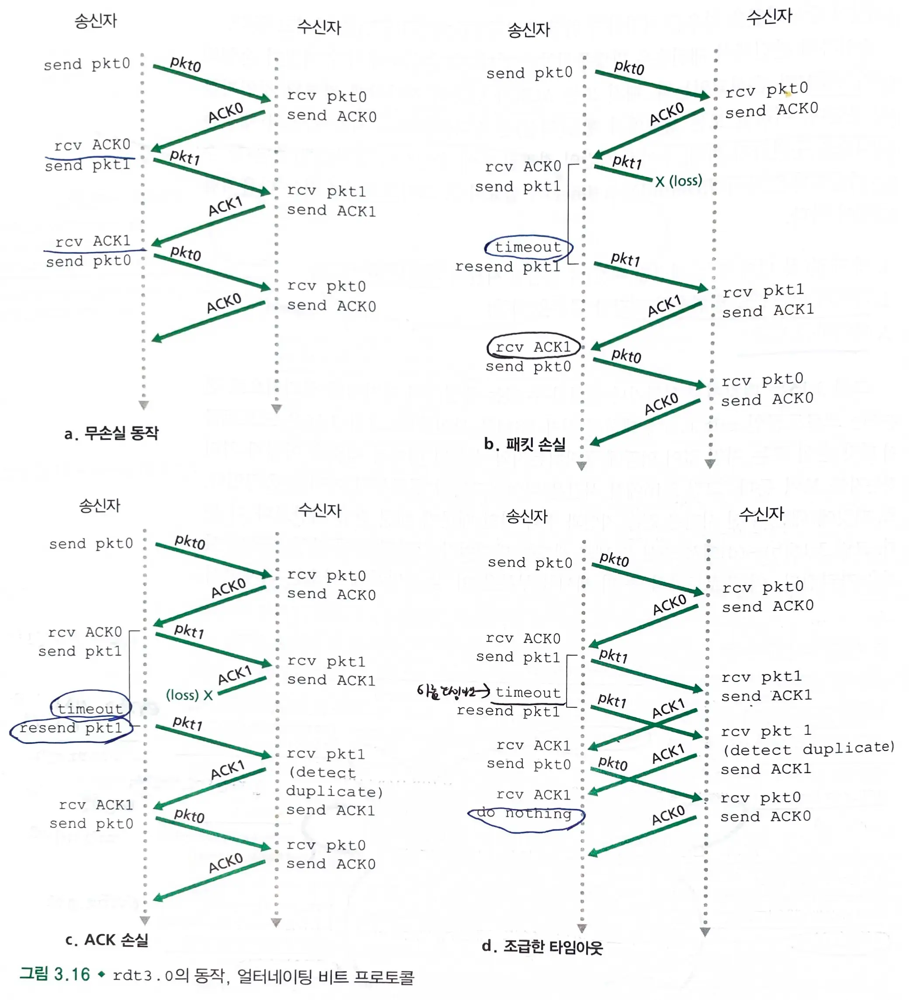

- 패킷의 순서번호가 0과 1이 번갈아 일어난다.
- 패킷 송신 후 일정 시간 내에 해당 패킷에 대한 ACK가 오지 않으면 패킷을 재전송한다.

## 3.4.2 파이프라인된 신뢰적 데이터 전송 프로토콜
### 이용률
- 데이터 전송 시간은 링크로 패킷을 전송하는 시간과 이동하는 시간의 합이다.
    - 실제 링크로 패킷을 전송하는 시간 대비 이동하는 시간이 훨씬 크다.
    - 이용률이 적어 성능 문제가 발생한다.
> 전송-후-대기 방식은 이용률이 낮다.

### 파이프라이닝
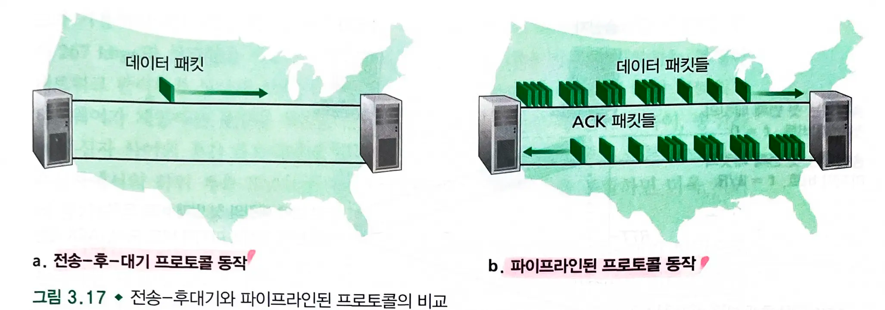

- **확인 응답을 기다리지 않고 여러 패킷을 전송하는 것**
    - 순서번호의 범위가 커져야한다.
    - 프로토콜의 송신 측과 수신 측은 한 패킷 이상을 버퍼링해야 한다.
        - 송신자는 전송하였으나 확인응답하지 않은 패킷을 버퍼링해야한다.
    - 파이프라인 오류 회복의 두가지 접근 방법은 **N부터 반복**과 **선택적 반복**이 있다.

## 3.4.3 N부터 반복(GBN)
- GBN 프로토콜
    - **송신자는 확인응답을 기다리지 않고 여러 패킷을 전송**할 수 있다.
    - 파이프라인에서 확인 응답이 안된 패킷의 최대 허용수 N보다 크지 않아야 한다.

### 송신자 관점의 순서번호 범위
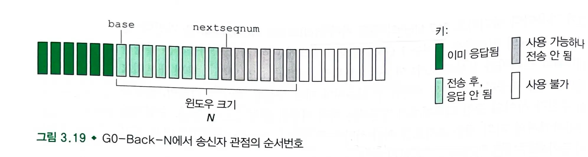

- base : 확인 응답(ACK)이 안 된 가장 오래된 패킷의 순서번호
- nextseqnum: 사용되지 않은 가장 작은 순서번호
    - 전송될 다음 패킷의 순서 번호
- **GBN** : **슬라이딩 윈도우 프로토콜**
    - N : 윈도우, 크기
    - `[0, base-1]` : 이미 전송되고 확인응답이 된 패킷
    - `[base, nextseqnum-1]` : 송신은 되었지만 확인 응답 되지 않은 패킷
    - `[nextseqnum, base+N-1]` : 상위 계층으로부터 데이터가 도착하면 바로 전송될 수 있는 패킷
    - `base+N ~` : base 이상의 순서번호를 가진 패킷이 ACK를 받을 때까지 사용될 수 없다.
- 패킷의 순서 번호는 패킷 헤더 안의 고정된 길이 필드에 포함된다.
    - k가 비트수라면 순서번호의 범위는 2^k - 1

#### GBN 송신자
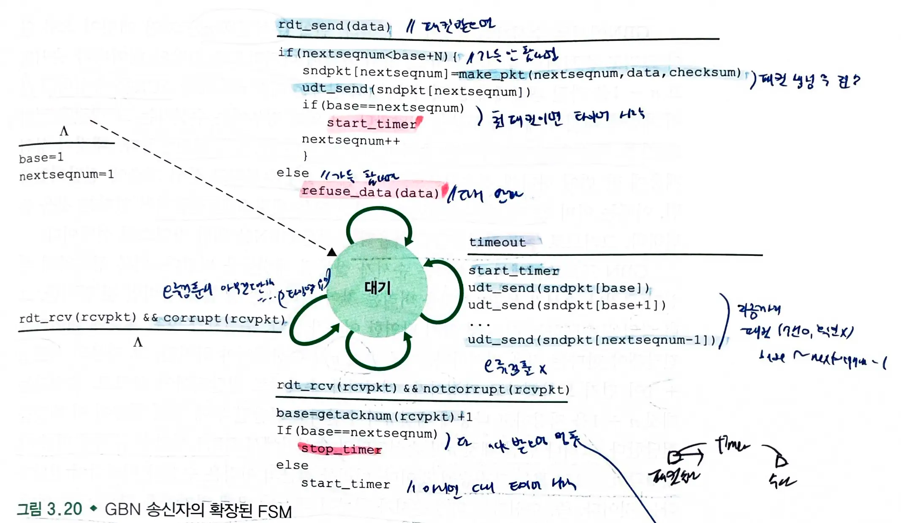

- **상위로부터 호출** : 상위 계층에서 `rdt_send`가 호출되면 N개의 확인 응답이 안 된 패킷이 있는지 확인한다.
    - 윈도우가 가득 차 있지 않다면 패킷이 생성되고 송신된다.
    - 윈도우가 가득 차 있다면 데이터를 상위 계층으로 반환한다.
- **ACK 수신** : ACK 수신시 순서번호는 누적 확인 응답을 나타낸다.
    - **`ACK n` : 올바르게 수신된 n을 포함하여, n까지의 순서번호를 가진 모든 패킷들에 대한 확인응답이다.**
- **타임아웃 이벤트**: 타임아웃 발생시 송신자는 이전에 전송되었지만 **확인 응답을 받지 않은 모든 패킷을 재전송**한다.
    - 타이머 : ACK는 수신되었지만 아직 확인 응답안 된 패킷이 존재한다면 타이머는 다시 시작된다.

#### GBN 수신자
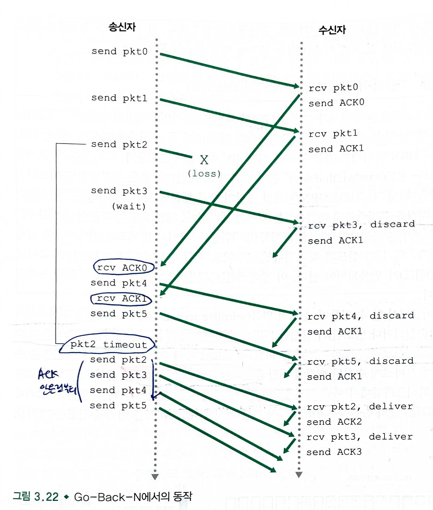

- 수신자는 **순서가 잘못된 패킷을 버리고** **가장 최근에 제대로 수신된 순서의 패킷에 대한 ACK를 재전송**한다.
    - 수신자는 어떤 순서가 잘못된 패킷에 대해 버퍼링할 필요가 없다.
    - 많은 재전송이 필요할 수 있다.

> GBN 프로토콜은 슬라이딩 윈도우 기반의 흐름 제어 및 오류 제어 방식이다.
> 송신자가 여러 패킷을 전송하고 **수신자는 오류 발생시 마지막으로 올바르게 수신한 패킷 이후의 모든 패킷을 재전송 요청**한다.

> 윈도우 크기는 SR 프로토콜에 대한 순서번호 공간 크기의 절반보다 작거나 같아야 한다.

## 3.4.4 선택적 반복(SR)
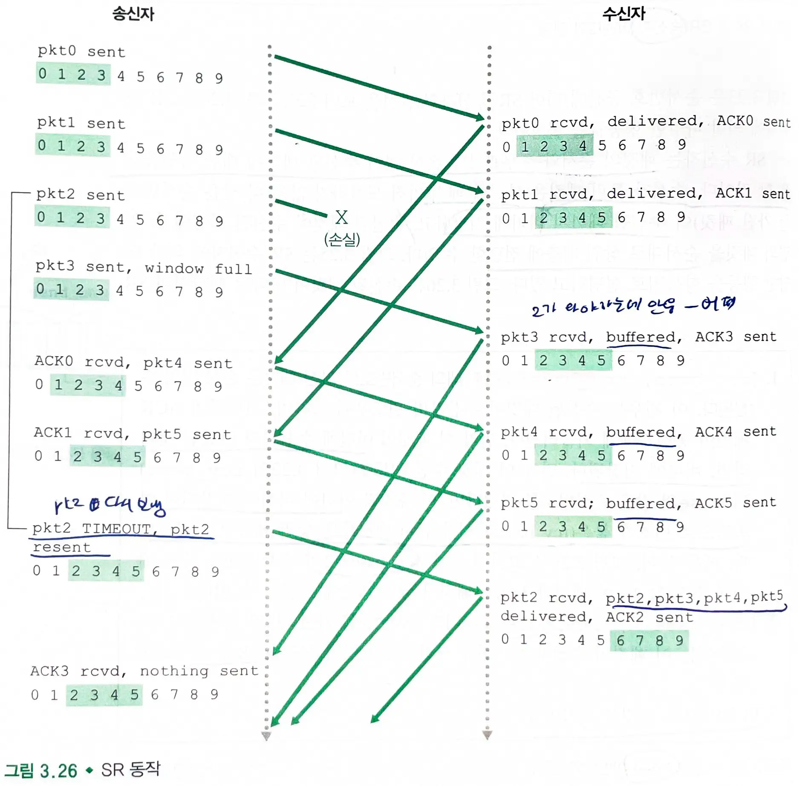

- GBN은 패킷 하나의 오류 때문에 많은 패킷을 불필요하게 재전송할 수 있다.
- **선택적 반복 프로토콜(SR, selective repeat)**
    - 수신자에서 **오류가 발생한 패킷을 수신했다고 의심되는 패킷만을 송신자가 다시 전송**한다.
    - 불필요한 재전송을 피한다.
        - 개별적인 확인응답을 요구한다.
    - 윈도우 크기는 아직 확인응답이 안된 패킷 수를 제한하는데 사용한다.

#### SR 송신자
1. **상위로부터 데이터를 받는다**.
    - 순서번호가 **송신자 윈도우 내에 있으면 데이터는 패킷으로 수신**된다.
2. **타임아웃**
    - 손실된 패킷을 보호하기 위해 사용된다.
    - 각 패킷은 **자신만의 논리 타이머**를 가진다.
3. **ACK 수신**
    - ACK가 수신되었을 때, SR 송신자는 **그 ACK가 윈도우에 있다면 그 패킷을 수신된 것으로 표기**한다.
    - 패킷 순서번호가 `send_base`와 같다면, **윈도우 베이스는 가장 작은 순서번호를 가진 아직 확인응답 되지 않은 패킷으로 옮겨진다.**
    - 윈도우 이동 후 윈도우 내의 순서번호를 가진 미전송 패킷이 있다면 패킷들을 전송한다.

#### SR 수신자
- 패킷의 순서와는 무관하게 손상 없이 수신된 패킷에 대한 확인응답을 한다.
    - 순서가 틀린 패킷은 분실된 패킷이 수신될 때까지 **버퍼에 저장**한다.
    - 손실된 패킷이 수신된 시점에서, 일련의 패킷을 순서대로 상위 계층에 전달한다.
1. `[rcv_base, rcv_base+N-1]` 내의 순서번호를 가진 패킷은 손상없이 수신된다.
2. `[rcv_base-N, rcv_base-1]` 내의 순서번호를 가진 패킷이 수신되면 이미 ACK를 보냈더라도 ACK를 보낸다.
    - **송신자와 수신자의 윈도우를 동기화**한다. (ACK가 손실되었을 수 있다.)
3. 그 외의 경우 패킷을 무시한다.

> SR 프로토콜은 슬라이딩 윈도우 기반의 흐름제어 및 오류 제어 방식으로,
> 오류가 발생한 특정 패킷만을 선택적으로 재전송하여 네트워크의 효율성을 높이는 프로토콜이다.

