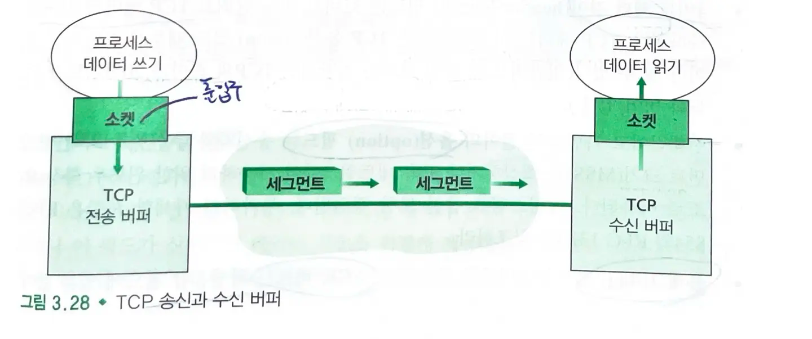
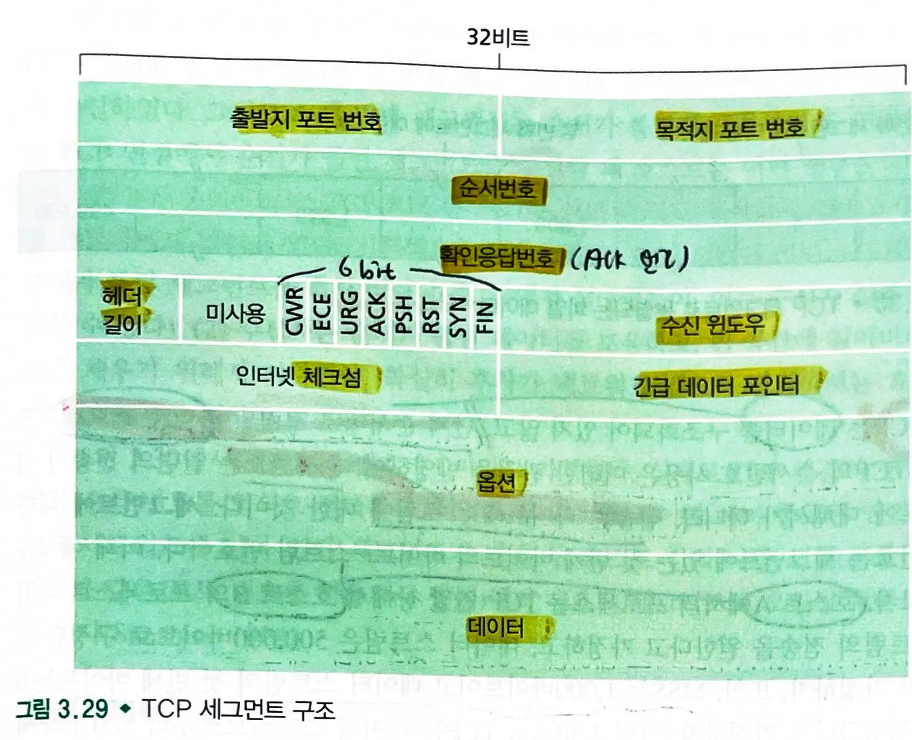
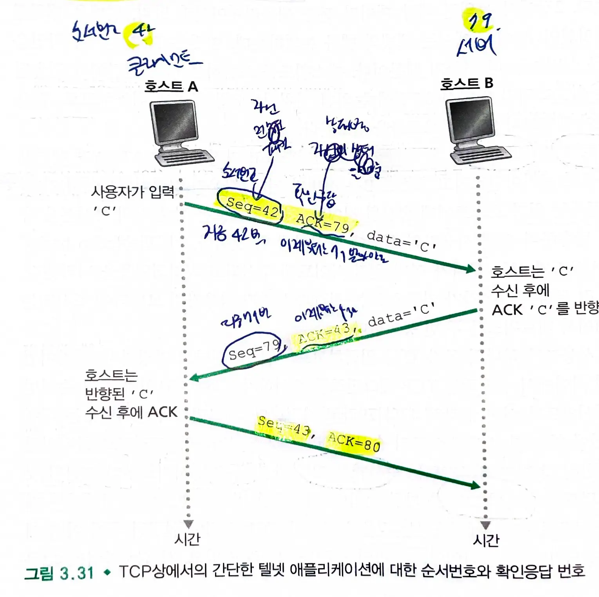
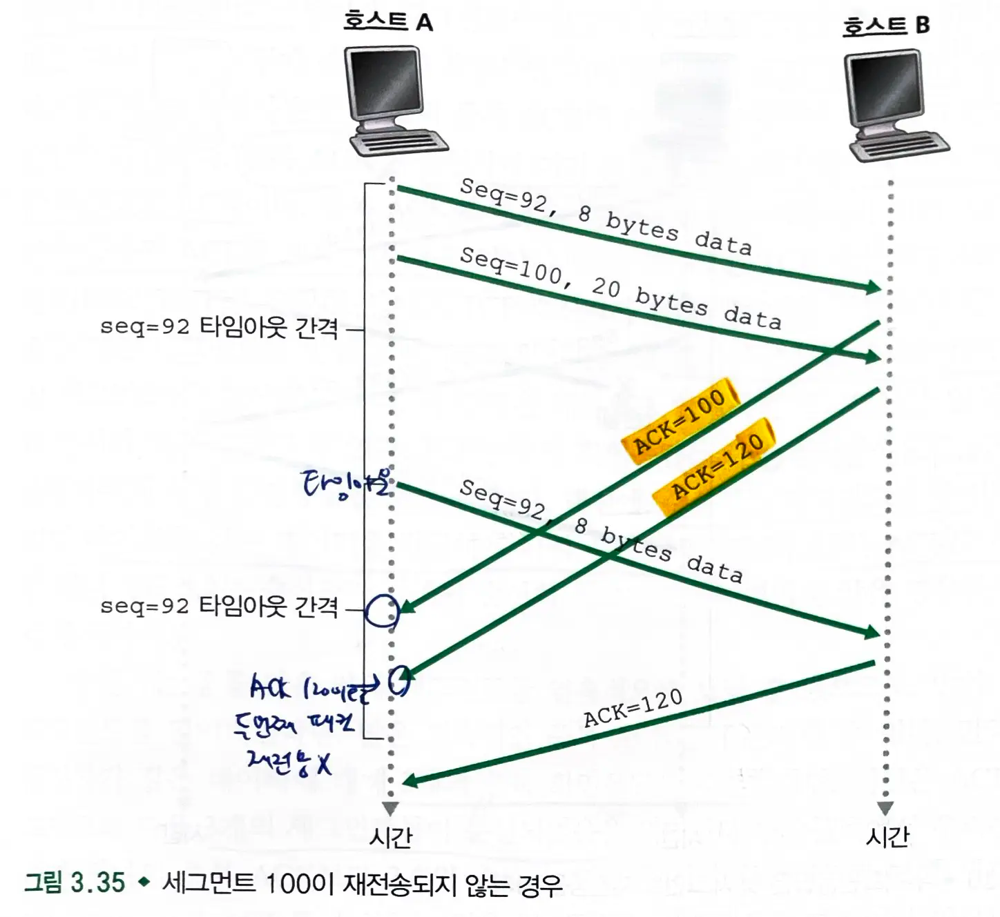
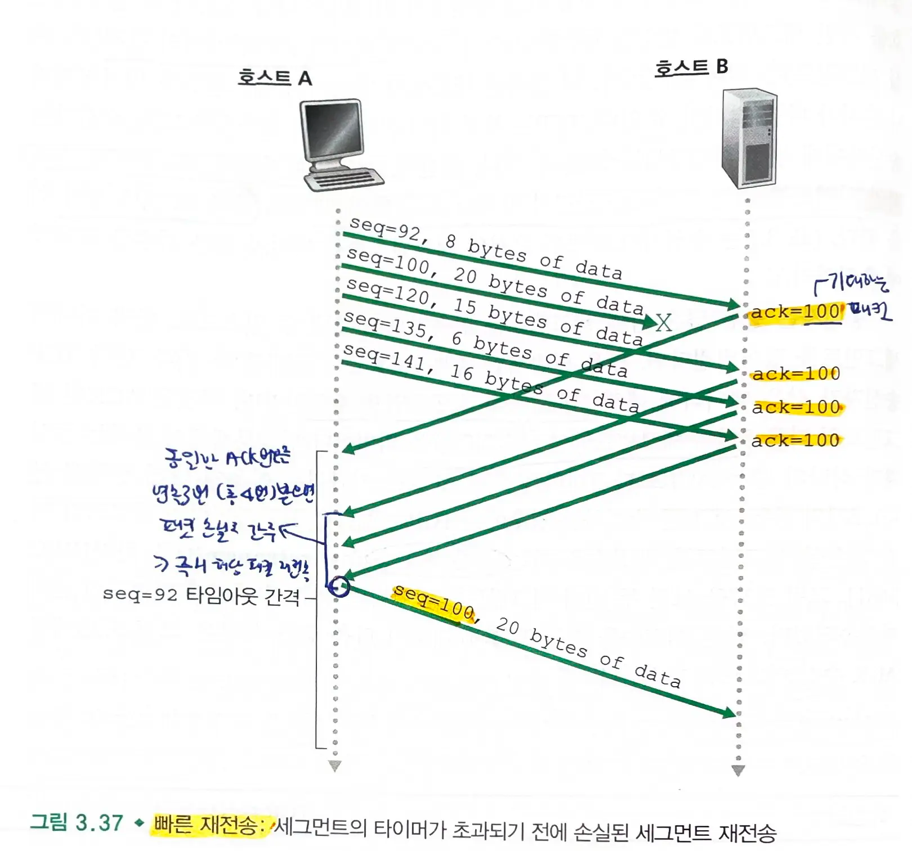
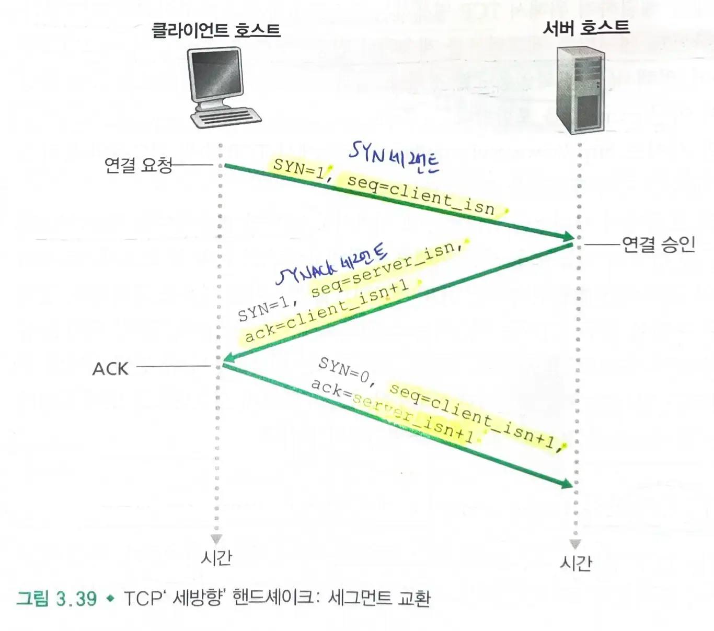
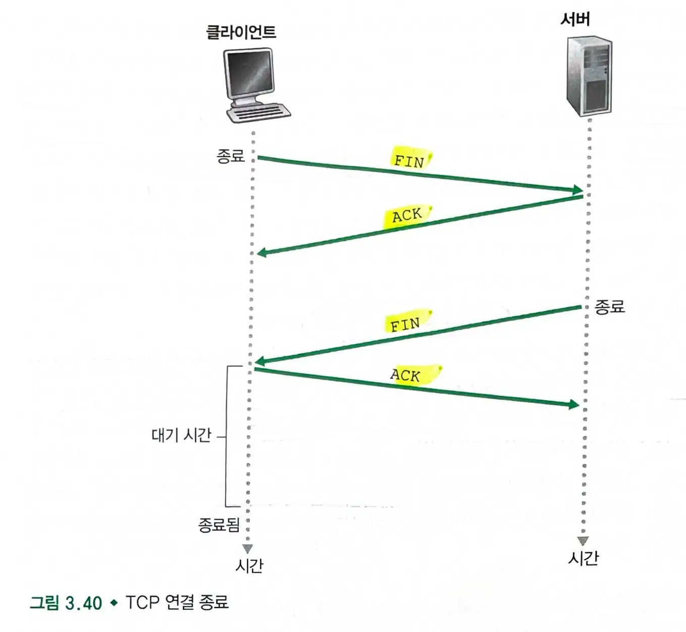
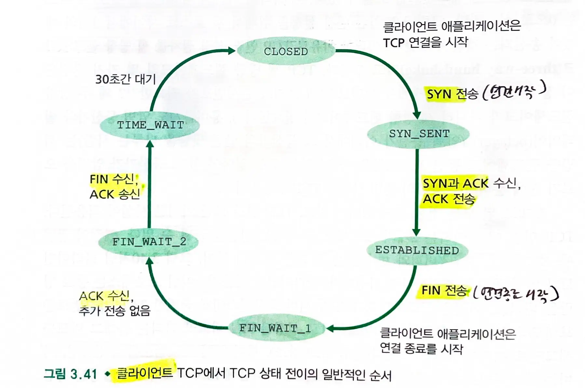
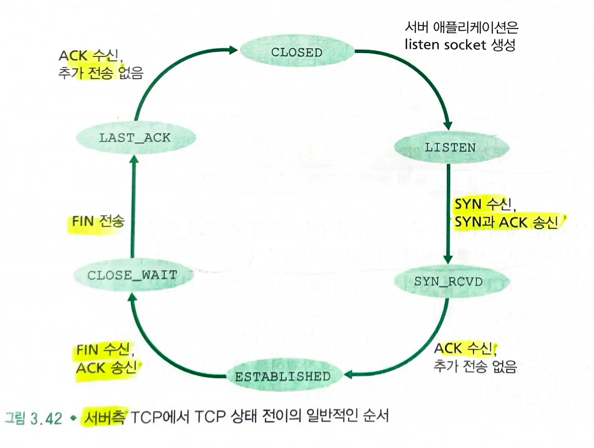

# 3.5 연결지향형 전송 TCP
## 3.5.1 TCP 연결
### TCP 특징
#### TCP는 연결지향형이다.
- 애플리케이션의 프로세스가 다른 프로세스에게 데이터를 보내기 전에 두 프로세스는 서로 **핸드쉐이크**를 해야 한다.
	- 연결 양단은 TCP 연결과 연관된 TCP 상태 변수를 초기화한다.

#### TCP는 종단 시스템에서만 동작한다.
- 중간의 네트워크 요소(라우터나 브리지)에서는 동작하지 않는다.
	- 중간 라우터들은 전혀 TCP 연결을 감지하지 못하고, 데이터그램만을 본다.

#### TCP 연결은 전이중 서비스(full-duplex)를 제공한다
- 호스트 A와 호스트 B 사이에 TCP 연결이있다면, 애플리케이션 데이터는 A에서 B로 흐르는 동시에 B에서 A로 흐를 수 있다.
> A <-> B

#### TCP 연결은 단일 송신자와 단일 수신자 사이의 점대점이다.
- 멀티 캐스팅(한 송신자가 여러 수신자게 데이터 전송)은 불가능하다.

### TCP 연결 수행 과정
- **클라이언트 프로세스** : 연결을 초기화하는 프로세스
- **서버 프로세스** : 다른 프로세스
	- 서버 : `socket()` : 소켓 생성, `bind()` : 소켓에 주소 할당, `listen()` : 연결 요청 대기

1. 클라이언트 프로세스는 서버의 프로세스와 연결을 설정하길 원한다고 TCP 클라이언트에게 알린다.
	- 클라이언트: `socket()`: 소켓 생성
2. 클라이언트의 전송 계층은 서버와의 **tcp 연결 설정**을 진행한다. (**세 방향 핸드쉐이크**)
	1. 클라이언트는 tcp 세그먼트를 보낸다.
	2. 서버도 tcp 세그먼트로 응답한다.
	3. 클라이언트는 tcp 세그먼트로 응답한다 (페이로드를 함께 보낼 수 있다.)
	- 클라이언트:`socket.connect()`
	- 서버 : `socket.accept()`
4. 데이터를 전송한다.
	- tcp는 전이중 통신이므로 클라이언트 서버 모두 `send()`, `recv()` 가능
> 소켓 프로그래밍을 통해 개발자는 저수준의 tcp 동작을 직접 다루지 않고 네트워크 통신을 구현할 수 있다.
> 소켓 프로그래밍은 소켓을 다루기 위한 도구이다.

### TCP 데이터 전송 과정


1. 클라이언트 프로세스는 데이터 스트림을 소켓을 통해 **TCP 계층으로 전달**한다.
2. TCP는 **세그먼트**를 만들어 **송신 버퍼**에 저장한다.
	- 데이터 스트림을 적절한 크기로 나누고, TCP 헤더를 추가하여 세그먼트를 생성한다.
	- 흐름 제어와 혼잡 제어를 통해 전송 속도를 조절한다.
3. 세그먼트가 TCP의 **수신 버퍼**에 전달되면, **애플리케이션**은 수신 버퍼에서 데이터의 스트림을 읽는다.
	- 수신된 세그먼트는 순서에 맞게 재조정되는 과정을 거친다.

#### 세그먼트 생성
- `TCP 헤더` + `클라이언트 데이터`
- 세그먼트는 네트워크 계층에 전달되며, 네트워크 계층 ip 데이터그램 안에 각각 캡슐화된다.

#### 세그먼트 크기
- TCP는 데이터를 최대 세그먼트 크기(`MSS - Maximum Segment Size`) 이하로 나눈다.
	- `MSS`는 헤더를 포함하지 않은 **애플리케이션 계층 데이터에 대한 최대 크기**이다. (순수 데이터 크기)
	- `MSS`는 최대 전송 단위(`MTU - Maximum Transmission Unit`)에 의해 결정된다.
		- MTU는 네트워크 **링크**에서 전송될 수 있는 가장 큰 패킷의 크기이다. (IP헤더와 TCP 헤더 크기 포함)
		- MSS = MTU - IP 헤더 크기 - TCP 헤더 크기
	- `TCP 세그먼트`와 `TCP/IP 헤더길이`가 링크 계층 프레임에 맞도록 정해진다.
> 물리 계층은 0과 1만 보내므로 데이터의 구조를 알지 못한다.
> 링크 계층은 전달되는 비트들을 프레임으로 구성하므로, MTU(링크 계층에서 전송될 수 있는 가장 큰 프레임의 크기)를 고려한다.

## 3.5.2 TCP 세그먼트 구조
- 헤더 필드와 데이터 필드로 구성된다.
- 데이터는 `MSS` 크기로 파일을 쪼갠다.



- **출발지 포트번호**와 **목적지 포트번호**
	- 다중화와 역다중화하는데 사용
- **순서번호**와 **확인응답번호(ACK)**
	- 세방향 핸드쉐이크의 `SYN-ACK`처럼 동시에 두 필드가 모두 사용될 수 있다.
- TCP **헤더 길이**
- **flag** 필드
	- `ACK` : 확인응답 필드가 유용한지
	- `CWR`, `ECE`: 명시적 혼합표시
	- `RST`, `SYN`, `FIN` : 연결 설정과 해제
	- `PSH`: 수신자가 상위 계층에 즉시 전달해야함
	- `URG` : 송신측 상위 계층 객체가 긴급으로 표시
- **수신 윈도우**
	- 흐름 제어에 사용, 수신자가 받아들이려는 바이트의 크기
- **인터넷 체크섬**
- **긴급 데이터 포인터**
	- URG 비트에서 긴급 데이터로 표시할 경우 긴급 데이터의 마지막 바이트 위치 나타냄
- **옵션**
- **데이터**

### 순서번호와 확인응답 번호
#### 순서번호
- TCP는 데이터를 바이트 스트림으로 본다.
	- 순서번호는 전송된 바이트의 스트림에 대한 것이다.
- 세그먼트의 순서번호: 세그먼트의 첫번째 바이트 - 스트림 번호(전체 스트림에서의 위치)
	- MSS가 1000이고 데이터 스트림이 500000바이트라면 순서번호는 0, 1000, 2000 ...

#### 확인응답번호


- TCP는 전이중 방식
	- 호스트 A가 자신의 세그먼트에 삽입하는 확인응답번호(ACK) : **호스트 A가 호스트 B로부터 기대하는 다음 바이트의 순서번호**
	- 누적 확인응답을 사용한다.

## 3.5.3 왕복시간 예측과 타임아웃

### 왕복시간 예측
- `SampleRTT`(왕복시간) : **세그먼트가 송신된 시간 ~ 세그먼트에 대한 긍정응답(`ACK`)이 도착한 시간**
	- 모든 세그먼트에 대한 SampleRTT를 전송하는 것이 아닌, 한번 전송된 세그먼트에 대해서만 측정한다.
	- RTT를 추정하기 위해 SampleRTT의 평균값(가중평균 = `EstimatedRTT`)을 채택한다.
- 가중평균(`EstimatedRTT`)은 예전 샘플보다 최근 샘플에 더 높은 가중치를 주는데, 이는 최근의 샘플들이 네트워크 상의 현재 혼잡을 더 잘 반영하기 때문이다. (지수적 가중 이동 평균)
```
EstimatedRTT = (1 - α) * EstimatedRTT + α * SampleRTT
```
> α는 일반적으로 0.125 (1/8)
- `DevRTT` : `SampleRTT`가 `EstimatedRTT`로부터 얼마나 많이 벗어나는지에 대한 예측
```
DevRTT = (1 - β) * DevRTT + β * |SampleRTT - EstimatedRTT|
```

- 타임아웃 간격
	- 타임아웃 값은 `EstimatedRTT`에 약간의 여유 값을 더한 값
	- `DevRTT`를 고려하여 값의 변화가 크면 여유값을 늘린다.
```
TimeoutInterval = EstimatedRTT + 4 * DevRTT
```

## 3.5.4 신뢰적인 데이터 전달
### TCP 송신자


1. 상위 애플리케이션으로부터 **데이터를 수신**한다.
	- 타이머가 실행중이 아니면 타이머를 시작한다.
2. **타임아웃 발생시 타임아웃을 일으킨 세그먼트를 재전송**하여 응답한 후 **타이머를 재시작**한다.
3. 수신자로부터 `ACK y`를 받는다.
	- `y` > `sendBase`이면 `sendBase`를 `y`로 업데이트한다.
		- `ACK y`는 `y-1`까지 잘 받았다는 뜻이다.
	- `sendBase` : 수신 확인응답이 확인되지 않은 가장 오래된 바이트의 순서번호

### 타임아웃 주기 2배로 설정
- 타임아웃 발생시 **아직 확인응답이 안된 가장 작은 순서번호를 가진 세그먼트를 재전송**한다.
- TCP는 재전송할때마다 **타임아웃 주기를 이전 값의 2배로 설정**한다.
	- `TimeoutInterval` : 0.75 -> 1.5 -> 3.0초 ...
		- 주기는 지수적으로 증가한다.
		- 제한된 형태의 혼잡 제어를 제공한다.
	- 데이터 수신과 `ACK` 수신 이후 타이머가 시작될때는 `EstimatedRTT`와 `DevRTT`의 값에서 TimeoutInterval을 계산한다.

### 빠른 재전송


- 타임아웃 주기가 때때로 길다
	- 송신자를 오래 기다리게 해서 종단간의 지연을 증가시킨다.
- 중복 ACK : 수신자는 마지막으로 올바르게 수신한 세그먼트의 다음번호(수신을 기대하는 번호)로 ACK를 보낸다.
- 만약 **송신자가 동일한 ACK 번호를 연속해서 3번 (총 4번 ) 받으면, 패킷 손실로 간주하고 빠른 재전송을 한다.**
	- 빠른 재전송 : 세그먼트의 타이머가 만료되기 전에 손실 세그먼트를 재전송

### TCP는 GBN과 SR 프로토콜의 혼합이다
- `GBN`
	- TCP 송신자는 **송신되고 확인응답 안된 바이트의 가장 작은 순서번호**(`sendBase`)와 **전송될 다음 바이트의 순서번호**(`NextSeqnum`)을 유지해야한다.
	- **하나의 타이머**만 갖는다.
- `SR`
	- **올바르게 수신되었지만 순서가 바뀐 세그먼트들을 버퍼링**한다.
	- 순서가 틀린 세그먼트에 대해 **선택적으로 확인응답**(ACK)을 한다.
=> **`TCP`는 `GBN`과 `SR` 프로토콜의 혼합**이다.

## 3.5.5 흐름 제어
- 호스트들은 연결에 대한 개별 수신 버퍼를 설정한다.
	- 송신자가 수신자의 수신 버퍼를 오버플로 시키는 것을 방지하기 위해 흐름제어 서비스를 제공한다.

### 흐름 제어 서비스( = 송신자 제어)
- 수신하는 애플리케이션이 **읽는 속도**와 송신자가 **전송하는 속도**를 같게 한다.
- 송신자는 **수신 윈도우** 변수를 유지하여 흐름제어를 제공한다.
	- **수신 윈도우** : 수신 측에서 가용한 버퍼 공간이 얼마나 되는지를 송신자에게 알려준다.
	- TCP는 전이중이므로 송신자도 별개의 수신 윈도울르 유지한다.

- A->B에게 파일을 전송한다
- **수신자**가 관리하는 변수
	- `LastByteRead`: 버퍼로부터 **읽은** 데이터 스트림의 마지막 바이트의 수
	- `LastByteRcvd` : **수신 버퍼에 저장**된 데이터 스트림의 마지막 바이트의 수
```
LastByteRcvd - LastByteRead <= RcvBuffer(버퍼 크기)
```
> 버퍼의 오버플로우를 막는다.
- `rwnd` : 버퍼의 여유 공간
```
rwnd = RcvBuffer - [LastByteRcvd - LastByteRead]
```
> 수신자는 송신자에게 전송하는 모든 세그먼트의 윈도우필드에 rwnd 값을 설정하여 **송신자에게 여유 공간을 알려준다.**
> rwnd는 동적이다.

- **송신자**가 관리하는 변수
	- `LastByteSent` : 보낸 데이터 스트림의 마지막 바이트 수
	- `LastByteAcked` : 확인 응답받은 데이터 스트림의 마지막 바이트 수
```
LastByteSent - LastByteAcked <= rwnd
```
> **전송 확인응답이 안된 데이터의 크기가 여유공간 이하가 되도록 유지**한다.

- 문제: 만약 호스트의 수신버퍼가 가득차고(`rwnd = 0`) 송신자도 더이상 보낼 것이 없다면?
	- 송신자는 차단되어 더이상 데이터를 보낼 수 없다.
		- 수신자가 더이상 수신할 수 없기 때문이다.
	- 이를 막기 위해, 수신 윈도우가 0일 때, **1바이트의 데이터(이미 수신한 데이터의 다음 바이트)로 세그먼트를 계속 전송**하도록 요구한다.
		- 세그먼트들은 수신자에 의해 긍정 확인응답(`ACK`)된다.
			- **송신자는 수신자의 버퍼 상태를 주기적으로 확인**한다.
	- 수신자의 애플리케이션의 버퍼의 데이터를 처리하면, **새로운 공간이 생긴다.**
		- rwnd 값으로 송신자에게 알리고, 정상적으로 데이터를 전송할 수 있다.

- **UDP는 흐름 제어를 제공하지 않는다.**
	- UDP는 데이터를 보내기만 하고, 수신자의 상태를 고려하지 않는다.
	- 프로세스는 버퍼로부터 한번에 하나의 전체 세그먼트를 읽는다.
	- 프로세스가 충분히 빠르게 데이터를 읽지 못한다면, **버퍼는 오버플로될 것이고 세그먼트를 잃어버릴 것**이다.

## 3.5.6 TCP 연결 관리
### TCP 연결 설정 (세 방향 핸드쉐이크)


1. 클라이언트측 TCP는 서버 TCP에게 SYN 세그먼트를 보낸다.
	- 세그먼트 헤더에 SYN 비트라는 플래그 비트를 가진다.
	- 순서번호(`client_isn`)을 함께 보낸다.
	- `syn` = 1
	- `seq` = `client_isn`
2. 서버는 SYN 세그먼트를 받고 ACK(연결 승인) 세그먼트와 함께 SYN를 보낸다. (**SYNACK** 세그먼트)
	- 자신의 순서번호(`server_isn`)을 함께 보낸다.
	- `syn` = 1
	- `seq` = `server_isn`
	- `ack` = `client_isn + 1`
3. 클라이언트는 서버에게 연결 승인 세그먼트를 보낸다.
	- `syn` = 0 (연결 설정)
	- `seq` = `client_isn + 1`
	- `ack` = `server_isn + 1`

### TCP 연결 종료


- 연결이 끝나면 호스트의 자원은 회수된다.
1. 클라이언트는 `FIN` 비트를 헤더에 포함한 세그먼트를 보낸다.
2. 서버는 확인 세그먼트(`ACK`)를 보낸다.
3. 서버도 헤더에 `FIN` 비트를 포함한 세그먼트를 보낸다.
4. 클라이언트는 확인 세그먼트(`ACK`)를 보낸다.

#### 클라이언트 TCP 상태


#### 서버 TCP 상태


### RST 세그먼트
- 호스트가 호스트와 관련없는 포트 번호와 출발지 IP 주소를 가진 TCP 세그먼트를 수신한다면?
	- 호스트는 출발지에게 RST 세그먼트(리셋 세그먼트)를 보낸다.
	- RST 세그먼트(리셋 세그먼트)는 TCP 연결을 즉시 강제로 종료한다.

### nmap 포트스캐닝
- 출발지 호스트는 목표 호스트로부터 **TCP SYNACK 세그먼트**를 수신한다.
	- nmap은 open을 반환한다.
- 출발지 호스트는 목표 호스트로부터 **TCP RST 세그먼트**를 수신한다.
	- 목표 호스트가 해당 포트에 대해 애플리케이션을 실행하지 않음을 의미한다.
	- 세그먼트가 출발지와 목표 호스트간의 경로 상에서 방화벽에 의해 차단되지 않았음을 알 수 있다.
- 출발지가 아무것도 받지 않는다.
	- SYN 세그먼트가 중간에 있는 **방화벽에 의해 차단**되어 목표 호스트에 도달하지 않았음을 알 수 있다.
