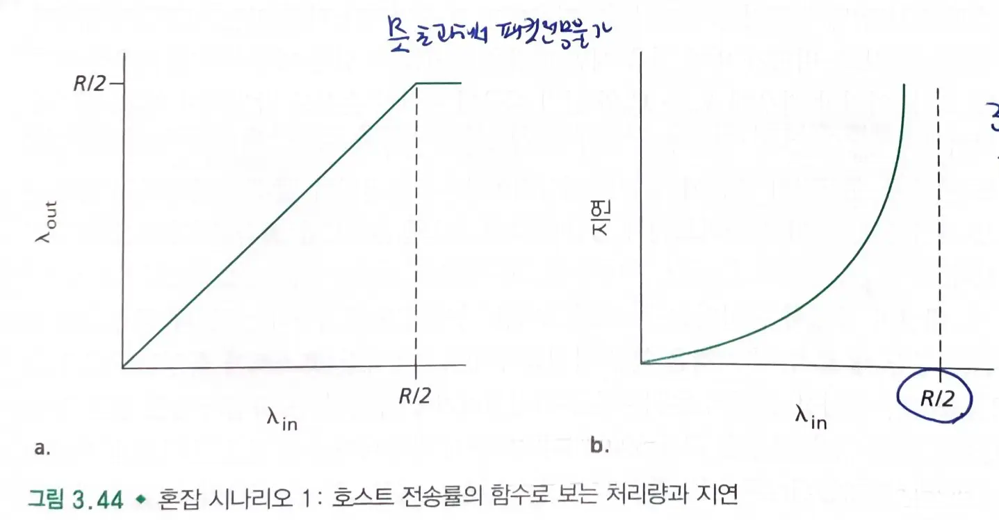
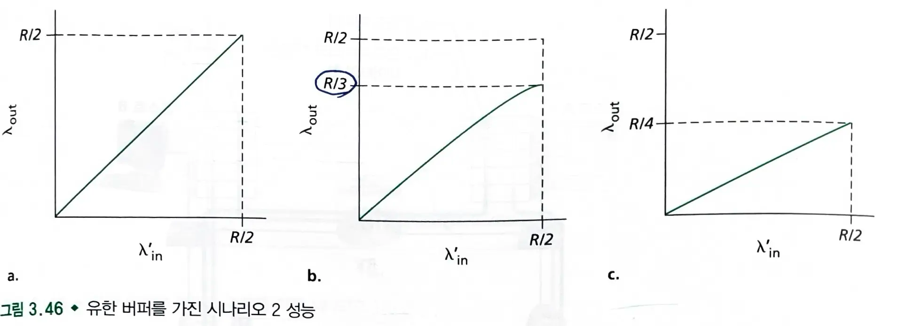
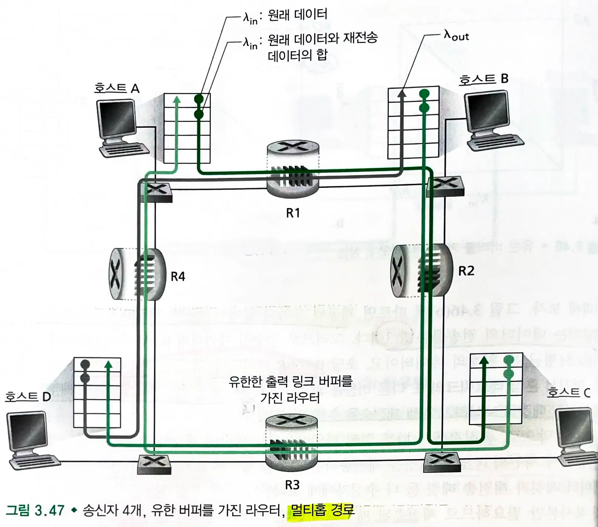
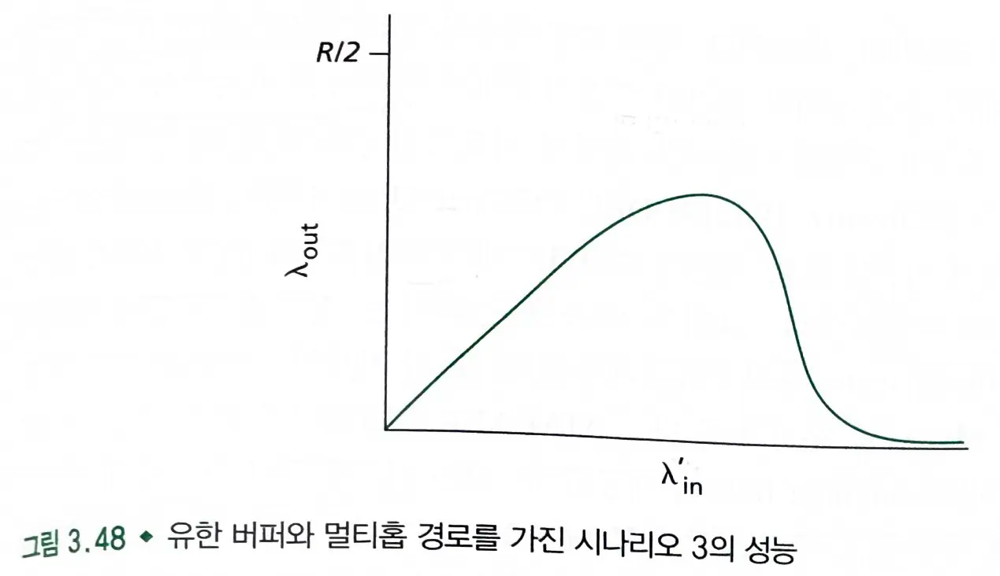
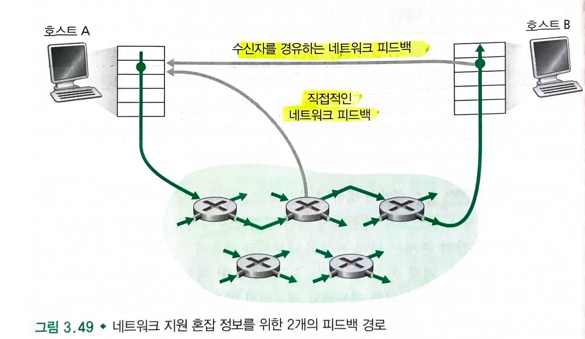

# 3.6 혼잡제어의 원리

## 3.6.1 혼잡의 원인과 비용

### 시나리오 1. 2개의 송신자와 무한 버퍼를 갖는 라우터

1. 수신자측 처리량은 송신자의 전송률과 같지만, 전송률이 R/2 이상일때, 처리량은 R/2이다.
2. 패킷 도착률이 링크 용량에 근접함에 따라 큐잉 지연이 커진다.

### 시나리오2. 2개의 송신자와 유한 버퍼를 가진 라우터
#### 가정
- 라우터의 버퍼의 양이 유한하다고 가정한다.
    - 버퍼가 가득차면 패킷들은 버려진다.
- 각 연결은 신뢰적이라고 가정한다.
    - 패킷이 라우터에 의해 버려지면, 송신자에 의해 재전송된다.

#### 용어
- **손실률** : 애플리케이션이 **원래의 데이터**를 소켓으로 보내는 송신율
- **제공된 부하** : **원래 데이터와 재전송된 데이터를 포함한 세그먼트**를 송신하는 전송 계층에서의 송신율

#### 1. 버퍼가 비어있을 경우에만 패킷을 송신하는 경우
- 송신율은 제공된 부하와 같다.
    - 패킷을 재전송하지 않기 때문이다.

#### 2. 패킷이 확실히 손실된 것을 알았을 때만, 송신자가 재전송하는 경우
- 제공된 부하가 `0.5R`이라면, 제공된 부하에서 수신자 애플리케이션으로 전달되는 데이터 전송률은 `R/3`이다.
    - 원래의 데이터 : 0.5R 중 0.333R
    - 재전송 데이터 : 0.5 - 0.3333 = 1.66R 바이트/초
> 송신자는 버퍼 오버플로 때문에 버려진 패킷을 보상하기 위해 재전송을 해야한다.

#### 3. 송신자에서 일찍 타임아웃을 해서 패킷이 손실되지 않았지만 재전송하는 경우
- 원래의 데이터 패킷과 재전송된 패킷 모두 수신자에게 도착한다.
    - 수신자는 하나의 패킷만 필요하므로 **재전송된 패킷은 버린다.**
- 패킷이 두번씩 전달되므로 제공된 부하가 `R/2`일 때 처리량은 `R/4`를 가진다.
> 커다란 지연으로 인한 송신자의 불필요한 재전송은 라우터가 패킷의 불필요한 복사본들을 전송하는데 링크 대역폭을 사용하는 원인이 된다.

### 시나리오 3. 4개의 송신자와 유한 버퍼를 가지는 라우터, 멀티홉 경로

- A~C 트래픽은 B~D 트래픽과 `R2` 라우터의 버퍼 공간을 경쟁해야한다.
    - A~C 트래픽의 양은 B~D에서 제공된 부하가 크면 클수록 더 작아진다.
    - 트래픽이 많은 경우 A~C 종단간 처리율이 0이 된다.
    - 제공된 부하와 처리량 간의 `tradeoff`
- 패킷이 `R2` 라우터에서 버려질 때마다 `R1`에서 수행된 작업은 헛된 것이 된다.
    - 전송 패킷을 선택할 때, 라우터가 이미 여러 개의 상향 라우터들을 거친 패킷에게 우선순위를 주는 것이 좋다.
> 패킷이 경로 상에서 버려질 때, 버려지는 지점까지 패킷을 전송하는데 사용된 상위 라우터에서 사용된 전송 용량은 헛된 것이다.

## 3.6.2 혼잡제어에 대한 접근법
- 네트워크 계층이 전송 계층에게 혼잡 제어를 목적으로 제공하는 2가지 방법이 있다.

#### a. 종단간의 혼잡제어
- **네트워크 계층은 전송 계층에게 혼잡제어를 위한 어떠한 직접적인 지원도 제공하지 않는다.**
    - 네트워크 혼잡은 관찰된 네트워크 행동에 기초하여 **종단 시스템이 추측**해야한다.
- **타임아웃 또는 3중 중복 ACK**가 나타날 때, TCP 세그먼트 손실이 네트워크 혼잡으로 인해 발생한 것으로 유추한다.
    - 이에 따라 윈도우 크기를 줄인다.
- **증가하는 왕복 지연값**을 네트워크 혼잡 증가를 나타내는 것으로 유추할 수도 있다.

#### b. 네트워크 지원 혼잡제어
- 네트워크 계층 구성요소는 네트워크 안에서 **혼잡 상태와 관련하여 송신자에게 직접적인 피드백을 제공**한다.
    - ATM 안에서 ABR 혼잡제어로 사용된다.
        - 라우터가 출력 링크에 제공할 수 있는 전송률을 송신자에게 알린다.
    - XCP 프로토콜은 라우터가 계산하여 피드백을 제공한다.

- 피드백 방법

1. **직접 피드백 :** 네트워크 라우터에서 송신자에게 보낸다.
2. 송신자 -> 수신자 패킷안의 특정 필드에 **표시**한다.
    - 왕복 시간이 걸린다.
