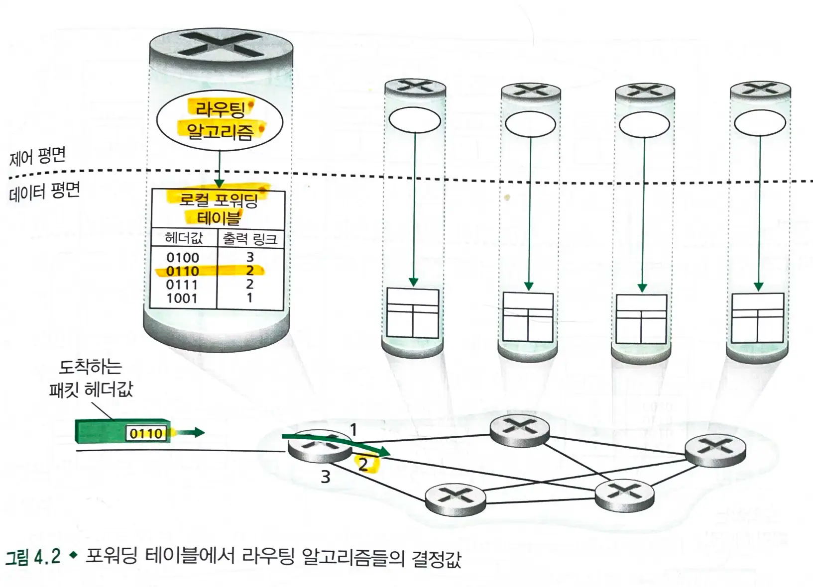

# 4.1 네트워크 계층 개요

- 호스트 H1, 호스트 H2
  - H1이 H2에게 정보를 보낸다
  - H1의 네트워크 계층은 전송 계층으로부터 `세그먼트`를 받아 `데이터그램`으로 **캡슐화**하고, 라우터에게 데이터그램을 보낸다.
  - 수신 호스트인 H2는 데이터그램으로 받아 세그먼트를 **추출**하여 전송 계층으로 전달한다.

### 네트워크 계층은 `데이터 평면`과 `제어 평면`으로 나뉜다.

- **데이터 평면** : 입력 링크에서 출력 링크로 **데이터그램을 전달**하는 것
  - `IP 포워딩`과 `일반화된 포워딩`
  - `IPv4`, `IPv6` 프로토콜과 `어드레싱`
- **제어 평면** : 데이터그램이 송신 호스트에서 목적지 호스트까지 전달되게끔 **로컬, 퍼 라우터 포워딩 조정**하는 것
  - **네트워크-와이드 논리**: 송신 호스트에서 수신 호스트까지 데이터그램이 라우터들을 어떻게 지나갈 것인지
  - `OSPF`, `BGP` 라우팅 프로토콜
  - `SDN`

## 4.1.1 포워딩과 라우팅 : 데이터 평면과 제어 평면

### 네트워크 계층의 역할

- 근본적인 역할은 `송신 호스트`에서 `수신 호스트`로 **패킷을 전달**하는 것이다.
- 이를 위한 2가지 네트워크 계층의 주요 기능이 있다.

#### 1. 포워딩 (전달)

- 패킷이 라우터의 입력 링크에 도달했을 때 **라우터는 그 패킷을 적절한 출력 링크로 이동**시켜야 한다.
  - `호스트 H1`이 보낸 패킷이 `라우터 R1`에 도착했을 때, `R1`은 `호스트 H2`로 가는 경로 상에 있는 **다음 라우터로 전달**되어야 한다.
- **데이터 평면**에 구현된 기능이다.
- 매우 짧은 시간(몇 나노초) 단위이며 하드웨어에서 실행된다.

#### 2. 라우팅

- **라우팅 알고리즘**: 송신자가 수신자에게 패킷을 전송할 때 네트워크 계층은 **패킷 경로를 결정**한다.
  - `호스트 H1`에서 `호스트 H2`로 **패킷 전송 라우팅**은 **제어 평면**에서 실행된다.
- 네트워크 전반에 걸쳐 출발지에서 목적지까지 데이터그램의 종단간 경로를 결정한다.
- 더 긴 시간(보통 초) 단위를 갖기에 `소프트웨어`에서 보통 실행된다.

#### 예시) 운전

- 펜실베이니아에서 플로리다까지의 여행
- `포워딩`
  - 여행 중 한 교차로를 지나는 과정
  - 도로에서 **교차로를 지날때 어떤 도로를 드러설지 결정**
- `라우팅`
  - 펜실베이니아에서 플로리다까지 여행을 계획하는 과정
  - 여행을 시작하기 전, 지도를 보며 매 교차로에서 어떤 도로를 선택할지 **이용 가능한 경로를 선택**

#### 포워딩 테이블

- 라우터는 도착하는 `패킷 헤더의 필드 값`을 조사하여 패킷을 포워딩한다.
  - 패킷 헤더의 필드 값을 라우터의 포워딩 테이블의 `내부 색인(index)`로 사용한다.
  - `포워딩 테이블 엔트리`에 저장되어 있는 헤더의 `값`은 해당 패킷이 전달되어야 할 라우터의 `외부 링크 인터페이스`를 나타낸다.

> key: 헤더 값 - value: 링크 인터페이스

- 예시
  - 헤더 값이 `0110`인 패킷이 라우터에 도착한다.
  - 라우터는 내부적으로 이 패킷을 인터페이스 2(외부 링크 인터페이스)로 전달한다.

### 제어 평면: 전통적인 접근

- 첫 `포워딩 테이블`은 어떻게 구성될까?
  - `라우팅`(제어 평면)과 `포워딩`(데이터 평면) 사이의 상호작용
- **`라우팅 알고리즘`은 라우터의 `포워딩 테이블`의 내용을 결정한다.**
  - 라우팅 알고리즘은 각각의 **모든 `라우터`에서 실행**된다.
    - 라우터는 `포워딩`과 `라우팅` 기능 모두를 가지고 있어야 한다.
  - **한 라우터의 `라우팅 알고리즘` 기능은 다른 라우터의 `라우팅 알고리즘`과 소통하며 `포워딩 테이블`의 값들을 계산한다.**
    - 라우팅 프로토콜에 따라 라우팅 정보에 포함된 `라우팅 메세지`를 교환하며 이루어진다.

### 제어 평면 : SDN

- **`원격 컨트롤러` 컴퓨터가 각각의 `라우터`에 의해 사용될 `포워딩 테이블`을 분배하는 방법**
  - `원격 제어`가 포워딩 테이블을 계산하고 배분하는 동안, `라우팅` 기기는 `포워딩`만을 수행한다.
  - `원격 컨트롤러`는 높은 신뢰성과 중복성을 갖춘 `원격 데이터 센터`에 설치될 수 있으며, `ISP` 혹은 다른 `제 3자`에 의해 관리될 수 있다.
- `원격 컨트롤러`와 `라우터`는 `포워딩 테이블과 다른 라우팅 정보들을 포함한 메세지`를 교환함으로써 **소통**할 수 있다.
- `SDN` (Software defined networking)
  - 네트워크가 `소프트웨어적으로 정의`되었을 때, **포워딩 테이블을 계산하는 컨트롤러**는 라우터와 상호작용을 하며 **소프트웨어에서 실행**된다.

## 4.1.2 네트워크 서비스 모델

- 송신 호스트의 전송 계층이 패킷을 네트워크로 보낼 때 목적지까지 패킷을 전달한다는 것을 믿을 수 있을까?
- 여러 패킷이 전송될때, 보낸 순서와 동일하게 수신 호스트의 전송 계층에 전달될 수 있는가?
- 연속적인 두 패킷의 송신 시간이 패킷 수신시 걸리는 시간과 동일한가?
- 네트워크가 네트워크 혼잡에 대한 피드백을 제공할 수 있는가?
- 송신 호스트와 수신 호스트에서 전송 계층을 연결하는 채널의 추상적인 관점은 무엇인가?

### 네트워크 서비스 모델

- 송수신 호스트간 **패킷 전송 특성을 정의**한다.
- `보장된 전달`: 패킷이 소스 호스트에서부터 목적지 호스트로 도착하는 것을 보장한다.
- `지연 제한 이내의 보장된 전달`: 패킷의 전달 보장 뿐 아니라 호스트간의 특정 지연 제한 안에 전달한다.
- `순서화 패킷 전달`: 패킷이 목적지에 송신된 순서로 도착한다.
- `최소 대역폭 보장`: 송신과 수신 호스트 사이에 특정한 비트 속도의 전송 링크를 모방한다.
  - 일정 수준 이상의 데이터 전송 속도를 보장한다.
  - 특정한 비트 속도 이하(약속된 대역폭 이하)로 전송하는 한, 모든 패킷이 목적지 호스트까지 전달된다.
- `보안 서비스`: 네트워크 계층은 모든 데이터그램을 소스 호스트에서는 `암호화`, 목적지 호스트에서는 `해독`을 할 수 있게 하여 전송 계층의 모든 세그먼트들에 대해 **기밀성을 제공**하여야한다.

### 최선형 서비스 모델

- 인터넷 네트워크 계층은 `최선형 서비스`를 제공한다.
- `최선형 서비스`: 패킷을 보내는 순서대로 수신됨을 보장할 수 없을 뿐만 아니라, 목적지까지의 전송 자체도 보장될 수 없다.
  - `종단 시스템간 지연` 또한 보장되지 않으며, 보장된 `최소 대역폭` 또한 없다.
- 광범위한 애플리케이션이 실행될 만큼, 충분히 좋다고 입증되고 있다.

### 포워딩 vs 스위칭

- `패킷 스위치` : 패킷 헤더 내부의 필드값에 따라 입력 링크 인터페이스에서 출력 링크 인터페이스로 **패킷을 전달**
  - `링크 계층 스위치(2계층)`: **링크 계층 프레임의 필드 값**에 근거하여 `스위칭` 결정
    - 로컬 네트워크 내에서 작동
  - `라우터(3계층)`: **네트워크 계층 필드 값**에 근거하여 `포워딩` 결정
    - 서로 다른 네트워크 간에 작동

> 여기서는 패킷 스위치 대신 라우터라는 용어를 사용한다.

