# 4.2 라우터 내부에는 무엇이 있을까?

### 라우터 구조

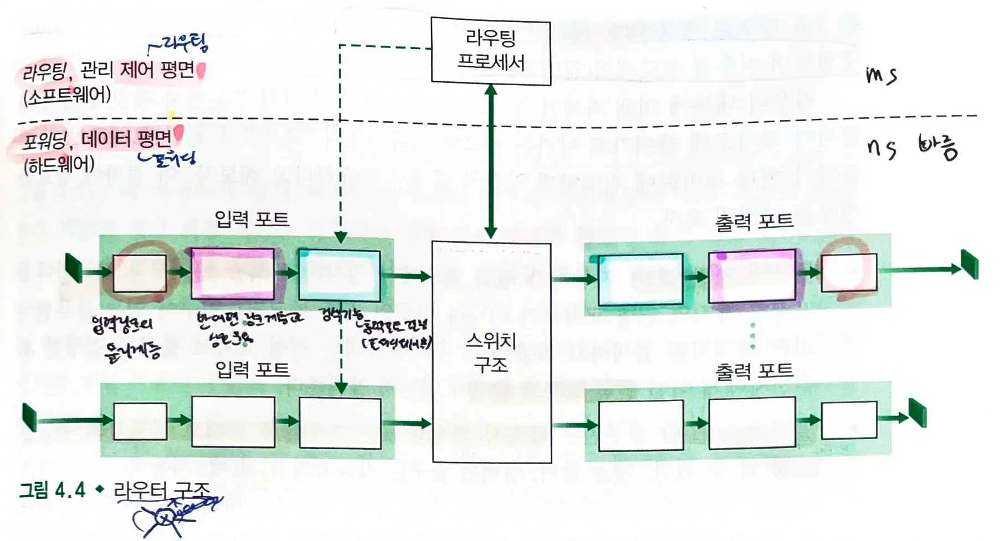

#### 입력 포트

- 첫번째 상자: 입력 링크의 `물리 계층` 기능 수행
- 중간 상자: 입력 링크의 반대편에 있는 `링크 계층`과 상호 운용
- 세번째 상자: 입력 포트에서 `검색 기능` 수행
  - 포워딩 테이블을 참조하여 도착한 패킷이 스위칭 구조를 통해 전달되는 **라우터 출력 포트 결정**
- 제어 패킷은 `입력 포트`에서 `라우팅 프로세서`로 전달된다.
  - `포트`: 물리적인 입출력 라우터 인터페이스

#### 스위칭 구조

- 라우터의 `입력 포트`와 `출력 포트`를 연결
- 라우터 내부에 포함되어 있다.

#### 출력 포트

- 스위칭 구조에서 **수신한 패킷을 저장**하고 필요한 링크 계층 및 물리적 계층 기능을 수행하여 **`출력 링크`로 패킷을 전송**한다.
- 링크가 `양방향`일 때, `출력 포트`는 일반적으로 동일한 링크의 **`입력 포트`와 한 쌍을 이룬다.**

#### 라우팅 프로세서

- **제어 평면 기능**을 수행한다.
- `기존의 라우터`(전통적인 라우터)
  - `라우팅 프로토콜`을 실행하고 라우터의 `포워딩 테이블`을 계산한다.
  - 입력 포트에서 중앙의 포워딩 테이블을 참조하여 포워딩 결정을 내린다.
- `SDN`
  - `원격 컨트롤러`와 통신하여 원격 컨트롤러에서 계산된 **포워딩 테이블 항목을 수신**하고, 라우터의 **입력 포트에 설치**한다.
  - 입력 포트에서 패킷이 도착하면 바로 포워딩 결정 가능
- `네트워크 관리 기능`을 수행한다.

### 데이터 평면, 제어 평면 구현 방식

- `데이터 평면`인 `입력 포트`, `스위칭 구조`, `출력 포트`는 거의 `하드웨어`로 구현된다.

> 데이터 평면이 나노초로 작동하는 동안, 라우터의 제어 기능은 좀 더 긴 밀리초 또는 2초 단위로 작동한다.

- `제어 평면`은 일반적으로 `소프트웨어`로 구현되며, `라우팅 프로세서`에서 실행된다.

## 4.2.1 입력 포트 처리 및 목적지 기반 전달

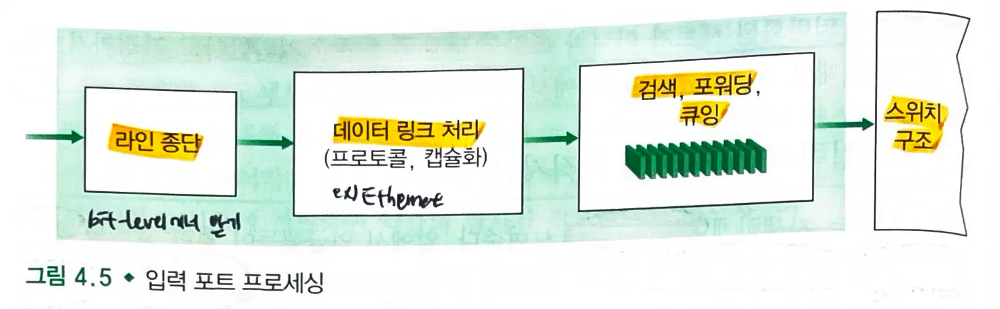

- 입력 포트의 **회선 종단 기능 (물리적 연결 담당)** 과 **링크 계층 처리 (데이터를 프레임 단위로 구성, 해석)** 는 라우터의 개별 입력 링크와 관련된 `물리 계층` 및 `데이터 링크 계층`을 구현한다.
- 입력 포트에서 수행되는 **검색**은 라우터 동작의 핵심이다.
  - 라우터는 `포워딩 테이블`을 사용하여 도착 패킷이 `스위칭 구조`를 통해 전달되는 `출력 포트`를 검색한다.
- `포워딩 테이블`은 `라우팅 프로세서`에서 계산되거나 업데이트되거나 `원격 SDN 컨트롤러`에서 수신된다.
  - 포워딩 테이블은 라우팅 프로세서에서 `압력 회선 카드`로 복사된다.
  - 각 회선 카드에서 `섀도 복사본(포워딩 테이블의 복사본)`을 사용하면 패킷 단위로 중앙 집중식 라우팅 프로세서를 호출하지 않게 되고 병목 현상을 피할 수 있다.

### 출력 포트가 각 패킷의 대상 주소를 기반으로 하는 경우

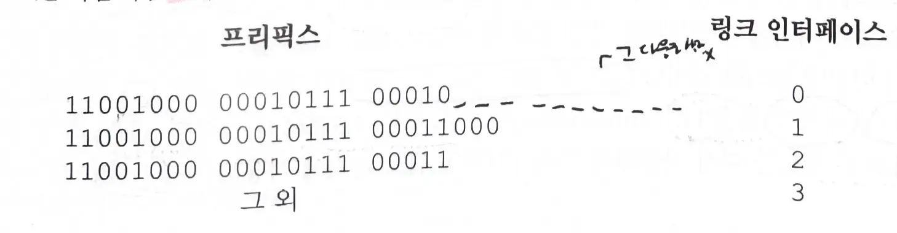

- 라우터는 패킷의 목적지 주소의 `prefix`를 테이블의 엔트리와 대응시킨다.
  - 대응하는 엔트리가 존재하면 라우터는 패킷을 그 대응에 연관된 `링크`로 보낸다.
- `최장 prefix 매칭 규칙` : 테이블에서 가장 긴 대응 엔트리를 찾고, 연관된 링크 인터페이스로 패킷을 보낸다.

#### match and action

- `목적지 ip 주소`를 찾은 다음에(`match`), 스위칭 구조를 통해 지정된 `출력 포트`로 보내는 것(`action`)

## 4.2.2 변환기

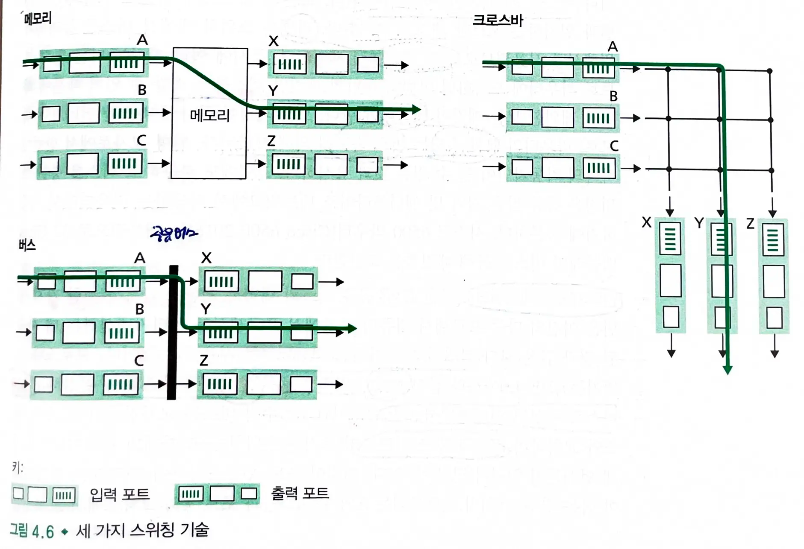

- 스위칭 구조 : 패킷을 입력 포트에서 출력 포트로 실제로 스위칭(전달)된다.

### 1. 메모리를 통한 교환

- 가장 단순하고, 초기에 라우터는 `CPU`(라우팅 프로세서)를 직접 제어해서 입력 포트와 출력 포트 사이에서 패킷을 스위칭하는 전통적인 컴퓨터이다.
- **패킷이 도착**하면 `입력포트`는 `라우팅 프로세서`에게 `인터럽트`를 보내 패킷을 프로세서 메모리에 복사한다.
- `라우팅 프로세서`는 **헤더에서 대상 주소를 추출**하고, 포워딩 테이블에서 적절한 `출력 포트`를 찾은 다음, 패킷을 출력 포트의 버퍼에 복사한다.
  - 메모리 대역폭이 초당 최대 `B`인 패킷을 메모리에 쓰거나 메모리에서 읽을 수 있는 경우 전체 전달 처리량은 `B/2`보다 작아야한다.
    - `입력 포트`에서 중앙 메모리로 패킷을 복사할 때 '`쓰기`' 작업
    - 중앙 메모리에서 `출력 포트`로 패킷을 전송할 때 '`읽기`' 작업
  - 두 패킷을 동시에 전달할 수 없다.
    - `목적지 포트`가 다르더라도 `공유 시스템 버스`를 통해 한번에 하나의 메모리 `읽기/쓰기` 작업을 수행할 수 있다.

### 2. 버스를 통한 교환

- `입력 포트`는 **라우팅 프로세서의 개입 없이** `공유 버스`를 통해 **직접 출력 포트로 패킷을 전송**한다.
  - 미리 준비된 `입력 포트 스위치 내부 라벨(헤더)`은 어느 `출력 포트`로 가야할지 나타낸다.
  - 모든 출력 포트에 패킷이 수신되지만 **라벨과 일치하는 포트만 패킷을 유지한다.**
  - `라벨`은 스위치 내에서 버스를 통과하기 위해서만 사용되므로 **출력 포트에서 제거**된다.
  - 동시에 여러 패킷이 다른 입력 포트로 라우터에 도착하면 하나를 제외한 모든 패킷이 `대기`해야한다.
- `라우터의 교환 속도`는 `버스 속도`에 의해 제한된다.

### 3. 인터커넥션 네트워크를 통한 교환

- 공유 버스의 대역폭 제한을 극복하는 방법
- `N개의 입력 포트`를 `N개의 출력 포트`에 연결하는 `2N` 버스로 구성된 `인터커넥션 네트워크`
  - 각 수직 버스는 교차점에서 각 수평 버스와 교차하며 스위치 구조 컨트롤러에 의해 언제나 열고 닫을 수 있다.
- 여러 패킷을 **병렬로 전송**할 수 있다.
  - 서로 다른 패킷이 `동일한 출력 포트`로 전송할 경우 한번에 한 패킷만 버스에서 전송될 수 있으므로 **입력 포트에서 대기**해야한다.

#### 참고) 다단계 스위칭 구조

- 서로 다른 입력 포트의 패킷이 `동일한 출력 포트`를 향해 동시에 전달할 수 있도록 함

## 4.2.3 출력 포트 프로세싱

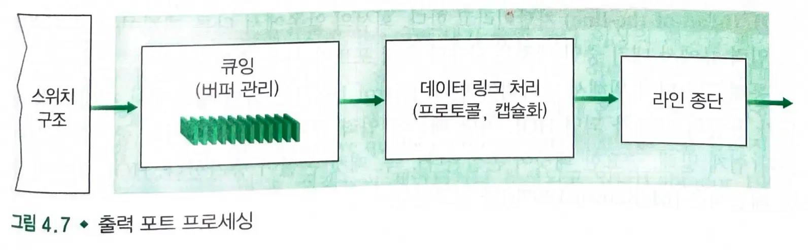

- `출력 포트`의 메모리에 저장된 패킷을 가져와서 `출력 링크`를 통해 전송한다.
- 전송을 위한 `패킷 선택` 및 `대기열 제거`, 필요한 `링크 계층 및 물리계층 전송 기능`을 수행하는 것이 포함된다.

## 4.2.4 어디에서 큐잉이 일어날까?

- 패킷 큐는 `입력 포트`와 `출력 포트` 모두에서 형성될 수 있다.
- `R line` : 입력 및 출력 회선의 속도 (전송속도)
  - 라우터의 외부 연결 속도
  - 라우터가 외부와 데이터를 주고받는 속도
- `R switch` : 입력 포트에서 출력 포트로 이동할 수 있는 전송속도
  - 라우터 내부에서 패킷을 처리하는 속도
  - 라우터가 내부적으로 패킷을 처리하고 전달하는 속도
- `R line` < `R switch` : 일반적인 상황
- `R line` > `R switch` : 패킷 병목 현상

> `입력 포트 큐잉` : 패킷이 라우터에 도착하는 `입력 포트`에서 발생
> `출력 포트 큐잉`: 패킷이 라우터를 떠나는 `출력 포트`에서 발생

### 입력 큐잉

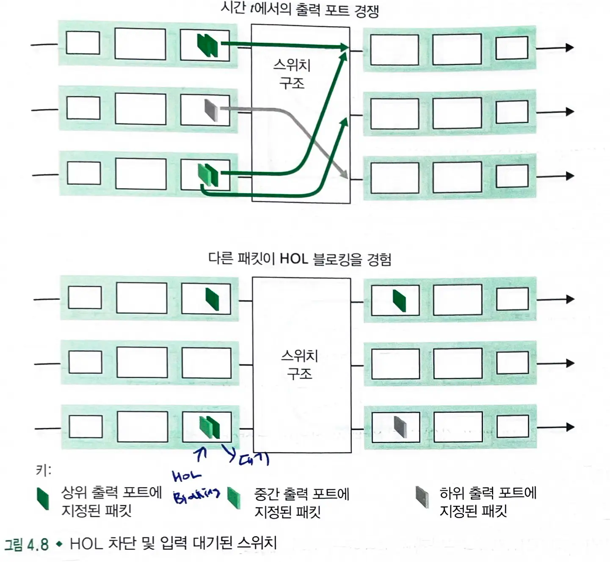

- 크로스바 스위칭 구조라고 가정한다.
  - 모든 링크의 속도는 같다.
  - 입력 링크가 패킷을 받는 것과 같은 속도로 하나의 패킷을 입력 포트에서 주어진 출력 포트로 전달한다.
  - `FCFS` 방식으로 패킷은 전달된다.

> 여러 패킷이 병렬적으로 전달될 수 있지만, 두 패킷이 같은 출력 큐로 향한다면 한 패킷은 차단되고 입력 큐에서 기다려야한다.
> 한번의 한 패킷만 지정된 출력 포트로 전달할 수 있다.

#### HOL(head-of-line) 차단

- 회선의 앞쪽에서 다른 패킷이 막고 있으므로 입력 큐에서 대기중인 패킷은 사용할 출력 포트가 사용되지 않아도 대기하는 상태

### 출력 큐잉

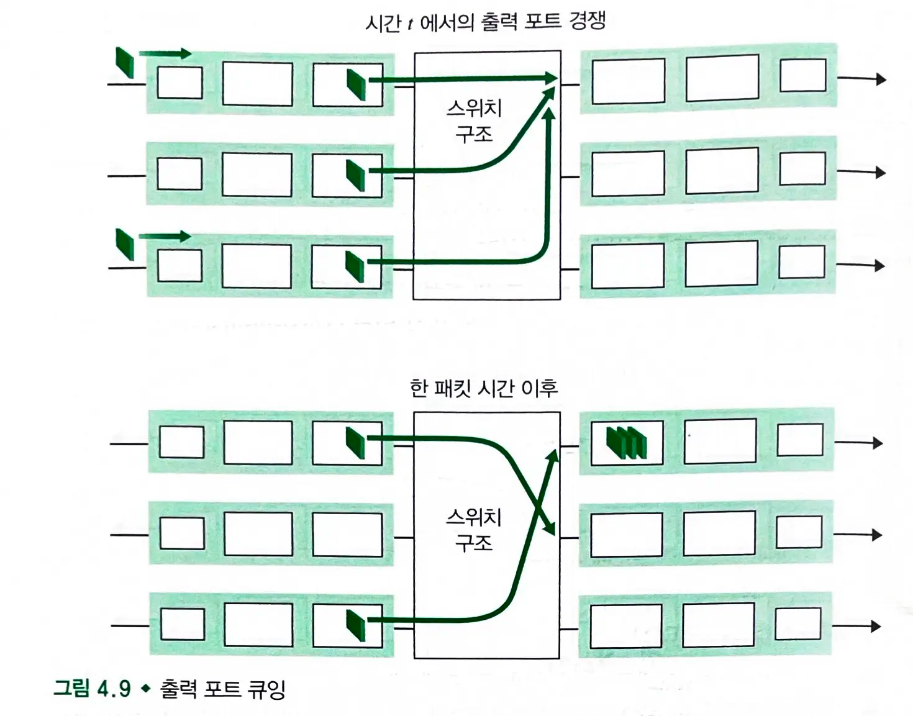

- `R switch`는 `R line`보다 `N배` 빠르고, `N개`의 다른 입력 포트의 패킷이 같은 `출력포트`로 향한다고 가정한다.
- `N개의 도착 패킷`은 출력 링크를 통한 `전송 큐`에 대기해야한다.
  - 하나를 전송할 때 다시 `N개`의 새로운 패킷이 도착할 수 있다.
- `패킷 스케줄러`가 전송대기중인 패킷 중 하나의 패킷을 선택한다.
  => 스위칭 구조가 포트 회선 속도의 N배 빠른 경우에도 **출력 포트에서 패킷 큐잉이 발생될 수 있다.**

- 버퍼의 양 `B = RTT(평균 왕복시간) * C(링크 용량) / √N`

#### 폐기 (drop-tail)

- 들어오는 패킷을 저장할 메모리가 충분하지 않을 때 도착한 패킷을 폐기시키거나, 이미 대기중인 패킷을 폐기해야한다.

## 4.2.5 패킷 스케줄링

- `FCFS`(First Come First Served) : FIFO(first-in-first-out)
  - 라우터에서 일반적으로 사용되는 큐잉 처리 방법
- `라운드 로빈` 큐잉: 고객은 우선순위 큐잉과 같이 `클래스`로 나뉘지만, 각 클래스의 고객에게는 차례대로 서비스가 제공된다.

### FIFO(First-In-First-Out)

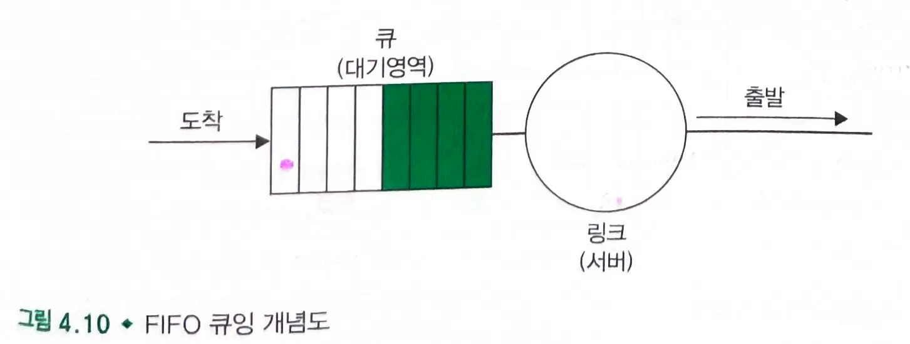
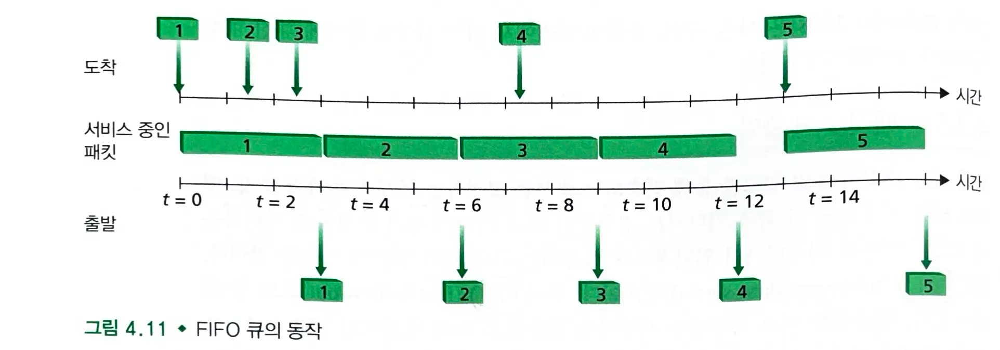

- 출력 링크 큐에 **도착한 순서와 동일한 순서**로 출력 링크에서 **전송할 패킷 선택**

### 우선순위 큐잉

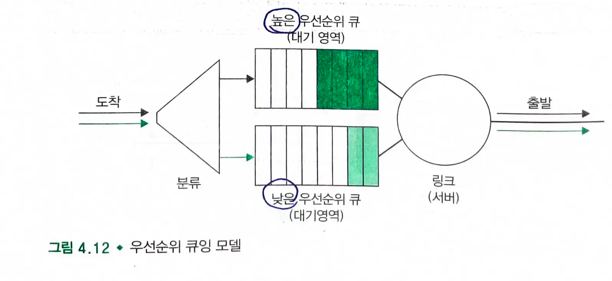
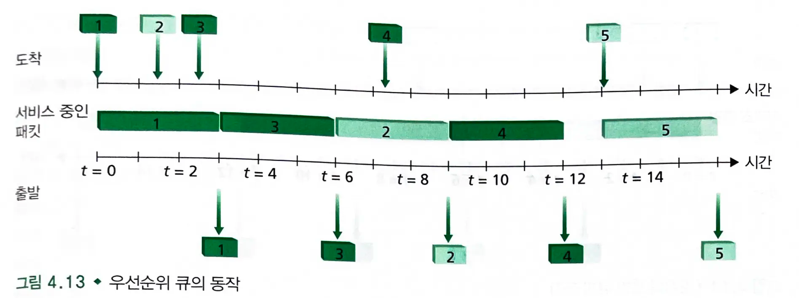

- 출력 링크에 도착한 패킷은 큐에 도착하면 `우선순위 클래스`로 분류된다.
  - 각 우선순위에는 고유한 큐가 있다.
- 전송할 패킷을 선택할 때 우선순위 큐는 전송대기 중인 패킷으로 차있는 상태이고, **가장 높은 우선순위 클래스에서 패킷을 전송**한다.
  - 동일한 우선순위를 가진 패킷들을 선택하는 것은 `FIFO 방식`으로 행해진다.
- 위는 `비선점 우선순위 큐잉 방식`이다.
  - 패킷의 전송이 시작되면 중단하지 않는다.

### `라운드 로빈`과 `WFQ`(Weighted Fair Queuing)

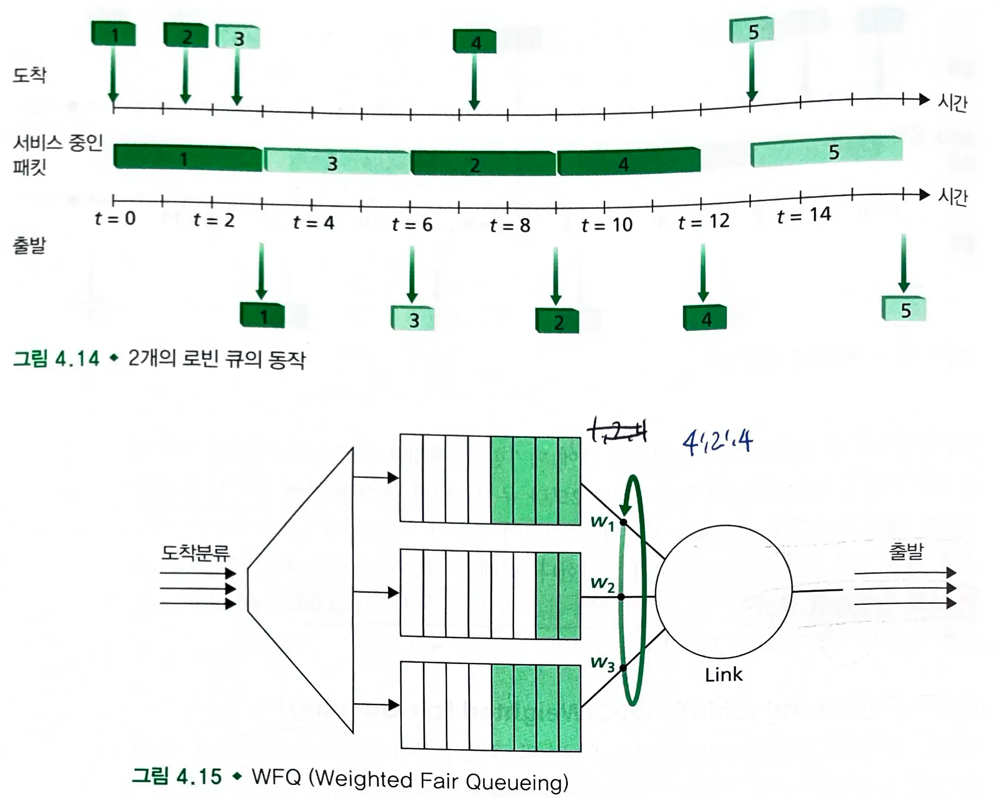

- 패킷은 우선순위 큐잉과 같이 `클래스`로 분류된다.
  - 클래스 간에는 엄격한 서비스 우선순위가 존재하지 않으며, `라운드 로빈 스케줄러`가 **클래스 간에 서비스를 번갈아서 제공**한다.
- `작업 보존 큐잉 규칙`
  - 클래스에 패킷이 없으면 다음 클래스를 즉시 검사한다.

#### 라운드 로빈의 일반적인 형태 : `WFQ` 규칙

- 도착하는 패킷은 적절한 클래스별 대기 영역에서 분류하며 대기한다.
- 순환 방식으로 동작한다.
- 작업 보존 큐잉 규칙이다.
- 특징 : **클래스마다 다른 양의 서비스 시간을 부여받는다.**
  - 각 클래스는 가중치를 할당받는다.
  - 클래스는 `가중치 / (큐에 패킷이 있는 모든 클래스의 합)` 의 서비스 시간을 보장받는다.
  - 전송률 R 인 링크에 대해 클래스는 항상 최소한 `R * 가중치/ (큐에 패킷이 있는 모든 클래스의 합)` 의 처리율을 가진다.
