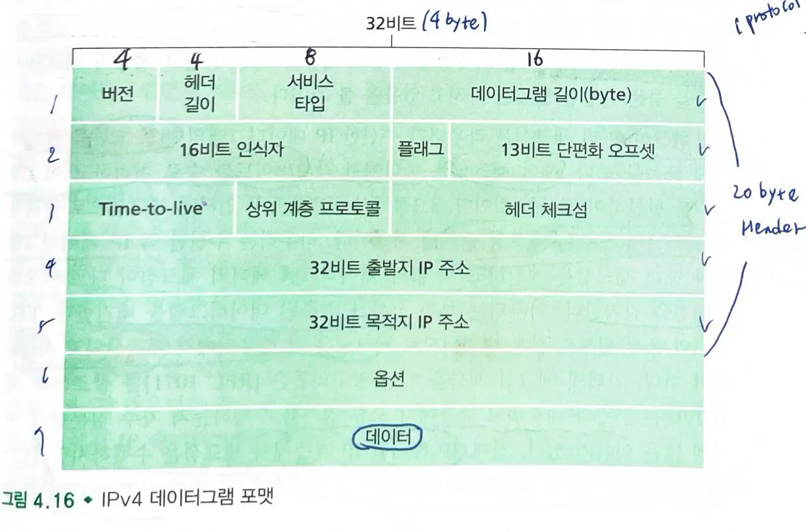
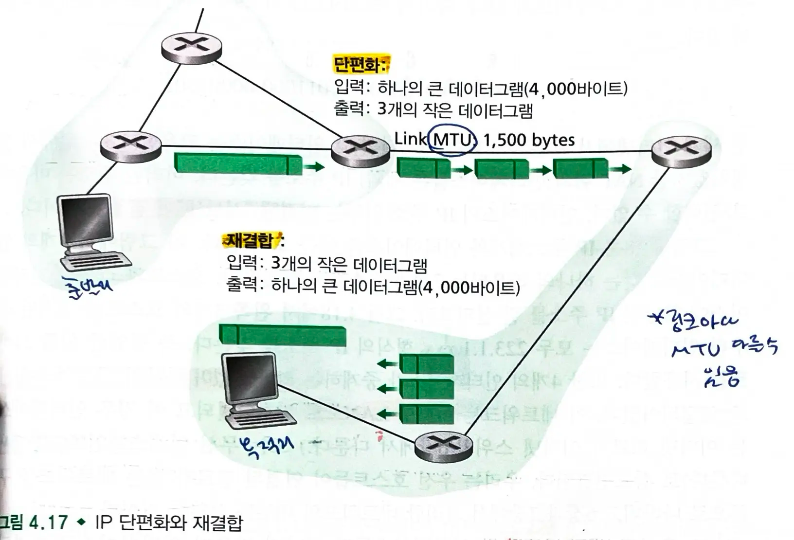
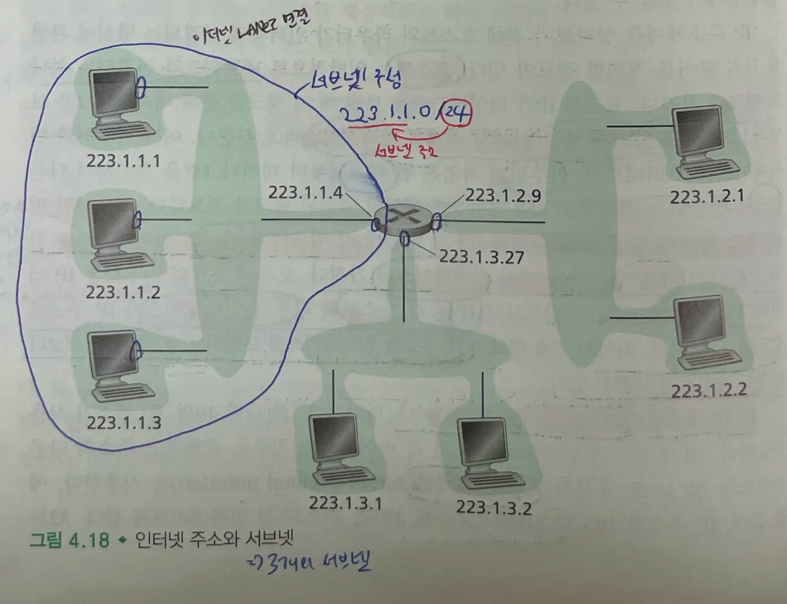
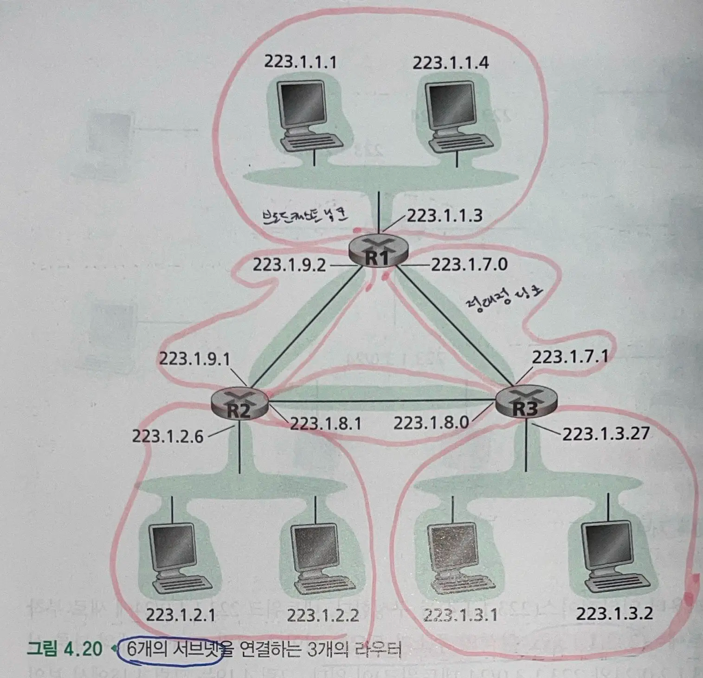
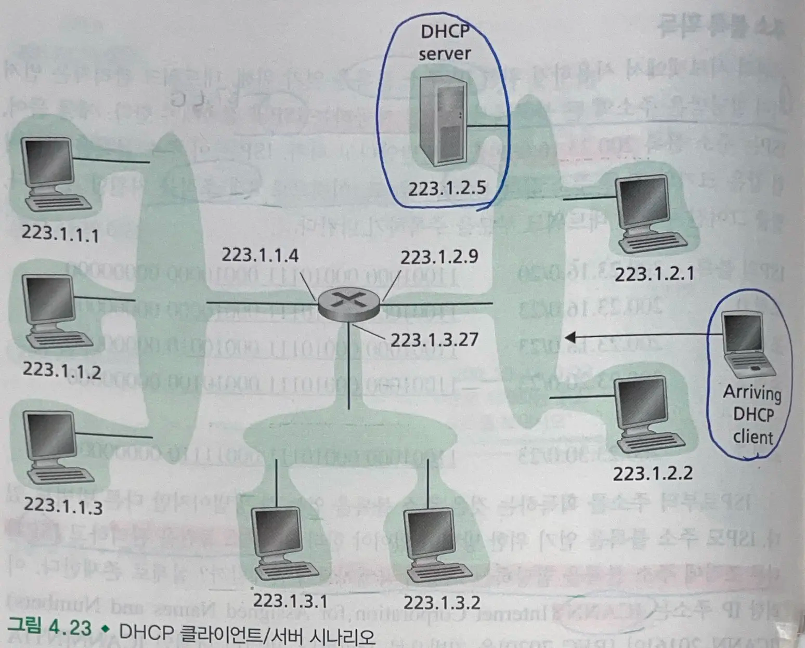
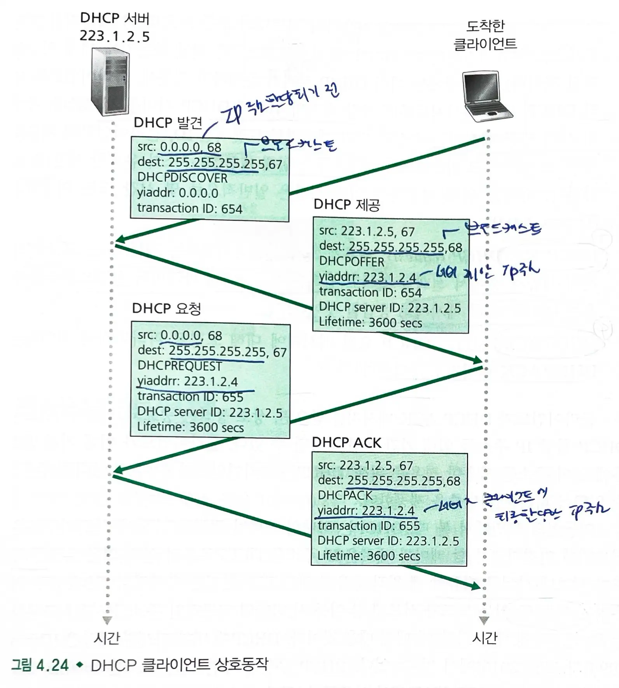
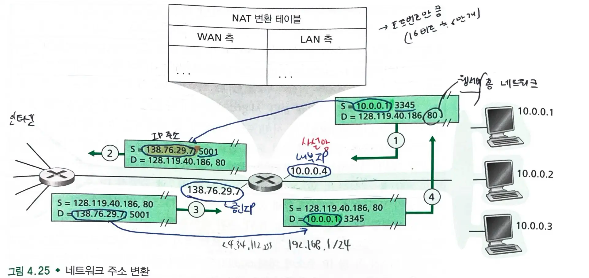
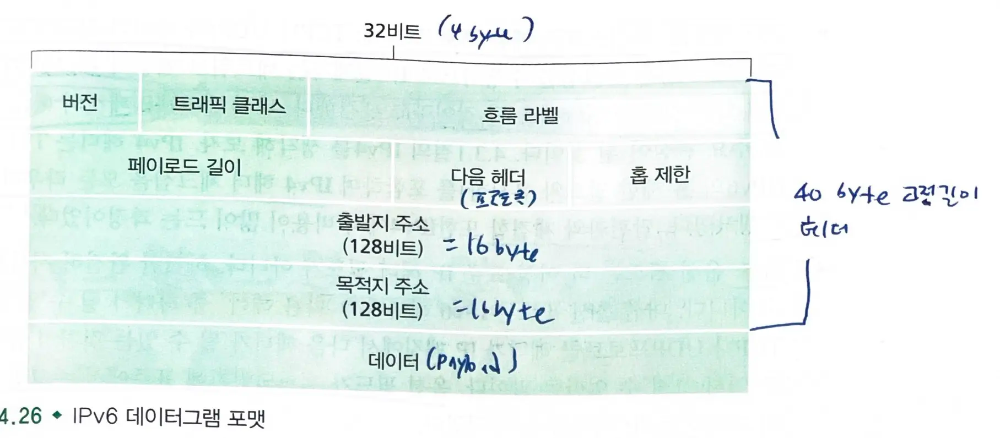
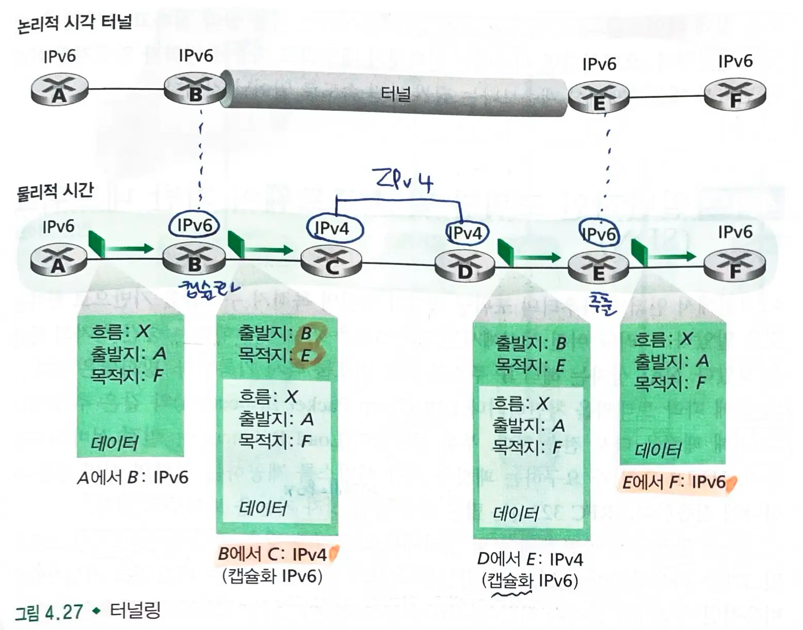

# 4.3 인터넷 프로토콜(IP)- IPv4, 주소지정, IPv6

- 데이터그램: 네트워크 계층 패킷

## 4.3.1 IPv4 데이터그램 형식

- `버전 번호`(4 bit): 데이터그램의 IP 프로토콜 버전 명시
- `헤더 길이` : 실제 페이로드가 시작하는 위치
    - 옵션은 가변 길이이다.
    - 대부분 IPv4 데이터그램은 옵션을 포함하지 않으므로 헤더는 `20 byte`이다.
- `서비스 타입`(TOS): 서로 다른 유형의 IP 데이터그램 구별
    - 실시간 데이터그램(IP 데이터그램)과 비실시간 트래픽(FTP)를 구분
- `데이터그램 길이`(16 bit): 바이트로 계산한 IP 데이터그램의 전체 길이
- `16비트 인식자(식별자)`, `플래그`, `13비트 단편화 오프셋` : IP 단편화와 관련됨
    - IPv6은 단편화를 허용하지 않는다.
- `TTL`(Time-to-live) : 네트워크에서 데이터그램이 무한히 순환하지 않도록 한다.
    - 라우터가 데이터그램을 처리할 때마다 감소한다.
    - TTL 필드가 0이 되면 라우터가 데이터그램을 폐기한다.
- `프로토콜`: 목적지 전송 계층의 특정 프로토콜 명시
    - 6 : TCP 프로토콜
    - 17 : UDP 프로토콜

> 포트번호: 전송 계층 - 응용 계층
> 프로토콜 번호: 네트워크 계층 - 전송 계층

- `헤더 체크섬`: 라우터가 수신한 IP 데이터그램의 비트 오류 탐지
    - 헤더에서 각 2바이트를 수로 처리하고, 1의 보수를 합산해서 계산한 것
    - 라우터는 수신한 각 IP 데이터그램마다 헤더 체크섬을 계산하고 체크섬이 데이터그램 헤더의 체크섬과 다르면 오류 상태임을 감지하고 패킷을 폐기한다.
    - TTL 필드와 옵션 필드의 값은 라우터마다 변경되므로 **체크섬은 각 라우터마다 재계산되고 저장**된다.
- `출발지와 목적지 IP 주소`: 데이터그램 생성시 출발지와 목적지 IP 주소를 명시한다.
- `옵션`: IP 헤더를 확장한다.
    - 옵션 처리 여부에 따라 라우터의 데이터그램 처리 시간이 크게 달라진다.
    - IP 옵션은 `IPv6`에 포함되지 않는다.
- `데이터(페이로드)`: `전송 계층 세그먼트(TCP/UDP)`를 포함하며 `ICMP 메세지`와 같은 다른 유형의 데이터를 담기도 한다.

#### TCP/IP가 전송 계층과 네트워크 계층 모두에서 오류 검사를 수행하는 이유

- `전송 계층`: 데이터의 전체적인 `무결성`과 `순서`, `중복`, `손실` 등을 확인한다.
    - `종단간 신뢰성`을 보장하기 위해 수행한다. (신뢰성 있는 전송)
- `네트워크 계층`: `IP 헤더`만 검사하며 헤더의 무결성을 검사한다.
    - `빠른 라우팅 결정`을 위해 수행한다.

> 종단간의 원리에서의 기능의 중복이라기 보다는 서로 목적이 다르며, TCP와 IP의 오류 검사는 상호 보완적인 역할을 한다.

## 4.3.2 IPv4 데이터그램 단편화

### MTU

- 링크 계층 프레임이 전달할 수 있는 최대 데이터 양
    - IP 데이터그램은 링크 계층 프레임 내에 캡슐화된다.
- 각 링크는 **서로 다른 링크 계층 프로토콜**을 사용할 수 있으며, 서로 다른 `MTU`를 가질 수 있다.

### 출력 링크가 IP 데이터그램보다 작은 MTU를 가진다면?

#### 해결책: **단편화**

- `IP 데이터그램`의 페이로드를 두 개 이상의 `작은 IP 데이터그램 (조각:Fragment)`으로 분할하고, 별도의 **링크 계층 프레임으로 캡슐화**하여 출력 링크로 보낸다.
- `조각`(Fragment) : 작은 데이터그램 각각을 의미
- 조각들은 전송 계층에 도달하기 직전에, 종단 시스템에서 데이터그램으로 재결합을 한다.
    - 중간 라우터에서는 재결합을 하지 않는다.

#### 조각 **재결합**

- **네트워크의 목적지 호스트가 재결합을 수행한다.**
- 데이터그램의 식별자, 플래그, 단편화 오프셋 필드를 이용해 재결합을 수행한다.
    - `식별자`: 나누어지기 전, 원본 데이터그램의 식별 번호
    - `플래그`: 원본 데이터그램의 마지막 조각 표시
        - 0: 마지막 데이터그램 조각
        - 1: 그 외 데이터그램 조각
    - `단편화` 오프셋: 원본 데이터그램 내의 조각의 위치
- ex) 4000 바이트 데이터그램(IP 헤더는 20바이트), MTU는 1500 바이트
    - 3개의 조각 ( 3980 / (1500-20)) = 2.68 )

## 4.3.3 IPv4 주소체계

### 인터페이스

- 호스트와 물리적 링크 사이의 경계
- 라우터와 링크 사이의 경계

> 각 장치는 링크마다 하나의 인터페이스를 가진다.
> 하나의 호스트나 라우터는 다중 인터페이스를 가질 수 있다.

- IP 주소는 장치별 할당이 아닌 장치의 인터페이스별로 할당된다.
    - 한 장치에 여러개의 IP 주소를 할당할 수 있다.

### IP 주소

- 32비트 길이(4바이트)이며 십진 표기법을 사용한다.
    - ex) `192.32.216.9/24`
- 인터넷의 모든 호스트와 라우터는 IP 주소를 가진다.
    - 마음대로 선택할 수 없으며, 연결된 서브넷이 결정한다.

### 서브넷

- 고립된 IP 네트워크
    - ex) 3개의 호스트들의 인터페이스와 하나의 라우터 인터페이스로 연결된 네트워크
- `192.32.216.9/24` 에서 `/24`는 서브넷 마스크를 의미한다.
    - 서브넷 마스크: 왼쪽 24비트가 서브넷 주소임을 가리킨다.

### 인터넷 주소 할당 방식

#### CIDR(Classless InterDomain Routing)

- a.b.c.d/x
    - x: 네트워크 prefix, 최상위 비트(MSB)를 의미하며 IP 주소의 네트워크 부분 구성
        - 서로 다른 기관은 다른 네트워크 주소를 가진다.
    - 32-x: 기관 내부에 같은 네트워크 prefix를 가진 모든 장비
        - 기관 내부의 라우터에서 패킷을 전달할 때 사용

#### 클래스 주소 체계

- `CIDR` 채택 전 사용했던 방법
- IP 주소의 **네트워크 부분을 `8`,`16`,`24` 비트로 제한**하고 각 서브넷을 클래스 `A`, `B`, `C` 네트워크로 분류했다.
- 낭비되는 주소가 많다.
    - 2000개의 호스트가 있는 조직은 클래스 A(256 호스트)를 사용하지 못하고 클래스 B(65534 호스트)를 사용해야하는데, 63000개 이상의 주소가 낭비된다.

### 기관이 주소 블록을 획득하는 방법

- 네트워크 관리자는 `ISP`(이미 할당받은 주소의 큰 블록에서 주소를 제공)와 접촉하여 `IP 주소 블록`을 얻는다.
- `ISP`는 `ICANN` 으로부터 `IP 주소 블록`을 할당받는다.
    - `ICANN` : IP 주소 할당과 DNS 루트 서버관리

### 호스트 주소 획득 (DHCP)

- 기관은 `ISP`로부터 주소 블록을 획득하여, 개별 IP 주소를 기관 내부의 `호스트`와 `라우터 인터페이스`에 할당한다.
- `DHCP`(동적 호스트 구성 프로토콜) : **호스트에 IP 주소를 동적으로 할당**
    - 네트워크 관리자는 호스트가 네트워크에 접속할때마다 동일한 IP 주소를 할당받거나, 다른 임시 IP 주소를 할당하도록 설정할 수 있다.
    - 네트워크에서 자동으로 호스트를 연결해주기 때문에, `플러그 앤 플레이 프로토콜`나 `제로 구성 프로토콜`이라고 한다.

#### DHCP 프로토콜 4단계

1. `DHCP 서버 발견` : 호스트는 **DHCP 발견 메세지**를 `UDP` 패킷으로 `브로드캐스팅` 주소로 전송한다.
    - 출발지 IP 주소는 0.0.0.0 으로 설정한다.
2. `DHCP 서버 제공`: DHCP 서버는 **DHCP 제공 메세지**를 `브로드캐스트`한다.
    - 클라이언트는 받은 DHCP 제공 메세지 중에서 가장 최적의 위치의 DHCP 서버를 선택한다.
3. `DHCP 요청`: 클라이언트는 선택한 제공자에게 **DHCP 요청 메세지**를 보낸다.
4. `DHCP ACK` : 서버는 DHCP 요청 메세지에 대해 **DHCP ACK**으로 응답한다.

> 이동 노드가 서브넷 사이를 이동할 때 TCP 연결은 유지될 수 없으므로 이동 IP를 사용한다.

## 4.3.4 네트워크 주소 변환 (NAT)

### 사설망

- 네트워크 주소들이 그 네트워크 내부에 있는 장비에게만 의미가 있는 네트워크
- 홈 네트워크 같은 사설 개인 주소를 가진 권역(realm)을 위해 예약된 IP 주소 공간
    - `클래스 A` : 10.0.0.0 - 10.255.255.255
        - 서브넷 마스크: 255.0.0.0 또는 /8
        - `대규모 네트워크`에서 사용
    - `클래스 B`: 172.16.0.0 - 172.31.255.255
        - 서브넷 마스크: 255.240.0.0 또는 /12
        - `중간 규모 네트워크`에서 사용
    - `클래스 C`: 192.168.0.0 - 192.168.255.255
        - 서브넷 마스크: 255.255.0.0 또는 /16
        - `소규모 네트워크`에서 사용

> 인터넷에서 라우팅되지 않고 로컬 네트워크에서만 사용

- 홈 네트워크 내부의 장비는 서로 사설망 주소 체계를 이용하여 패킷을 송신할 수 있다.

### NAT (가능) 라우터

- 외부 세계에는 **하나의 IP 주소를 가진 하나의 장비**로 동작한다.
    - NAT 가능 라우터는 외부에서 들어오는 홈 네트워크의 상세한 사항을 숨긴다.
- 라우터는 ISP의 `DHCP 서버`로부터 IP 주소를 얻고(홈 네트워크 IP 주소), 라우터의 DHCP 서버가 **홈 네트워크의 컴퓨터에게 IP 주소를 할당**한다.

#### NAT 변환 테이블

- 출발지 IP 주소와 출발지 포트 번호, 목적지 IP 주소와 목적지 포트 번호를 포함한다.

#### NAT 작동 과정

-
    1. 호스트 `10.0.0.1:3345`인 홈 네트워크가 목적지 호스트 `128.119.40.186:80` 인 웹서버에게 웹페이지를 요청한다.
-
    2. 요청이 `NAT 라우터`에 도달하고, 라우터는 패킷의 출발지 IP를 자신의 `공인 IP(138.76.29.7)`로 변경하고, 새로운 출발지 포트번호인 `5001`로
       변경한다.(`138.76.29.7:5001`)
- 3 `NAT 변환 테이블`에 변환 정보를 기록한다.
    - 내부 IP : `10.0.0.1`, 포트 번호: `3345`
    - 외부 IP: `128.119.40.186`, 포트 번호: `80`
-
    4. 웹 서버로 요청 전송

    - 변환된 패킷이 웹서버로 전송된다.
-
    5. 웹 서버는 NAT 라우터의 공인 IP 주소와 5001번 포트번호로 응답을 보낸다. (`138.76.29.7:5001`)
-
    6. NAT 라우터 역변환

    - 라우터는 NAT 변환 테이블을 참조하여 도착한 응답 패킷에서 `목적지 IP 주소(138.76.29.7)`와 `포트번호(5001)`를 `내부 IP(10.0.0.1)`와 `포트번호(3345)`로 변경한다.
-
    7. 패킷이 내부 호스트로 전달된다.

## 4.3.5 IPv6

- IPv4의 주소 고갈로 인해 IPv4 프로토콜의 다음 버전을 개발하기 시작했다.

### IPv6의 특징

- **확장된 주소 기능** : IP 주소 크기를 `32비트`에서 `128비트`로 확장했다.
    - `유니캐스트`(1:1), `멀티캐스트`(1:N, udp 지원) 뿐만 아니라 `애니캐스트`(호스트 그룹의 어떤이에게 전달)도 지원한다.
- **간소화된 `40 byte 고정 길이 헤더`**
    - 고정 길이 헤더는 라우터가 IP 데이터그램을 더 빠르게 처리할 수 있도록 해준다.
    - IPv4의 많은 필드가 생략되거나 옵션으로 지정되었다.
        - 기본 IP 헤더 뒤에 여러 확장 헤더를 추가할 수 있고, 다음 헤더 필드에 확장 헤더의 유형을 지정할 수 있다.
        - 구조: `[IPv6 기본 헤더(40바이트)]` -> `[확장 헤더 1]` -> `[확장 헤더 2]` -> ... -> `[페이로드]`
        - 라우터는 기본적으로 40 byte 고정 헤더만을 검사한다. (특정 확장 헤더 제외)
- **흐름 라벨링** : 특별 처리를 요청하는 송신자에 대해 특정 흐름에 속하는 패킷 레이블링을 가능하게 한다.

### IPv6 데이터그램 포맷

 

- `버전` : IP 버전 번호
    - IPv4 : 4, IPv6 : 6
- `트래픽 클래스` : IPv4의 TOS 필드와 비슷, 특정 응용 데이터그램에 우선순위 부여
- `흐름 라벨`: 데이터그램의 흐름 인식
- `페이로드 길이`: 고정 길이 40 byte 고정 헤더 뒤에 나오는 바이트 길이
    - 확장 헤더 + 상위 계층 프로토콜 헤더 + 실제 페이로드
- `다음 헤더`: IPv4의 프로토콜 필드와 비슷, 데이터그램 내용이 전달될 프로토콜(TCP, UDP)을 지정하거나 다음 확장 헤더를 지정한다.
- `홉 제한`: 라우터가 뎅이터그램을 전달할 때마다 1씩 감소한다.
- `출발지와 목적지 주소`: 128 비트의 주소이다.
- `데이터`: 페이로드
    - 전송계층의 헤더 + 실제 데이터(페이로드)

> IPv4보다 굉장히 간소화되었다.

#### IPv4 vs IPv6

- **단편화/재결합 필드가 사라짐**
    - 데이터그램이 너무 커서 전달할 수 없다면 `ICMP 오류 메세지`를 송신자에게 보낸다.
    - 라우터에서 단편화/재결합 하는 것을 하지 않도록 하여 네트워크에서 IP 전달 속도를 증가시켰다.
- **헤더 체크섬 필드가 사라짐**
    - 전송 계층 프로토콜과 데이터 링크 계층 프로토콜에서 체크섬을 수행하므로 생략한다.
    - IP 패킷의 빠른 처리를 우선시하였다.
        - 매 라우터마다 헤더 체크섬을 수행하는 것은 비용이 많이 든다.
- **옵션 필드가 사라짐**
    - 옵션 필드는 `다음 헤더` 중 하나가 될 수 있다.
    - **고정 길이 40 byte 헤더**를 가지게 되어 데이터그램을 더 빠르게 처리할 수 있다.

> 결론 : **IPv6은 IP 패킷(데이터그램)을 빠르게 처리하는 것을 주안점**으로 두었다.

### IPv4에서 IPv6으로 전환 : 터널링

- 두 IPv6 사이의 IPv4 라우터들을 `터널`이라고 한다.
    - 터널의 `송신`측은 IPv6 데이터그램을 IPv4 데이터그램의 데이터(페이로드) 필드에 넣는다 (**캡슐화**)
    - 터널의 수신측은 IPv4 데이터그램으로부터 IPv6 데이터그램을 **추출**한다.
