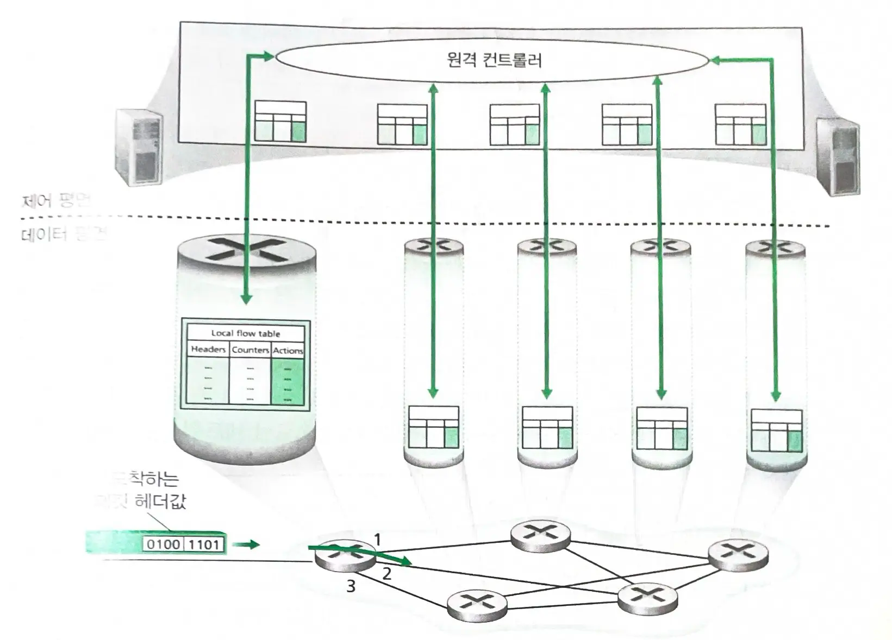
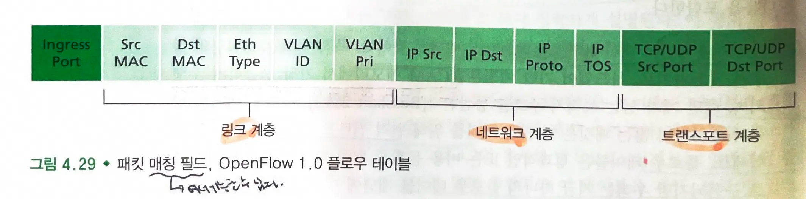
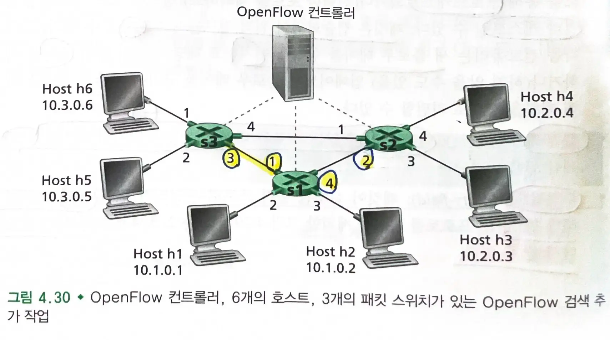
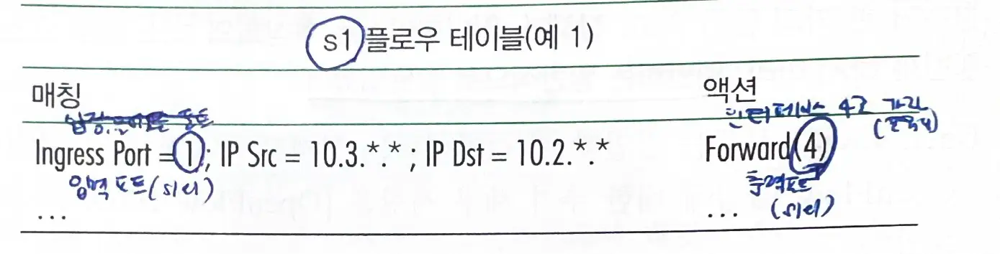
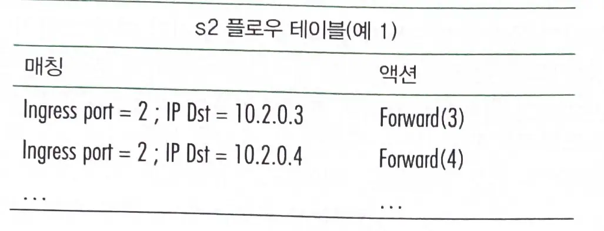
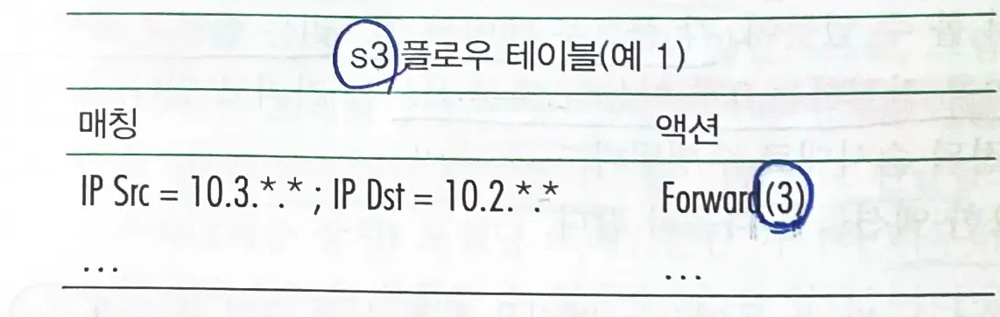
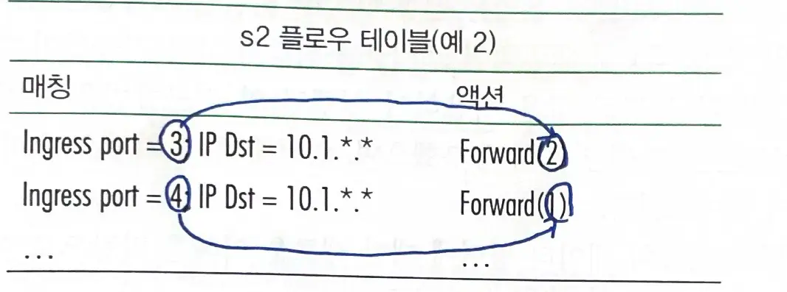
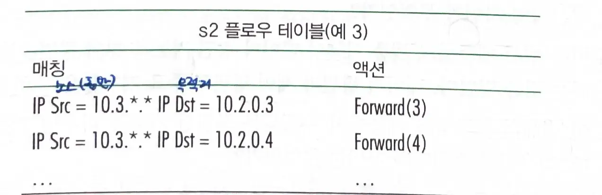

# 4.4 일반적인 포워딩 및 소프트웨어 기반 네트워크(SDN)

## SDN

- 테이블은 원격 컨트롤러를 통해 계산, 설치 및 업데이트된다.
  - OpenFlow : SDN의 성공적인 표준

### OpenFlow의 플로우 테이블

- **들어오는 패킷에 대한 헤더 값들의 세트가 매칭된다.**
  - 하드웨어 기반 매칭은 TCAM 메모리에서 수행된다.
  - 플로우 테이블 항목가 일치하지 않은 패킷은 원격 컨트롤러로 전송될 수 있다.
- **패킷들에 의해 업데이트 되는 카운터 세트는 플로우 테이블 요소들과 일치된다.**
  - 패킷이 지나갈때마다 플로우의 카운터가 증가한다.
  - 특정 플로우(네트워크 트래픽)에 속하는 패킷이 지나갈때마다 해당 플로우의 통계 정보가 업데이트된다.
  - 플로우 테이블 요소와 마지막으로 업데이트된 테이블 항목 이후에 일치된 다수의 패킷을 포함한다.
- **패킷이 플로우 테이블 항목과 일치할 때, 여러 동작들이 가능하다.**
  - 패킷을 출력 포트로 전달하고, 삭제하고, 패킷의 복사본을 만들어 여러 출력 포트로 보낼 수 있다.

> 플로우 테이블은 본질적으로 API이며, 개별 패킷 스위치의 동작을 프로그래밍할 수 있다.

## 4.4.1 매치(Match)

- OpenFlow에서 일치할 수 있는 11개의 패킷 헤더 필드와 수신 포트 ID
- 특징
  -
    1. 프로토콜 헤더의 세 계층에서 선택된 필드에 일치하는지 검사할 수 있다.

    - IP 주소가 아닌 이더넷 주소를 기반으로 전달함으로써 스위치 포워딩 프레임뿐 아니라 라우터 포워딩 데이터그램과 동일한 성능을 발휘할 수 있다.
  -
    2. 와일드 카드와 우선순위가 존재한다.
  -
    3. TTL 필드 또는 데이터그램 길이 필드에 기반한 일치를 허용하지 않는다.

> 일반화는 일반적으로 잘못되었다.

## 4.4.2 액션(Action)

- `포워딩` : 들어오는 패킷은 실제 출력 포트로 `전달`되거나, `브로드캐스트`되거나 `멀티 캐스트`될 수 있다.
- `드롭핑`: 아무 동작이 없는 플로우 테이블 항목은 일치된 패킷을 `삭제`해야함을 나타낸다.
- `수정 필드`: 패킷이 선택된 출력 포트로 전달되기 전에, 10개의 패킷 헤더 필드의 값을 다시 쓸 수 있다.

## 4.4.3 매칭-플러스-액션 작업의 OpenFlow 예

### 간단한 포워딩

- h5 또는 h6의 패킷이 h3 또는 h4 패킷으로 전달된다.
- 라우터 s3 -> s1 -> s2

- s1 플로우 테이블

- s2 플로우 테이블

- s3 플로우 테이블

### 부하 균등화

- 출발지에 따라 다른 링크로 패킷이 전달되도록 할 수 있다.
  - h3에서 `10.1.*.*` : s2--s1 링크
  - h4에서 `10.1.*.*` : s2--s3 링크

### 방화벽

- `s2`가 `s3`에 연결된 호스트에서 보낸 트래픽만 수신하는 방화벽

