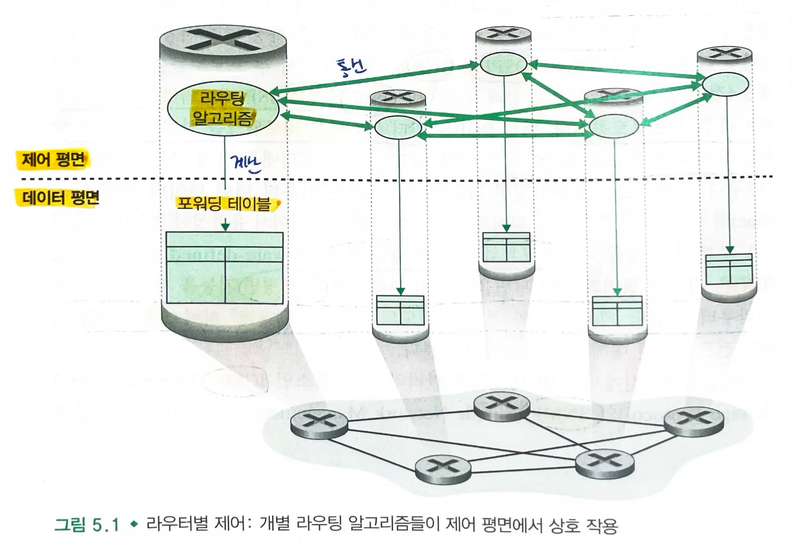
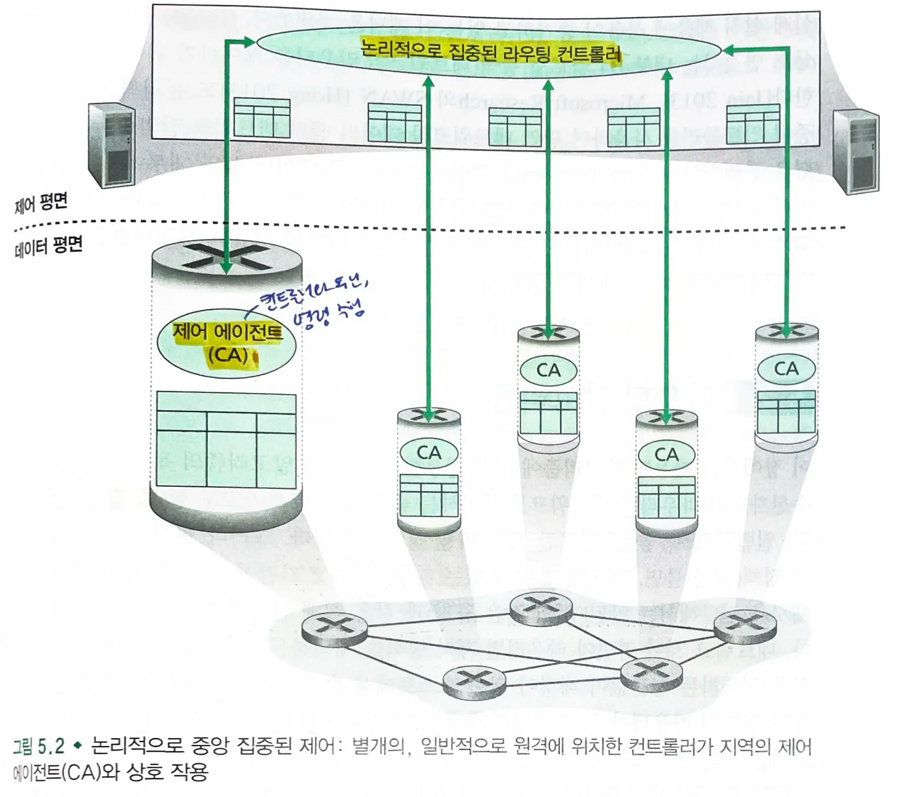

## 네트워크 계층 제어 평면

- 네트워크 전체를 아우르는 구성요소
  - 데이터그램이 `송신 호스트`에서 `목적지 호스트`까지 라우터간에 어떻게 전달되어야하는지
  - 네트워크 계층 구성요소들과 서비스를 어떻게 `설정`하고 `관리`할지 제어

### 라우팅 프로토콜

- `OSPF`
  - **단일 ISP 네트워크** 내에 동작하는 라우팅 프로토콜
- `BGP`
  - **인터넷의 모든 네트워크**를 상호 연결하는 역할을 하는 라우팅 프로토콜

### SDN

- 소프트웨어 정의 네트워크
- `데이터 평면`과 `제어 평면`을 명확히 분리하고 **제어 평면 기능을** 라우터의 전달 기능 요소와 분리된 **원격 컨트롤러 서비스에 구현**

## 라우터별 제어 vs 논리적으로 중앙 집중된 제어

### 라우터별 제어

- 라우팅 알고리즘들이 모든 라우터 각각에서 동작
  - **포워딩과 라우팅 기능이 모두 개별 라우터에 포함**
  - 라우터는 다른 라우터의 구성요소와 `통신`하여 자신의 포워딩 테이블의 값을 `계산`한다.
- `OSPF`와 `BGP` 프로토콜
- `포워딩 테이블`(목적지 기반 포워딩)

### 논리적으로 중앙 집중된 제어 (SDN)

- 논리적으로 집중된 컨트롤러가 **포워딩 테이블을 작성**하고, 이를 모든 개별 라우터가 사용할 수 있도록 **배포**한다.
  - 일반화된 일치와 행동(4.4 `match-and-action`) 추상화

> 포워딩은 라우터가, 라우팅은 컨트롤러가 수행
> => **제어 평면 기능을** 라우터의 전달 기능 요소와 분리된 **원격 컨트롤러 서비스에 구현**

- 기존에는 별도의 장치로 구현되었던 `다양한 기능`들뿐만 아니라 `전통적인 IP 포워딩`을 수행할 수 있다.
  - 마치 하나의 중앙 서비스 지점에 있는 것처럼 서비스에 접근한다.
- `플로우 테이블`(일반화된 포워딩)

> 구글은 데이터 센터를 상호 연결하는 네트워크의 라우터를 제어하기 위해 sdn을 사용한다.

#### 라우터의 CA(제어 에이전트)

- 컨트롤러와 `통신`하고 컨트롤러의 `명령을 수행`하는 최소한의 기능을 가진다.
- `라우팅 컨트롤러`는 각 라우터의 `제어 에이전트(CA)`와 상호작용하여 라우터의 **플로우 테이블을 구성 및 관리**한다.
  - CA 끼리는 서로 상호작용하지 않으며, 포워딩 테이블 계산에도 적극적으로 참여하지 않는다.

