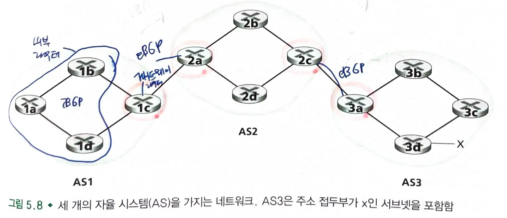
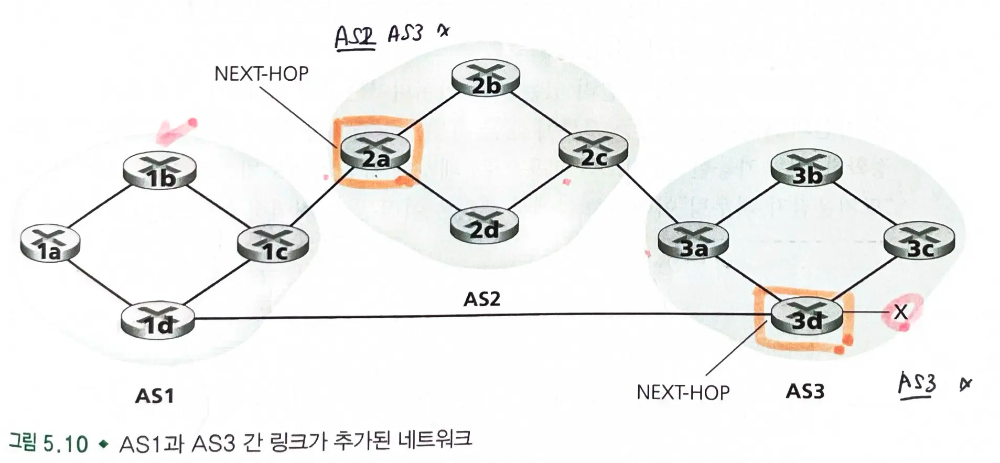
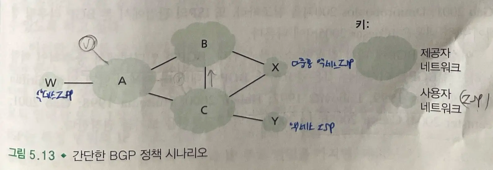

# 5.4 인터넷 서비스 제공업자(ISP) 간의 라우팅 BGP

- `OSPF` : **단일 AS 내의 라우터들 간 라우팅 프로토콜**
- `BGP` : **AS 간 라우팅 프로토콜**
  - 인터넷의 모든 AS들은 경계 게이트웨이 프로토콜이라고 불리는 동일한 AS간 라우팅 프로토콜을 사용한다.
  - BGP라고 불린다.

### BGP

- 인터넷의 수천개의 ISP들을 연결하는 프로토콜
  - ISP는 하나 이상의 AS를 소유하고 운영한다.
- 분산형 비동기식 프로토콜이다.

## 5.4.1 BGP의 역할

### BGP 작동 방식

- 패킷이 CIDR 형식으로 표현된 prefix를 통해 포워딩된다.
  - 각 prefix는 서브넷이나 서브넷의 집합을 의미한다.
- 라우터의 포워딩 테이블은 (x, I) 형식의 엔트리를 갖는다.
  - x : 주소 접두부
  - I : 라우터 인터페이스의 인터페이스 번호

### BGP의 역할

- `이웃 AS`로부터 도달 가능한 `서브넷 prefix` 정보를 얻는다.
- 서브넷 주소 `prefix`로의 **가장 좋은 경로를 결정**한다.
  - 두 개 이상의 경로에서 가장 좋은 경로를 선택하기 위해 `BGP 경로 결정 프로시저`를 수행한다.
  - `도달 가능 정보` 뿐 아니라 `정책`에 기반해서 결정한다.

## 5.4.2 BGP 경로 정보 알리기

- `AS`에서 각 라우터들은 `게이트웨이 라우터` 거나 `내부 라우터`이다.
  - **게이트웨이 라우터** : `AS 경계`에 있는 라우터, 다른 AS에 있는 하나 또는 여러 개의 라우터와 연결
  - **내부 라우터** : `자신의 AS` 내에 있는 호스트 및 라우터와만 연결
- BGP 연결: 각 라우터는 `TCP 연결`, `포트번호 179`로 라우팅 정보를 교환한다.
  - 이 TCP 연결을 통해 BGP 메세지가 전송된다.
  - 외부 BGP 연결(두 AS에 걸친 연결, `eBGP`), 내부 BGP 연결(같은 AS 라우터 간 연결, `iBGP`)
- 접두부 x에 대한 도달 정보 알리기
  - 게이트웨이 라우터 3a는 2c에게 `"AS3 x"` 메세지를 보낸다.
    - 메세지는 존재와 경로를 포함한다.
  - 게이트웨이 라우터 2c는 AS2의 모든 라우터에게 메세지를 전달한다.
  - 게이트웨이 라우터 2a는 1c에게 `"AS2 AS3 x"` 메세지를 보낸다.

## 5.4.3 최고의 경로 결정

### BGP 속성

- `AS-PATH` : 알림 메세지가 통과하는 `AS들의 리스트`
  - 접두부가 어떤 AS들에 전달되었을 때 `AS-PATH`에 라우터를 추가한다.
  - 자신의 라우터가 AS의 경로 리스트에 포함될 경우 메세지를 버린다. (`루프 방지`)
- `NEXT-HOP` : `AS-PATH`를 시작하는 `라우터 인터페이스의 IP 주소`
  - 아래 그림에서는 AS1에서 x로 가기 위한 `NEXT-HOP`은 2a과 3d이다.
- 각 BGP 경로는 **NEXT-HOP, AS-PATH, 목적지 주소 prefix**로 기술된다.

> 라우터 2a의 맨 왼쪽 인터페이스의 IP 주소; AS2 AS3; x
> 라우터 3d의 맨 왼쪽 인터페이스의 IP 주소; AS3; x

### 뜨거운 감자 라우팅

- 경로의 시작점인 **`NEXT-HOP 라우터`까지의 경로 비용이 최소가 되는 경로**가 선택된다.
  - `1b`에서 `x`로 이동한다면, `2a`까지의 비용이 2, `3d`까지의 비용이 3이므로 `2a`가 선택된다.
  - `1b`는 `2a`로 가는 인터페이스를 찾아 `엔트리(x, I)`를 자신의 포워딩 테이블에 추가한다.

> 포워딩 테이블에 엔트리를 추가할 때 AS간 라우팅 프로토콜(BGP)와 AS 내부 라우팅 프로토콜(OSPF) 둘 다가 사용된다.

- 자신의 AS 바깥에 있는 부분에 대한 비용은 신경쓰지 않고 **최대한 신속하게 패킷을 자신의 AS 밖으로 내보내는 것**
  - AS 외부에서 얼마의 비용이 들지 신경쓰지 않고 오직 자신의 AS 내부의 비용만 줄이려는 이기적인 알고리즘이다.

### 경로 선택 알고리즘

- 주어진 목적지까지의 모든 경로 중에서 하나의 경로가 남을 때까지 제거 규칙을 수행한다.
-
  1. 가장 높은 `지역 선호값`을 가진 경로를 선택한다.
-
  2. `최단 AS-PATH`를 가진 경로가 선택된다.
-
  3. 남은 경로들에 대해 `뜨거운 감자 라우팅(NEXT-HOP까지의 최단 경로)`을 수행한다.

  - `거리 벡터 알고리즘`을 사용하며 `AS 홉 수`를 거리값으로 사용한다.
-
  4. `BGP 식별자`를 선택하여 경로를 선택한다.

## 5.4.4 IP 애니캐스트

- BGP는 `IP 애니캐스트` 서비스를 구현하는데도 활용된다.
  - `IP 애니캐스트` : **동일한 IP 주소**를 여러 서버나 네트워크 장치에 할당하여 **네트워크 토폴로지 상 가장 가까운 위치로 라우팅**된다.
- 예시: 같은 컨텐츠를 지리적으로 분산된 많은 다른 서버에 복제하고, 각 사용자가 가장 가까운 서버의 컨텐츠로 접근하는 경우
  - 각 서버에 동일한 IP 주소를 할당하고 표준 BGP를 활용하여 주소를 서버 각각으로부터 알린다.
  - `BGP 라우터`는 이 IP 주소의 복수 개의 경로 알림 메세지를 받으면 이를 **동일한 물리적 위치로의 서로 다른 경로에 대한 정보를 제공**받는 것처럼 생각한다.
  - 해당 IP 주소로의 최고의 경로로 전송된다.
- 실제 `CDN`은 일반적으로 `IP 애니캐스트`를 사용하지 않는다.
  - 하나의 TCP에 속한 패킷들이 웹서버의 서로 다른 복제본으로 도착할 수 있기 때문이다. (세션 유지X)
- `DNS 시스템`에서는 DNS 질의를 가장 가까운 루트 DNS 서버로 전송하기 위해 광범위하게 사용된다. (상태 유지 X, 단일 요청-응답)

## 5.4. 라우팅 정책

- `AS 라우팅 정책`은 `최단 AS-PATH`나 `뜨거운 감자 라우팅`같은 다른 모든 고려사항보다 우선시된다.
  - 경로 선택 알고리즘에서 지역 선호도 속성의 값이 각 `AS 정책`에 의해 결정된다.

### 간단한 BGP 정책 시나리오

- A, B, C, W, X, Y는 `라우터`가 아닌 `AS`이다.
- `AS`인 `W` ,`X` ,`Y`는 `사용자 액세스 ISP`이고 `A`, `B`, `C`는 `백본 제공자 네트워크`이다.
  - `사용자 액세스 ISP` : 일반 사용자나 기업에게 직접 인터넷 연결 서비스를 제공하는 ISP
    - `W`, `Y`는 `액세스 ISP`이다.
    - `X`는 `다중 홈 액세스 ISP`이다. (둘 이상의 백본 제공자 네트워크와 연결)
  - `백본 제공자 네트워크`: **사용자 액세스 ISP들을 연결**하여 사용자들을 연결한다.
    - `A`, `B`, `C`는 트래픽을 서로에게 직접 보내고, 그들의 사용자 네트워크에 완전한 `BGP 정보`를 제공한다.
- X가 B와 C간의 대량 트래픽을 처리(포워딩)하지 못하도록 막아야한다.
  - X는 백본 네트워크가 아니므로 대역폭이 작다.
  - 고객(X)가 제공자(B와 C) 사이의 트래픽을 전달하지 않도록 설정해야한다.
  - X는 B와 C에게 XCY 경로를 알리지 않는다.
- 서비스 제공자 네트워크 `AS B`
  - X가 B로부터 AW 경로를 통해 W 에 도착할 수 있도록 경로 `BAW`를 X에게 알린다.
  - C에게는 경로 `BAW`를 알리지 않는다. A와 C를 연결하는 것은 A와 C가 해야할 일이기 때문이다. (무임승차 문제)
- ISP 백본 네트워크를 통해 흐르는 트래픽은 해당 ISP의 `고객 네트워크`를 `출발지`로 하거나 `목적지`로 해야한다.
  - Y → C → B → A → W 에서 B는 Y, W가 자신의 고객이 아니므로 BGP 정책을 위반한다.

## 5.4.6 조각 맞추기: 인터넷에서의 존재 획득

### 회사를 설립하였고, 공개 웹서버, 메일 서버, DNS 서버를 사람들에게 알리고 싶다.

-
  1. `지역 ISP`와 계약하여 인터넷 연결을 해야한다.

  - 회사의 `게이트웨이 라우터`는 `지역 ISP의 라우터`와 연결된다.
  - 지역 ISP는 **특정 범위의 IP 주소**를 제공한다.
  - 지역 ISP는 **BGP**를 통해 자신과 연결된 ISP에게 `주소 prefix`를 알린다.
-
  2. `도메인` 이름을 얻기 위해 인터넷 등록 기관과 계약을 한다.

  - 회사의 DNS 서버를 `DNS 시스템`에 등록하여 최상위 도메인 서버(`.com`)에 제공한다.

