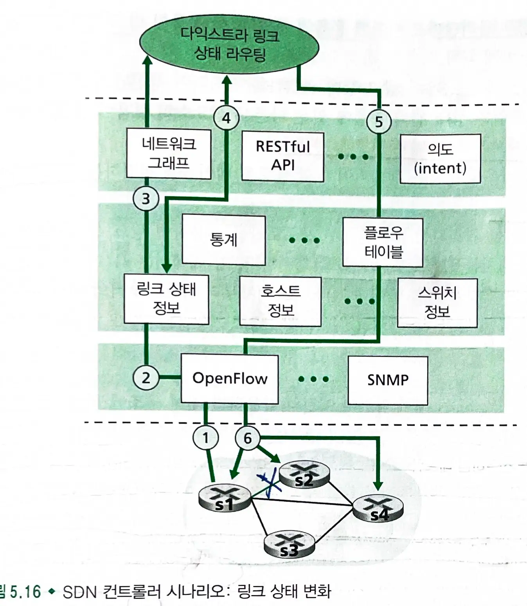

# 5.5 소프트웨어 정의 네트워크 (SDN) 제어 평면

### SDN 구조의 네 가지 특징

- **플로우 기반 포워딩** : `SDN`으로 제어되는 스위치들에서의 패킷 포워딩은 `전송 계층`, `네트워크 계층`, 또는 `링크 계층` 헤더의 **어떤 값들을 기반으로도 이루어질 수 있다**.
- **데이터 평면과 제어 평면의 분리**
  - `데이터 평면` : **네트워크 스위치들로 구성**된다.
    - `플로우 테이블` 기반으로 비교와 실행을 수행한다.
  - `제어 평면` : **서버와 스위치들의 플로우 테이블을 결정, 관리하는 소프트웨어**로 이루어진다.
- **네트워크 제어 기능이 데이터 평면 스위치 외부에 존재** : 제어 평면은 네트워크 스위치로부터 멀리 떨어진 별도의 몇 개 서버에서 구성된다.
  - `SDN 컨트롤러`와 `네트워크 제어 응용들의 집합`으로 구성된다.
- **프로그램이 가능한 네트워크** : 네트워크 제어 응용을 통해 네트워크를 프로그램 할 수 있다.

> 데이터 평면 스위치와 SDN 컨트롤러, 네트워크 제어 응용들 각각은 서로 다른 제조사나 기관에서 제공하는 분리된 개체이다.

## 5.5.1 SDN 제어 평면 : SDN 컨트롤러와 SDN 네트워크 제어 응용들

- SDN 제어 평면은 SDN 컨트롤러와 SDN 네트워크 제어 응용들로 나뉜다.
  - 컨트롤러의 기능은 크게 세 개의 계층으로 구성된다.

### 1. 통신 계층

- SDN 컨트롤러와 제어받는 네트워크 장치들 사이의 통신은 OpenFlow 프로토콜을 통해 수행된다.

### 2. 네트워크 전역 상태 관리 계층

- SDN의 제어 평면의 제어 결정을 위해서 컨트롤러가 `네트워크 호스트`와 `링크`, `스위치`, 그리고 `SDN`으로 제어되는 다른 장치들에 대한 최신 정보를 알아야한다.
  - 이러한 정보 조각들을 SDN 컨트롤러가 네트워크 전역 상태로 유지한다.

### 3. 네트워크 제어 응용 계층과의 인터페이스

- `컨트롤러`는 `노스바운드`(northbound) 인터페이스를 통해서 네트워크 제어 응용들과 상호 작용한다.
  - 이 API는 네트워크 제어 응용들이 상태 관리 계층 내의 네트워크 상태 정보와 플로우 테이블을 읽고 쓸 수 있도록 해준다.

- `SDN 컨트롤러`를 위한 `데이터베이스`는 **분산된 서버의 집합에 구현**된다.

## 5.5.2 OpenFlow 프로토콜

- SDN 컨트롤러와 SDN으로 제어되는 스위치 또는 오픈플로우 API를 구현하는 다른 장치와의 사이에서 동작한다.

### 컨트롤러 -> 스위치

- **설정** : 컨트롤러가 스위치의 설정 파라미터들을 문의하거나 설정한다.
- **상태 수정** : 컨트롤러가 스위치 플로우 테이블의 엔트리를 추가/제거 또는 수정하거나 스위치 포트의 특성을 설정한다.
- **상태 읽기**: 컨트롤러가 스위치 플로우 테이블과 포트로부터 통계 정보와 카운터 값을 얻기 위해 사용한다.
- **패킷 전송** : 컨트롤러가 제어하는 스위치의 지정된 포트에서 특정 패킷을 내보내기 위해 사용된다.

### 스위치 -> 컨트롤러

- **플로우 제거** : 컨트롤러에게 어떤 플로우 테이블 엔트리가 시간이 만료되었거나 상태 수정 메세지를 수신한 결과로 삭제되었음을 알린다.
- **포트 상태** : 스위치가 컨트롤러에게 포트의 상태 변화를 알리기 위해 사용한다.
- **패킷 전달** : 스위치 포트에 도착한 패킷중에서 플로우 테이블의 어떤 엔트리와도 일치하지 않은 패킷 일부는 작업을 위해 컨트롤러로 보내진다.

## 5.5.3 데이터 평면과 제어 평면의 상호 작용 : 예제

- `SDN 컨트롤러`와 `SDN의 제어를 받는 스위치`간의 통신
  - 최단 경로를 결정하기 위해 `다익스트라 알고리즘`을 사용한다.
- `다익스트라 알고리즘`이 **패킷 스위치 외부에서 별도의 응용으로 수행**된다.
- 패킷 스위치들이 **링크 업데이트 정보를** 서로간이 아닌 **SDN 컨트롤러에게 전송한다.**

### s1과 s2와의 링크 단절 이벤트

-
  1. 스위치 s2와 링크 단절을 감지한 s1은 `openflow`의 **포트 상태 메세지**를 사용하여 링크 상태의 변화를 `sdn 컨트롤러`에게 알린다.
-
  2. 링크 상태 변화를 알리는 `openflow` 메세지를 받은 `sdn 컨트롤러`는 `링크 상태 관리자`에게 알리고, `링크 상태 관리자`는 **링크 상태 db를 갱신**한다.
-
  3. `링크 상태 라우팅 응용`은 링크 상태의 변화에 대한 알림을 받는다.
-
  4. `링크 상태 라우팅 응용`이 `링크 상태 관리자`와 접촉하여 갱신된 링크 상태를 가져오고, **새로운 최소 비용 경로를 계산**한다.
-
  5. `링크 상태 라우팅 응용`은 갱신될 플로우 테이블을 결정하는 `플로우 테이블 관리자`와 접촉한다.
-
  6. `플로우 테이블 관리자`는 `openflow` 프로토콜을 이용해 `플로우 테이블`을 갱신한다.

> 단순히 `응용 제어 소프트웨어`를 바꿈으로써 **원하는 어떤 형태의 포워딩 방식도 구현**할 수 있다.
> 모든 라우터의 소프트웨어를 바꿔야 했던 전형적인 `라우터별 제어 평면`의 경우와 대조적이다.

## 5.5.4 SDN : 과거와 미래

- `SDN 혁명`은 단순한 상용 스위칭 하드웨어와 정교한 소프트웨어 제어 평면으로 `모든 기능이 하나로 통합된 스위치와 라우터를 교체`하는 혼란스러움으로 이어지고 있다.
- `SDN` 개념을 `AS 내부 설정`에서 `AS 간 설정`으로 확장하는 연구도 있다.

