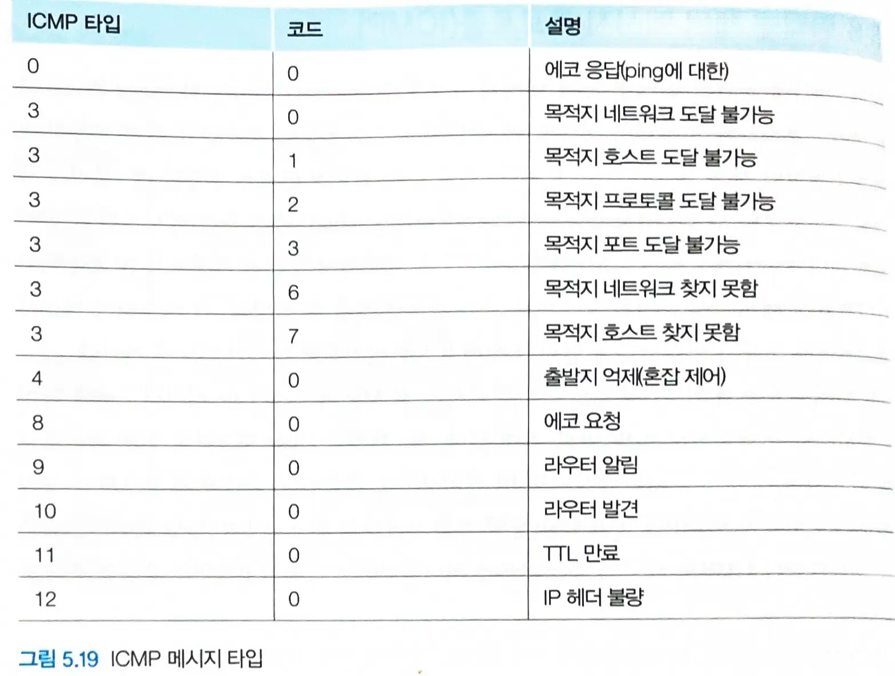

# 5.6 인터넷 제어 메세지 프로토콜 (ICMP)

## 인터넷 제어 메세지 프로토콜 (ICMP)

- `호스트`와 `라우터`가 **서로 간에 네트워크 계층 정보**를 주고받을 때 사용한다.
  - ex ) 오류 보고
- ICMP 메세지는 `ip 페이로드`로 전송된다.
  - 구조적으로 ip 바로 위에 있다.

### ICMP 메세지

- `타입`과 `코드` 필드가 있다.
- ping 프로그램은 타입 8, 코드 0인 `icmp 메세지`를 호스트에게 보낸다.
- `출발지 억제 메세지`(타입 4, 코드 0)은 실제로는 잘 사용되지 않는다 (혼잡 제어 목적)
  - tcp는 `icmp 메세지`(네트워크 계층의 피드백) 없이도 전달계층에서 동작하는 `혼잡 제어 메커니즘`을 가진다.
- `Traceroute`도 icmp 메세지로 구현된다.

#### Traceroute

- 평범한 일련의 ip 데이터그램을 목적지에 보내는데, **없을 것 같은 udp 포트 번호를 가진 udp 세그먼트**를 운반한다.
  - `ttl` 값은 첫번째 데이터그램이 1, 그 다음 데이터그램이 2,... 이런식이다.
- n번째 데이터그램이 n번째 라우터에 도착하면 해당 라우터는 데이터그램의 `ttl`이 방금 만료되었음을 알게된다.
  - 라우터는 데이터그램을 폐기하고 `icmp 경고 메세지`를 출발지에 보낸다.
  - 출발지는 타이머로부터 **왕복 시간**, **n번째 라우터의 주소와 이름**을 획득한다.
- 데이터그램이 `목적지 호스트`에 도착하면, 없을 것 같은 udp 포트번호의 데이터그램을 전송하므로 `도달 불가능 icmp` 메세지를 보낸다.

