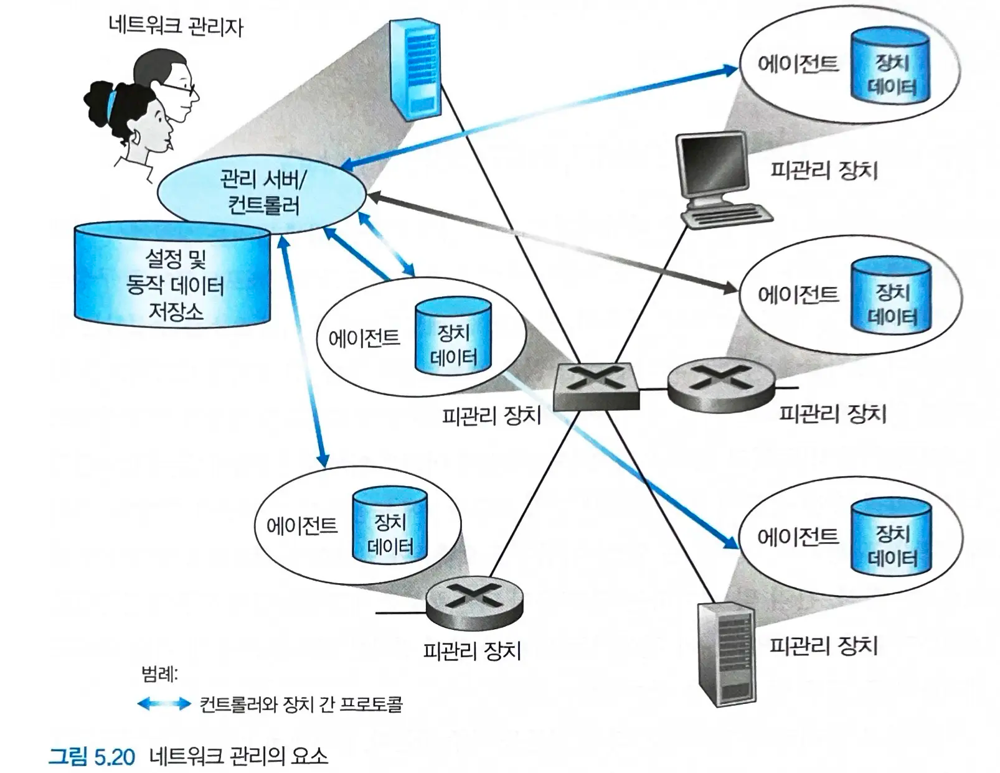
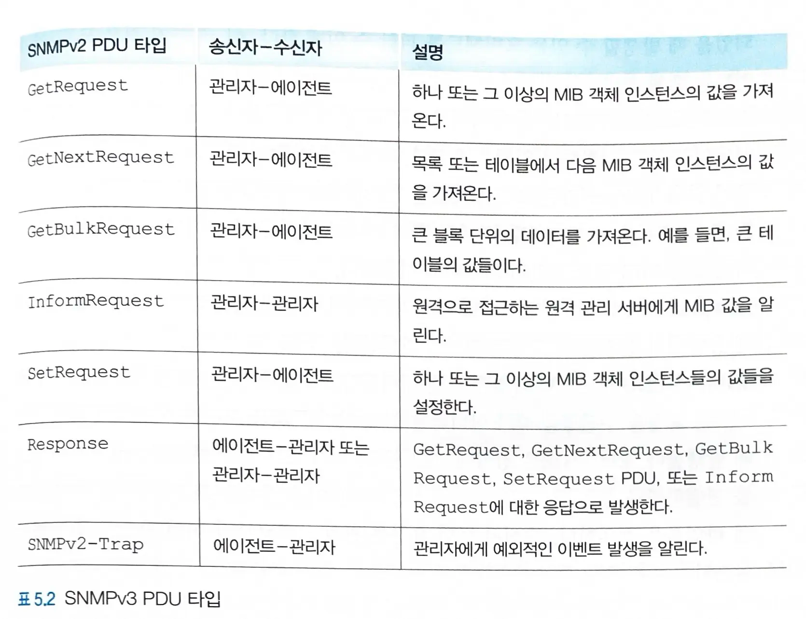
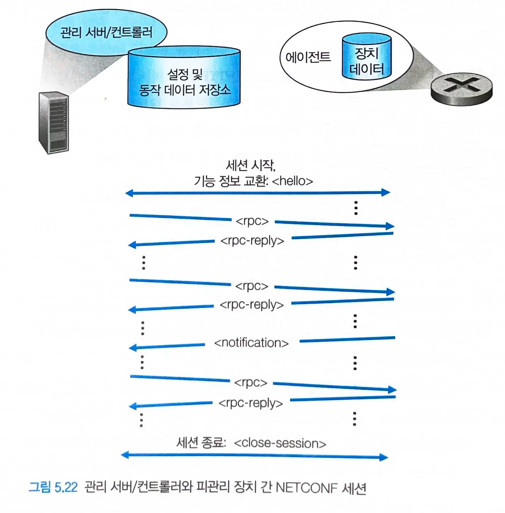
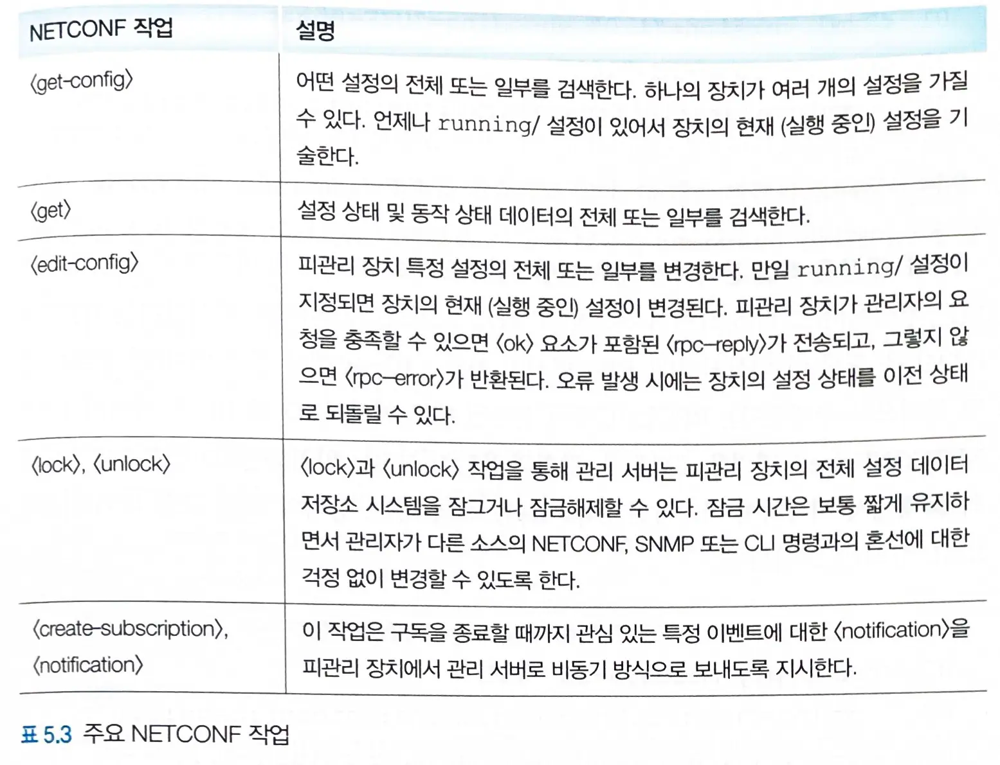

# 5.7 네트워크 관리와 SNMP, NETCONF, YANG

## 네트워크 관리란?

- `네트워크 관리`란 적정한 비용으로 `실시간`, `운용 성능`, `서비스 품질` 등의 요구사항을 만족시키기 위해 네트워크와 구성요소 자원을 감시,테스트,폴링,설정,분석,평가, 제어하는 하드웨어, 소프트웨어, 인간
  요소 등을 배치하고, 통합, 조정하는 것이다.

## 5.7.1 네트워크 관리 프레임워크

- `관리 서버` :  네트워크 운영 센터의 중앙 집중형 네트워크 관리 스테이션에서 동작하는 네트워크 관리자와 상호작용하는 애플리케이션이다.
  - 네트워크 관리 활동이 일어나는 장소로서, 네트워크 관리 정보의 수집, 처리, 분석, 발송을 제어한다.
  - 네트워크 피관리 장치를 설정, 감시, 제어하기 위한 작업이 시작된다.
- `피관리 장치` : 관리 대상 네트워크에 존재하는 네트워크 장비들이다.
  - 호스트, 라우터, 스위치, 미들박스, 모뎀, 온도계, 그 밖의 장치들과 그 밖의 설정 매개변수들
- `데이터`
  - `설정 데이터` : 장치 정보
  - `동작 데이터` : 장치가 동작하면서 획득하는 정보
  - `장치 통계`: 인터페이스에 삭제된 패킷 수 또는 상태 표시기 및 계수기
- `네트워크 관리 에이전트` : 관리 서버와 통신하는 **피관리 장치상의 소프트웨어 프로세스**
  - 관리 서버와 피관리 장치들 사이에서 동작하면서 관리 서버가 피관리 장치의 상태에 대해 질의한다.
  - 에이전트를 통해 피관리 장치에 행동을 취하도록 해준다.

### 네트워크 관리 방법

#### CLI

- `네트워크 운영자`는 명령줄 인터페이스를 통해 **장치에 직접 명령을 보낸다**.

#### SNMP/MIB

- 네트워크 운영자는 `SNMP`를 사용하여 **장치의 MIB에 있는 데이터를 질의하거나 설정**할 수 있다.
- `SNMP/MIB`를 통해 동작 상태 및 장치 통계 정보를 질의 및 모니터링 한 후, `CLI`를 통해 장치를 실제로 제어하고 설정한다.

#### NETCONF/YANG

- `NETCONF` : 설정 관리에 초점을 둔 더 현대적인 프로토콜
- `YANG` : NETCONF와 함께 사용되는 데이터 모델링 언어

## 5.7.2 SNMP과 MIB

### SNMPv3

- 관리 서버와 관리 서버를 대표하여 실행되고 있는 에이전트 사이에서 **네트워크 관리 제어 및 정보 메세지를 전달**하기 위해 사용된다.
- `요청-응답 모드`
  - `SNMP` 관리 서버는 에이전트에게 요청을 송신하고, 이를 받은 SNMP 에이전트는 이를 수행한 후 요청에 대한 응답을 보낸다.
  - 피관리장치와 관련된 **MIB 객체 값들을 검색 또는 수정**하기 위해 사용된다.
- `트랩 메세지`
  - 에이전트가 요구받지 않더라도 트랩 메세지를 관리 서버에게 전송한다.
  - 관리 서버들에게 **MIB 객체 값들을 변화시킨 예외 상황의 발생을 통지**하기 위해 이용된다.

#### SNMP PDU 타입

- SNMP PDU들은 일반적으로 `udp 데이터그램`의 페이로드에 실린다.
  - udp는 신뢰성이 보장되지 않으므로 목적지에 도착한다는 보장이 없다.
  - `요청 id` 필드를 함께 보내 관리 서버가 요청 또는 응답의 분실을 검출하는데 사용한다.

### MIB

- **피관리 장치의 동작 상태 데이터**는 `해당 장치를 위한 MIB에 수집된 객체`로 표현된다.
  - 라우터에서 버려지는 데이터그램 개수, 이더넷 인터페이스 카드의 오류를 세는 카운터, 상태 정보 등등

## 5.7.3 네트워크 설정 프로토콜 (NETCONF)와 YANG

### NETCONF

- `관리 서버`와 `피관리 네트워크 장치` 사이에서 동작한다.
  -
    1. 피관리 장치의 설정 데이터를 검색, 수정
  -
    2. 피관리 장치의 동작 데이터 및 통계를 질의
  -
    3. 피관리 장치에서 생성된 알림을 구독하기 위한 메세지 전송 기능
- `XML` 기반으로 설정 내용을 보내 피관리 장치에서 활성화시킨다.
  - NETCONF는 `원격 프로시저 호출(RPC)` 패러다임을 사용한다.
  - `XML` 기반으로 인코딩된 프로토콜 메세지는 `TCP 상의 TLS 프로토콜`을 통해 관리 서버와 피관리 장치 사이에서 교환된다.

#### NETCONF 작업

### SNMP vs NETCONF

| 특성       | SNMP                 | NETCONF                  |
|----------|----------------------|--------------------------|
| 주요 용도    | 네트워크 모니터링, 간단한 구성 변경 | 복잡한 네트워크 구성 관리           |
| 데이터 모델   | 단순한 OID 트리           | XML 기반 구조화 모델 (YANG과 연계) |
| 작동 방식    | 주로 폴링 (Polling)      | RPC (원격 프로시저 호출)         |
| 프로토콜     | 주로 UDP               | TCP (SSH 또는 TLS 위에서 동작)  |
| 구성 관리 능력 | 제한적                  | 강력함 (전체 구성 변경, 롤백 등)     |
| 보안       | 기본적                  | 강력함 (SSH/TLS 기반)         |
| 확장성      | 제한적                  | 높음 (YANG 모델 통해 쉽게 확장)    |
| 데이터 인코딩  | ASN.1                | XML                      |
| 표준화      | IETF                 | IETF                     |
| 복잡성      | 상대적으로 단순             | 더 복잡하지만 강력               |
| 트랜잭션 지원  | 제한적                  | 강력한 트랜잭션 지원              |
| 알림 메커니즘  | 트랩 (비동기)             | 이벤트 알림 (구독 기반)           |

> 네트워크 관리 추세는 NETCONF와 YANG을 함께 사용하는 방향으로 이동하고 있다.

