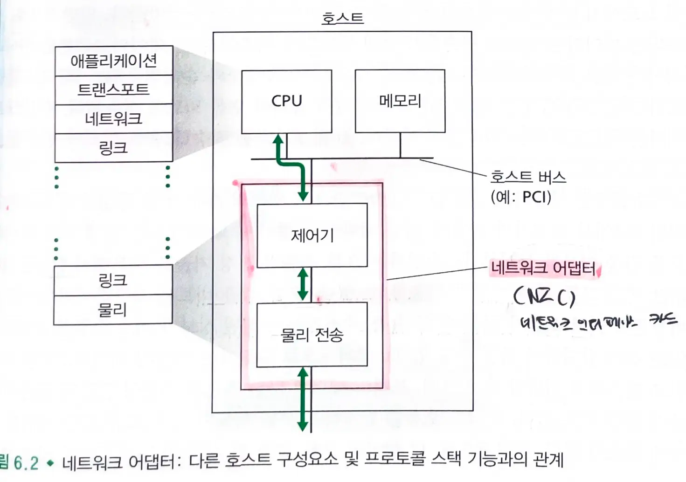

# 6.1 링크 계층 소개

### 링크 계층 채널

#### 1. 브로드캐스트 채널

- 무선랜(LAN), 위성 네트워크, HFC 접속망에서 **다수의 호스트를 연결**해준다.
  - `매체 접속 프로토`콜: 브로드캐스트 통신 채널에 **다수의 호스트가 연결**되므로, 프레임 전송을 조정하기 위해 매체 접속 프로토콜이 있어야한다.
- 중앙 제어기를 사용해서 전송을 조정할 수도 있고, 호스트가 자체적으로 전송을 조정할 수도 있다.

#### 2. 점대점 통신 링크

- 원거리 링크에 의해 연결된 두 라우터 또는 사용자의 사무실 컴퓨터와 이 컴퓨터에 연결된 근처 이더넷 스위치 사이에서 사용될 수 있다.
- `PPP` : 전화선을 이용한 다이얼업 서비스부터 광 링크상에서의 고속 점대점 프레임 전송에 모두 사용된다.

### 노드와 링크

- 노드: 링크 계층 프로토콜을 실행하는 장치
- 링크 : 통신 경로 상의 인접한 노드들을 연결하는 통신 채널

> 데이터그램을 `출발지 호스트`부터 `목적지 호스트`로 이동시키기 위해서는 데이터그램을 종단간 경로의 `개별 링크`로 이동시켜야만 한다.

## 6.1.1 링크 계층이 제공하는 서비스

- 기본 서비스 : 단일 통신 링크 상으로 데이터그램을 한 노드에서 인접 노드로 이동시키는 것

### 프레임화

- 링크 게층 프로토콜은 `네트워크 계층 데이터그램`을 링크상으로 전송하기 전에, `링크 계층 프레임`에 캡슐화한다.
- `프레임` : 네트워크 계층 데이터그램이 들어있는 `데이터 필드`와 여러 개의 `헤더 필드`로 구성된다.

### 링크 접속

- `MAC(매체 접속 제어) 프로토콜` : 링크상으로 프레임을 전송하는 규칙
  - `점대점 링크`(단일 송신자-단일 수신자)의 경우 **링크가 사용되지 않을때마다 (idle) 프레임을 전송**할 수 있다.
  - 하나의 `브로드캐스트 링크`를 여러 노드가 공유하는 경우(다중 접속 문제), MAC 프로토콜은 **여러 노드로부터의 프레임 전송을 조정**한다.

### 신뢰적 전달

- `링크 계층 프로토콜`이 신뢰적 전달 서비스를 제공하는 경우, **네트워크 계층 데이터그램은 링크상에서 오류 없이 전달**된다.
  - `확인 응답`과 `재전송`을 통해 가능하다.
  - 전송 계층이나 애플리케이션 계층에서 데이터를 `종단간에 재전송`하는 것과 달리, 링크 계층의 신뢰적 전달은 `오류가 발생한 링크에서 오류를 정정`한다.
- 오류율이 높은 링크에서 주로 사용된다.
- 낮은 비트율을 가진 링크에서는 **불필요한 오버헤드**가 될 수도 있다.

> 대다수 유선 링크 계층 프로토콜은 신뢰적 전달 서비스를 제공하지 않는다.

### 오류 검출과 정정

- `비트 오류`는 신호의 약화나 전자기 잡음 때문에 생긴다.
- 오류 검출은 송신 노드에서 프레임에 `오류 검출 비트`를 설정하고, 수신 노드에서 `오류 검출`을 수행함으로써 가능하다.
  - 하드웨어로 구현된다.

> 링크 계층 프로토콜에서의 일반적인 서비스이다.

## 6.1.2 링크 계층이 구현되는 위치

### 하드웨어

- 대부분의 경우 링크 계층은 `네트워크 인터페이스 카드 (NIC)` 라고 알려진 `네트워크 어댑터`에 구현된다.
- 네트워크 어댑터의 중심에는 `링크 계층 제어기`가 있다.
  - `링크 계층 제어기` : 링크 계층 서비스들 (프레임화, 링크 접속, 신뢰적 전달, 오류 검출)의 대다수가 구현되어 있는 단일의 특수 용도 칩이다.

> 링크 계층 제어기의 기능 대부분은 하드웨어로 구현된다.

- 네트워크 어댑터가 카드 형태로 되어 있었으나, 갈수록 호스트의 마더보드에 통합되고 있는 추세이다. (LAN-on-mother-board)

#### 송신 측의 제어기

- 프로토콜 스택의 상위 계층에 의해서 생성되어 호스트 메모리에 저장된 `데이터그램`을 링크 계층 `프레임`으로 캡슐화한다.
- 링크 접속 프로토콜에 따라 이 프레임을 통신 링크 상으로 전송한다.

#### 수신 측의 제어기

- 프레임을 수신한 후, 네트워크 계층 `데이터그램을 추출`한다.

> 오류 검출을 수행할 경우, 송신 측 제어기는 프레임 헤더의 오류 검출 비트를 설정하고 수신 측 제어기는 오류 검출을 수행한다.

### 소프트웨어

- 대부분의 링크 계층 기능이 인터페이스 카드에 구현되어 있다.
- 일부 링크 계층 기능은 `호스트 CPU에서 실행되는 소프트웨어`에 구현되어 있다.
  - 상위 수준의 링크 계층 기능들은 `링크 계층 소프트웨어 구성요소`에 구현되어있다.
  - ex) 링크 계층 주소 정보 조립, 제어기 하드웨어의 활성화
- 제어기가 기본적인 작업을 수행하지만, 소프트웨어가 더 복잡하고 유연한 처리를 담당한다.

#### 수신 측의 링크 계층 소프트웨어

- 제어기로부터의 `인터럽트`에 응답한다.
- `오류 조건`을 처리한다.
  - 하드웨어보다 더 복잡한 오류 처리
- `데이터그램`을 `네트워크 계층`으로 전달한다.
  - 추출된 데이터그램을 네트워크 계층으로 전달하는 과정을 관리

> 링크 계층은 하드웨어와 소프트웨어의 조합이다.

  

