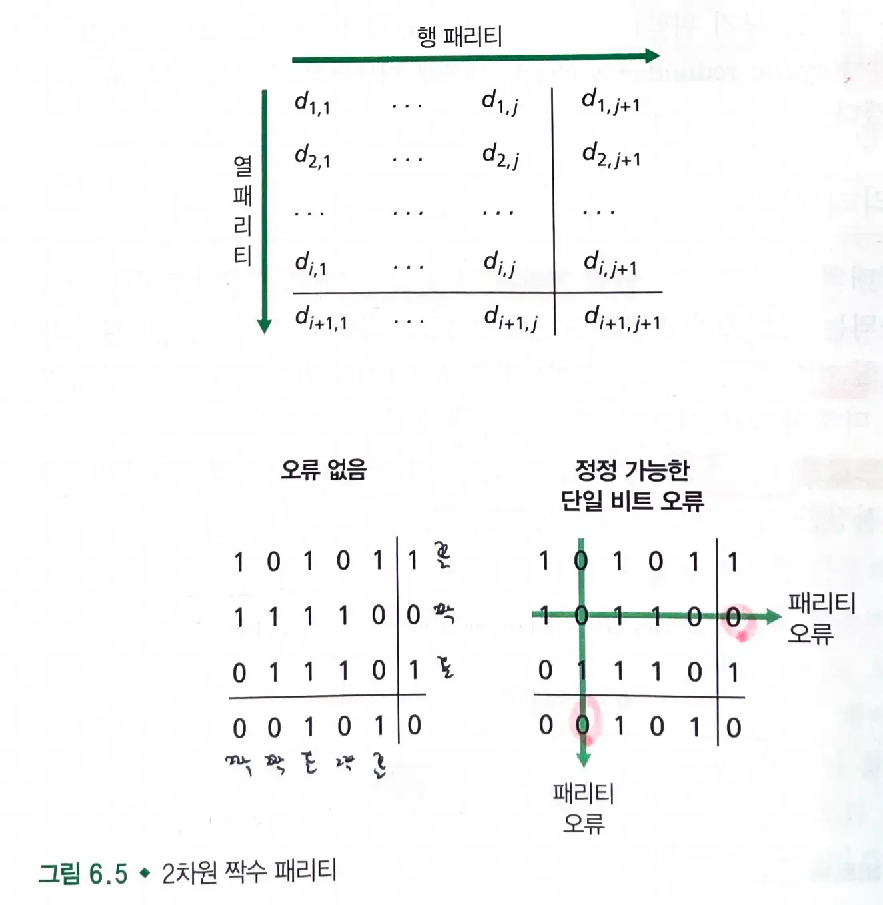
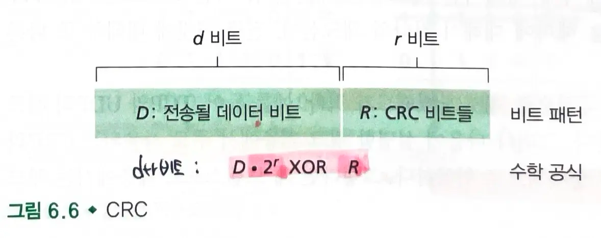

# 6.2 오류 검출 및 정정 기술

- `비트 수준 오류 검출과 정정` : 한 노드에서 물리적으로 연결된 이웃 노드로 전송한 링크 계층 프레임 안의 비트 오류 검출과 정정
- 비트 오류를 방지하기 위해 송신 노드에서 `데이터 D`에 `오류 검출 및 정정비트들(EDC)`를 첨가한다.
  - 데이터그램 뿐만 아니라 데이터 링크 프레임 헤더에 있는 링크 수준의 주소 정보와 순서번호, 기타 필드들을 보호하기 위해서이다.
- 수신자는 오류 검출과 정정 기술을 사용해서 거의 모든 비트 오류를 검출할 수 있다.
  - 일반적으로 더 향상된 오류 검출 및 정정 기술은 더 많은 오버헤드를 필요로 한다.
  - 더 많은 계산시간을 요구하기 때문이다.
- 데이터 오류를 검출하는 기술로 `패리티 검사`, `체크섬`, `순환중복검사`를 수행한다.

## 6.2.1 패리티 검사

### 단일 패리티 비트

- 가장 단순한 형태의 오류 검출
- 짝수 패리티 기법 : 사용자가 단순히 한 비트를 추가하고, 그 비트값을 d+1개의 비트들에서 1의 총개수가 짝수가 되도록 선택한다.
- 홀수 패리티 기법: 1의 개수가 홀수가 되도록 선택한다.
- 수신자는 1의 개수를 계산하여 오류 발생 여부를 알 수 있다.
  - 짝수 패리티 기법일 경우 1의 개수가 홀수이면 임의의 홀수개의 비트 오류가 발생했음을 알 수 있다.

#### 짝수개의 비트 오류가 발생하다면?

- 검출하지 못하는 오류가 발생할 수 있다.
- 오류는 종종 버스트 형태로 한꺼번에 몰려서 발생한다.
  - 버스트 형태의 오류 상황에서 미검출 오류가 있을 확률은 50%이다.

### 2차원 패리티 기법

- **단일 비트 패리티 기법을 2차원으로 일반화한 것**
  - 각각의 행과 열에 대해 하나의 패리티값이 계산된다.
- 수신자는 `단일 비트 오류`의 발생을 검출할 수 있을 뿐만 아니라, 패리티 오류가 있는 열과 행의 인덱스값을 사용해 `오류를 정정`할 수 있다.
- 패킷에 있는 임의의 `2개의 오류`도 `검출`할 수 있다. (오류 정정은 불가)
  - 8x8 데이터 행렬이 있다고 가정할 때, 두 개의 비트에서 오류가 발생하면 두 개의 행과 두 개의 열에서 패리티 오류가 감지된다.

#### 순방향 오류 정정

- 오류를 `검출` 및 `정정`하는 수신자의 능력
  - 수신자가 즉각적인 오류 정정을 할 수 있다.

## 6.2.2 체크섬 방법

- 데이터를 구성하는 `d 비트`들을 일련의 `k 비트`의 정수처럼 다룬다.
- `인터넷 체크섬` : **k비트 정수들을 더해서 더한 값의 1의 보수**가 인터넷 체크섬이 된다.
  - `세그먼트 헤더`에 체크섬을 넣는다.
- 수신자는 수신 데이터 합의 `1의 보수`를 취한 뒤, 그 결과가 모두 `1`인 비트로 구성되어있는지 검사한다.
  - 한 비트라도 `0`이면 오류가 발생한 것이다.
- 체크섬 방법은 상대적으로 패킷 오버헤드가 적다.
  - 그러나 체크섬은 링크 계층에서 주로 사용되는 `CRC`에 비해 오류면에서 취약하다.

### 전송 계층에서는 체크섬을 사용하고, 링크 계층에서는 `CRC`를 사용한다.

- 전송 계층의 오류 검출은 소프트웨어로 구현되므로, 체크섬처럼 간단하고 빠른 오류 검출 기법이 필요하다.
- 링크 계층에서의 오류 검출은 어댑터 안의 전용 하드웨어로 구현되므로 더 복잡한 CRC 연산을 빨리 수행할 수 있다.

## 6.2.3. 순환중복검사 (CRC)

- 전송하고 싶은 데이터 `d 비트`로 이루어진 데`이터 D`
- 송신자와 수신자가 합의한 `r+1 비트` (생성자 : `G`)
- 방법
  - 주어진 데이터 D에 대해 r개의 추가 비트 R을 뒤에 덧붙인다.
  - `d+r 비트`가 `모듈러-2 연산`을 수행하여 `G`로 나누었을때, 나머지가 존재하면 오류가 발생한 것으로 간주한다.
- 모듈러-2 연산 : 덧셈의 올림이나 뺄셈의 빌림이 없음, 피연산자를 비트별로 `xor` 한 것과 같다.

### CRC (Cyclic Redundancy Check) 계산 방법

CRC에서 R(나머지)을 계산하는 방법

#### 1. 기본 식

`D · 2^r XOR R = nG`

여기서:

- D: 데이터
- 2^r: 2의 r승 (r은 CRC 비트 수)
- R: 나머지 (우리가 찾고자 하는 값)
- G: 생성 다항식
- n: 어떤 정수

#### 2. XOR 연산의 특성을 이용한 식 변형

`D · 2^r = nG XOR R`

#### 3. 최종 R 계산 식

`D · 2^r을 G로 나눈 나머지`가 R이 된다.

### 오류 검출 확률

- 각각의 CRC 표준은 `r개 이하의 연속된 비트 오류를 검출`할 수 있다.
- r+1 비트보다 큰 길이의 버스트 오류는 `1-0.5^r` 의 확률로 검출된다.
- 각각의 CRC 표준은 `임의의 홀수개의 비트 오류를 검출`할 수 있다.
