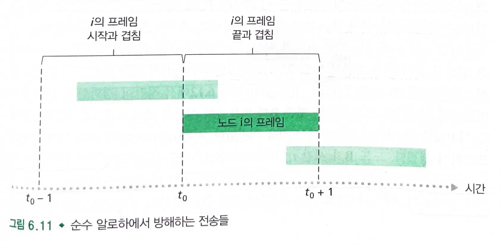
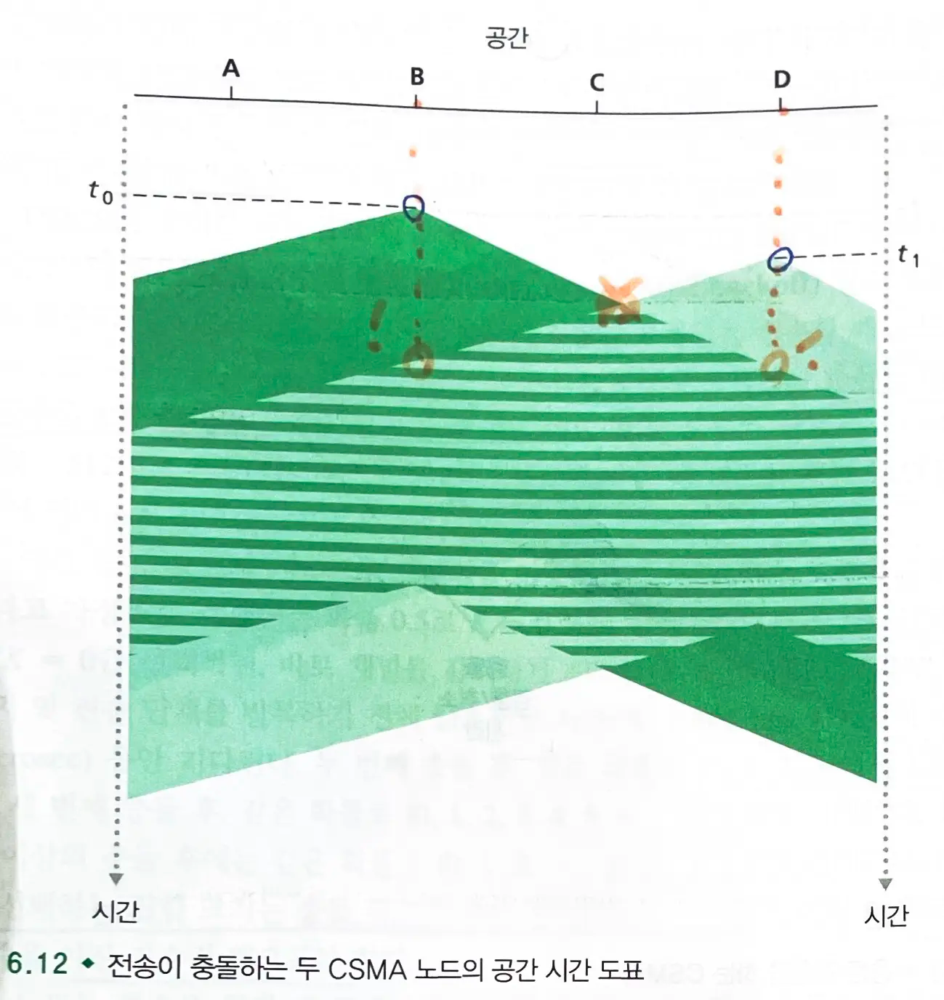

# 6.3 다중 접속 링크와 프로토콜

- 두 종류의 네트워크 링크가 있다.

### 점대점 링크

- 링크의 한쪽 끝에 한 송신자와 링크의 다른 쪽 끝에 한 수신자가 있다.
- 대다수의 링크 계층 프로토콜은 `점대점 링크용`으로 설계되었다.
  - `PPP`, `HDLC`

### 브로드캐스트 링크

- `동일한 하나의 공유된 브로드캐스트 채널`에 **다수의 송신 노드 및 수신 노드들이 연결**된다.
  - `브로드캐스트`: 임의의 한 노드가 프레임을 전송하면 채널이 그 프레임을 방송해서 다른 모든 노드들이 그 프레임의 복사본을 수신한다.
  - `이더넷`과 `무선 랜`은 브로드캐스트 링크의 대표적인 예시다.

> 이더넷이 브로드캐스트 링크로 분류되는 이유는 브로드캐스트 기능을 지원하기 때문이다.
> 그러나 실제 데이터 대부분은 스위치에 의해 선별적으로 전달된다.

- `다중 접속 프로토콜`: 브로드캐스트 채널로 보내는 노드들의 전송을 조정하기 위한 프로토콜
  - 2개 이상의 노드가 동시에 프레임을 전송하는 경우, 충돌이 일어나 낭비된다.
  - `채널 분할 프로토콜`, `랜덤 접속 프로토콜`, `순번 프로토콜` 로 분류된다.

## 6.3.1 채널 분할 프로토콜

- 채널을 공유하는 모든 노드가 브로드캐스트 채널의 대역폭을 분할하게 해주는 기술
  -
    1. 시분할 다중화(`TDM`)
  -
    2. 주파수 분할 다중화(`FDM`)

### TDM (시분할 다중화)

- 시간을 `시간 프레임`으로 나누고, `시간 프레임`을 N개의 `시간 슬롯`으로 나눈다.
  - 각 `시간 슬롯`은 N개의 노드에게 각각 할당된다.
- 노드는 전송할 패킷이 있을때마다 TDM 프레임에서 자신에게 할당된 `시간 슬롯` 동안 패킷 비트들을 전송한다.
  - 각 노드는 프레임 시간 동안 `R/N` bps의 할당된 전송률을 가진다.

> 각 노드는 자신의 시간 슬롯 동안 전체 대역폭 R을 사용할 수 있다.
> 그러나 전체 프레임 시간을 고려하면, 평균 전송률은 R/N으로 제한된다.

- 충돌을 피하고 N개 노드에게 대역폭을 균등하게 분할한다.

- 단점
  - 전송할 패킷이 있는 노드가 단 하나인 경우에도 노드 전송률이 평균 `R/N`으로 제한된다.
    - 수신만 하는 노드까지 포함하기 때문이다.
  - 노드가 전송 순서상 자신의 차례를 항상 기다려야한다.

### FDM (주파수 분할 다중화)

- `R bps` 채널을 다른 주파수(각 `R/N` 대역폭)로 나눠서 각 주파수를 `N`개 노드 중 하나에게 할당한다.
  - 하나의 큰 `R bps` 채널로부터 N개의 `R/N` bps의 작은 채널을 만든다.
- 전송할 패킷을 가진 노드가 단 하나일지라도 노드는 `R/N`의 대역폭으로 한정된다.
  - 수신만 하는 노드까지 포함하기 때문이다.

### 코드 분할 자동 접속 (CDMA)

- 각 `코드`를 각 노드에게 할당한다.
  - 노드는 전송할 데이터 비트들을 **자신의 유일한 코드로 인코딩**한다.
- 코드들을 신중하게 선택하면 **여러 노드들이 동시에 전송할 수 있다.**
  - 다른 노드들에 의해 전송이 간섭되더라도 각 수신자들이 송신자의 인코딩된 데이터 비트를 정확하게 수신할 수 있다.

## 6.3.2 랜덤 접속 프로토콜

- 전송 노드는 항상 채널의 최대 전송률인 `R bps`로 전송한다.
- 충돌이 생기면 충돌 발생 노드는 프레임이 충돌 없이 전송될 때까지 자신의 프레임을 계속해서 `재전송`한다.
  - 프레임을 재전송하기 전에 `랜덤 지연 시간`동안 기다린다.
- 충돌이 생긴 노드는 자신만의 랜덤 지연 시간을 선택한다.

### 슬롯 알로하

#### 설명

- 모든 프레임은 `L 비트`로 구성된다.
- 시간은 `L/R 초의 슬롯`들로 나뉜다.
  - 한 슬롯은 한 프레임 전송에 걸리는 시간과 같다.
  - 최대 전송률 : `R` bps
- 노드는 슬롯의 시작점에서만 프레임을 전송하기 시작한다.
- 각 노드는 언제 슬롯이 시작되는지 알 수 있도록 동기화되어있다.
- 한 슬롯에서 2개 이상의 프레임이 충돌하면, 모든 노드는 그 슬롯이 끝나기 전에 충돌 발생을 알게 된다.

#### 각 노드에서의 동작

- 노드는 전송할 새 프레임이 있으면 다음 슬롯이 시작할때까지 기다렸다가 그 슬롯에 전체 프레임을 전송한다.
- 만약 충돌하면, 노드는 그 슬롯이 끝나기 전에 충돌을 검출한다.
  - 노드는 그 프레임이 충돌 없이 재전송될 때까지 `확률 p`로 해당 프레임을 다음 슬롯들에서 재전송한다.

#### 장점

- 하나의 활성 노드로 하여금 채널의 전속력 R로 계속해서 프레임을 전송할 수 있다.
- 단순한 프로토콜이다.

#### 효율성

- 활성 노드가 많이 있으면 낭비된다.
- 모든 활성 노드들이 확률적인 전송 정책으로 전송을 하지 않을 경우 일부 슬롯들이 빈다.
  - 성공한 슬롯 : 정확히 한 노드만 전송하는 슬롯
- 임의의 한 노드가 성공할 확률:`Np * (1-p)^(N-1)`

> 활성 노드가 많은 경우(N->무한대) 최대 효율은 0.37이다.

### 알로하 (분산된 알로하, 순수 알로하)

- 슬롯 알로하와 달리 슬롯이 없고 완전히 분산된 프로토콜
    - 노드들이 언제든지 프레임을 전송할 수 있다.
    - 시간 동기화가 필요 없다.
- 프레임이 도착하면 노드는 즉시 그 프레임 전체르 브로드캐스트 채널로 전송한다.
    - 전송된 프레임이 충돌하면, 확률 p로 재전송한다.
- 임의의 한 노드가 성공할 확률 : `Np * (1-p)^(2(N-1))`
    - 전송 시작과 겹칠 확률과 다른 노드가 전송하지 않을 확률을 고려한다.
>  효울성은 슬롯 알로하의 절반이다.

#### 전송 2가지 규칙 - CSMA, CSMA/CD

- `캐리어 감지` : 노드는 전송하기 전에 채널을 듣는다.
- `충돌 검출`: 송신 노드는 전송하면서 동시에 채널을 듣는다.
  - 다른 노드가 프레임을 전송하고 있음을 검출하면, 자신의 전송을 중단하고 랜덤 시간동안 기다린다.

### CSMA (Carrier Sense Multiple Access)

- 모든 노드들은 매체 감지를 한다. 그럼에도 충돌이 발생한다.
- `채널 전파 지연`이 길수록 네트워크의 다른 노드에서 이미 시작된 전송을 캐리어 감지 노드가 감지할 수 없다.
  - `채널 전파 지연` : 신호가 채널의 한쪽 끝에서 다른 쪽 끝으로 전파되는데 걸리는 시간
- 충돌 검출을 수행하지 않는다.
  - 충돌이 발생했음에도 불구하고 자신의 프레임 전체를 계속해서 전송한다.

### CSMA/CD (Carrier Sense Multiple Access with Collision Detection)

- `매체 감지`와 `충돌 검출`을 수행한다.
  - `충돌 검출`: 충돌이 검출되면 바로 전송을 중단(abort)한다.
  - 충돌 검출을 수행하면 손상된 프레임을 전송하지 않아도 되므로 성능을 향상시킬 수 있다.

#### 랜덤 시간 (랜덤 백오프 시간)

- 충돌되는 노드가 적을 때는 시간 간격을 작게 하고, 충돌하는 노드가 많을 때는 시간 간격을 크게 한다.
- `이진 지수적 백오프` : 충돌을 n번 경험한 프레임을 전송할 때 노드는 {0,1,2,...,2^n-1} 중에 랜덤하게 k값을 선택한다.
  - 충돌을 더 많이 경험할 수록 K개를 선택할 간격을 크게 한다.
  - K를 선택하는 집합 크기는 충돌 횟수에 따라 지수적으로 증가한다.

#### 효율

- 오랜 시간 동안 다수의 활성 노드들이 있을 때 충돌 없이 프레임이 채널로 전송되는 시간 비율
- `1 / (1 + 5d_prop / d_trans)`
  - d_prop(전파 지연)이 0에 가까우면 효율은 1에 근접한다.
  - d_trans(전송 시간)이 매우 커지면 효율은 1에 근접한다.

## 6.3.3 순번 프로토콜

### 폴링 프로토콜

- 노드 중 하나를 `마스터 노드`로 지정한다.
  - 마스터 노드는 각 노드를 `라운드 로빈` 방식으로 폴링한다.
  - 마스터 노드는 각 노드가 최대로 보낼 수 있는 프레임 수를 제공한다.
- 빈 슬롯을 제거함으로써 훨씬 높은 효율을 제공한다.

#### 단점

- `폴링 지연` : 노드가 전송할 수 있음을 알리는데 걸리는 시간
  - 한 노드만 활성이면 활성 노드가 프레임을 최대 개수만큼 보낼때마다 마스터 노드는 비활성 노드들을 차례로 폴링해야한다.
  - 활성 노드는 `R bps`보다 작은 전송률로 전송하게 된다.
- 마스터 노드가 고장 나면 전체 채널이 동작하지 못하게 된다.

### 토큰 전달 프로토콜

- 노드들 사이에 정해진 순서대로 `토큰`이 전달된다.
  - 노드가 토큰을 수신하면, 전송할 프레임이 있을 때만 토큰을 붙잡는다.
    - 프레임을 최대 개수만큼 전송한다.
  - 그렇지 않으면 토큰을 즉시 다음 노드로 전달한다.
- 토큰 전달 방식은 분산 방식이며 효율이 매우 높다.

#### 단점

- 노드 하나가 실패하면 전체 채널이 동작하지 않는다.
- 노드가 잘못해서 토큰을 놓아주지 않으면, 토큰이 다시 돌 수 있도록 하는 회복 절차가 실행되어야한다.

## 6.3.4 `DOCSIS`: 케이블 인터넷 접속을 위한 링크 계층 프로토콜

- 케이블 접속망은 수천개의 케이블 모뎀을 `케이블망 중개소(headend)`에 있는 `케이블 모뎀 종단 시스템(CMTS)`에 연결한다.
- `DOCSIS` : 케이블 데이터망의 구조와 프로토콜들을 정의한다.
  - `하향`(downstream)과 `상향`(upstream) 망 세그먼트들을 다수의 주파수 채널로 나누기 위해 `FDM`을 사용한다.
  - 상향 및 하향 채널은 브로드캐스트 채널이다.
  - 상향의 경우 다수의 케이블 모델이 `CMTS`로의 동일한 상향 채널을 공유하므로 충돌이 발생할 수 있다.
- 상향 채널은 시간 간격으로 나뉘고, 각 시간 간격은 `미니 슬롯`들로 구성되어있다.
  - CMTS는 **개별 케이블 모뎀이 특정 미니 슬롯에 전송**할 수 있도록 허용한다.
- CMTS는 하향 채널 상으로 `MAP 메세지`(어떤 케이블 모뎀이 어떤 미니 슬롯으로 전송 가능한지)를 전송한다.
- 케이블 모뎀은 CMTS에게 `미니 슬롯 요청 프레임`을 전송함으로써 전송할 데이터가 있음을 알린다.
  - 랜덤 접속 방식으로 전송되므로 충돌시 `이진 지수적 백오프`를 사용한다.

